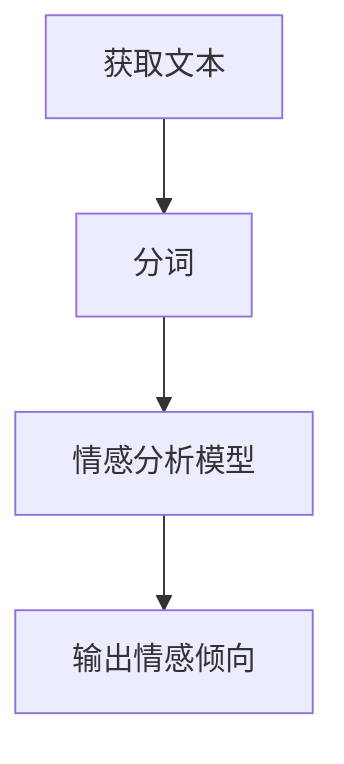
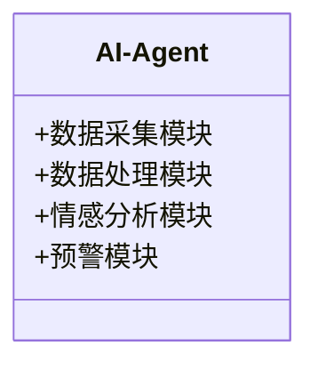
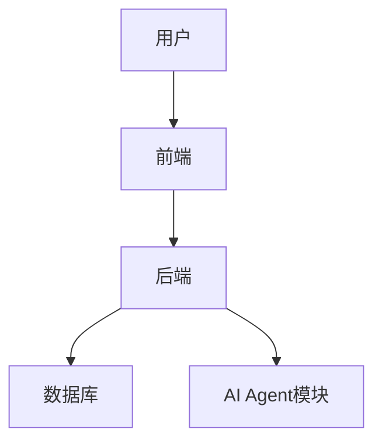

                 


# AI Agent辅助企业舆情监测与品牌管理的策略

> 关键词：AI Agent, 企业舆情监测, 品牌管理, 自然语言处理, 情感分析, 系统架构设计

> 摘要：本文探讨了AI Agent在企业舆情监测与品牌管理中的应用策略，从核心概念、算法原理到系统架构设计，结合实际案例，详细阐述了AI Agent如何辅助企业实现舆情监测和品牌管理的智能化、高效化。

---

## 第一章：企业舆情监测与品牌管理的背景

### 1.1 问题背景

随着互联网的快速发展，企业的品牌形象和声誉在社交媒体和网络评论中变得至关重要。企业舆情监测是指通过收集和分析公众对企业及其产品的看法，识别潜在的声誉风险，并及时采取应对措施。传统的舆情监测方法依赖人工分析，效率低且成本高，难以应对海量数据和实时需求。

### 1.2 问题描述

企业在品牌管理中面临以下挑战：
- **数据量大**：社交媒体和新闻网站产生的海量数据难以处理。
- **实时性要求高**：企业需要实时了解市场动态和用户反馈。
- **分析复杂**：用户评论涉及多种情感和意图，人工分析难以准确识别。

### 1.3 问题解决

引入AI Agent可以有效解决上述问题。AI Agent能够实时监控网络数据，利用自然语言处理（NLP）技术分析文本，快速识别情感倾向和关键词，为企业提供实时的舆情分析和决策支持。

### 1.4 边界与外延

AI Agent在舆情监测中的应用边界包括：
- 数据来源：仅限于公开的社交媒体和新闻网站，不涉及企业内部数据。
- 功能限制：主要提供舆情分析和预警，不直接参与品牌管理的策略制定。

### 1.5 核心要素

| 核心要素 | 描述 |
|----------|------|
| 数据源   | 社交媒体、新闻网站等公开数据 |
| 自然语言处理 | 文本分析、情感识别 |
| 情感分析算法 | 识别文本情感倾向 |
| 机器学习模型 | 训练模型以提高分析准确性 |

---

## 第二章：AI Agent的核心概念与原理

### 2.1 AI Agent的基本原理

AI Agent通过以下步骤实现舆情监测：
1. **数据采集**：从社交媒体和新闻网站获取数据。
2. **文本预处理**：去除噪声，提取关键词。
3. **情感分析**：识别文本的情感倾向。
4. **结果输出**：生成舆情报告并提供预警。

### 2.2 AI Agent的核心算法

#### 2.2.1 自然语言处理（NLP）

自然语言处理是AI Agent的核心技术，用于理解用户评论的内容和情感。常见的NLP任务包括分词、句法分析和情感分析。

**示例代码：**

```python
import nltk
text = "This product is amazing!"
tokens = nltk.word_tokenize(text)
print(tokens)  # 输出: ['This', 'product', 'is', 'amazing', '!']
```

#### 2.2.2 情感分析算法

情感分析算法用于识别文本的情感倾向，常用的支持向量机（SVM）和长短期记忆网络（LSTM）模型。

**情感分析流程图（mermaid）：**



**LSTM模型公式：**

$$
f(x) = \text{LSTM}(x) \rightarrow \text{输出情感概率}
$$

---

## 第三章：AI Agent的系统架构设计

### 3.1 系统功能设计

AI Agent系统主要功能包括：
- **数据采集模块**：从社交媒体和新闻网站获取数据。
- **数据处理模块**：清洗和预处理数据。
- **情感分析模块**：识别文本情感倾向。
- **预警模块**：根据情感倾向生成预警信息。

**系统功能类图（mermaid）：**



### 3.2 系统架构设计

AI Agent系统的架构包括前端和后端，前端用于用户交互，后端负责数据处理和分析。

**系统架构图（mermaid）：**



### 3.3 接口设计

系统接口包括：
- **数据接口**：与社交媒体平台的API对接。
- **用户接口**：提供给用户查看舆情报告和预警信息。

---

## 第四章：项目实战

### 4.1 环境安装

需要安装以下工具：
- Python 3.8+
- NLTK库：`pip install nltk`
- TensorFlow库：`pip install tensorflow`

### 4.2 核心代码实现

**情感分析模型实现：**

```python
import tensorflow as tf
from tensorflow.keras import layers

model = tf.keras.Sequential()
model.add(layers.Embedding(input_dim=10000, output_dim=16))
model.add(layers.LSTM(64, return_sequences=True))
model.add(layers.Dense(2, activation='sigmoid'))
model.compile(loss='binary_crossentropy', optimizer='adam', metrics=['accuracy'])
```

### 4.3 案例分析

以某公司产品为例，AI Agent实时监测社交媒体评论，识别负面评论并生成预警。

---

## 第五章：最佳实践与小结

### 5.1 最佳实践

- **数据清洗**：确保数据质量，提高分析准确性。
- **模型优化**：定期更新模型，适应新的数据和语言变化。
- **用户交互**：提供直观的可视化界面，方便用户查看舆情报告。

### 5.2 小结

本文详细探讨了AI Agent在企业舆情监测与品牌管理中的应用策略，从核心概念、算法原理到系统架构设计，结合实际案例，展示了AI Agent如何帮助企业实现舆情监测的智能化和高效化。

---

## 作者

**作者：AI天才研究院（AI Genius Institute） & 禅与计算机程序设计艺术（Zen And The Art of Computer Programming）**

---

通过以上结构，文章系统地介绍了AI Agent在企业舆情监测与品牌管理中的应用，从理论到实践，为读者提供了全面的指导和参考。

