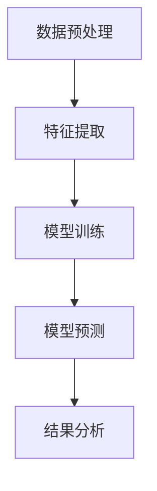
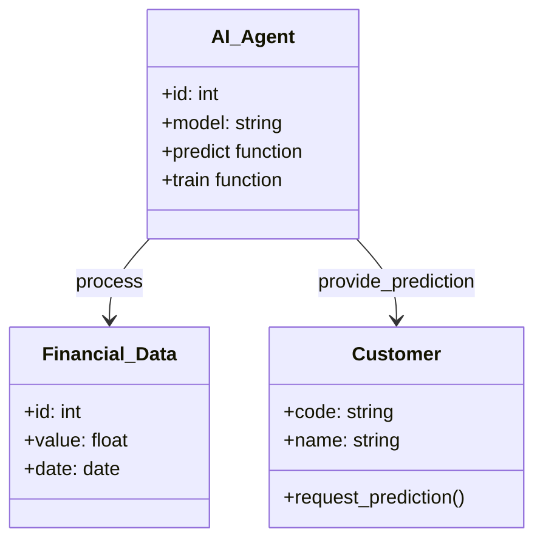
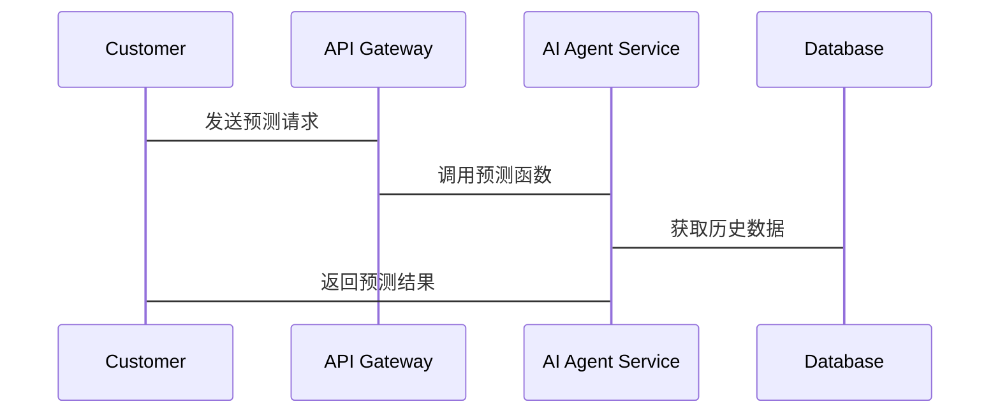

                 


# 《AI Agent辅助企业财务分析与预测》

---

## 关键词：
- AI Agent
- 企业财务分析
- 财务预测
- 人工智能
- 数据分析

---

## 摘要：
本文系统地探讨了AI Agent在企业财务分析与预测中的应用，从理论到实践，详细分析了AI Agent的核心概念、算法原理、系统架构及实际案例。通过深入分析财务数据分析的复杂性，本文展示了AI Agent如何通过智能化处理和预测，为企业提供更精准的决策支持。文章还结合实际项目，详细讲解了系统设计与实现过程，为读者提供了全面的技术指导。

---

# 第一部分: AI Agent与企业财务分析的背景与概念

## 第1章: 问题背景与问题描述

### 1.1 问题背景
#### 1.1.1 企业财务分析的现状与挑战
企业财务分析是企业管理中的核心任务之一，主要涉及对企业财务数据的收集、处理、分析和预测。然而，随着企业规模的扩大和业务的复杂化，传统的财务分析方法面临以下挑战：
- 数据量大：企业每天产生的财务数据量巨大，传统人工分析效率低下。
- 数据复杂性：财务数据涉及多个部门和业务流程，数据之间关系复杂，难以快速提取有用信息。
- 预测准确性：传统的统计分析方法在面对非线性关系和复杂市场变化时，预测准确性有限。

#### 1.1.2 传统财务分析的局限性
- 依赖人工经验：传统财务分析高度依赖分析师的个人经验和主观判断，难以保证结果的客观性和一致性。
- 数据处理效率低：面对海量数据，人工分析效率低下，难以满足实时分析的需求。
- 预测能力有限：传统方法在处理非线性关系和复杂场景时表现不佳，预测结果的准确性难以保证。

#### 1.1.3 AI Agent技术的引入与潜力
AI Agent（人工智能代理）是一种能够感知环境、自主决策并执行任务的智能系统。引入AI Agent技术，可以显著提升企业财务分析的效率和准确性：
- 自动化数据处理：AI Agent能够自动收集、清洗和整理财务数据，减少人工干预。
- 高效分析与预测：利用机器学习和深度学习算法，AI Agent能够快速分析复杂数据，提供精准的财务预测。
- 实时监控与反馈：AI Agent能够实时监控财务数据的变化，及时提供反馈和建议，帮助企业做出快速决策。

### 1.2 问题描述
#### 1.2.1 企业财务分析的核心任务
企业财务分析的核心任务包括：
- 财务数据的收集与整理
- 财务数据的分析与建模
- 财务预测与决策支持

#### 1.2.2 数据量与复杂性对企业财务分析的影响
- 数据量大：企业的财务数据涉及多个部门和业务流程，数据量大且复杂。
- 数据复杂性：数据之间存在复杂的关联关系，传统方法难以有效处理。
- 业务场景多样性：不同企业的业务模式和财务需求差异大，增加了分析的复杂性。

#### 1.2.3 传统方法在复杂场景中的不足
- 预测精度不足：传统统计方法在处理非线性关系和复杂市场变化时，预测精度有限。
- 处理效率低下：面对海量数据，传统方法难以满足实时分析的需求。
- 人工干预过多：传统方法依赖人工经验，难以保证结果的客观性和一致性。

### 1.3 问题解决与边界定义

#### 1.3.1 AI Agent在企业财务分析中的应用
AI Agent在企业财务分析中的应用包括：
- 数据自动化处理：AI Agent能够自动收集、清洗和整理财务数据，提高数据处理效率。
- 智能分析与预测：利用机器学习算法，AI Agent能够快速分析复杂数据，提供精准的财务预测。
- 实时监控与反馈：AI Agent能够实时监控财务数据的变化，及时提供反馈和建议，帮助企业做出快速决策。

#### 1.3.2 问题解决的边界与外延
- 解决边界：AI Agent主要用于解决复杂数据环境下的财务分析与预测问题，适用于数据量大、业务场景复杂的大型企业。
- 解决外延：AI Agent技术可以扩展应用于其他领域，如供应链管理、风险管理等。

#### 1.3.3 概念结构与核心要素
- 核心概念：AI Agent、企业财务分析、财务预测。
- 关键要素：数据源、分析模型、预测结果。

### 1.4 核心概念的属性与特征对比

#### 1.4.1 AI Agent的属性
- 智能性：能够感知环境并自主决策。
- 自主性：无需人工干预，能够独立完成任务。
- 反应性：能够实时响应环境变化。

#### 1.4.2 企业财务分析的属性
- 数据驱动性：依赖财务数据进行分析。
- 复杂性：涉及多个部门和业务流程。
- 实时性：需要及时的财务反馈和决策。

#### 1.4.3 AI Agent在财务分析中的属性
- 智能化：能够自动处理复杂数据。
- 高效性：快速分析和预测。
- 准确性：提供高精度的预测结果。

---

## 第2章: 核心概念与联系

### 2.1 AI Agent与企业财务分析的关系
- AI Agent作为智能工具，能够提升企业财务分析的效率和准确性。
- 企业财务分析为AI Agent提供了应用场景和数据支持。

### 2.2 核心概念的特征对比
| 概念      | 属性                |
|-----------|---------------------|
| AI Agent  | 智能性、自主性、反应性 |
| 财务分析  | 数据驱动性、复杂性、实时性 |
| 财务预测   | 精度要求高、依赖模型、实时更新 |

### 2.3 ER实体关系图
```mermaid
erDiagram
    customer [企业] {
        code : string
        name : string
    }
    financial_data [财务数据] {
        id : integer
        value : float
        date : date
    }
    ai_agent [AI Agent] {
        id : integer
        model : string
    }
    customer --> financial_data : 提供
    ai_agent --> financial_data : 处理
    ai_agent --> customer : 提供预测
```

---

## 第3章: 算法原理讲解

### 3.1 算法选择与原理
- 算法选择：支持向量机（SVM）、随机森林（Random Forest）、长短期记忆网络（LSTM）。
- 算法原理：以LSTM为例，用于时间序列预测，能够捕捉数据中的长期依赖关系。

### 3.2 算法实现步骤


### 3.3 核心代码实现
```python
import pandas as pd
import numpy as np
from sklearn.preprocessing import MinMaxScaler
from keras.models import Sequential
from keras.layers import LSTM, Dense

# 数据预处理
data = pd.read_csv('financial_data.csv')
data = data.values
data = data.reshape(-1, data.shape[0])
scaler = MinMaxScaler(feature_range=(0, 1))
scaled_data = scaler.fit_transform(data)

# LSTM模型构建
model = Sequential()
model.add(LSTM(128, input_shape=(None, 1)))
model.add(Dense(1))
model.compile(optimizer='adam', loss='mean_squared_error')

# 模型训练
model.fit(scaled_data, epochs=100, batch_size=32)
```

### 3.4 数学模型与公式
- 损失函数：均方误差（MSE）
  $$ \text{Loss} = \frac{1}{n}\sum_{i=1}^{n}(y_i - \hat{y}_i)^2 $$
- 优化器：Adam优化器
  $$ \theta_{t+1} = \theta_t - \eta \frac{\rho_1}{1 - \beta_1^t} \frac{\rho_2}{1 - \beta_2^t} \nabla L $$

---

## 第4章: 系统分析与架构设计

### 4.1 系统功能设计


### 4.2 系统架构设计


### 4.3 接口设计
- API接口：RESTful API，支持POST请求。
- 数据接口：与数据库交互，支持增删改查操作。

### 4.4 交互设计


---

## 第5章: 项目实战

### 5.1 环境安装
- 安装Python：3.8及以上版本。
- 安装依赖库：`pip install numpy pandas keras scikit-learn`.

### 5.2 核心代码实现
```python
import pandas as pd
import numpy as np
from sklearn.model_selection import train_test_split
from sklearn.metrics import mean_squared_error

# 数据加载与分割
data = pd.read_csv('financial_data.csv')
X = data[['revenue', 'profit', 'expenses']]
y = data['forecast']
X_train, X_test, y_train, y_test = train_test_split(X, y, test_size=0.2, random_state=42)

# 模型训练
from sklearn.ensemble import RandomForestRegressor
model = RandomForestRegressor(n_estimators=100, random_state=42)
model.fit(X_train, y_train)

# 模型预测
y_pred = model.predict(X_test)

# 模型评估
mse = mean_squared_error(y_test, y_pred)
print(f"均方误差: {mse}")
```

### 5.3 代码解读与分析
- 数据加载与预处理：使用Pandas加载数据，进行数据清洗和特征选择。
- 模型选择：随机森林回归模型，适合处理多维特征的数据。
- 模型训练与预测：使用训练数据训练模型，然后对测试数据进行预测。
- 模型评估：计算均方误差，评估模型的预测精度。

### 5.4 案例分析
- 案例背景：某大型制造企业的财务数据分析与预测。
- 数据来源：企业过去五年的财务数据。
- 预测结果：预测未来一年的财务状况，帮助企业做出投资决策。

### 5.5 项目小结
- 项目目标：实现企业财务数据分析与预测的自动化。
- 项目成果：构建了一个基于AI Agent的财务分析系统，提高了预测精度和效率。

---

## 第6章: 总结与展望

### 6.1 最佳实践 tips
- 数据质量是关键：确保数据的准确性和完整性。
- 模型选择要谨慎：根据具体场景选择合适的算法。
- 系统架构要合理：设计高效的系统架构，确保系统的稳定性和可扩展性。

### 6.2 小结
本文详细探讨了AI Agent在企业财务分析与预测中的应用，从理论到实践，全面分析了AI Agent的优势和实现方法。

### 6.3 注意事项
- 数据隐私保护：在处理财务数据时，必须遵守相关法律法规，保护数据隐私。
- 系统稳定性：确保系统的稳定运行，避免因技术问题影响企业的正常运作。

### 6.4 拓展阅读
- 推荐阅读《机器学习实战》和《深度学习》等书籍，深入了解机器学习和深度学习的理论与实践。

---

## 作者：
作者：AI天才研究院/AI Genius Institute  
作者：禅与计算机程序设计艺术/Zen And The Art of Computer Programming

