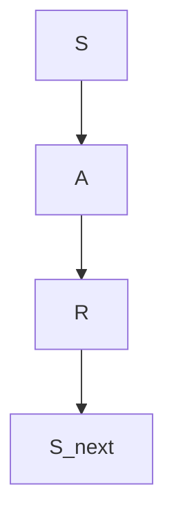
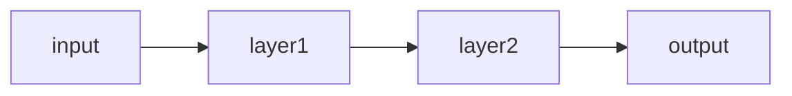
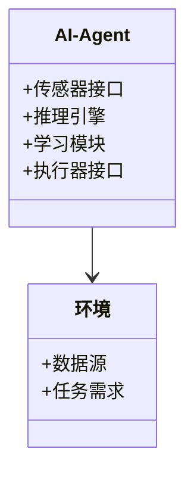
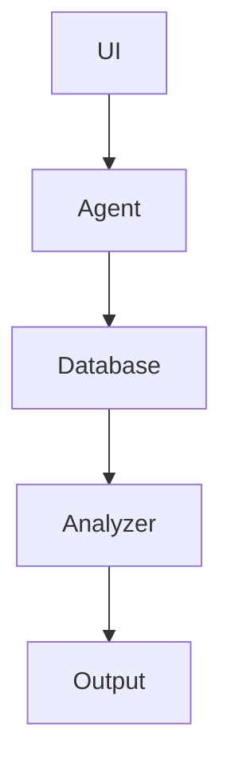

                 


# AI Agent辅助科学研究的方法

## 关键词：AI Agent，人工智能，科学研究，算法，系统设计，案例分析

## 摘要：AI Agent作为人工智能的重要组成部分，在科学研究中发挥着越来越重要的作用。本文从AI Agent的基本概念出发，详细探讨其在科学研究中的应用方法，涵盖任务建模、推理算法、学习机制、系统设计和实际案例分析等方面，帮助读者全面理解并掌握AI Agent辅助科学研究的核心技术与实践应用。

---

## 第一部分: AI Agent的基本概念与基础

### 第1章: AI Agent的定义与核心功能

#### 1.1 AI Agent的定义

AI Agent，即人工智能代理，是一种能够感知环境、自主决策并采取行动的智能实体。它通过传感器获取信息，利用计算模型进行推理，并通过执行器与环境交互。AI Agent可以是软件程序，也可以是物理机器人，其核心在于具备自主性和智能性。

**AI Agent与传统代理的对比表：**

| 特性          | 传统代理                | AI Agent                  |
|---------------|-------------------------|---------------------------|
| 智能水平      | 低或无智能               | 高智能，具备学习和推理能力 |
| 决策方式      | 基于预设规则             | 基于数据学习和动态调整     |
| 适应性        | 有限或无适应性           | 高适应性，能够自适应环境   |

**AI Agent的ER实体关系图：**

```mermaid
er
actor(AI Agent) -[1..n]-> task(任务)
actor(AI Agent) -[1..n]-> environment(环境)
task(任务) --> state(状态)
```

AI Agent在科学研究中的作用日益显著，特别是在数据处理、实验设计和结果分析等方面。它能够帮助科学家更高效地处理复杂问题，提升研究效率和准确性。

#### 1.2 AI Agent在科学研究中的作用

AI Agent在科学研究中扮演着多种角色，包括数据收集、实验设计、结果分析和预测建模等。它通过自动化处理，减少了研究人员的工作量，提高了研究的精确性和广度。

**AI Agent在科学研究中的应用场景：**

- 数据处理与分析
- 实验设计与优化
- 知识发现与推理
- 模型构建与预测

**AI Agent的核心要素：**

1. **感知能力**：通过传感器或数据接口获取环境信息。
2. **推理能力**：基于获取的信息进行逻辑推理和决策。
3. **学习能力**：通过机器学习算法不断优化自身模型。
4. **执行能力**：根据推理结果采取相应行动。

---

## 第二部分: AI Agent的核心算法与数学模型

### 第2章: AI Agent的任务建模与推理

#### 2.1 任务建模的数学模型

任务建模是AI Agent完成特定科学研究任务的基础。通过构建数学模型，可以明确任务的目标、状态和动作空间。

**任务空间的数学表达：**

- 状态空间 \( S \)：描述问题的状态。
- 动作空间 \( A \)：AI Agent可以执行的动作。
- 奖励函数 \( R: S \times A \rightarrow \mathbb{R} \)：定义每个动作的奖励值。

**马尔可夫决策过程（MDP）模型：**



**数学公式：**

$$ V(s) = \max_{a} \sum_{t=0}^\infty \gamma^t r(s_t, a_t) $$

其中，\( V(s) \) 是状态 \( s \) 的价值函数，\( \gamma \) 是折扣因子，\( r(s_t, a_t) \) 是在状态 \( s_t \) 下执行动作 \( a_t \) 的奖励。

#### 2.2 推理算法的实现

AI Agent的推理过程通常基于概率论和逻辑推理。以下是一个简单的条件概率推理示例：

**问题描述：**

假设我们有三个变量 \( A \), \( B \), \( C \)，其中 \( A \) 和 \( B \) 是原因，\( C \) 是结果。已知 \( P(C|A,B) \)，求 \( P(A|C,B) \)。

**解决步骤：**

1. **定义变量关系：**
   $$ P(C|A,B) = 0.8 $$
   $$ P(A) = 0.5 $$
   $$ P(B) = 0.5 $$

2. **计算联合概率：**
   $$ P(C,A,B) = P(A) \times P(B) \times P(C|A,B) = 0.5 \times 0.5 \times 0.8 = 0.2 $$

3. **计算条件概率：**
   $$ P(A|C,B) = \frac{P(C,A,B)}{P(C,B)} = \frac{0.2}{0.5 \times 0.5 \times 0.8 + 0.2} = \frac{0.2}{0.4} = 0.5 $$

**推理过程的mermaid流程图：**

```mermaid
graph TD
    A --> P(A)
    B --> P(B)
    C --> P(C|A,B)
    A,B --> P(C|A,B)
    A,B,C --> P(A|C,B)
```

---

## 第3章: AI Agent的学习机制

### 3.1 监督学习与强化学习的区别

**监督学习：**

- 输入：带标签的数据集。
- 输出：学习模型，预测新的数据点。

**数学公式：**

$$ y = f(x) $$

**强化学习：**

- 输入：环境状态。
- 输出：动作，以最大化累积奖励。

**数学公式：**

$$ Q(s, a) = r + \gamma \max_a Q(s', a') $$

### 3.2 深度学习在AI Agent中的应用

深度学习通过构建多层神经网络，自动提取数据特征，提升AI Agent的学习能力。以下是一个简单的神经网络结构示例：

**神经网络结构图：**



**神经网络的训练过程：**

1. **输入数据**：输入样本 \( x \)。
2. **前向传播**：计算输出 \( y \)。
3. **计算损失**：使用损失函数计算预测值与真实值的差异。
4. **反向传播**：通过梯度下降优化权重。

**数学公式：**

$$ \text{损失} = \frac{1}{n}\sum_{i=1}^n (y_i - \hat{y}_i)^2 $$

---

## 第三部分: AI Agent的系统设计与实现

### 第4章: 科学研究中的AI Agent系统架构

#### 4.1 系统功能设计

AI Agent系统在科学研究中的功能设计需要结合具体应用场景。以下是一个典型的系统功能模块图：



**系统架构设计：**



---

## 第四部分: 项目实战与案例分析

### 第5章: 项目实战

#### 5.1 项目环境安装

- 安装Python和相关库：
  ```bash
  pip install numpy matplotlib scikit-learn
  ```

#### 5.2 系统核心实现源代码

以下是一个简单的AI Agent实现示例：

```python
import numpy as np
from sklearn import svm

# 数据预处理
X = np.array([[1, 2], [3, 4], [5, 6]])
y = np.array([0, 1, 0])

# 创建SVM模型
model = svm.SVC()

# 训练模型
model.fit(X, y)

# 预测新数据
print(model.predict(np.array([[7, 8]])))
```

#### 5.3 代码应用解读与分析

上述代码展示了如何使用支持向量机（SVM）进行分类任务。AI Agent通过训练数据学习模型，并对新数据进行分类预测。

---

## 第五部分: 总结与展望

### 6.1 总结

AI Agent通过任务建模、推理算法和学习机制，为科学研究提供了强大的辅助工具。它能够处理复杂问题，提高研究效率和准确性。

### 6.2 展望

随着技术的进步，AI Agent在科学研究中的应用将更加广泛。未来的研究方向包括优化算法、提高系统的可解释性和应对伦理挑战。

---

## 附录

### A. 工具列表

- Python编程语言
- TensorFlow/PyTorch深度学习框架
- scikit-learn机器学习库

### B. 参考文献

- Russell, S., & Norvig, P. (2010). Artificial Intelligence: A Modern Approach.
- LeCun, Y., Bengio, Y., & Hinton, G. (2015). Deep learning.

---

## 作者：AI天才研究院/AI Genius Institute & 禅与计算机程序设计艺术 /Zen And The Art of Computer Programming

---

本文通过系统地介绍AI Agent的基本概念、核心算法、系统设计和实际案例，全面探讨了AI Agent在科学研究中的应用方法。希望读者能够通过本文，掌握AI Agent的核心技术，并在实际科学研究中加以应用。

