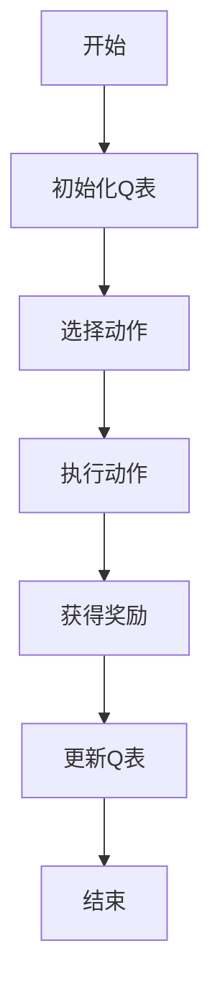
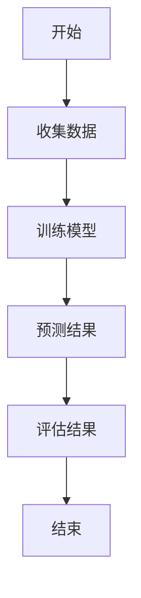
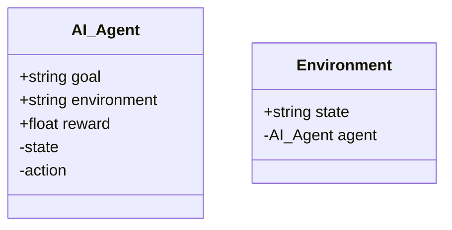
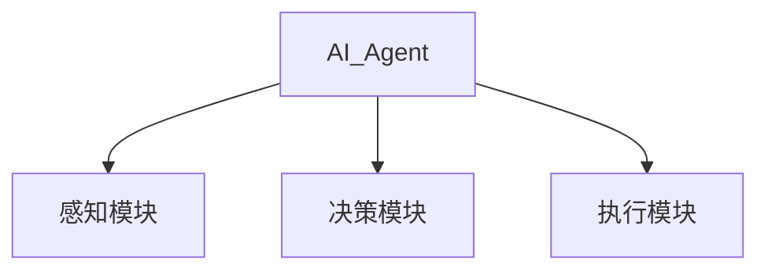
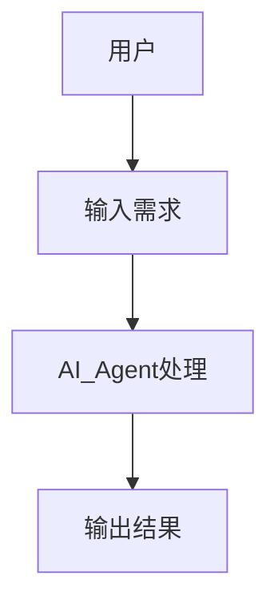

                 


# AI Agent辅助软件开发的方法

> 关键词：AI Agent, 软件开发, 人工智能, 开发效率, 软件质量

> 摘要：本文将详细探讨AI Agent在软件开发中的应用方法，从基本概念到实际应用场景，结合算法原理和系统设计，帮助读者理解如何利用AI Agent提升开发效率和代码质量。

---

## 第1章: AI Agent的概述

### 1.1 AI Agent的基本概念

#### 1.1.1 什么是AI Agent
AI Agent（人工智能代理）是指能够感知环境、做出决策并采取行动的智能实体。与传统软件不同，AI Agent具备自主性、反应性和目标导向性。

#### 1.1.2 AI Agent的核心特点
- **自主性**：AI Agent能够独立决策和行动，无需人工干预。
- **反应性**：能够实时感知环境变化并做出反应。
- **目标导向性**：通过实现目标来优化行为。

#### 1.1.3 AI Agent与传统软件开发的区别
- **传统软件**：基于固定的逻辑和规则执行任务。
- **AI Agent**：具备学习和适应能力，能够优化决策过程。

---

### 1.2 AI Agent在软件开发中的作用

#### 1.2.1 提高开发效率
AI Agent能够自动化处理重复性任务，如代码生成和错误修复，从而节省开发时间。

#### 1.2.2 增强代码质量
通过分析历史数据和最佳实践，AI Agent能够生成高质量的代码，减少潜在错误。

#### 1.2.3 优化开发流程
AI Agent能够实时监控开发流程，提供优化建议，提升整体效率。

---

## 第2章: AI Agent的核心原理

### 2.1 AI Agent的体系结构

#### 2.1.1 反应式体系结构
- **感知环境**：实时收集环境信息。
- **行为选择**：基于当前状态选择最优行为。
- **执行**：根据选择的行为采取行动。

#### 2.1.2 行为选择体系结构
- **目标驱动**：基于目标选择行为。
- **多目标优化**：在多个目标间权衡，选择最优解决方案。

#### 2.1.3 目标驱动体系结构
- **目标设定**：明确任务目标。
- **路径规划**：制定实现目标的步骤。
- **执行与反馈**：根据反馈调整路径。

---

### 2.2 AI Agent的工作原理

#### 2.2.1 信息感知
AI Agent通过传感器或API接口获取环境数据，如代码仓库的状态或用户输入。

#### 2.2.2 行为决策
基于感知的信息，AI Agent使用算法（如强化学习）选择最优行为。

#### 2.2.3 执行与反馈
执行选定的行为，并根据反馈结果优化后续决策。

---

### 2.3 AI Agent与传统AI的区别

#### 2.3.1 传统AI的特点
- **任务特定**：为特定任务设计，不具备自主性。
- **静态规则**：基于固定的规则执行任务。

#### 2.3.2 AI Agent的独特性
- **自主性**：具备独立决策能力。
- **动态适应**：能够根据环境变化调整行为。

#### 2.3.3 区别与联系
AI Agent是传统AI的发展，结合了自主性和目标导向性，使其在复杂环境中更具灵活性。

---

## 第3章: AI Agent在软件开发中的应用场景

### 3.1 代码生成

#### 3.1.1 基于AI Agent的代码生成工具
- **工具介绍**：如GitHub Copilot，能够根据上下文生成代码片段。
- **实现过程**：通过自然语言理解（NLP）技术分析需求，生成相应代码。

#### 3.1.2 代码生成的实现过程
1. **需求分析**：理解用户需求，提取关键信息。
2. **代码生成**：基于提取的信息生成代码片段。
3. **反馈优化**：根据用户反馈调整生成结果。

#### 3.1.3 实际案例分析
- **案例**：生成一个简单的计算器应用程序代码。
- **步骤**：从需求描述到代码生成，展示AI Agent的自动化能力。

---

### 3.2 代码调试与错误修复

#### 3.2.1 AI Agent在调试中的应用
- **错误检测**：通过分析日志和测试结果识别潜在问题。
- **修复建议**：基于历史错误修复案例，提供修复方案。

#### 3.2.2 错误检测与修复的流程
1. **问题识别**：分析程序运行时的错误信息。
2. **修复建议**：生成修复代码片段。
3. **验证修复**：执行修复后的代码，确认问题解决。

#### 3.2.3 案例分析
- **案例**：修复一个数组越界错误。
- **过程**：AI Agent分析错误原因，生成修复代码，并验证修复效果。

---

### 3.3 软件测试与质量保障

#### 3.3.1 AI Agent在测试中的作用
- **测试用例生成**：基于代码结构生成覆盖性测试用例。
- **测试执行**：自动化运行测试用例并报告结果。

#### 3.3.2 测试用例生成与优化
1. **需求分析**：理解被测程序的功能需求。
2. **用例生成**：通过分析代码结构生成测试用例。
3. **优化**：根据测试覆盖率调整用例优先级。

#### 3.3.3 测试结果分析
- **分析方法**：统计测试通过率、覆盖率等指标。
- **结果优化**：根据测试结果调整测试策略。

---

## 第4章: AI Agent的算法原理

### 4.1 基于强化学习的AI Agent

#### 4.1.1 强化学习的基本原理
- **定义**：通过试错学习，智能体在环境中通过与环境互动来最大化累积奖励。
- **数学模型**：使用Q-learning算法，状态-动作价值函数$Q(s,a)$表示在状态$s$下执行动作$a$的期望奖励。

$$ Q(s,a) = Q(s,a) + \alpha \cdot [r + \gamma \cdot \max Q(s',a') - Q(s,a)] $$

其中：
- $\alpha$ 是学习率。
- $\gamma$ 是折扣因子。

#### 4.1.2 AI Agent在强化学习中的应用
- **应用领域**：游戏AI、机器人控制等。
- **实现流程**：
  1. 初始化Q表。
  2. 执行动作并获得奖励。
  3. 更新Q表值。

#### 4.1.3 算法实现流程
- **流程图**：使用mermaid绘制强化学习算法流程图。



---

### 4.2 基于监督学习的AI Agent

#### 4.2.1 监督学习的基本原理
- **定义**：通过训练数据，学习输入到输出的映射关系。
- **数学模型**：线性回归模型$y = wx + b$，其中$w$是权重，$b$是截距。

$$ \text{损失函数} = \frac{1}{2m} \sum_{i=1}^{m} (y_i - wx_i - b)^2 $$

其中：
- $m$ 是训练样本数。
- $y_i$ 是第$i$个样本的真实输出。
- $x_i$ 是第$i$个样本的输入。

#### 4.2.2 监督学习在AI Agent中的应用
- **应用领域**：分类任务、回归任务等。
- **实现流程**：
  1. 收集训练数据。
  2. 训练模型。
  3. 预测并评估结果。

#### 4.2.3 算法实现
- **流程图**：使用mermaid绘制监督学习算法流程图。



---

## 第5章: AI Agent的系统分析与架构设计

### 5.1 系统需求分析

#### 5.1.1 项目介绍
- **目标**：开发一个AI Agent辅助软件开发的系统。
- **功能需求**：代码生成、错误修复、测试优化。

#### 5.1.2 领域模型
- **类图**：使用mermaid绘制领域模型类图。



---

### 5.2 系统架构设计

#### 5.2.1 模块划分
- **感知模块**：负责收集环境信息。
- **决策模块**：基于感知信息做出决策。
- **执行模块**：根据决策执行操作。

#### 5.2.2 架构图
- **架构图**：使用mermaid绘制系统架构图。



---

### 5.3 系统接口设计

#### 5.3.1 接口描述
- **输入接口**：接收环境状态和用户需求。
- **输出接口**：输出决策结果和执行操作。

#### 5.3.2 交互流程
- **流程图**：使用mermaid绘制交互流程图。



---

## 第6章: AI Agent的项目实战

### 6.1 环境安装

#### 6.1.1 安装Python
- **命令**：`python --version` 检查Python版本。

#### 6.1.2 安装依赖
- **命令**：`pip install numpy matplotlib`

---

### 6.2 核心代码实现

#### 6.2.1 加载数据
```python
import numpy as np

data = np.loadtxt('data.csv', delimiter=',')
```

#### 6.2.2 训练模型
```python
from sklearn.linear_model import LinearRegression

model = LinearRegression()
model.fit(data[:, :-1], data[:, -1])
```

#### 6.2.3 预测与评估
```python
predictions = model.predict(new_data)
score = model.score(data[:, :-1], data[:, -1])
print(score)
```

---

### 6.3 案例分析

#### 6.3.1 实际案例
- **案例**：预测房价。
- **数据**：使用Kaggle上的房价数据集。

#### 6.3.2 代码解读
- **解读**：通过线性回归模型预测房价，展示AI Agent在实际项目中的应用。

---

## 第7章: 总结与展望

### 7.1 总结

#### 7.1.1 核心内容回顾
- AI Agent的基本概念。
- AI Agent在软件开发中的应用场景。
- AI Agent的算法原理和系统设计。

#### 7.1.2 最佳实践
- **模块化设计**：确保系统各模块独立且易于扩展。
- **持续优化**：定期更新模型和算法，提升性能。

### 7.2 注意事项

#### 7.2.1 数据安全
- 确保训练数据的安全性和隐私性。

#### 7.2.2 系统稳定性
- 设计容错机制，确保系统稳定运行。

### 7.3 未来展望

#### 7.3.1 技术发展
- AI Agent将更加智能化和自主化。

#### 7.3.2 应用领域
- 更多领域将采用AI Agent技术，推动行业进步。

---

## 作者：AI天才研究院/AI Genius Institute & 禅与计算机程序设计艺术 /Zen And The Art of Computer Programming

---

以上就是《AI Agent辅助软件开发的方法》的完整思考过程和文章内容。

