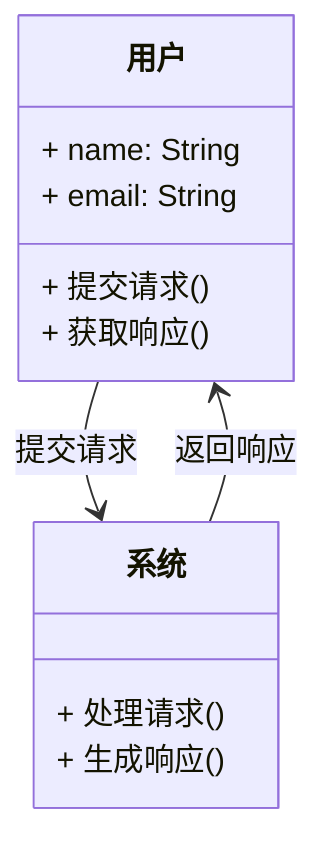
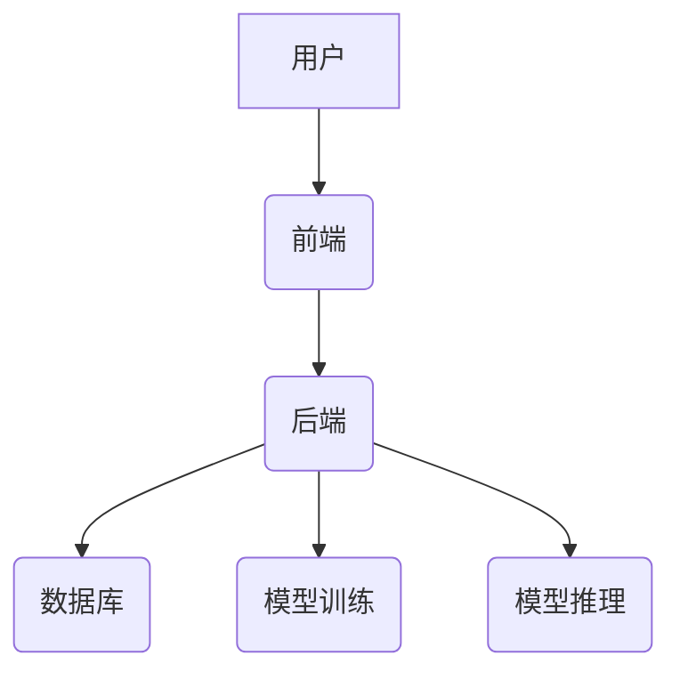

                 


# AI Agent项目成本效益分析指南

## 关键词：AI Agent、成本效益分析、项目管理、系统设计、技术经济分析、投资回报率

## 摘要：本文为AI Agent项目的成本效益分析提供系统性指南。从项目背景到系统架构，详细阐述成本构成、效益评估方法及可行性分析。通过实例分析，提供实际操作步骤和数学模型，帮助读者掌握AI Agent项目的经济与技术可行性评估。

---

# 第1章: AI Agent项目成本效益分析背景

## 1.1 AI Agent的基本概念

### 1.1.1 什么是AI Agent
AI Agent（人工智能代理）是能够感知环境并采取行动以实现目标的智能实体。它通过传感器获取信息，利用推理机制做出决策，并通过执行器与环境交互。

**AI Agent的核心特征：**
- **自主性**：无需外部干预，自主决策。
- **反应性**：能实时感知并响应环境变化。
- **目标导向性**：所有行动均以实现特定目标为导向。

### 1.1.2 AI Agent的核心特征
| 特性 | 描述 |
|------|------|
| 自主性 | 能够独立决策和行动，无需外部干预 |
| 反应性 | 根据环境反馈实时调整行为 |
| 目标导向性 | 行动均以实现预定目标为导向 |

### 1.1.3 AI Agent的应用场景
AI Agent广泛应用于多个领域：
- **智能助手**：如Siri、Alexa等。
- **推荐系统**：基于用户行为推荐内容。
- **自动驾驶**：车辆实时感知并做出驾驶决策。

---

## 1.2 项目成本效益分析的定义

### 1.2.1 成本效益分析的基本概念
成本效益分析（Cost-Benefit Analysis，CBA）是一种评估项目可行性的经济工具，通过比较项目成本与预期收益来判断项目是否值得投资。

### 1.2.2 AI Agent项目中的成本构成
AI Agent项目的成本构成主要包括：
- **开发成本**：包括算法设计、数据收集、模型训练等。
- **运行成本**：服务器租赁、计算资源消耗等。
- **维护成本**：系统更新、 bug修复等。

### 1.2.3 项目效益的衡量标准
项目效益主要体现在：
- **经济效益**：直接带来的经济收益。
- **社会效益**：提升用户体验、优化社会资源配置等。
- **技术效益**：推动技术进步，积累技术经验。

---

## 1.3 本章小结
本章介绍了AI Agent的基本概念、核心特征及应用场景，并定义了成本效益分析的基本概念，明确了AI Agent项目中成本和效益的具体构成。为后续章节的成本效益分析奠定了基础。

---

# 第2章: AI Agent项目的成本构成与效益评估

## 2.1 AI Agent项目的成本构成

### 2.1.1 开发成本
开发成本包括：
- **人力成本**：开发人员、数据科学家的薪资。
- **技术成本**：软件开发工具、AI框架的使用成本。
- **数据成本**：数据收集、清洗和标注的成本。

### 2.1.2 运行成本
运行成本包括：
- **计算资源**：云服务器、GPU等的使用费用。
- **存储成本**：数据存储的费用。
- **网络成本**：数据传输和通信费用。

### 2.1.3 维护成本
维护成本包括：
- **系统更新**：持续优化模型、修复漏洞的成本。
- **技术支持**：提供技术支持和维护服务的费用。

---

## 2.2 项目效益的评估方法

### 2.2.1 经济效益
经济效益主要通过以下指标衡量：
- **投资回报率（ROI）**：项目收益与投资成本的比率。
- **净现值（NPV）**：未来收益的现值减去初始投资。

### 2.2.2 社会效益
社会效益包括：
- **提升用户体验**：通过AI Agent提供更智能、便捷的服务。
- **优化资源配置**：提高资源利用效率，减少浪费。

### 2.2.3 技术效益
技术效益包括：
- **技术积累**：通过项目积累AI相关技术经验。
- **推动技术创新**：在项目中探索新技术，提升技术水平。

---

## 2.3 成本效益分析的数学模型

### 2.3.1 成本模型
总成本 = 开发成本 + 运行成本 + 维护成本

$$
\text{总成本} = C_{\text{开发}} + C_{\text{运行}} + C_{\text{维护}}
$$

### 2.3.2 效益模型
总效益 = 经济效益 + 社会效益 + 技术效益

$$
\text{总效益} = B_{\text{经济}} + B_{\text{社会}} + B_{\text{技术}}
$$

### 2.3.3 综合评估公式
综合评估指数 = （总效益 / 总成本）× 100%

$$
\text{综合评估指数} = \left( \frac{\text{总效益}}{\text{总成本}} \right) \times 100\%
$$

---

## 2.4 本章小结
本章详细分析了AI Agent项目的成本构成，包括开发成本、运行成本和维护成本，并探讨了项目效益的三种主要形式：经济效益、社会效益和技术效益。通过数学模型，明确了成本效益分析的计算方法，为后续章节的可行性分析奠定了基础。

---

# 第3章: AI Agent项目的可行性分析

## 3.1 项目可行性分析的框架

### 3.1.1 技术可行性
技术可行性分析包括：
- **技术可行性**：评估现有技术是否能够满足项目需求。
- **技术风险**：分析可能的技术风险及其影响。

### 3.1.2 经济可行性
经济可行性分析包括：
- **投资成本**：评估项目的初始投资和后续成本。
- **收益预测**：预测项目未来的收益情况。

### 3.1.3 社会可行性
社会可行性分析包括：
- **社会接受度**：评估项目是否符合社会价值观和用户需求。
- **政策法规**：评估项目是否符合相关法律法规。

---

## 3.2 项目可行性分析的步骤

### 3.2.1 明确目标
明确项目的总体目标和具体目标，确保分析方向正确。

### 3.2.2 收集数据
收集与项目相关的所有数据，包括技术数据、经济数据和社会数据。

### 3.2.3 分析评估
根据收集到的数据，运用相关方法进行分析评估，得出可行性结论。

### 3.2.4 制定结论
根据分析结果，制定最终的可行性结论，并提出改进建议。

---

## 3.3 本章小结
本章从技术、经济和社会三个维度，详细分析了AI Agent项目的可行性，提出了可行性分析的框架和步骤。通过系统性分析，确保项目在技术上可行、经济上合理、社会上接受。

---

# 第4章: AI Agent项目的成本效益分析方法

## 4.1 成本效益分析的基本方法

### 4.1.1 直接比较法
直接比较法通过比较不同方案的总成本和总效益，选择最优方案。

### 4.1.2 投资回收期法
投资回收期法通过计算投资成本回收所需的时间，评估项目的经济可行性。

### 4.1.3 净现值法
净现值法通过计算未来收益的现值，评估项目的经济可行性。

---

## 4.2 AI Agent项目中的特殊考虑

### 4.2.1 技术风险的量化
技术风险的量化需要考虑：
- **技术可行性**：技术实现的可能性。
- **技术稳定性**：系统运行的稳定性。

### 4.2.2 数据依赖性的影响
数据依赖性的影响包括：
- **数据质量**：数据的准确性和完整性。
- **数据来源**：数据的合法性和隐私性。

### 4.2.3 用户接受度的评估
用户接受度的评估包括：
- **用户体验**：用户对AI Agent的满意度。
- **用户反馈**：用户对系统的反馈和建议。

---

## 4.3 实例分析

### 4.3.1 某AI Agent项目的成本效益分析案例
假设我们开发一个智能客服AI Agent，以下是其成本效益分析：

- **开发成本**：50万元（包括人力成本、技术成本）。
- **运行成本**：每月10万元（包括服务器租赁、网络成本）。
- **维护成本**：每月5万元（包括系统更新、技术支持）。
- **预期收益**：每月20万元（通过提高客户满意度和效率带来的收益）。

### 4.3.2 分析结果与改进建议
- **投资回收期**：投资回收期为5个月。
- **净现值**：净现值为正数，项目可行。
- **改进建议**：优化系统架构，降低运行成本。

---

## 4.4 本章小结
本章介绍了成本效益分析的基本方法，并结合实例分析，详细探讨了AI Agent项目中的特殊考虑因素。通过实际案例分析，帮助读者更好地理解和应用成本效益分析方法。

---

# 第5章: AI Agent项目的系统设计与架构

## 5.1 问题场景介绍
我们开发一个智能客服AI Agent，旨在提高客户满意度和工作效率。

## 5.2 系统功能设计

### 5.2.1 领域模型
领域模型是一个智能客服系统的类图，展示了系统中的主要类及其关系。



## 5.3 系统架构设计

### 5.3.1 系统架构图
系统架构图展示了AI Agent项目的整体架构，包括前端、后端和数据库。



## 5.4 系统接口设计

### 5.4.1 API接口设计
API接口设计如下：
- **输入接口**：用户请求。
- **输出接口**：系统响应。

### 5.4.2 接口交互流程
接口交互流程如下：

1. 用户通过前端提交请求。
2. 前端将请求发送到后端。
3. 后端处理请求并调用模型进行推理。
4. 后端将推理结果返回给前端。
5. 前端将结果展示给用户。

## 5.5 本章小结
本章通过系统设计与架构，详细阐述了AI Agent项目的实现过程，包括领域模型、系统架构图和接口设计。通过系统化的设计，确保项目的可扩展性和可维护性。

---

# 第6章: AI Agent项目的项目实战

## 6.1 环境安装

### 6.1.1 安装Python
安装Python 3.x版本，确保环境变量配置正确。

### 6.1.2 安装依赖库
安装所需的依赖库，如TensorFlow、PyTorch等。

### 6.1.3 安装开发工具
安装IDE（如PyCharm）和其他开发工具。

## 6.2 核心代码实现

### 6.2.1 模型训练代码
以下是模型训练的Python代码示例：

```python
import tensorflow as tf
from tensorflow.keras import layers

# 定义模型
model = tf.keras.Sequential([
    layers.Dense(64, activation='relu'),
    layers.Dense(1, activation='sigmoid')
])

# 编译模型
model.compile(optimizer='adam', loss='binary_crossentropy', metrics=['accuracy'])

# 训练模型
model.fit(x_train, y_train, epochs=10, batch_size=32)
```

### 6.2.2 推理代码
以下是模型推理的Python代码示例：

```python
# 加载训练好的模型
model.load_weights("model.h5")

# 接收用户请求
request = input("请输入您的请求：")

# 调用模型进行推理
prediction = model.predict(request)

# 输出系统响应
print("系统响应：", prediction)
```

## 6.3 案例分析

### 6.3.1 某AI Agent项目的实战案例
假设我们开发一个智能客服AI Agent，以下是其实战案例：

1. **需求分析**：明确用户需求，设计系统功能。
2. **系统设计**：根据需求设计系统架构和接口。
3. **模型训练**：收集数据，训练AI模型。
4. **系统实现**：编写代码，实现系统功能。
5. **测试优化**：测试系统，优化性能。

## 6.4 本章小结
本章通过项目实战，详细展示了AI Agent项目的实现过程，包括环境安装、核心代码实现和案例分析。通过实际操作，帮助读者掌握AI Agent项目的开发和部署。

---

# 第7章: 最佳实践与总结

## 7.1 小结
通过本文的系统分析，我们全面探讨了AI Agent项目的成本效益分析方法，从背景到系统设计，再到项目实战，为读者提供了详细的指导。

## 7.2 注意事项
在实际项目中，需要注意以下几点：
- **数据隐私**：确保数据的合法性和隐私性。
- **技术风险**：重视技术风险的评估和控制。
- **用户反馈**：及时收集和处理用户反馈，优化系统。

## 7.3 拓展阅读
建议读者进一步阅读以下内容：
- **AI Agent技术**：深入学习AI Agent的相关技术。
- **成本效益分析**：学习更多成本效益分析的方法和工具。
- **系统设计**：学习系统设计的更多方法和最佳实践。

## 7.4 本章小结
本章总结了AI Agent项目成本效益分析的要点，提出了注意事项和拓展阅读的方向，帮助读者进一步提升技术水平。

---

# 作者
作者：AI天才研究院/AI Genius Institute  
作者：禅与计算机程序设计艺术/Zen And The Art of Computer Programming

