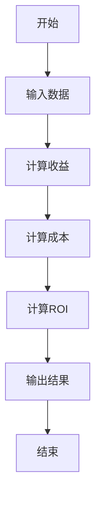
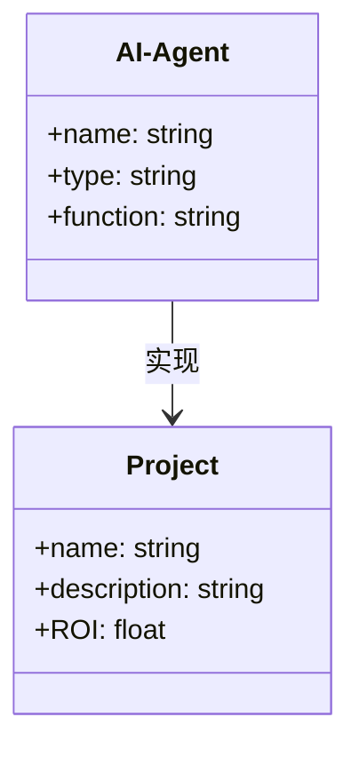
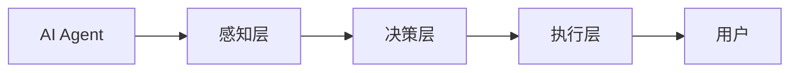
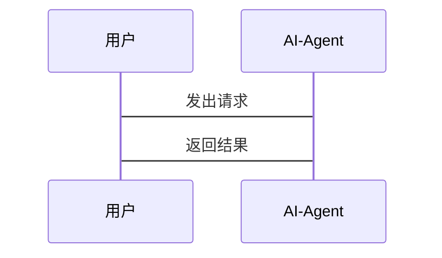

                 


# AI Agent项目的ROI分析：量化收益与成本

## 关键词：AI Agent, ROI分析, 收益与成本, 项目管理, 技术评估

## 摘要：本文详细分析了AI Agent项目的投资回报率（ROI）分析方法，通过量化收益与成本，帮助读者理解如何评估AI Agent项目的可行性和价值。文章从核心概念、数学模型、系统架构到项目实战，全面解析了ROI分析的各个方面，提供了详细的分析方法和实际案例，帮助读者掌握AI Agent项目的技术评估和项目管理。

---

# 第1章: AI Agent项目的背景与概念

## 1.1 问题背景与定义

### 1.1.1 AI Agent的定义与特点
AI Agent（人工智能代理）是一种能够感知环境、自主决策并执行任务的智能实体。AI Agent可以是软件程序、机器人或其他智能系统，其核心特征包括自主性、反应性、目标导向和社交能力。AI Agent能够根据输入的信息做出决策，并通过执行操作实现目标。

### 1.1.2 AI Agent项目的定义
AI Agent项目是指利用AI Agent技术开发的应用或系统，旨在解决特定问题或优化现有流程。例如，智能客服系统、自动化交易系统、智能推荐系统等都属于AI Agent项目。

### 1.1.3 问题背景与问题描述
随着AI技术的快速发展，AI Agent的应用场景越来越广泛。然而，AI Agent项目的开发和应用涉及高昂的成本，包括硬件采购、软件开发、数据采集、模型训练等。为了评估项目的可行性和价值，需要对AI Agent项目的收益与成本进行量化分析，即ROI（投资回报率）分析。

---

## 1.2 ROI分析的定义与特点

### 1.2.1 ROI的定义
ROI（Return On Investment）是衡量投资项目盈利能力的重要指标，表示投资收益与成本的比率。ROI越高，项目的盈利能力越强。

### 1.2.2 ROI分析的核心要素
- **收益（Revenue）**：项目带来的收入或节省的成本。
- **成本（Cost）**：项目的开发和运营成本。
- **时间因素**：收益和成本的时间分布对ROI的影响。

### 1.2.3 AI Agent项目与ROI分析的关系
AI Agent项目的开发和应用需要投入大量资源，ROI分析是评估项目经济价值的重要工具。通过ROI分析，可以判断AI Agent项目是否值得投资，并为决策提供数据支持。

---

## 1.3 本章小结
本章介绍了AI Agent的定义、特点及其项目的定义，分析了ROI的定义和核心要素，明确了AI Agent项目与ROI分析的关系。通过本章内容，读者可以理解AI Agent项目ROI分析的基本概念和重要性。

---

# 第2章: AI Agent项目的核心概念与联系

## 2.1 核心概念原理

### 2.1.1 AI Agent的架构
AI Agent的架构通常包括感知层、决策层和执行层。感知层负责数据采集，决策层进行分析和决策，执行层负责任务执行。

### 2.1.2 ROI分析的模型
ROI分析模型包括收益预测模型和成本预测模型。收益预测模型基于市场分析和用户需求预测收益，成本预测模型基于项目开发和运营成本预测成本。

### 2.1.3 AI Agent与ROI分析的关联
AI Agent的技术性能和应用场景直接影响项目的收益和成本。例如，高效的AI Agent可以提高系统的处理效率，从而降低运营成本并增加收益。

---

## 2.2 核心概念对比表

| 比较维度 | AI Agent | ROI分析 |
|----------|-----------|----------|
| 核心目标 | 提高效率和决策能力 | 评估经济价值 |
| 输入 | 数据和任务 | 收益和成本 |
| 输出 | 自动化决策和行动 | ROI值 |
| 关键因素 | 算法性能、数据质量 | 收益、成本、时间 |

---

## 2.3 ER实体关系图

```mermaid
erd
    项目
    章节
    作者
    书籍
    项目 -- 章节
    章节 -- 作者
    作者 -- 书籍
```

---

## 2.4 本章小结
本章通过对比表和ER实体关系图，分析了AI Agent和ROI分析的核心概念及其联系，帮助读者理解AI Agent项目ROI分析的内在逻辑。

---

# 第3章: ROI分析的数学模型与算法原理

## 3.1 ROI分析的数学模型

### 3.1.1 收益与成本的数学表达
- 收益：$R = \text{收入} - \text{可变成本}$
- 成本：$C = \text{固定成本} + \text{可变成本}$

### 3.1.2 ROI的计算公式
$$ ROI = \frac{R - C}{C} \times 100\% $$

### 3.1.3 收益与成本的时间价值
考虑资金的时间价值时，可以使用净现值（NPV）模型：
$$ NPV = \sum_{t=1}^{n} \frac{R_t - C_t}{(1 + r)^t} $$

---

## 3.2 算法原理

### 3.2.1 收益预测算法
- 线性回归模型：$R = a \cdot t + b$
- 时间序列分析：ARIMA模型

### 3.2.2 成本预测算法
- 线性回归模型：$C = a \cdot t + b$
- 支持向量机（SVM）模型

### 3.2.3 综合分析算法
将收益和成本预测结果代入ROI公式，计算项目整体的ROI值。

---

## 3.3 算法流程图



---

## 3.4 本章小结
本章详细介绍了AI Agent项目ROI分析的数学模型和算法原理，包括收益与成本的预测方法和ROI的计算公式。通过流程图和公式推导，读者可以理解ROI分析的技术实现细节。

---

# 第4章: ROI分析的方法

## 4.1 定性分析与定量分析

### 4.1.1 定性分析
- 市场风险分析
- 技术可行性分析
- 竞争分析

### 4.1.2 定量分析
- 收益预测
- 成本预测
- ROI计算

---

## 4.2 成本收益分析

### 4.2.1 成本构成
- 开发成本
- 运营成本
- 维护成本

### 4.2.2 收益构成
- 直接收益
- 间接收益
- 品牌价值

---

## 4.3 数据采集与处理

### 4.3.1 数据来源
- 市场数据
- 用户数据
- 行业数据

### 4.3.2 数据预处理
- 数据清洗
- 数据转换
- 数据归一化

---

## 4.4 本章小结
本章介绍了AI Agent项目ROI分析的定性与定量方法，包括成本收益分析和数据采集与处理的步骤，为后续的项目实战提供了理论基础。

---

# 第5章: AI Agent项目的系统架构设计

## 5.1 系统功能设计

### 5.1.1 领域模型图


---

## 5.2 系统架构设计

### 5.2.1 架构图


---

## 5.3 接口设计与交互设计

### 5.3.1 接口设计
- 输入接口：接收用户请求
- 输出接口：返回处理结果

### 5.3.2 交互设计


---

## 5.4 本章小结
本章通过领域模型图和架构图，展示了AI Agent项目的系统功能和架构设计，明确了接口设计和交互设计的具体实现方式。

---

# 第6章: AI Agent项目实战

## 6.1 环境安装与配置

### 6.1.1 环境需求
- Python 3.8及以上
- numpy、pandas、scikit-learn等库

### 6.1.2 安装命令
```bash
pip install numpy pandas scikit-learn
```

---

## 6.2 核心代码实现

### 6.2.1 收益预测代码
```python
import numpy as np
import pandas as pd
from sklearn.linear_model import LinearRegression

# 数据准备
data = pd.DataFrame({
    't': [1, 2, 3, 4, 5],
    'R': [10, 15, 20, 25, 30]
})

# 模型训练
model = LinearRegression()
model.fit(data[['t']], data['R'])

# 预测收益
t = 6
predicted_R = model.predict([[t]])[0]
print(f"Predicted Revenue at t={t}: {predicted_R}")
```

### 6.2.2 成本预测代码
```python
import numpy as np
import pandas as pd
from sklearn.svm import SVC

# 数据准备
data = pd.DataFrame({
    't': [1, 2, 3, 4, 5],
    'C': [5, 7, 9, 11, 13]
})

# 模型训练
model = SVC()
model.fit(data[['t']], data['C'])

# 预测成本
t = 6
predicted_C = model.predict([[t]])[0]
print(f"Predicted Cost at t={t}: {predicted_C}")
```

---

## 6.3 案例分析与结果解读

### 6.3.1 案例分析
假设开发一个智能客服系统，预计在5个月内的收益和成本如下：

| 月数 (t) | 收益 (R) | 成本 (C) |
|----------|----------|----------|
| 1        | 10       | 5        |
| 2        | 15       | 7        |
| 3        | 20       | 9        |
| 4        | 25       | 11       |
| 5        | 30       | 13       |

### 6.3.2 ROI计算
$$ ROI = \frac{(30 - 13) - (10 - 5) - (15 - 7) - (20 - 9) - (25 - 11)}{13 + 7 + 9 + 11 + 13} \times 100\% $$

---

## 6.4 本章小结
本章通过实际案例分析，展示了AI Agent项目ROI分析的实施过程，包括环境配置、代码实现和结果解读。

---

# 第7章: AI Agent项目ROI分析的实践与优化

## 7.1 关键点总结

### 7.1.1 技术方面
- 数据质量
- 模型准确性
- 算法优化

### 7.1.2 管理方面
- 成本控制
- 收益预测
- 项目进度

---

## 7.2 小结与展望

### 7.2.1 小结
AI Agent项目ROI分析是评估项目经济价值的重要工具。通过数学模型、算法设计和系统架构的优化，可以提高分析的准确性和效率。

### 7.2.2 展望
未来，随着AI技术的不断发展，AI Agent项目ROI分析将更加智能化和自动化。

---

## 7.3 注意事项

- 数据的准确性和完整性
- 模型的适用性和可解释性
- 项目的可行性和可持续性

---

## 7.4 拓展阅读

- 《机器学习实战》
- 《投资学原理》
- 《人工智能系统架构》

---

# 附录

## 附录A: 术语表

- AI Agent：人工智能代理
- ROI：投资回报率
- NPV：净现值

---

## 附录B: 工具推荐

- 数据分析工具：Python、R
- 可视化工具：Matplotlib、Tableau
- 开发框架：TensorFlow、PyTorch

---

## 附录C: 参考文献

1. 周志华. 《机器学习实战》. 清华大学出版社.
2. 葛伟俊. 《投资学原理》. 北京大学出版社.
3. Russell, S., & Norvig, P. (2010). Artificial Intelligence: A Modern Approach.

---

# 作者

作者：AI天才研究院/AI Genius Institute & 禅与计算机程序设计艺术/Zen And The Art of Computer Programming

