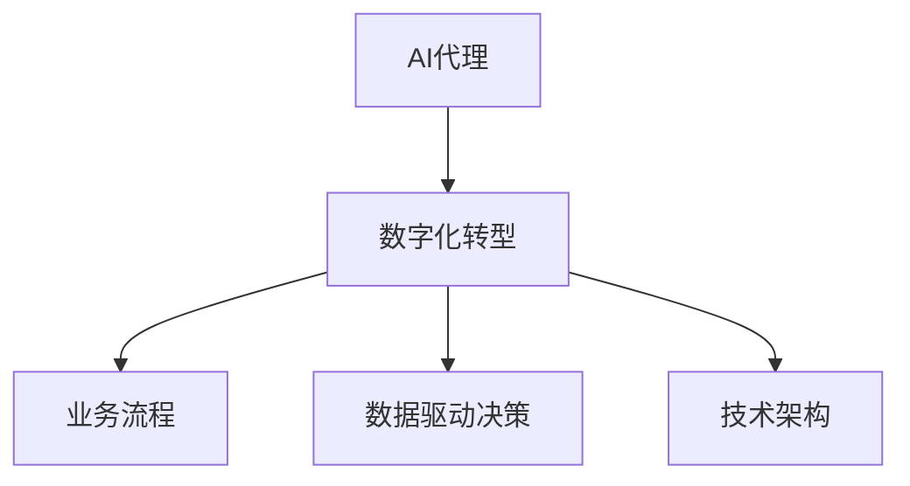
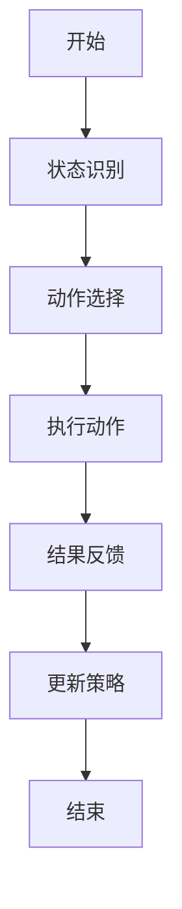
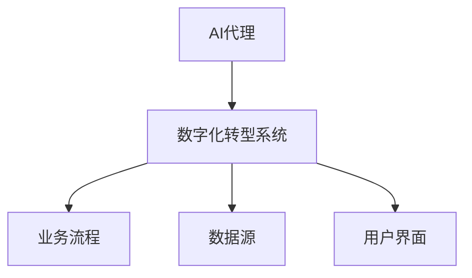

                 


# AI Agents在公司数字化转型效果评估中的应用

> 关键词：AI代理，数字化转型，效果评估，算法原理，系统架构

> 摘要：本文详细探讨了AI代理在公司数字化转型效果评估中的应用。通过分析AI代理的核心概念、算法原理、系统架构及实际案例，本文揭示了AI代理如何助力企业实现数字化转型的深度洞察。文章从背景介绍、核心概念、算法原理、系统架构、项目实战等多个维度展开，为企业提供了一套完整的AI代理驱动的数字化转型效果评估方法论。

---

## 第一部分: AI代理与公司数字化转型概述

### 第1章: 数字化转型与AI代理的背景介绍

#### 1.1 数字化转型的定义与核心概念
- **1.1.1 数字化转型的定义**  
  数字化转型是指通过技术手段将企业的业务流程、运营模式和组织结构进行数字化改造，以提升效率、竞争力和创新能力。

- **1.1.2 数字化转型的核心要素**  
  - 数据驱动：利用数据进行决策和优化。
  - 技术支撑：依赖云计算、大数据、AI等技术。
  - 组织变革：推动企业组织结构和文化转型。
  - 业务创新：通过数字化手段实现业务模式创新。

- **1.1.3 数字化转型的背景与趋势**  
  随着AI、大数据和物联网等技术的快速发展，企业数字化转型已成为必然趋势，旨在应对市场竞争和客户需求的变化。

#### 1.2 AI代理的定义与特点
- **1.2.1 AI代理的定义**  
  AI代理是一种智能系统，能够感知环境、自主决策并执行任务，以实现特定目标。

- **1.2.2 AI代理的核心特点**  
  - 智能性：基于数据和算法进行决策。
  - 自适应性：能够根据环境变化调整行为。
  - 交互性：与用户或系统进行实时交互。

- **1.2.3 AI代理与传统IT系统的主要区别**  
  | 特性       | AI代理             | 传统IT系统         |
  |------------|--------------------|--------------------|
  | 决策能力   | 自主决策           | 依赖人工干预       |
  | 学习能力   | 能够不断优化       | 无法自我优化       |
  | 交互方式   | 支持自然语言交互   | 基于固定规则交互   |

#### 1.3 数字化转型中AI代理的应用场景
- **1.3.1 AI代理在企业运营中的应用场景**  
  - 优化供应链管理：通过AI代理实时监控库存和物流，减少浪费。
  - 提升客户体验：通过智能客服系统提供个性化服务。

- **1.3.2 AI代理在业务流程优化中的作用**  
  - 自动化处理重复性任务：如数据录入、邮件分类。
  - 提供实时反馈：帮助业务部门快速调整策略。

- **1.3.3 AI代理在数据驱动决策中的价值**  
  - 数据分析与预测：通过AI代理分析海量数据，提供精准的决策支持。
  - 智能监控：实时监控系统运行状态，及时发现并解决问题。

#### 1.4 本章小结  
本章介绍了数字化转型的核心概念和AI代理的基本特点，分析了AI代理在企业运营中的应用场景，为后续章节奠定了基础。

---

## 第二部分: AI代理在数字化转型中的核心概念与联系

### 第2章: AI代理与数字化转型的核心概念

#### 2.1 AI代理的核心概念原理
- **2.1.1 AI代理的基本原理**  
  AI代理通过感知环境、分析数据、制定策略并执行任务，实现目标。

- **2.1.2 AI代理的决策机制**  
  - 基于规则的决策：通过预定义的规则进行判断。
  - 基于机器学习的决策：通过训练模型进行预测和决策。
  - 基于强化学习的决策：通过不断试错优化策略。

- **2.1.3 AI代理的学习与自适应能力**  
  AI代理能够通过反馈机制不断优化自身的算法和策略。

#### 2.2 AI代理与数字化转型的联系
- **2.2.1 AI代理如何推动数字化转型**  
  - 提供智能化的解决方案，提升企业效率。
  - 支持数据驱动的决策，优化业务流程。

- **2.2.2 数字化转型为AI代理提供的应用场景**  
  - 数据的丰富性：数字化转型为企业提供了大量结构化和非结构化数据，为AI代理提供了训练和优化的条件。
  - 技术的成熟性：云计算和大数据技术的成熟为AI代理的部署和运行提供了技术保障。

- **2.2.3 AI代理与数字化转型的相互作用**  
  AI代理推动数字化转型，数字化转型反过来又为AI代理提供了更多的数据和应用场景，形成正向循环。

#### 2.3 AI代理与数字化转型的对比分析
- **2.3.1 核心概念对比**  
  | 特性       | AI代理             | 数字化转型         |
  |------------|--------------------|--------------------|
  | 目标       | 完成特定任务       | 实现业务数字化     |
  | 技术基础   | AI算法             | 多种数字化技术     |
  | 应用场景   | 智能决策、自动化    | 业务流程优化       |

- **2.3.2 属性特征对比**  
  | 特性       | AI代理             | 数字化转型         |
  |------------|--------------------|--------------------|
  | 智能性     | 高                 | 高                 |
  | 可扩展性   | 高                 | 高                 |
  | 交互性     | 强                 | 中                 |

- **2.3.3 优缺点对比**  
  | 特性       | AI代理             | 数字化转型         |
  |------------|--------------------|--------------------|
  | 优点       | 提高效率、自动化     | 提升竞争力、创新性 |
  | 缺点       | 需要大量数据和算力  | 需要组织变革       |

#### 2.4 实体关系图
- **2.4.1 AI代理与数字化转型的ER实体关系图**  


#### 2.5 本章小结  
本章详细分析了AI代理的核心概念和其与数字化转型的联系，通过对比分析和实体关系图，揭示了两者之间的相互作用。

---

## 第三部分: AI代理的算法原理与数学模型

### 第3章: AI代理的算法原理

#### 3.1 AI代理的算法概述
- **3.1.1 基于规则的AI代理**  
  通过预定义的规则进行决策，适用于简单场景。

- **3.1.2 基于机器学习的AI代理**  
  通过训练数据生成模型，适用于复杂场景。

- **3.1.3 基于深度学习的AI代理**  
  通过神经网络进行特征学习和决策，适用于高度复杂场景。

#### 3.2 基于强化学习的AI代理算法
- **3.2.1 强化学习的基本原理**  
  AI代理通过与环境交互，不断试错，以获得最大化的累计奖励。

- **3.2.2 AI代理的奖励机制**  
  根据任务完成情况给予奖励，例如完成任务给予正向奖励，失败给予负向奖励。

- **3.2.3 AI代理的策略优化**  
  通过不断优化策略参数，提升任务完成效率和质量。

#### 3.3 AI代理的算法实现
- **3.3.1 算法流程图**  


- **3.3.2 Python代码示例**  
  ```python
  import numpy as np

  def reward_function(state, action, next_state):
      # 简单的奖励函数示例
      if next_state == "success":
          return 1
      else:
          return -0.1

  class AI-Agent:
      def __init__(self, state_space, action_space):
          self.state_space = state_space
          self.action_space = action_space
          self奖励函数 = reward_function

      def choose_action(self, state):
          # 简单策略示例
          if state in ["high_risk", "critical"]:
              return "alert"
          else:
              return "monitor"

      def update_policy(self, state, action, reward):
          # 简单策略优化示例
          if reward > 0:
              self政策 = action
  ```

- **3.4 数学模型与公式**
  - **3.4.1 强化学习的数学模型**  
    $$ R(s, a) = \text{奖励函数} $$
  - **3.4.2 策略优化的数学公式**  
    $$ \theta_{t+1} = \theta_t + \alpha \nabla J(\theta_t) $$

#### 3.5 本章小结  
本章详细介绍了AI代理的算法原理，包括基于规则、机器学习和深度学习的AI代理，以及强化学习的数学模型和代码实现。

---

## 第四部分: 数字化转型效果评估的系统分析与架构设计

### 第4章: 数字化转型效果评估的系统分析

#### 4.1 问题场景介绍
- **4.1.1 数字化转型中的关键问题**  
  - 数据孤岛问题：各部门数据无法有效共享。
  - 业务流程复杂：流程冗长，效率低下。
  - 技术整合困难：多种技术栈难以统一管理。

- **4.1.2 AI代理在效果评估中的作用**  
  - 提供实时数据监控，帮助评估数字化转型的效果。
  - 通过数据分析，找出瓶颈并提出优化建议。

#### 4.2 系统功能设计
- **4.2.1 领域模型**  
  ```mermaid
  classDiagram
      class AI-Agent {
          +state: string
          +action: string
          +policy: string
          -reward_fn: function
          +choose_action(): string
          +update_policy(): void
      }
      class Digital-Transformation {
          +state: string
          +action: string
          +result: string
          -monitor_system(): void
          -optimize_process(): void
      }
      AI-Agent --> Digital-Transformation: 实现
  ```

- **4.2.2 系统架构图**  


- **4.2.3 接口与交互设计**  
  ```mermaid
  sequenceDiagram
      participant AI-Agent
      participant Digital-Transformation
      AI-Agent -> Digital-Transformation: 请求数据
      Digital-Transformation -> AI-Agent: 返回数据
      AI-Agent -> Digital-Transformation: 提出优化建议
      Digital-Transformation -> AI-Agent: 确认优化
  ```

#### 4.3 本章小结  
本章通过系统分析和架构设计，展示了AI代理在数字化转型效果评估中的系统实现方式。

---

## 第五部分: 项目实战与案例分析

### 第5章: 项目实战

#### 5.1 环境安装与配置
- **5.1.1 安装Python与依赖库**  
  ```bash
  pip install numpy scikit-learn matplotlib
  ```

- **5.1.2 安装AI代理框架**  
  ```bash
  pip install gym
  ```

#### 5.2 系统核心实现
- **5.2.1 AI代理核心代码**  
  ```python
  import gym
  import numpy as np

  env = gym.make('CartPole-v0')
  agent = AI-Agent(env.observation_space, env.action_space)
  ```

- **5.2.2 数字化转型效果评估代码**  
  ```python
  def evaluate_transformation():
      env = gym.make('CartPole-v0')
      agent = AI-Agent(env.observation_space, env.action_space)
      for _ in range(100):
          state = env.reset()
          done = False
          while not done:
              action = agent.choose_action(state)
              next_state, reward, done, info = env.step(action)
              agent.update_policy(state, action, reward)
              state = next_state
  ```

#### 5.3 案例分析与效果评估
- **5.3.1 案例分析**  
  通过模拟案例，展示AI代理在数字化转型中的实际应用效果。

- **5.3.2 优化建议**  
  根据评估结果，提出进一步优化的建议，例如优化奖励函数或改进算法。

#### 5.4 本章小结  
本章通过项目实战，展示了AI代理在数字化转型效果评估中的具体实现和应用案例。

---

## 第六部分: 最佳实践与总结

### 第6章: 最佳实践与总结

#### 6.1 最佳实践
- **技术选型**：根据具体需求选择合适的AI代理框架和技术栈。
- **数据管理**：确保数据质量和完整性，为AI代理提供充足的数据支持。
- **团队协作**：数字化转型需要跨部门协作，确保技术与业务的无缝对接。

#### 6.2 本章小结  
总结本文的核心内容，强调AI代理在数字化转型中的重要性，并提出未来研究的方向。

#### 6.3 注意事项
- 数据隐私与安全：在数字化转型中，必须重视数据的隐私和安全问题。
- 技术可行性：在实际应用中，需考虑技术的可行性和实施难度。

#### 6.4 拓展阅读
- 推荐阅读《AI与企业数字化转型》和《强化学习实战》等书籍，深入理解AI代理的应用场景和技术细节。

---

## 作者：AI天才研究院 & 禅与计算机程序设计艺术

---

以上是完整的文章大纲，涵盖了从背景介绍到系统实现的各个方面，确保文章内容详实、逻辑清晰，满足技术博客的专业性和深度要求。

