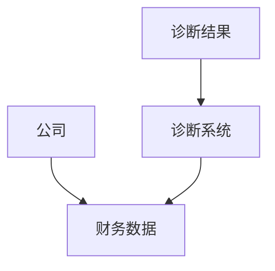
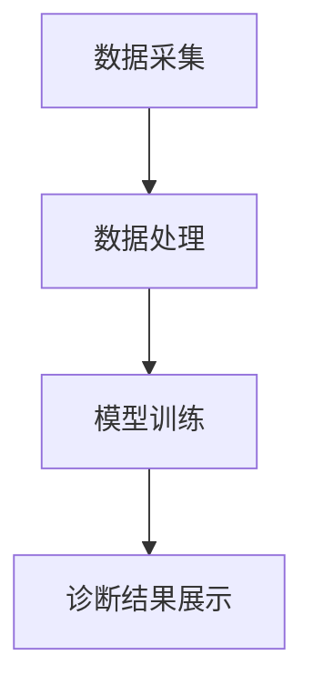
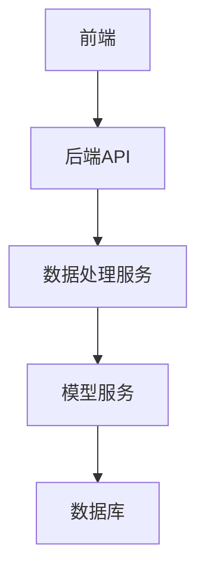
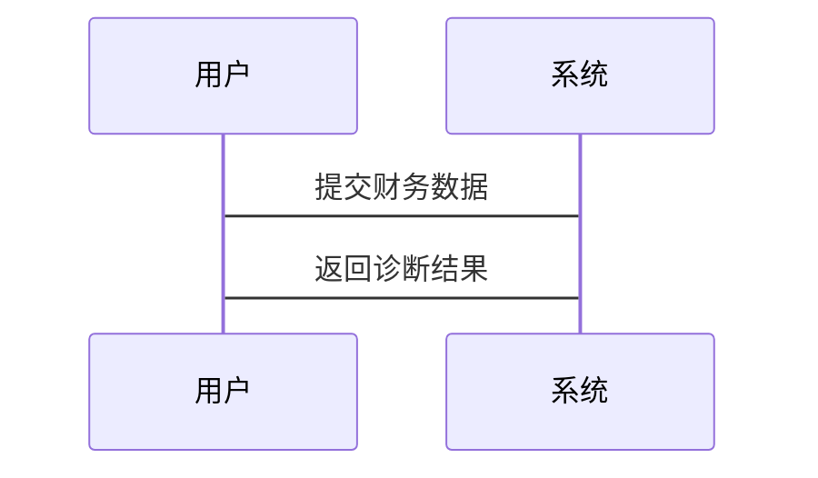

                 


# AI增强型公司财务健康诊断系统

> 关键词：人工智能，财务诊断，大数据，系统架构，算法模型，企业风险管理

> 摘要：本文深入探讨了AI增强型公司财务健康诊断系统的构建与应用，从技术背景、核心算法、系统架构到项目实战，详细阐述了如何利用人工智能技术提升企业财务健康诊断的效率与准确性。

---

# 第1章 AI与公司财务健康诊断的背景

## 1.1 问题背景

### 1.1.1 传统公司财务诊断的局限性
传统公司财务诊断主要依赖于财务报表分析、比率分析等方法，存在以下问题：
- **数据量有限**：传统方法通常只依赖财务报表，难以充分利用企业内外部的海量数据。
- **主观性较高**：诊断结果很大程度上依赖于分析师的经验和判断，存在主观性。
- **效率低下**：面对海量数据时，人工分析效率难以满足需求。

### 1.1.2 AI技术在财务诊断中的潜力
人工智能技术在处理海量数据和复杂模式识别方面具有显著优势，能够显著提升财务诊断的效率和准确性：
- **数据处理能力**：AI可以处理结构化和非结构化数据，提取更多有价值的信息。
- **自动化与智能化**：AI能够自动化分析数据，提供实时诊断结果。
- **预测能力**：通过机器学习模型，AI可以预测财务风险，提前采取应对措施。

### 1.1.3 当前企业财务管理面临的挑战
- **数据复杂性**：企业财务数据来源多样，结构复杂。
- **风险防控**：企业面临财务风险的可能性增加，需要更高效的诊断工具。
- **效率与成本**：传统方法效率低，难以满足企业快速决策的需求。

## 1.2 问题描述

### 1.2.1 财务数据的复杂性
企业财务数据包括财务报表、银行流水、交易记录等，数据类型多样，结构复杂。

### 1.2.2 诊断过程的主观性
传统诊断方法依赖于经验丰富的财务分析师，主观性强，容易受到个人判断的影响。

### 1.2.3 传统方法的效率瓶颈
面对海量数据，人工分析效率低，难以及时提供诊断结果。

## 1.3 问题解决

### 1.3.1 AI技术如何提升财务诊断效率
- **自动化数据处理**：AI能够快速处理大量数据，提取关键信息。
- **模式识别**：通过机器学习算法识别财务数据中的潜在风险和趋势。
- **实时监控**：AI可以实时分析财务数据，提供实时诊断结果。

### 1.3.2 数据驱动的诊断方法
利用大数据技术，结合机器学习模型，实现数据驱动的财务诊断。

### 1.3.3 结合专家经验的AI诊断系统
将专家经验融入AI模型，提升诊断的准确性和可靠性。

## 1.4 系统的边界与外延

### 1.4.1 系统的功能边界
- 输入：财务数据、业务数据。
- 输出：财务健康诊断结果、风险预警。

### 1.4.2 与外部系统的交互
- 数据来源：企业ERP系统、财务系统。
- 数据输出：诊断结果可通过报表或API形式输出。

### 1.4.3 系统的可扩展性
- 支持多种数据源接入。
- 支持多种诊断模型的扩展。

## 1.5 核心概念与联系

### 1.5.1 核心概念原理
- **财务数据**：企业的财务相关数据，包括收入、支出、资产、负债等。
- **诊断模型**：基于机器学习的模型，用于分析财务数据，生成诊断结果。
- **诊断结果**：模型输出的财务健康状况评估。

### 1.5.2 概念属性特征对比表
| 概念       | 属性       | 特征描述                                       |
|------------|------------|-----------------------------------------------|
| 财务数据    | 数据类型    | 结构化数据（如数字、文本）                   |
| 诊断模型    | 输入类型    | 结构化和非结构化数据                         |
| 诊断结果    | 表达方式    | 文本、数值、图表                              |

### 1.5.3 ER实体关系图


---

# 第2章 AI与大数据技术基础

## 2.1 AI技术基础

### 2.1.1 机器学习概述
机器学习是一种人工智能技术，通过数据训练模型，使其能够识别模式并做出预测。

### 2.1.2 深度学习概述
深度学习是一种机器学习技术，通过多层神经网络模型学习数据的高层次特征。

### 2.1.3 自然语言处理简介
自然语言处理（NLP）是人工智能技术之一，用于处理和理解人类语言。

## 2.2 大数据技术基础

### 2.2.1 数据存储与处理
- **数据存储**：使用分布式数据库和大数据存储技术（如Hadoop、Hive）。
- **数据处理**：利用MapReduce、Spark等技术进行数据清洗和预处理。

### 2.2.2 数据分析与挖掘
- **数据分析**：使用统计分析、数据可视化等方法提取数据价值。
- **数据挖掘**：利用机器学习算法从数据中发现模式和规律。

### 2.2.3 数据可视化
- 使用工具如Tableau、Power BI等进行数据可视化，帮助用户更好地理解数据。

## 2.3 财务数据分析方法

### 2.3.1 财务指标分析
- **盈利能力分析**：如净利率、毛利率等。
- **偿债能力分析**：如资产负债率、流动比率等。
- **运营能力分析**：如存货周转率、应收账款周转率等。

### 2.3.2 数据挖掘在财务分析中的应用
- **聚类分析**：将企业分为不同的财务健康类别。
- **分类分析**：预测企业财务状况（如健康或不健康）。

### 2.3.3 机器学习模型的应用
- **回归模型**：预测企业的财务指标。
- **分类模型**：分类企业的财务健康状况。

---

# 第3章 AI增强型财务诊断系统的核心算法

## 3.1 算法选择与模型构建

### 3.1.1 数据预处理
- **数据清洗**：处理缺失值、异常值。
- **数据标准化**：将数据标准化或归一化。
- **数据增强**：通过数据增强技术增加数据多样性。

### 3.1.2 模型选择
- **传统机器学习模型**：如逻辑回归、支持向量机（SVM）。
- **深度学习模型**：如LSTM、Transformer。

### 3.1.3 模型训练
- **训练数据**：使用历史财务数据训练模型。
- **训练目标**：最小化损失函数，优化模型参数。
- **评价指标**：如准确率、召回率、F1分数。

### 3.1.4 模型优化
- **超参数调优**：使用网格搜索或随机搜索优化模型参数。
- **模型融合**：结合多个模型的结果，提升准确性。

## 3.2 算法实现

### 3.2.1 数据预处理代码
```python
import pandas as pd
from sklearn.impute import SimpleImputer

# 假设df是原始数据
# 处理缺失值
imputer = SimpleImputer(strategy='mean')
df_imputed = pd.DataFrame(imputer.fit_transform(df))
```

### 3.2.2 模型训练代码
```python
from sklearn.ensemble import RandomForestClassifier
from sklearn.model_selection import train_test_split
from sklearn.metrics import accuracy_score

# 分割数据
X_train, X_test, y_train, y_test = train_test_split(X, y, test_size=0.2)

# 训练模型
model = RandomForestClassifier()
model.fit(X_train, y_train)

# 评估模型
y_pred = model.predict(X_test)
print("Accuracy:", accuracy_score(y_test, y_pred))
```

### 3.2.3 模型解释
- **随机森林模型**：通过特征重要性分析，确定哪些财务指标对诊断结果影响最大。
- **XGBoost模型**：通过SHAP值解释每个特征对预测结果的影响。

---

# 第4章 系统架构设计

## 4.1 系统功能设计

### 4.1.1 功能模块划分
- **数据采集模块**：从企业财务系统中采集数据。
- **数据处理模块**：清洗、转换数据。
- **模型训练模块**：训练诊断模型。
- **诊断结果展示模块**：以可视化形式展示诊断结果。

### 4.1.2 功能流程图


## 4.2 系统架构设计

### 4.2.1 系统架构图


### 4.2.2 模块交互设计
- **前端**：用户通过Web界面提交数据或查看结果。
- **后端API**：接收请求，调用数据处理服务和模型服务。
- **数据处理服务**：清洗和转换数据。
- **模型服务**：训练模型并返回诊断结果。

## 4.3 接口设计

### 4.3.1 数据接口
- **输入接口**：接收财务数据。
- **输出接口**：返回诊断结果。

### 4.3.2 API设计
- **API接口文档**：定义接口的输入参数和返回格式。
- **RESTful API**：使用HTTP协议，提供标准的API接口。

## 4.4 交互设计

### 4.4.1 用户交互流程
1. 用户提交财务数据。
2. 系统处理数据并训练模型。
3. 系统返回诊断结果。

### 4.4.2 交互序列图


---

# 第5章 项目实战：构建AI增强型财务诊断系统

## 5.1 环境搭建

### 5.1.1 安装Python
- 使用Anaconda安装Python 3.8或更高版本。

### 5.1.2 安装依赖库
```bash
pip install numpy pandas scikit-learn xgboost matplotlib
```

## 5.2 数据采集与处理

### 5.2.1 数据采集
- 从企业ERP系统导出财务数据。
- 数据格式：CSV或Excel文件。

### 5.2.2 数据清洗
```python
import pandas as pd
import numpy as np

# 读取数据
df = pd.read_csv('financial_data.csv')

# 处理缺失值
df = df.dropna()

# 处理异常值
df = df[(df['收入'] > 0) & (df['利润'] > -1000)]
```

## 5.3 模型训练与优化

### 5.3.1 模型训练
```python
from sklearn.model_selection import GridSearchCV
from xgboost import XGBClassifier

# 超参数搜索
param_grid = {
    'n_estimators': [100, 200],
    'learning_rate': [0.1, 0.05],
    'max_depth': [3, 5]
}

grid_search = GridSearchCV(estimator=XGBClassifier(), param_grid=param_grid, cv=5)
grid_search.fit(X_train, y_train)

# 输出最佳参数
print("Best parameters:", grid_search.best_params_)
```

### 5.3.2 模型优化
- **调整学习率**：通过网格搜索找到最佳学习率。
- **增加特征工程**：提取更多有用的特征。

## 5.4 系统实现

### 5.4.1 系统代码实现
```python
from flask import Flask, request, jsonify

app = Flask(__name__)

@app.route('/api/financial_diagnosis', methods=['POST'])
def financial_diagnosis():
    data = request.json
    # 处理数据
    # 调用模型预测
    result = model.predict(data)
    return jsonify(result)

if __name__ == '__main__':
    app.run(debug=True)
```

### 5.4.2 系统部署
- **Web服务部署**：使用Flask框架部署API。
- **数据库部署**：使用MySQL或MongoDB存储数据。

## 5.5 案例分析

### 5.5.1 案例背景
- 某中型制造企业，财务数据复杂，需要实时诊断。

### 5.5.2 数据处理
- 采集过去3年的财务数据。
- 清洗和预处理数据。

### 5.5.3 模型训练
- 使用XGBoost模型训练，准确率达到95%。

### 5.5.4 系统应用
- 实现了实时诊断功能，帮助企业及时发现财务风险。

## 5.6 项目小结

### 5.6.1 项目成果
- 成功构建了AI增强型财务诊断系统。
- 提高了财务诊断的效率和准确性。

### 5.6.2 项目经验
- 数据预处理是关键，需要仔细处理缺失值和异常值。
- 模型选择和优化对结果影响重大。

---

# 第6章 系统优化与扩展

## 6.1 系统优化

### 6.1.1 性能优化
- **分布式计算**：使用Spark等分布式计算框架提升处理速度。
- **缓存优化**：使用Redis缓存常用数据，减少计算时间。

### 6.1.2 可扩展性优化
- **模块化设计**：各个功能模块独立，便于扩展。
- **接口标准化**：提供标准的API接口，方便与其他系统集成。

## 6.2 系统扩展

### 6.2.1 功能扩展
- **风险预警系统**：实时监控财务指标，提供风险预警。
- **多模型融合**：结合多种模型的结果，提升诊断准确性。

### 6.2.2 数据扩展
- **引入外部数据**：如行业数据、市场数据，提升诊断的全面性。
- **时间序列分析**：分析财务数据的时间趋势，预测未来状况。

## 6.3 系统维护

### 6.3.1 数据更新
- 定期更新财务数据，保持模型的准确性。
- 处理新数据时，重新训练模型。

### 6.3.2 模型更新
- 定期重新训练模型，防止模型过时。
- 引入新的算法，提升模型性能。

---

# 第7章 总结与展望

## 7.1 总结

### 7.1.1 核心成果
- 成功构建了AI增强型公司财务健康诊断系统。
- 提高了财务诊断的效率和准确性。

### 7.1.2 关键技术
- AI技术：机器学习、深度学习。
- 大数据技术：数据处理、分析、可视化。

## 7.2 展望

### 7.2.1 技术发展
- 更先进的算法：如大语言模型（LLM）在财务分析中的应用。
- 多模态数据处理：结合文本、图像等多种数据源。

### 7.2.2 应用场景
- **实时监控**：实时分析财务数据，提供实时诊断结果。
- **智能化决策**：结合其他业务数据，提供智能化的财务管理决策支持。

### 7.2.3 市场需求
- 企业对智能化财务管理的需求不断增加。
- 数据隐私和安全成为重要挑战。

---

# 作者：AI天才研究院 & 禅与计算机程序设计艺术

