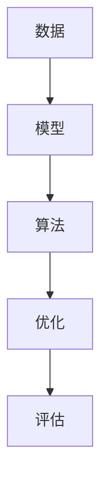
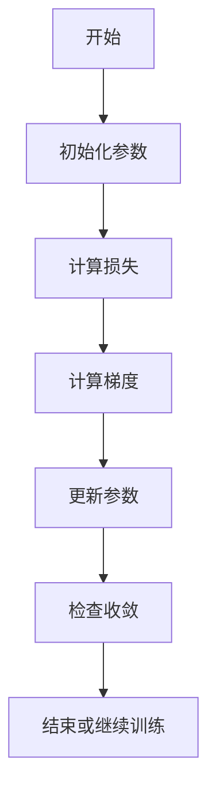
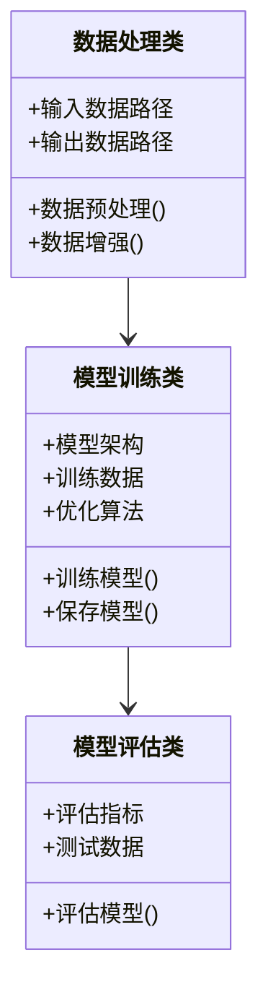
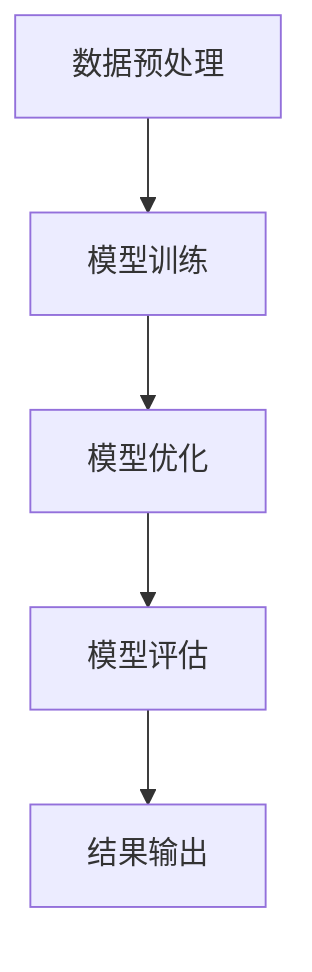

                 


# AI模型训练与优化步骤详解

> **关键词**：AI模型训练，优化步骤，算法原理，系统架构，项目实战

> **摘要**：本文详细讲解AI模型训练与优化的全过程，涵盖数据准备、模型训练、优化策略、系统架构设计及项目实战等内容。从基础概念到高级技巧，结合实际案例和代码实现，帮助读者全面掌握AI模型训练与优化的步骤与方法。

---

# 第一部分: AI模型训练与优化背景介绍

## 第1章: AI模型训练与优化概述

### 1.1 AI模型训练与优化的核心概念

#### 1.1.1 问题背景与问题描述
AI模型训练与优化是人工智能领域中的核心任务，其目标是通过算法和数据的结合，构建高效、准确的模型。训练过程中，模型通过学习数据的特征和规律，逐步提升对新数据的预测或分类能力。优化则是对训练过程中的参数调整和算法改进，以提高模型的性能和效率。

#### 1.1.2 问题解决的思路与方法
模型训练与优化的基本思路包括以下步骤：
1. **数据准备**：收集、清洗和预处理数据。
2. **模型选择**：根据任务需求选择合适的模型架构。
3. **训练过程**：通过优化算法调整模型参数，降低损失函数值。
4. **模型评估**：通过评估指标衡量模型性能。
5. **优化调整**：根据评估结果调整模型结构或优化策略。

#### 1.1.3 问题的边界与外延
- **边界**：模型训练与优化主要关注算法和数据的处理，不涉及硬件实现。
- **外延**：优化策略可以应用于模型压缩、分布式训练等多个领域。

#### 1.1.4 核心概念的结构与组成
AI模型训练与优化的核心概念包括：
- **数据**：输入样本及其标签。
- **模型**：参数化函数，用于表示数据的映射关系。
- **损失函数**：衡量模型输出与真实值的差异。
- **优化算法**：用于调整模型参数以最小化损失函数。

### 1.2 AI模型训练与优化的核心要素

#### 1.2.1 数据、模型、算法的关系
- 数据是训练的基础，决定了模型的泛化能力。
- 模型是训练的目标，决定了任务的解决方式。
- 算法是训练的工具，决定了训练的效率和效果。

#### 1.2.2 训练目标与优化目标的对比
- **训练目标**：最小化损失函数，提升模型在训练数据上的表现。
- **优化目标**：在训练目标的基础上，进一步提升模型的泛化能力、计算效率和运行时性能。

#### 1.2.3 模型性能评估的维度分析
- **准确率**：分类任务中预测正确的比例。
- **召回率**：分类任务中正确识别的正例比例。
- **F1分数**：准确率和召回率的调和平均，综合衡量模型性能。
- **训练时间**：模型训练所需的时间。
- **内存消耗**：模型训练过程中占用的内存资源。

#### 1.2.4 优化策略的选择与实现
- **超参数调优**：通过调整学习率、批量大小等超参数优化训练效果。
- **模型剪枝**：去除冗余的神经网络节点，降低模型复杂度。
- **模型蒸馏**：通过知识蒸馏技术将大模型压缩为小模型。

---

## 第2章: AI模型训练与优化的核心概念与联系

### 2.1 核心概念原理

#### 2.1.1 数据预处理的流程与方法
- **数据清洗**：去除噪声数据、处理缺失值。
- **数据标注**：为图像数据添加标签，为文本数据分词。
- **数据增强**：通过旋转、翻转等方式增加数据多样性。

#### 2.1.2 模型训练的基本原理
- 模型通过反向传播算法计算损失函数的梯度，调整参数以最小化损失。
- 常见的反向传播算法包括随机梯度下降（SGD）、Adam优化器等。

#### 2.1.3 模型优化的算法选择
- **梯度下降**：最基础的优化算法，适用于小规模数据。
- **Adam**：结合动量和自适应学习率，适用于大规模数据。
- **AdamW**：Adam的变体，优化模型的权重衰减问题。

#### 2.1.4 模型评估的指标体系
- **混淆矩阵**：用于分类任务，展示模型的预测结果。
- **精确率**：预测为正例中实际为正例的比例。
- **召回率**：实际为正例中预测为正例的比例。

### 2.2 核心概念属性特征对比

| 核心概念 | 数据 | 模型 | 算法 |
|----------|------|------|------|
| 作用     | 提供输入 | 表示数据映射 | 调整参数 |
| 示例     | 图像、文本 | 神经网络 | SGD、Adam |
| 关系     | 数据驱动 | 算法驱动 | 算法主导 |

### 2.3 ER实体关系图与流程图



---

## 第3章: AI模型训练与优化的算法原理

### 3.1 常见训练算法原理

#### 3.1.1 梯度下降算法
- **数学模型**：
  $$ \text{损失函数} = \frac{1}{2m}\sum_{i=1}^{m}(y_i - \hat{y_i})^2 $$
  $$ \theta := \theta - \alpha \frac{\partial L}{\partial \theta} $$
  其中，$\alpha$ 是学习率，$\theta$ 是模型参数。

#### 3.1.2 随机梯度下降算法
- **特点**：每次更新参数时仅使用一个样本，适用于大规模数据。

#### 3.1.3 批量梯度下降算法
- **特点**：每次更新参数时使用所有样本，计算精确梯度，但计算量大。

#### 3.1.4 动量优化算法
- **数学模型**：
  $$ v := \beta v + (1-\beta)\frac{\partial L}{\partial \theta} $$
  $$ \theta := \theta - \alpha v $$

#### 3.1.5 自适应学习率优化算法
- **Adam优化器**：
  $$ m_t = \beta_1 m_{t-1} + (1-\beta_1)\frac{\partial L}{\partial \theta} $$
  $$ v_t = \beta_2 v_{t-1} + (1-\beta_2)(\frac{\partial L}{\partial \theta})^2 $$
  $$ \theta := \theta - \frac{\alpha}{\sqrt{v_t + \epsilon}} m_t $$

### 3.2 算法流程图



---

## 第4章: AI模型训练与优化的系统架构设计

### 4.1 项目背景与需求分析

#### 4.1.1 问题场景介绍
- **任务目标**：构建一个图像分类模型，用于识别花朵的种类。
- **目标用户**：研究人员、开发者。

#### 4.1.2 项目功能需求
- 数据预处理：将图像数据归一化、标注。
- 模型训练：使用CNN网络结构，训练一个分类器。
- 模型优化：调整超参数，提升准确率。

### 4.2 系统功能设计

#### 4.2.1 领域模型（类图）



#### 4.2.2 系统架构设计



---

## 第5章: AI模型训练与优化的项目实战

### 5.1 环境安装与配置

```bash
pip install numpy
pip install matplotlib
pip install tensorflow
```

### 5.2 核心代码实现

```python
import numpy as np
import tensorflow as tf

# 数据预处理
def preprocess_data(x, y):
    x = x / 255.0
    y = tf.keras.utils.to_categorical(y, num_classes=10)
    return x, y

# 模型构建
def build_model():
    model = tf.keras.Sequential([
        tf.keras.layers.Conv2D(32, (3,3), activation='relu', input_shape=(32,32,3)),
        tf.keras.layers.MaxPooling2D((2,2)),
        tf.keras.layers.Conv2D(64, (3,3), activation='relu'),
        tf.keras.layers.MaxPooling2D((2,2)),
        tf.keras.layers.Flatten(),
        tf.keras.layers.Dense(64, activation='relu'),
        tf.keras.layers.Dense(10, activation='softmax')
    ])
    return model

# 训练过程
def train_model(model, x_train, y_train, x_val, y_val, epochs=10):
    model.compile(optimizer='adam', loss='categorical_crossentropy', metrics=['accuracy'])
    history = model.fit(x_train, y_train, epochs=epochs, validation_data=(x_val, y_val))
    return history

# 模型评估
def evaluate_model(model, x_test, y_test):
    loss, accuracy = model.evaluate(x_test, y_test)
    print(f"测试损失：{loss}, 测试准确率：{accuracy}")
```

---

## 第6章: AI模型训练与优化的最佳实践与小结

### 6.1 最佳实践 Tips

1. **数据预处理**：确保数据清洗和标注的准确性。
2. **模型选择**：根据任务需求选择合适的模型架构。
3. **超参数调优**：通过网格搜索或随机搜索优化超参数。
4. **模型压缩**：使用模型剪枝或蒸馏技术降低模型复杂度。

### 6.2 小结

AI模型训练与优化是一个复杂但系统的过程，需要从数据准备、模型选择到算法优化的全面考虑。通过不断实践和调整，可以逐步提升模型的性能和效率。

### 6.3 注意事项

1. **避免过拟合**：通过数据增强、Dropout等方法防止模型过拟合。
2. **计算资源**：合理利用GPU资源，优化训练效率。
3. **模型解释性**：关注模型的可解释性，提升实际应用的可信度。

### 6.4 拓展阅读

- 《深度学习》——Ian Goodfellow
- 《动手学深度学习》——中国深度学习教材组

---

**作者：AI天才研究院/AI Genius Institute & 禅与计算机程序设计艺术 /Zen And The Art of Computer Programming**

