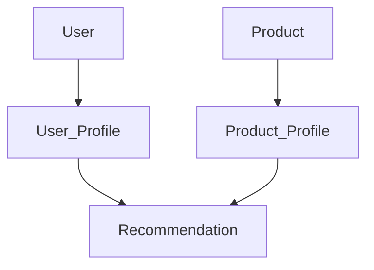
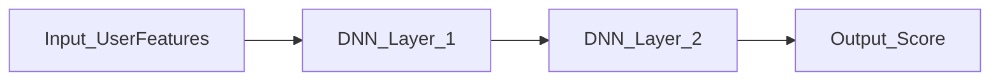
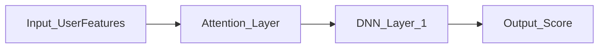
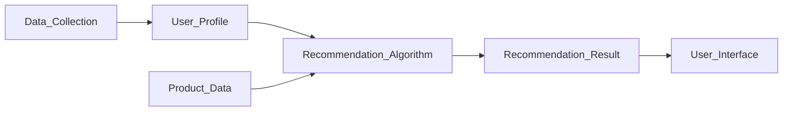
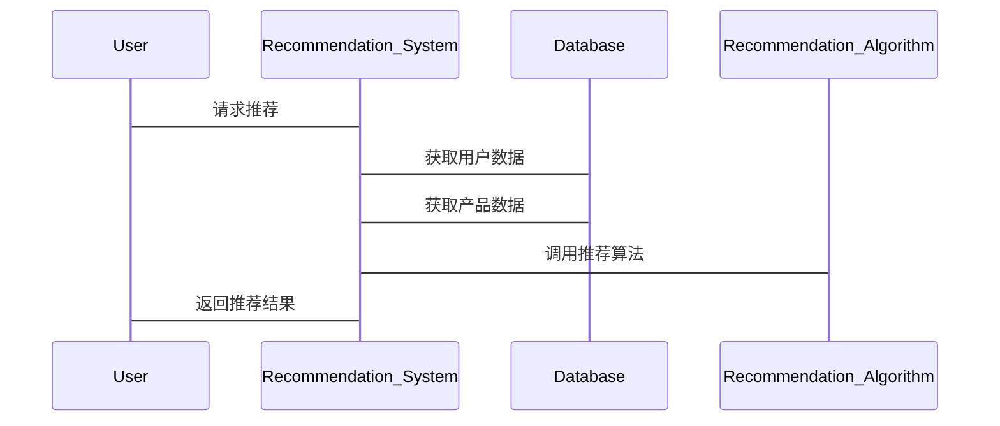

                 


# AI辅助产品推荐与个性化服务的算法与实现

## 关键词：AI推荐系统、个性化服务、协同过滤、深度学习、推荐算法、系统架构

## 摘要：  
本文详细探讨了AI辅助产品推荐与个性化服务的算法实现与系统架构设计。从推荐系统的背景与核心概念出发，分析了基于协同过滤和深度学习的推荐算法，介绍了推荐系统的系统架构设计，并通过实际项目案例展示了推荐系统的实现过程。文章还提供了优化建议和未来研究方向，帮助读者全面理解AI辅助推荐系统的技术要点。

---

## 第一部分: AI辅助推荐系统的背景与核心概念

### 第1章: 问题背景与核心概念

#### 1.1 问题背景
推荐系统是人工智能领域的重要应用之一，广泛应用于电商、社交媒体、视频平台等领域。随着用户需求的多样化和数据量的爆炸式增长，传统的推荐方法逐渐暴露出效率低下、个性化不足等问题。AI技术的引入为推荐系统带来了新的解决方案。

#### 1.2 核心概念与问题描述
推荐系统的核心目标是通过分析用户行为和产品特征，生成个性化的产品推荐列表。本文将重点探讨以下核心概念：

- **用户画像**：基于用户行为数据，构建用户兴趣模型。
- **产品特征**：提取产品的多维度特征，如类别、属性、评分等。
- **推荐算法**：通过算法计算用户与产品之间的关联性，生成推荐结果。

#### 1.3 推荐系统的类型
推荐系统可以分为以下几种类型：
- **协同过滤推荐**：基于用户之间的相似性或产品之间的相似性进行推荐。
- **基于内容的推荐**：基于产品的特征进行推荐。
- **混合推荐**：结合协同过滤和内容推荐的混合方法。

### 第2章: 核心概念与联系

#### 2.1 用户与产品的关系
用户与产品之间的关系可以通过用户行为数据和产品特征数据来建模。用户行为数据包括点击、收藏、购买等，产品特征数据包括产品类别、品牌、价格等。

#### 2.2 用户画像与产品特征
- **用户画像**：通过用户的行为数据，构建用户的兴趣模型。
- **产品特征**：通过产品数据，提取产品的多维度特征。

#### 2.3 实体关系图
以下是用户、产品和推荐结果之间的关系图：



---

## 第二部分: AI辅助推荐算法原理与实现

### 第3章: 协同过滤算法原理

#### 3.1 基于用户的协同过滤
基于用户的协同过滤通过计算用户之间的相似性，将相似用户的偏好用于推荐。

##### 3.1.1 相似度计算
常用的相似度计算方法包括：
- 欧几里得距离
- 余弦相似度
- 皮尔逊相关系数

##### 3.1.2 推荐算法实现
基于用户的协同过滤算法实现步骤：
1. 数据预处理：填充缺失值。
2. 计算用户相似度矩阵。
3. 基于相似度生成推荐列表。

##### 3.1.3 示例代码
```python
import numpy as np

def cosine_similarity(matrix):
    # 计算余弦相似度
    numerator = np.dot(matrix, matrix.T)
    denominator = np.outer(np.linalg.norm(matrix, axis=1), np.linalg.norm(matrix, axis=1))
    return numerator / denominator

# 示例数据
user_data = np.array([[1, 2, 3], [4, 5, 6], [7, 8, 9]])
similarity_matrix = cosine_similarity(user_data)
print(similarity_matrix)
```

#### 3.2 基于物品的协同过滤
基于物品的协同过滤通过计算产品之间的相似性，将相似产品的特征用于推荐。

##### 3.2.1 相似度计算
基于物品的相似度计算与基于用户的相似度计算方法相同。

##### 3.2.2 推荐算法实现
基于物品的协同过滤算法实现步骤：
1. 数据预处理：填充缺失值。
2. 计算产品相似度矩阵。
3. 基于相似度生成推荐列表。

##### 3.2.3 示例代码
```python
def item_based_recommendation(matrix, user_id, top_n=3):
    similarity_matrix = cosine_similarity(matrix.T)
    user_preference = matrix[user_id]
    weighted_sum = np.dot(user_preference, similarity_matrix)
    recommended_indices = np.argsort(weighted_sum)[::-1][:top_n]
    return recommended_indices

print(item_based_recommendation(user_data, 0, 3))
```

### 第4章: 基于深度学习的推荐算法

#### 4.1 神经网络在推荐系统中的应用
神经网络通过非线性特征表达，能够捕捉用户和产品之间的复杂关系。

##### 4.1.1 DNN推荐模型
DNN推荐模型的结构如下：



##### 4.1.2 深度学习模型实现
DNN推荐模型的实现步骤：
1. 数据预处理：构建用户和产品的嵌入向量。
2. 网络结构设计：定义DNN模型。
3. 模型训练：使用梯度下降优化模型。

##### 4.1.3 示例代码
```python
import tensorflow as tf

model = tf.keras.Sequential([
    tf.keras.layers.Dense(64, activation='relu'),
    tf.keras.layers.Dense(1, activation='sigmoid')
])

model.compile(optimizer='adam', loss='binary_crossentropy', metrics=['accuracy'])
model.fit(x_train, y_train, epochs=10, batch_size=32)
```

#### 4.2 基于注意力机制的推荐算法
注意力机制通过关注重要的用户行为或产品特征，提高推荐的准确性。

##### 4.2.1 注意力机制的基本原理
注意力机制的核心思想是通过计算不同特征的重要性，加权求和得到最终的特征表示。

##### 4.2.2 基于注意力机制的推荐模型
注意力机制推荐模型的结构如下：



##### 4.2.3 示例代码
```python
def attention_layer(x, mask_zero=True):
    # 计算注意力权重
    attention = tf.keras.layers.Dense(1)(x)
    attention = tf.keras.layers.Activation('softmax')(attention)
    return attention

input_layer = tf.keras.Input(shape=(input_dim,))
attention = attention_layer(input_layer)
output = tf.keras.layers.Dense(1, activation='sigmoid')(attention)
model = tf.keras.Model(inputs=input_layer, outputs=output)
model.compile(optimizer='adam', loss='binary_crossentropy', metrics=['accuracy'])
model.fit(x_train, y_train, epochs=10, batch_size=32)
```

### 第5章: 集成推荐算法与优化策略

#### 5.1 多算法集成推荐策略
通过集成不同的推荐算法，可以提高推荐的准确性和多样性。

##### 5.1.1 基于投票的集成推荐方法
基于投票的集成推荐方法将不同算法的推荐结果进行投票，得到最终的推荐列表。

##### 5.1.2 基于加权的集成推荐方法
基于加权的集成推荐方法将不同算法的推荐结果进行加权求和，得到最终的推荐列表。

##### 5.1.3 基于混合模型的集成推荐方法
基于混合模型的集成推荐方法将不同算法的推荐结果进行混合，得到最终的推荐列表。

#### 5.2 算法优化与调优技巧
通过超参数优化、模型压缩和在线A/B测试，可以提高推荐系统的性能和效果。

##### 5.2.1 超参数优化方法
超参数优化方法包括网格搜索、随机搜索和贝叶斯优化等。

##### 5.2.2 模型压缩与轻量化技术
模型压缩与轻量化技术包括剪枝、量化和知识蒸馏等。

##### 5.2.3 在线A/B测试与效果评估
在线A/B测试可以评估不同推荐算法的效果，选择最优的推荐算法。

---

## 第三部分: 系统架构与实现方案

### 第6章: 系统架构设计

#### 6.1 系统功能模块划分
推荐系统的功能模块包括数据采集、用户行为分析、推荐算法和推荐结果展示。

##### 6.1.1 数据采集模块
数据采集模块负责采集用户行为数据和产品特征数据。

##### 6.1.2 用户行为分析模块
用户行为分析模块负责分析用户行为，构建用户画像。

##### 6.1.3 推荐算法模块
推荐算法模块负责根据用户画像和产品特征，生成推荐结果。

##### 6.1.4 推荐结果展示模块
推荐结果展示模块负责将推荐结果展示给用户。

#### 6.2 系统架构设计
推荐系统的架构设计如下：



#### 6.3 系统接口设计
推荐系统的接口设计包括数据接口、算法接口和展示接口。

##### 6.3.1 数据接口
数据接口负责数据的输入输出。

##### 6.3.2 算法接口
算法接口负责推荐算法的实现。

##### 6.3.3 展示接口
展示接口负责推荐结果的展示。

#### 6.4 系统交互设计
推荐系统的交互流程如下：



---

## 第四部分: 项目实战

### 第7章: 电商推荐系统实现

#### 7.1 项目介绍
电商推荐系统的目标是根据用户的购买历史和偏好，推荐相关的产品。

#### 7.2 环境安装
电商推荐系统的环境安装包括安装Python、TensorFlow和Keras等。

#### 7.3 核心实现
电商推荐系统的核心实现包括数据预处理、模型训练和结果展示。

##### 7.3.1 数据预处理
数据预处理包括数据清洗、特征提取和数据增强。

##### 7.3.2 模型训练
模型训练包括模型定义、模型训练和模型评估。

##### 7.3.3 结果展示
结果展示包括推荐结果的可视化和用户反馈的收集。

#### 7.4 案例分析
电商推荐系统的案例分析包括推荐效果的评估和推荐系统的优化。

---

## 第五部分: 优化建议与未来趋势

### 第8章: 优化建议

#### 8.1 数据优化
数据优化包括数据清洗、数据增强和数据隐私保护。

#### 8.2 算法优化
算法优化包括算法调优、算法集成和算法创新。

#### 8.3 系统优化
系统优化包括系统架构优化、系统性能优化和系统安全优化。

### 第9章: 未来趋势

#### 9.1 AI推荐系统的未来发展
AI推荐系统的未来发展包括推荐算法的创新、推荐系统的智能化和推荐系统的全球化。

#### 9.2 推荐系统的新兴技术
推荐系统的新兴技术包括强化学习、图神经网络和多模态推荐。

#### 9.3 推荐系统的应用拓展
推荐系统的应用拓展包括推荐系统的垂直化、推荐系统的个性化和推荐系统的社交化。

---

## 第六部分: 总结与展望

### 第10章: 总结

#### 10.1 核心内容回顾
本文详细探讨了AI辅助产品推荐与个性化服务的算法实现与系统架构设计。

#### 10.2 实践经验总结
通过项目实战，我们总结了推荐系统的实现经验和优化建议。

### 第11章: 展望

#### 11.1 未来研究方向
未来研究方向包括推荐系统的智能化、推荐系统的个性化和推荐系统的社交化。

#### 11.2 推荐系统的未来趋势
推荐系统的未来趋势包括推荐算法的创新、推荐系统的垂直化和推荐系统的全球化。

---

## 作者：AI天才研究院/AI Genius Institute & 禅与计算机程序设计艺术 /Zen And The Art of Computer Programming

---

以上是《AI辅助产品推荐与个性化服务的算法与实现》的技术博客文章的完整目录和内容概要。希望这篇文章能够为读者提供关于AI推荐系统实现的全面指导和深入分析。

