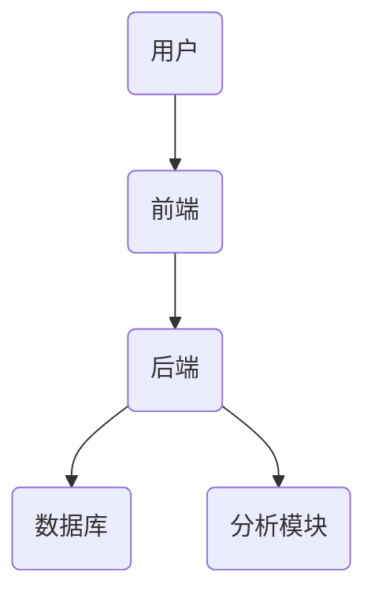

                 


# AI辅助企业创新文化培养：创新活动参与度分析与激励机制

> 关键词：人工智能、企业创新文化、创新活动参与度、激励机制、AI技术

> 摘要：本文探讨了如何利用人工智能技术辅助企业创新文化培养，特别是通过分析创新活动参与度和设计有效的激励机制来提升员工的创新积极性。文章从背景概述出发，详细阐述了创新活动参与度的核心概念、分析模型、算法原理，以及如何通过系统架构设计和项目实战来实现创新文化的培养。最后，本文提出了激励机制的动态调整策略，为企业在AI辅助下的创新文化构建提供了理论和实践指导。

---

## 第1章：企业创新文化与AI的结合：背景与概述

### 1.1 创新文化的核心要素

#### 1.1.1 创新文化的定义与特征

- **定义**：创新文化是指企业在组织内部营造的一种鼓励创新、支持员工提出新想法和解决方案的文化氛围。
- **特征**：开放性、包容性、灵活性、目标导向性。

#### 1.1.2 创新文化的重要性

- 促进企业竞争力提升。
- 提高员工满意度和忠诚度。
- 为企业创造持续增长的动力。

#### 1.1.3 AI在创新文化中的作用

- 数据分析与预测：AI技术可以通过分析员工行为数据，识别创新潜力。
- 智能推荐：AI可以为员工提供创新方向的建议，激发创新灵感。
- 自动化评估：AI能够快速评估创新方案的可行性和价值。

### 1.2 企业创新活动的现状分析

#### 1.2.1 传统创新模式的局限性

- 创新资源分配不均。
- 员工创新积极性不足。
- 创新成果难以量化。

#### 1.2.2 当前创新活动的主要挑战

- 员工参与度低。
- 创新激励机制不完善。
- 创新文化缺乏系统性。

#### 1.2.3 AI如何推动创新文化的变革

- 提供数据驱动的决策支持。
- 个性化激励机制。
- 实时反馈与协作。

### 1.3 本章小结

本章通过分析企业创新文化的定义、重要性以及当前面临的挑战，提出了AI技术在创新文化中的潜力和作用。为后续章节的深入分析奠定了基础。

---

## 第2章：创新活动参与度的核心概念与分析模型

### 2.1 创新活动参与度的定义

- 创新活动参与度是衡量员工参与创新活动的程度和频率的指标。

### 2.2 影响创新活动参与度的因素

- **个人因素**：员工的知识、技能、兴趣和动机。
- **组织因素**：企业的资源、制度、文化氛围。
- **环境因素**：市场环境、行业竞争压力。

### 2.3 创新活动参与度的分析模型

#### 2.3.1 模型构建

使用结构方程模型（SEM）构建创新活动参与度的分析框架，包括自变量、中间变量和因变量。

#### 2.3.2 模型验证与优化

通过实证数据分析，验证模型的拟合度，并进行参数优化。

---

## 第3章：激励机制的核心原理与设计

### 3.1 激励机制的基本概念

- 激励机制是指通过一定的手段激发员工创新行为的过程。

### 3.2 激励机制的核心要素

- **目标设定**：明确创新目标。
- **激励方式**：物质奖励、精神奖励、职业发展机会。
- **效果评估**：通过反馈机制评估激励效果。

### 3.3 激励机制与创新活动的关联

- 激励机制能够显著提升员工的创新参与度。
- 创新活动的成果能够反过来增强激励机制的有效性。

---

## 第4章：基于AI的创新活动参与度分析与激励机制设计

### 4.1 数据收集与处理

- 使用AI技术对员工的行为数据、绩效数据和反馈数据进行收集和分析。

### 4.2 基于机器学习的分析模型

#### 4.2.1 模型构建

使用随机森林算法对创新参与度进行预测。

#### 4.2.2 模型实现

```python
from sklearn.ensemble import RandomForestRegressor
import pandas as pd

# 加载数据
data = pd.read_csv('innovation.csv')

# 特征与目标分离
X = data.drop('participation', axis=1)
y = data['participation']

# 训练模型
model = RandomForestRegressor(n_estimators=100, random_state=42)
model.fit(X, y)
```

### 4.3 激励机制的动态调整

- 根据员工参与度的变化实时调整激励策略。

---

## 第5章：系统架构设计与项目实战

### 5.1 系统功能设计

- 用户界面：员工提交创新想法、查看激励信息。
- 管理界面：管理员查看参与度报告、调整激励机制。

### 5.2 系统架构图



### 5.3 项目实战

- 安装环境：Python、TensorFlow、Flask。
- 代码实现：基于Flask的创新参与度分析系统。

---

## 第6章：激励机制的优化与实施

### 6.1 动态调整策略

- 根据员工参与度变化调整激励强度。

### 6.2 优化路径

- 建立反馈机制，持续优化激励策略。

---

## 第7章：总结与展望

### 7.1 本文总结

本文系统地探讨了AI在企业创新文化培养中的应用，提出了创新活动参与度分析和激励机制设计的方法。

### 7.2 未来展望

未来的研究可以进一步探索AI在创新文化中的其他应用，如创新预测和创新风险管理。

---

## 参考文献

（此处列出相关文献）

---

## 作者

作者：AI天才研究院 & 禅与计算机程序设计艺术

