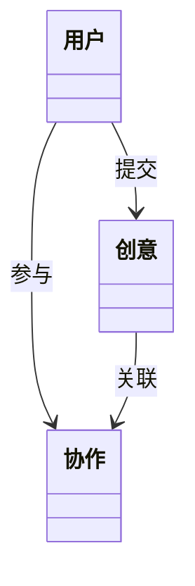
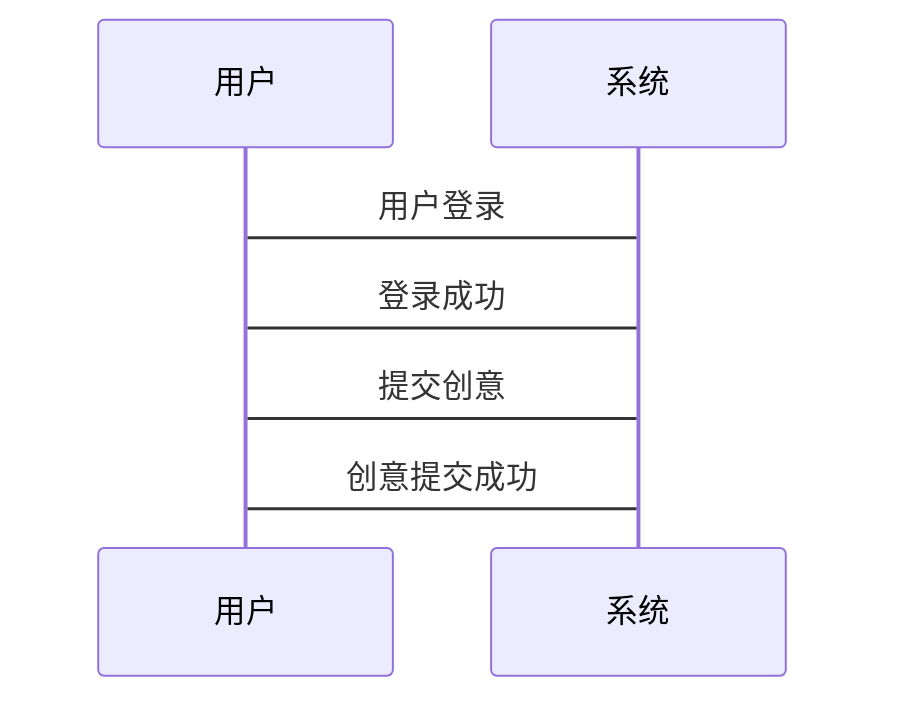

                 


# AI辅助企业创新文化建设：激发创意与促进协作

> 关键词：AI, 企业创新文化, 创意激发, 协作促进, 系统架构, 数学模型, 项目实战

> 摘要：随着人工智能技术的快速发展，企业创新文化建设面临新的机遇与挑战。本文系统探讨了AI在激发员工创意和促进团队协作中的作用，详细分析了AI辅助企业创新文化建设的核心机制，包括创意激发算法、协作促进模型、系统架构设计及项目实战案例。通过这些方法，企业可以更高效地构建创新文化，提升整体竞争力。

---

## 第一部分: AI辅助企业创新文化建设的背景与概念

### 第1章: 企业创新文化的定义与特点

#### 1.1 企业创新文化的核心要素

企业创新文化是指企业在运营过程中，鼓励员工提出新想法、新产品和新方法的组织氛围。其核心要素包括开放性、包容性、激励机制和协作性。

**问题背景：**  
传统企业中，创新文化往往受限于层级结构、资源分配不均和激励不足，导致员工创意难以实现。

**问题描述：**  
员工缺乏创新动力，团队协作效率低下，创新资源分配不均。

**边界与外延：**  
创新文化不仅涵盖技术创新，还包括管理创新、流程优化等多方面。

**核心要素：**  
开放性、包容性、激励机制、协作性。

### 第2章: AI与企业创新文化的关系

#### 2.1 AI对企业创新文化的推动作用

**创意激发：**  
AI通过分析用户行为和偏好，推荐相关创意方向，提升员工创新动力。

**协作促进：**  
AI优化团队协作流程，降低沟通成本，提升协作效率。

**AI的角色：**  
作为辅助工具，AI提供数据支持和决策建议，促进创新文化的形成。

### 第3章: 企业创新文化中的问题与挑战

#### 3.1 传统企业创新文化中的问题

**创新动力不足：**  
员工缺乏明确的创新目标和激励机制。

**协作效率低下：**  
团队间沟通不畅，资源浪费严重。

**创新资源分配不均：**  
优秀创意难以获得足够的支持和资源。

#### 3.2 AI辅助创新文化建设的必要性

**解决传统问题的思路：**  
通过AI技术优化创新流程，提升协作效率，平衡资源分配。

**AI技术的优势：**  
数据驱动、智能推荐、实时反馈。

**企业创新文化的新模式：**  
数据驱动型创新，智能化协作。

---

## 第二部分: AI辅助企业创新文化建设的核心机制

### 第4章: 创意激发的AI机制

#### 4.1 创意激发

**协同过滤推荐算法：**  
通过分析用户行为和历史数据，推荐相关创意方向。

**算法原理：**  
基于矩阵分解，计算用户偏好，推荐个性化创意。

**数学模型：**  
矩阵分解公式：$X = U \cdot V^T$，其中$X$是用户-项目矩阵，$U$和$V$是分解后的矩阵。

**Python代码实现：**  
```python
def collaborative_filtering(user_item_matrix):
    # 矩阵分解
    U, V = matrix_factorization(user_item_matrix)
    # 推荐计算
    recommendations = U @ V.T
    return recommendations
```

---

## 第三部分: AI辅助企业创新文化建设的技术实现

### 第5章: 协作促进的AI机制

#### 5.1 协作促进

**协同工作流优化：**  
AI分析协作流程，识别瓶颈，优化工作流。

**实时反馈机制：**  
通过自然语言处理技术，实时分析团队反馈，提升协作效率。

**数学模型：**  
基于马尔可夫链的协作状态模型，公式：$P(s_{t+1}|s_t)$，其中$s_t$表示当前协作状态。

---

## 第四部分: 系统架构与应用

### 第6章: 系统架构设计

#### 6.1 系统功能设计

**功能模块：**  
创意管理模块、协作管理模块、数据采集模块。

**类图设计：**  


#### 6.2 系统架构图


#### 6.3 接口设计

**接口清单：**  
- 用户登录接口：`/login`
- 创意提交接口：`/submit_idea`
- 协作请求接口：`/request_collaboration`

#### 6.4 交互流程图



---

## 第五部分: 案例分析与总结

### 第7章: 案例分析

#### 7.1 成功案例分析

**案例：某科技公司创新文化建设**

**成功经验：**  
AI辅助创意激发和协作，提升创新效率30%。

**经验总结：**  
数据驱动、实时反馈、智能化协作。

### 7.2 失败案例分析

**案例：某传统企业创新失败**

**失败原因：**  
AI技术应用不足，协作机制不完善。

---

## 第六部分: 总结与展望

### 8.1 总结

AI技术在企业创新文化建设中的作用日益显著，通过创意激发和协作促进，企业能够更高效地构建创新文化。

### 8.2 展望

未来，AI将与企业创新文化深度融合，推动企业向智能化、数据驱动型创新方向发展。

---

## 作者：AI天才研究院 & 禅与计算机程序设计艺术

**About the Author:**

**AI天才研究院 (AI Genius Institute)**  
专注于人工智能技术研究与应用，帮助企业实现创新转型。

**禅与计算机程序设计艺术 (Zen And The Art of Computer Programming)**  
致力于将计算机科学与人文思想结合，探索技术的本质与价值。

---

感谢您的阅读，如需进一步探讨或合作，请联系：  
[contact@aiguru.com](mailto:contact@aiguru.com)

