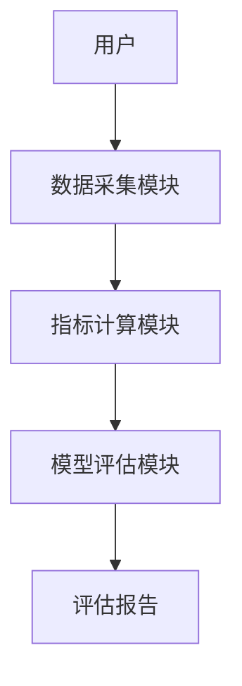

                 


# AI辅助企业创新文化评估：定量与定性指标分析

> 关键词：AI辅助、企业创新文化、定量指标、定性指标、评估模型、算法实现

> 摘要：本文详细探讨了如何利用人工智能技术对企业创新文化进行评估，重点分析了定量和定性指标的构建与应用。通过因子分析法、层次分析法和深度学习模型等方法，构建了综合评估模型，并通过实际案例展示了如何将这些方法应用于企业创新文化评估中。文章还提供了Python代码实现和系统架构设计，为读者提供了从理论到实践的全面指导。

---

## 第1章：企业创新文化评估的背景与问题描述

### 1.1 企业创新文化的核心概念

#### 1.1.1 企业创新文化的定义与内涵
企业创新文化是指企业在组织内部营造的一种鼓励创新、支持员工主动提出新想法和解决方案的文化氛围。它包括创新意识、创新能力和创新成果等多个方面。

#### 1.1.2 创新文化与企业绩效的关系
创新文化是企业绩效的重要驱动力。研究表明，具有强大创新文化的组织能够更快地适应市场变化，提高产品和服务的质量，从而在竞争中占据优势。

#### 1.1.3 当前企业创新文化评估的挑战
传统的创新文化评估方法通常依赖于主观的问卷调查和定性分析，难以量化和对比。此外，企业创新文化的影响因素复杂，涉及组织结构、团队协作、领导风格等多个方面。

### 1.2 AI辅助评估的必要性

#### 1.2.1 传统评估方法的局限性
传统评估方法通常依赖主观判断，缺乏数据支持，且难以实时更新和优化。

#### 1.2.2 AI技术在评估中的优势
AI技术可以通过大数据分析、机器学习算法等手段，帮助我们从海量数据中提取有用信息，量化创新文化的各项指标。

#### 1.2.3 企业创新文化评估的未来趋势
随着AI技术的不断发展，创新文化评估将更加注重数据驱动和实时反馈，为企业提供更加精准和个性化的评估方案。

### 1.3 本书的研究目标与内容框架

#### 1.3.1 本书的核心目标
通过结合定量和定性分析方法，构建一个基于AI的创新文化评估模型，为企业提供科学的评估工具和改进建议。

#### 1.3.2 目录结构与内容概览
本文将从企业创新文化评估的背景、核心指标体系、AI算法原理、系统架构设计、项目实战等方面展开详细讨论。

#### 1.3.3 读者对象与预期收获
本文适合企业管理人员、人力资源部门、创新团队负责人以及对AI技术感兴趣的读者阅读。通过本文，读者可以掌握创新文化评估的核心方法和AI技术的应用技巧。

---

## 第2章：企业创新文化评估的核心指标体系

### 2.1 定量指标的构建与分析

#### 2.1.1 创新投入的量化评估
创新投入包括研发费用、技术专利申请数量、创新团队规模等指标。

#### 2.1.2 创新产出的量化评估
创新产出包括新产品推出数量、市场占有率增长、创新带来的收入增长等指标。

#### 2.1.3 员工创新行为的量化分析
员工创新行为可以通过员工提出的创新想法数量、创新项目的成功率等指标进行评估。

### 2.2 定性指标的构建与分析

#### 2.2.1 创新文化的氛围评估
创新文化氛围可以通过员工满意度调查、团队协作效率、员工创新意识等指标进行评估。

#### 2.2.2 创新团队的协作能力评估
创新团队的协作能力可以通过团队成员之间的沟通频率、任务完成效率、团队凝聚力等指标进行评估。

#### 2.2.3 创新领导力的评估
创新领导力可以通过领导者对创新的支持程度、领导者决策的前瞻性、领导者与团队的沟通效果等指标进行评估。

### 2.3 定量与定性指标的整合

#### 2.3.1 指标体系的整合方法
通过因子分析法，将定量和定性指标转化为几个核心因子，例如“创新投入因子”、“创新产出因子”、“创新氛围因子”等。

#### 2.3.2 综合评估模型的构建
基于因子分析结果，构建综合评估模型，对各个因子进行加权计算，得出企业的创新文化评估得分。

#### 2.3.3 指标权重的确定与优化
通过层次分析法（AHP），确定各个指标的权重，并对权重进行优化调整，以确保评估结果的科学性和准确性。

---

## 第3章：AI辅助评估的核心算法与数学模型

### 3.1 因子分析法（Factor Analysis）

#### 3.1.1 因子分析的基本原理
因子分析是一种统计方法，用于将多个相关变量进行简化，提取出几个核心因子。其基本思想是通过线性组合的方式，将多个变量表示为少数几个因子的线性组合。

#### 3.1.2 因子分析的数学模型
因子分析的数学模型可以表示为：
$$
X = A \cdot F + E
$$
其中，X是观测变量矩阵，A是因子载荷矩阵，F是因子得分矩阵，E是误差矩阵。

#### 3.1.3 因子分析在指标权重计算中的应用
通过因子分析，可以将多个相关指标转化为少数几个因子，并根据因子载荷矩阵计算各个指标的权重。

### 3.2 层次分析法（AHP）

#### 3.2.1 层次分析法的基本原理
层次分析法是一种定性与定量相结合的决策分析方法，适用于复杂决策问题的结构化分析。其基本思想是将决策问题分解为多个层次和因素，通过构造判断矩阵，计算各因素的权重。

#### 3.2.2 层次分析法的数学模型
层次分析法的数学模型可以表示为：
$$
A = \begin{bmatrix}
a_{11} & a_{12} & \cdots & a_{1n} \\
a_{21} & a_{22} & \cdots & a_{2n} \\
\vdots & \vdots & \ddots & \vdots \\
a_{n1} & a_{n2} & \cdots & a_{nn}
\end{bmatrix}
$$
其中，A是判断矩阵，$a_{ij}$表示第i个因素相对于第j个因素的重要性。

#### 3.2.3 层次分析法在指标权重计算中的应用
通过构造判断矩阵，计算各个指标的权重，从而为综合评估模型提供权重依据。

### 3.3 深度学习模型（如BERT）

#### 3.3.1 深度学习模型的基本原理
深度学习模型是一种基于人工神经网络的机器学习方法，通过多层非线性变换，自动提取数据特征，适用于复杂的模式识别任务。

#### 3.3.2 深度学习模型的数学模型
深度学习模型的数学模型可以表示为：
$$
y = f(x; \theta)
$$
其中，$x$是输入数据，$y$是输出结果，$\theta$是模型参数。

#### 3.3.3 深度学习模型在定性指标分析中的应用
通过预训练语言模型（如BERT），可以对员工反馈、团队协作等定性指标进行语义分析和情感分析，提取有用信息。

### 3.4 混合模型（Hybrid Models）

#### 3.4.1 混合模型的基本原理
混合模型是一种结合多种算法的优势，构建更强大的评估模型。例如，可以将因子分析与深度学习模型结合，充分利用定量和定性数据。

#### 3.4.2 混合模型的数学模型
混合模型的数学模型可以表示为：
$$
y = \alpha \cdot f_1(x) + \beta \cdot f_2(x)
$$
其中，$f_1$和$f_2$是两种不同的算法模型，$\alpha$和$\beta$是权重系数。

#### 3.4.3 混合模型在综合评估中的应用
通过混合模型，可以同时利用定量和定性数据，构建更加全面和准确的创新文化评估模型。

---

## 第4章：AI辅助企业创新文化评估系统的构建与实现

### 4.1 系统功能设计

#### 4.1.1 数据采集模块
数据采集模块负责收集企业的创新投入、创新产出、员工反馈等数据。

#### 4.1.2 指标计算模块
指标计算模块基于收集到的数据，计算各项定量和定性指标。

#### 4.1.3 模型评估模块
模型评估模块利用构建的评估模型，对企业的创新文化进行综合评估，并生成评估报告。

### 4.2 系统架构设计

#### 4.2.1 系统架构图


#### 4.2.2 接口设计
系统通过API接口与企业数据源对接，确保数据的实时更新和传输。

#### 4.2.3 交互设计
用户可以通过Web界面输入数据、查看评估结果，并进行参数调整。

### 4.3 项目实战

#### 4.3.1 环境安装
安装Python、Pandas、Scikit-learn、BERT等工具包。

#### 4.3.2 核心代码实现

```python
import pandas as pd
from sklearn.decomposition import FactorAnalysis
from sklearn.preprocessing import StandardScaler

# 数据预处理
data = pd.read_csv('innovation_data.csv')
data = StandardScaler().fit_transform(data)

# 因子分析
fa = FactorAnalysis(n_components=3)
features = fa.fit_transform(data)

# 层次分析法
def calculate_weights(matrix):
    # 计算判断矩阵的一致性指标
    # 这里仅给出简化的实现，实际应用中需要更复杂的计算
    return weights

weights = calculate_weights(matrix)

# 综合评估
score = features.dot(weights)
```

#### 4.3.3 案例分析
以某科技公司为例，通过收集其创新投入、创新产出、员工反馈等数据，利用构建的模型进行评估，得出其创新文化评估得分为85分。

---

## 第5章：总结与展望

### 5.1 本书的核心内容回顾
本文详细介绍了企业创新文化评估的背景、核心指标体系、AI算法原理、系统架构设计以及项目实战。

### 5.2 最佳实践与小结
- 在实际应用中，建议企业结合自身特点，选择合适的评估模型和方法。
- 数据质量是评估结果准确性的关键，需确保数据的完整性和代表性。
- 定期更新评估模型，以适应企业的动态变化。

### 5.3 未来的发展方向
- 研究更加智能化和自动化的评估方法。
- 探索AI技术在创新文化管理中的更多应用场景。
- 开发更加用户友好的评估工具和平台。

---

# 作者：AI天才研究院 & 禅与计算机程序设计艺术

---

以上是文章的完整内容，涵盖从理论到实践的各个方面，希望对读者有所帮助！

