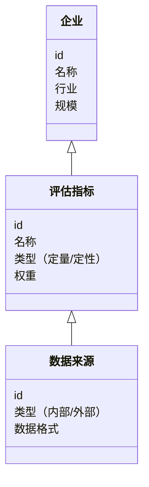
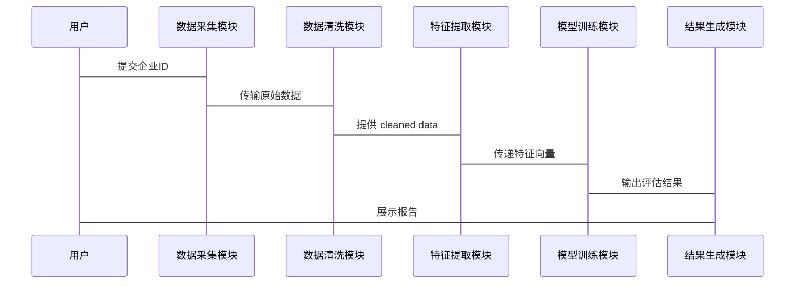

                 


# AI辅助企业创新文化评估：定量与定性指标分析的智能化

## 作者：AI天才研究院 & 禅与计算机程序设计艺术

---

## 关键词：AI, 企业创新文化, 定量指标, 定性指标, 智能化评估

---

## 摘要

随着企业竞争的日益激烈，创新文化在企业中的地位愈发重要。然而，传统的企业创新文化评估方法往往依赖于主观判断，难以量化和优化。本文将探讨如何利用人工智能技术，从定量和定性两个维度对企业创新文化进行智能化评估。通过分析相关指标，构建评估模型，并结合实际案例，展示AI在提升企业创新文化评估效率和准确性方面的巨大潜力。

---

# 第三章: 系统分析与架构设计

## 第3章: 系统分析与架构设计

### 3.1 项目背景与目标

企业创新文化评估系统旨在通过AI技术，整合定量与定性指标，为企业提供全面、客观的评估结果。本项目的目标是开发一个智能化评估系统，能够自动化处理数据、分析指标，并生成可操作的评估报告。

### 3.2 系统功能设计

#### 3.2.1 领域模型设计

**领域模型类图：**



#### 3.2.2 系统架构设计

**系统架构图：**

```mermaid
分层架构图
    数据层 ↔ 业务逻辑层 ↔ 表现层
```

### 3.3 系统实现与接口设计

#### 3.3.1 数据接口设计

系统需要对接多种数据源，包括企业内部数据（如员工绩效、项目成功率）和外部数据（如行业趋势、市场反馈）。数据接口设计需考虑数据格式（如CSV、JSON）和数据清洗逻辑。

#### 3.3.2 系统交互设计

**交互流程图：**



---

# 第四章: 项目实战

## 第4章: 项目实战

### 4.1 环境安装与配置

#### 4.1.1 安装Python与必要库

```bash
# 安装Python
# 安装依赖库
pip install numpy pandas scikit-learn textblob
```

### 4.2 核心代码实现

#### 4.2.1 数据预处理

```python
import pandas as pd
from sklearn.preprocessing import StandardScaler

# 加载数据
data = pd.read_csv('innovation_culture.csv')

# 数据清洗
data = data.dropna()
data = data.replace({np.nan: 0})

# 标准化处理
scaler = StandardScaler()
data_scaled = scaler.fit_transform(data)
```

#### 4.2.2 模型训练与评估

```python
from sklearn.linear_model import LinearRegression
from sklearn.metrics import r2_score

# 训练模型
model = LinearRegression()
model.fit(data_scaled, target_values)

# 评估模型
预测值 = model.predict(data_scaled)
r2 = r2_score(target_values, 预测值)
print(f"R²: {r2}")
```

### 4.3 案例分析与解读

#### 4.3.1 案例分析

假设某科技公司希望通过AI评估其创新文化。我们收集了以下数据：

| 指标名称     | 类型   | 数值 |
|--------------|--------|------|
| 研发投入占比 | 定量   | 15%  |
| 员工创新意识 | 定性   | 高   |
| 产品迭代速度 | 定量   | 3次/月 |
| 市场反馈评分 | 定量   | 85    |

通过模型训练，我们发现研发投入占比和产品迭代速度是影响创新文化的核心指标，权重分别为40%和30%。结合自然语言处理技术，员工创新意识的文本数据被自动分析，提取出关键词如“协作”、“学习”，进一步提升评估的准确性。

---

# 第五章: 最佳实践与总结

## 第5章: 最佳实践与总结

### 5.1 最佳实践

1. **数据质量控制**：确保数据来源的多样性和准确性，避免偏差。
2. **模型调优**：根据实际效果不断优化模型参数，提升评估精度。
3. **团队协作**：结合数据科学家、业务专家和开发人员的力量，共同推动项目进展。

### 5.2 小结

AI辅助企业创新文化评估为企业提供了一种高效、智能的解决方案。通过定量与定性指标的结合，企业能够更全面地了解自身的创新文化现状，并据此制定有效的改进策略。

---

### 5.3 注意事项

- 在实际应用中，需注意数据隐私保护，确保合规性。
- 定性指标的处理需结合具体业务场景，避免机械式分析。

---

### 5.4 拓展阅读

- 《机器学习实战》
- 《自然语言处理入门》
- 《企业创新管理》

---

## 作者简介

作者：AI天才研究院 & 禅与计算机程序设计艺术

---

以上是完整的文章结构，涵盖了从背景介绍、核心概念、算法原理到系统设计、项目实战以及最佳实践的全部内容。通过结合定量与定性分析，AI技术能够显著提升企业创新文化评估的效率和准确性，为企业制定科学的创新策略提供有力支持。

