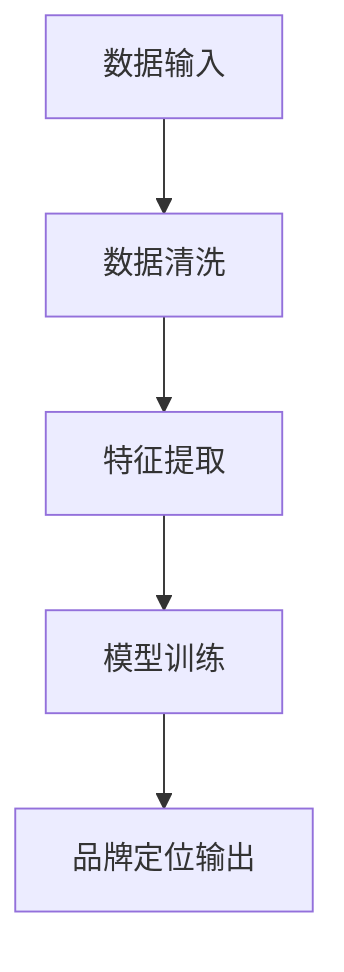

                 

# AI辅助企业品牌定位与差异化战略制定

## 关键词：AI技术、品牌定位、差异化战略、机器学习、自然语言处理、系统架构

## 摘要：  
本文将详细探讨如何利用AI技术辅助企业进行品牌定位与差异化战略的制定。通过分析AI在品牌定位中的核心作用，结合实际案例，展示如何利用机器学习、自然语言处理等技术手段，帮助企业实现精准的品牌定位和差异化竞争策略。本文将从理论基础到实践应用，系统性地阐述AI在品牌定位中的潜力和实现路径，为企业提供可操作的解决方案。

---

# 第一部分: AI辅助企业品牌定位与差异化战略的背景与基础

## 第1章: AI辅助企业品牌定位与差异化战略概述

### 1.1 企业品牌定位与差异化战略的基本概念

#### 1.1.1 企业品牌定位的定义与重要性  
品牌定位是企业在市场中确定自身独特位置的过程，旨在通过差异化策略，让目标客户清晰地感知品牌的核心价值和竞争优势。在数字化时代，品牌定位需要结合数据和算法，以更精准的方式触达目标客户。

#### 1.1.2 差异化战略的核心内涵  
差异化战略是指企业通过提供独特的产品或服务，与竞争对手形成差异化竞争优势。在AI技术的辅助下，差异化战略可以通过数据分析和个性化推荐实现更精准的市场定位。

#### 1.1.3 AI技术在品牌定位和差异化中的应用前景  
AI技术通过数据挖掘、机器学习和自然语言处理，可以帮助企业快速分析市场趋势、消费者需求和竞争对手策略，从而制定更具前瞻性的品牌定位和差异化战略。

---

### 1.2 AI技术对企业品牌定位的影响

#### 1.2.1 数据驱动的品牌定位新范式  
AI技术通过大数据分析，帮助企业从海量数据中提取关键信息，构建品牌画像，从而实现数据驱动的品牌定位。

#### 1.2.2 AI如何赋能差异化战略  
AI技术可以通过个性化推荐、情感分析和市场预测，帮助企业制定更具针对性的差异化策略，提升市场竞争力。

#### 1.2.3 企业品牌定位的未来趋势  
随着AI技术的不断发展，品牌定位将更加依赖数据和算法，实现从传统经验驱动向智能化数据驱动的转变。

---

### 1.3 本书的核心目标与内容框架

#### 1.3.1 本书的核心目标  
本书旨在通过系统性地介绍AI技术在品牌定位和差异化战略中的应用，帮助企业利用AI工具实现更精准的品牌定位和市场策略。

#### 1.3.2 本书的主要内容框架  
- 第一部分：AI辅助品牌定位的背景与基础  
- 第二部分：AI技术在品牌定位中的核心算法与数学模型  
- 第三部分：AI辅助品牌定位的系统架构与实现方案  
- 第四部分：AI辅助品牌定位的项目实战与案例分析  
- 第五部分：AI辅助品牌定位的最佳实践与未来发展  

#### 1.3.3 本书的读者对象与学习方法  
本书适合企业高管、市场营销人员、数据科学家以及对AI技术感兴趣的学生和研究者阅读。读者可以通过理论学习与实践结合的方式，逐步掌握AI辅助品牌定位的核心技能。

---

## 第2章: AI辅助企业品牌定位的核心概念与联系

### 2.1 品牌定位与差异化战略的核心要素

#### 2.1.1 品牌定位的四个维度  
- **市场定位**：确定目标市场和目标客户  
- **价值主张**：明确品牌的核心价值和竞争优势  
- **品牌形象**：塑造独特的品牌形象和认知度  
- **客户定位**：精准识别目标客户的需求和偏好  

#### 2.1.2 差异化战略的三大关键点  
- **产品差异化**：通过创新的产品或服务与竞争对手区分开  
- **价格差异化**：制定合理的定价策略，吸引目标客户  
- **渠道差异化**：通过独特的渠道策略提升市场覆盖能力  

#### 2.1.3 核心要素的相互关系  
品牌定位和差异化战略是相辅相成的。品牌定位确定了企业的市场位置，而差异化战略则通过独特的价值主张和竞争优势，进一步巩固品牌定位。

---

### 2.2 AI技术在品牌定位中的应用原理

#### 2.2.1 数据分析与品牌画像  
通过AI技术对消费者数据、市场数据和竞争对手数据进行分析，构建品牌画像，帮助企业更清晰地了解自身定位。

#### 2.2.2 机器学习与市场趋势预测  
利用机器学习算法预测市场趋势，分析消费者行为，为品牌定位提供数据支持。

#### 2.2.3 自然语言处理与品牌语义分析  
通过自然语言处理技术分析消费者对品牌的语义认知，帮助企业更精准地理解品牌在市场中的定位。

---

### 2.3 核心概念的对比分析

#### 2.3.1 品牌定位与市场定位的对比  
| 对比维度 | 品牌定位 | 市场定位 |
|----------|----------|----------|
| 定位对象 | 品牌形象与价值 | 市场区域与客户群体 |
| 定位目标 | 突出品牌核心价值 | 确定目标市场和客户 |
| 实现方式 | 通过差异化策略 | 通过渠道策略 |

#### 2.3.2 差异化战略与成本领先战略的对比  
| 对比维度 | 差异化战略 | 成本领先战略 |
|----------|----------|----------|
| 战略目标 | 提供独特的产品或服务 | 降低产品或服务的成本 |
| 适用场景 | 高端市场或 niche市场 | 大众市场或价格敏感型市场 |
| 竞争优势 | 独特性和差异化 | 成本优势 |

#### 2.3.3 AI辅助与传统品牌定位方法的对比  
| 对比维度 | AI辅助品牌定位 | 传统品牌定位 |
|----------|----------|----------|
| 数据支持 | 强大数据支持 | 依赖经验判断 |
| 分析效率 | 高效、快速 | 低效、耗时 |
| 精准度 | 高度精准 | 可能存在偏差 |

---

### 2.4 实体关系图与流程图

#### 2.4.1 品牌定位与差异化战略的实体关系图  

#### 2.4.2 AI辅助品牌定位的流程图  

---

## 第3章: AI辅助品牌定位的算法原理与数学模型

### 3.1 品牌定位的核心算法

#### 3.1.1 机器学习算法在品牌定位中的应用  
- **监督学习**：用于分类和回归问题，如客户细分和市场预测。  
- **无监督学习**：用于聚类分析，如消费者群体划分。  
- **深度学习**：用于复杂模式识别，如情感分析和语义理解。

#### 3.1.2 自然语言处理算法在品牌定位中的应用  
- **文本分类**：用于识别消费者情感倾向。  
- **实体识别**：用于提取品牌相关实体信息。  
- **语义分析**：用于理解品牌语义关系。

#### 3.1.3 时间序列分析算法  
- 用于分析市场趋势和周期性变化，帮助品牌定位长期战略。

---

### 3.2 算法原理与数学模型

#### 3.2.1 机器学习模型  
- **线性回归模型**：用于市场趋势预测。  
$$ y = \beta_0 + \beta_1x + \epsilon $$
- **随机森林模型**：用于客户细分和分类问题。  
- **神经网络模型**：用于复杂模式识别。

#### 3.2.2 自然语言处理模型  
- **词嵌入模型**（如Word2Vec）：用于文本特征提取。  
- **情感分析模型**：用于分析消费者情感倾向。

---

通过以上章节的分析，我们可以看到AI技术在企业品牌定位和差异化战略中的巨大潜力。接下来的章节将详细探讨系统的实现方案和实际案例，帮助读者更好地理解和应用这些技术。

