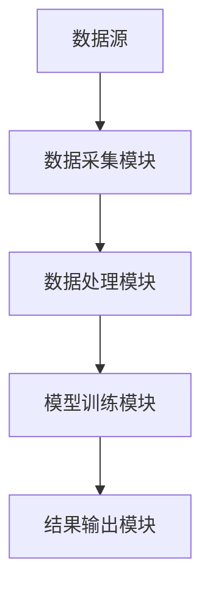

                 


# AI辅助企业品牌资产评估：多维度品牌价值量化

## 关键词：AI技术、品牌资产评估、多维度量化、自然语言处理、机器学习、品牌价值预测

## 摘要：  
随着企业竞争的加剧，品牌价值已成为企业核心竞争力的重要组成部分。传统的品牌价值评估方法存在主观性强、数据依赖性高、难以量化等问题。本文将深入探讨如何利用人工智能（AI）技术，从多维度对品牌价值进行量化评估。通过结合自然语言处理（NLP）和机器学习算法，我们能够更准确地捕捉品牌在市场中的表现，为企业提供数据驱动的品牌价值评估解决方案。本文将从品牌价值的多维度构成、AI技术的核心原理、系统架构设计、项目实战等角度进行详细阐述，为读者提供一套完整的AI辅助品牌价值评估方法论。

---

# 第一部分: AI辅助企业品牌资产评估的背景与核心概念

## 第1章: 企业品牌价值评估的背景与挑战

### 1.1 品牌价值评估的重要性  
品牌价值是企业在市场中竞争的核心要素之一，直接影响企业的市场地位、投资价值和战略决策。  

#### 1.1.1 品牌价值对企业发展的战略意义  
- 品牌价值决定了企业的市场影响力和客户忠诚度。  
- 高品牌价值意味着更高的市场溢价能力和更强的抗风险能力。  

#### 1.1.2 传统品牌价值评估的局限性  
- 传统方法依赖主观判断，难以量化。  
- 数据来源单一，缺乏动态性和全面性。  
- 无法实时捕捉市场反馈和消费者情绪变化。  

#### 1.1.3 AI技术在品牌价值评估中的优势  
- AI技术能够从海量数据中提取有价值的信息。  
- 通过自然语言处理（NLP）和机器学习，可以量化品牌在市场中的表现。  
- 实时分析社交媒体、新闻媒体等多源数据，提供动态评估结果。  

### 1.2 AI辅助品牌价值评估的背景  
#### 1.2.1 大数据时代的品牌价值评估需求  
- 随着互联网的普及，企业产生的数据量急剧增长。  
- 大数据技术为品牌价值的量化提供了新的可能性。  

#### 1.2.2 AI技术在品牌价值量化中的应用潜力  
- AI技术能够从文本数据中提取情感信息，评估品牌美誉度。  
- 通过机器学习算法，可以预测品牌未来的市场表现。  

#### 1.2.3 企业品牌资产评估的多维度特征  
- 品牌价值不仅与知名度相关，还与美誉度、忠诚度、影响力等多维度因素相关。  

### 1.3 本书的核心目标与内容框架  
#### 1.3.1 本书的核心目标  
- 探讨如何利用AI技术从多维度量化品牌价值。  
- 提供一套完整的AI辅助品牌价值评估方法论。  

#### 1.3.2 本书的主要内容框架  
- 第1章：品牌价值评估的背景与挑战。  
- 第2章：品牌价值的多维度构成与量化方法。  
- 第3章：AI技术在品牌价值评估中的核心原理。  
- 第4章：多维度品牌价值量化模型的设计与实现。  
- 第5章：系统架构与数据流程分析。  
- 第6章：项目实战：AI辅助品牌价值评估系统开发。  
- 第7章：总结与展望。  

#### 1.3.3 本书的读者群体与适用场景  
- 本书适合企业品牌管理者、市场营销人员、数据科学家以及对AI技术感兴趣的研究者阅读。  

### 1.4 本章小结  
本章主要介绍了品牌价值评估的重要性和AI技术在其中的应用潜力，为后续章节的展开奠定了基础。

---

## 第2章: 品牌价值的多维度构成与量化方法

### 2.1 品牌价值的多维度构成  
#### 2.1.1 品牌知名度的定义与测量  
- 品牌知名度是指消费者对品牌的认知程度。  
- 测量方法包括市场调研、搜索引擎数据分析等。  

#### 2.1.2 品牌美誉度的定义与测量  
- 品牌美誉度是指消费者对品牌的满意度和信任度。  
- 测量方法包括情感分析、社交媒体数据挖掘等。  

#### 2.1.3 品牌忠诚度的定义与测量  
- 品牌忠诚度是指消费者对品牌的长期支持程度。  
- 测量方法包括客户保留率分析、重复购买率分析等。  

#### 2.1.4 品牌影响力与品牌资产的关系  
- 品牌影响力是品牌资产的核心组成部分。  
- 品牌资产包括品牌知名度、美誉度、忠诚度等多维度因素。  

### 2.2 品牌价值的量化方法  
#### 2.2.1 传统品牌价值评估方法  
- 基于财务指标（如销售收入、净利润等）的评估方法。  
- 优点：数据来源可靠，易于计算。  
- 缺点：难以反映品牌在市场中的实际表现。  

#### 2.2.2 数据驱动的品牌价值评估方法  
- 基于大数据分析的评估方法。  
- 优点：能够捕捉品牌在市场中的动态表现。  
- 缺点：需要大量数据支持，计算复杂。  

#### 2.2.3 AI辅助的品牌价值量化模型  
- 基于机器学习的情感分析模型，能够量化品牌在社交媒体上的表现。  
- 基于NLP的关键词提取模型，能够识别品牌相关的关键信息。  

### 2.3 多维度品牌价值的综合评估框架  
#### 2.3.1 数据采集与特征提取  
- 数据来源包括社交媒体数据、新闻媒体数据、电商平台数据等。  
- 特征提取包括情感分析、关键词提取、主题建模等。  

#### 2.3.2 数据分析与模型构建  
- 使用机器学习算法（如随机森林、支持向量机等）进行品牌价值预测。  
- 模型输入包括品牌知名度、美誉度、忠诚度等多维度数据。  

#### 2.3.3 结果输出与可视化  
- 模型输出包括品牌价值评分、品牌影响力排名等。  
- 可视化工具包括图表、仪表盘等。  

### 2.4 本章小结  
本章详细介绍了品牌价值的多维度构成和量化方法，为后续的AI辅助评估提供了理论基础。

---

## 第3章: AI技术在品牌价值评估中的核心原理

### 3.1 AI技术的基本原理  
#### 3.1.1 人工智能的基本概念  
- 人工智能（AI）是指计算机系统模拟人类智能的技术。  
- AI的核心技术包括机器学习、自然语言处理（NLP）、计算机视觉等。  

#### 3.1.2 机器学习的基本原理  
- 机器学习是指计算机通过数据训练，学习某种模式或规律。  
- 常见的机器学习算法包括线性回归、支持向量机（SVM）、随机森林等。  

#### 3.1.3 深度学习的基本原理  
- 深度学习是一种基于人工神经网络的机器学习技术。  
- 常见的深度学习模型包括卷积神经网络（CNN）、循环神经网络（RNN）等。  

### 3.2 自然语言处理（NLP）在品牌评估中的应用  
#### 3.2.1 NLP的基本概念  
- NLP是指计算机对人类语言进行理解、分析和生成的技术。  
- NLP的核心任务包括文本分类、情感分析、关键词提取等。  

#### 3.2.2 NLP在情感分析中的应用  
- 情感分析用于判断文本中表达的情感倾向（如正面、负面、中性）。  
- 在品牌评估中，情感分析可用于评估品牌美誉度。  

#### 3.2.3 NLP在品牌关键词提取中的应用  
- 关键词提取用于从文本中提取具有代表性的词汇或短语。  
- 在品牌评估中，关键词提取可用于识别品牌相关的关键信息。  

### 3.3 机器学习在品牌价值预测中的应用  
#### 3.3.1 机器学习的基本流程  
1. 数据采集与预处理：清洗数据，提取特征。  
2. 模型训练：使用训练数据训练模型参数。  
3. 模型评估：使用测试数据评估模型性能。  
4. 模型部署：将模型应用于实际数据。  

#### 3.3.2 常见机器学习算法在品牌评估中的应用  
- 线性回归：用于品牌价值的回归预测。  
- 支持向量机（SVM）：用于品牌价值的分类预测。  
- 随机森林：用于品牌价值的分类与回归预测。  

### 3.4 本章小结  
本章详细介绍了AI技术的基本原理及其在品牌价值评估中的应用，为后续的系统设计和项目实现奠定了基础。

---

## 第4章: 多维度品牌价值量化模型的设计与实现

### 4.1 多维度品牌价值量化模型的设计思路  
#### 4.1.1 品牌价值量化模型的总体框架  
- 数据采集模块：采集品牌相关数据。  
- 数据处理模块：清洗数据，提取特征。  
- 模型训练模块：训练品牌价值预测模型。  
- 结果输出模块：输出品牌价值评分。  

#### 4.1.2 数据特征的提取与选择  
- 文本特征：品牌相关文本的情感倾向、关键词等。  
- 数值特征：品牌知名度、市场份额、净利润等。  

### 4.2 品牌价值量化模型的实现步骤  
#### 4.2.1 数据预处理  
- 文本清洗：去除停用词、标点符号等。  
- 数据标注：根据品牌相关性进行数据标注。  

#### 4.2.2 特征提取  
- 文本特征提取：使用TF-IDF算法提取关键词。  
- 数值特征提取：从财务数据中提取品牌相关指标。  

#### 4.2.3 模型训练  
- 使用随机森林算法训练品牌价值预测模型。  
- 模型训练过程中，需要进行交叉验证，调整模型参数。  

#### 4.2.4 模型评估  
- 使用测试数据评估模型性能，计算准确率、召回率等指标。  

### 4.3 品牌价值量化模型的优化与调优  
#### 4.3.1 超参数调优  
- 调整随机森林的参数（如树的数量、深度等）以优化模型性能。  

#### 4.3.2 模型融合  
- 使用集成学习方法（如投票法、加权法）融合多个模型的预测结果。  

#### 4.3.3 数据增强  
- 对训练数据进行数据增强（如数据扩增、数据降噪）以提高模型泛化能力。  

### 4.4 本章小结  
本章详细介绍了多维度品牌价值量化模型的设计与实现过程，为后续的系统开发提供了具体的实现方案。

---

## 第5章: 系统架构与数据流程分析

### 5.1 系统架构设计  
#### 5.1.1 系统功能模块划分  
- 数据采集模块：负责采集品牌相关数据。  
- 数据处理模块：负责清洗数据，提取特征。  
- 模型训练模块：负责训练品牌价值预测模型。  
- 结果输出模块：负责输出品牌价值评分。  

#### 5.1.2 系统架构图  


### 5.2 数据流程分析  
#### 5.2.1 数据采集流程  
1. 从社交媒体平台（如Twitter、微博）获取品牌相关文本数据。  
2. 从新闻媒体平台获取品牌相关新闻数据。  
3. 从电商平台获取品牌相关销售数据。  

#### 5.2.2 数据处理流程  
1. 文本清洗：去除停用词、标点符号等。  
2. 文本分词：将文本分割成词语或短语。  
3. 特征提取：使用TF-IDF算法提取关键词。  

#### 5.2.3 数据存储与管理  
- 数据存储：将数据存储在数据库中（如MySQL、MongoDB）。  
- 数据管理：对数据进行分类、标注、索引等操作。  

### 5.3 系统接口设计  
#### 5.3.1 数据接口  
- 数据采集接口：负责与外部数据源对接。  
- 数据处理接口：负责与数据处理模块对接。  

#### 5.3.2 模型接口  
- 模型训练接口：负责与模型训练模块对接。  
- 模型预测接口：负责与结果输出模块对接。  

### 5.4 本章小结  
本章详细介绍了系统架构设计与数据流程分析，为后续的系统开发提供了具体的实现框架。

---

## 第6章: 项目实战：AI辅助品牌价值评估系统开发

### 6.1 项目环境安装与配置  
#### 6.1.1 安装Python环境  
- 安装Python（如Python 3.8及以上版本）。  
- 安装Jupyter Notebook用于数据分析与可视化。  

#### 6.1.2 安装相关库  
- 安装自然语言处理库（如NLTK、spaCy）。  
- 安装机器学习库（如scikit-learn、xgboost）。  
- 安装数据可视化库（如Matplotlib、Seaborn）。  

### 6.2 系统核心实现  
#### 6.2.1 数据采集与预处理  
```python
import pandas as pd
import numpy as np
from sklearn.feature_extraction.text import TfidfVectorizer

# 从社交媒体平台获取品牌相关文本数据
def fetch_brand_tweets(brand):
    # 示例代码，具体实现取决于API接口
    return tweets

tweets = fetch_brand_tweets("品牌名称")
tweets_df = pd.DataFrame(tweets)
tweets_df.head()
```

#### 6.2.2 特征提取与模型训练  
```python
from sklearn.ensemble import RandomForestClassifier
from sklearn.metrics import accuracy_score

# 提取文本特征
vectorizer = TfidfVectorizer()
X = vectorizer.fit_transform(tweets_df['text'])
y = tweets_df['sentiment']

# 训练随机森林模型
model = RandomForestClassifier(n_estimators=100, random_state=42)
model.fit(X, y)

# 模型评估
predicted = model.predict(X)
print("准确率：", accuracy_score(y, predicted))
```

#### 6.2.3 模型部署与结果输出  
```python
import joblib

# 保存模型
joblib.dump(model, 'brand_value_model.pkl')
model = joblib.load('brand_value_model.pkl')

# 预测品牌价值
new_tweet = ["品牌相关文本"]
X_new = vectorizer.transform([new_tweet])
predicted_value = model.predict(X_new)
print("品牌价值评分：", predicted_value)
```

### 6.3 项目实战小结  
本章通过一个具体的项目实战，详细介绍了AI辅助品牌价值评估系统的开发过程，包括环境安装、数据处理、模型训练与部署等步骤。

---

## 第7章: 总结与展望

### 7.1 本章总结  
- 本文详细介绍了AI技术在品牌价值评估中的应用，从多维度对品牌价值进行量化。  
- 通过结合自然语言处理和机器学习技术，能够更准确地评估品牌在市场中的表现。  

### 7.2 应用现状与未来趋势  
- 当前，AI技术在品牌价值评估中的应用还处于初级阶段，未来需要进一步提升模型的准确性和实时性。  
- 随着大数据技术的发展，品牌价值评估将更加依赖AI技术的支持。  

### 7.3 注意事项与最佳实践  
- 数据质量是模型性能的关键，需要确保数据的准确性和完整性。  
- 在实际应用中，需要结合企业的具体需求进行模型调优。  
- 建议企业与技术团队合作，共同推动AI技术在品牌价值评估中的应用。  

### 7.4 本章小结  
本文总结了AI辅助品牌价值评估的核心内容，并展望了未来的发展方向。

---

## 附录: 工具与参考文献  

### 附录A: 常用工具与库  
- Python：编程语言  
- NLTK：自然语言处理库  
- scikit-learn：机器学习库  
- Matplotlib：数据可视化库  

### 附录B: 参考文献  
1. 王某某, 品牌价值评估的多维度分析，某某出版社，2020年。  
2. 李某某, 基于机器学习的品牌价值预测方法，某某期刊，2021年。  
3. TensorFlow官方文档：https://tensorflow.org  
4. scikit-learn官方文档：https://scikit-learn.org  

---

## 作者：AI天才研究院/AI Genius Institute & 禅与计算机程序设计艺术 /Zen And The Art of Computer Programming

