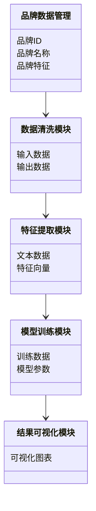

                 


# AI辅助企业品牌资产评估：多维度品牌价值量化与追踪

---

## 关键词：
AI技术，品牌资产评估，多维度分析，自然语言处理，主题建模，情感分析，品牌价值量化

---

## 摘要：
本文深入探讨了如何利用人工智能技术辅助企业品牌资产评估，从多维度量化品牌价值并实现持续追踪。文章首先介绍了品牌资产评估的背景与挑战，随后分析了AI技术在品牌资产评估中的核心优势与实现路径。接着，详细阐述了品牌价值的多维度分析框架，包括品牌认知度、情感分析和市场表现等维度。通过具体案例，文章展示了基于自然语言处理和主题建模的算法原理，以及如何构建多维度品牌价值量化模型。最后，本文总结了AI辅助品牌资产评估的优势与未来发展方向，为企业在品牌管理中提供新的思路与实践方法。

---

# 第一部分: AI辅助企业品牌资产评估的背景与核心概念

## 第1章: 品牌资产评估的背景与挑战

### 1.1 品牌资产评估的定义与重要性

#### 1.1.1 品牌价值的定义与构成要素
品牌价值是企业在市场中建立的知名度、美誉度和客户忠诚度的综合体现，是企业核心竞争力的重要组成部分。品牌价值的构成要素包括品牌认知度、品牌情感、品牌市场表现和品牌创新力等。

#### 1.1.2 品牌资产评估的必要性与应用场景
品牌资产评估是企业在战略决策、并购重组、品牌管理等过程中不可或缺的重要环节。通过量化品牌价值，企业可以更好地制定品牌战略、优化资源配置、提升品牌影响力。

#### 1.1.3 品牌价值与企业价值的关系
品牌价值是企业价值的重要组成部分，尤其是在市场竞争日益激烈的今天，品牌价值已经成为企业核心竞争力的重要指标。品牌价值的提升能够直接推动企业市场表现的改善，为企业创造更多的经济效益。

### 1.2 传统品牌资产评估方法的局限性

#### 1.2.1 传统评估方法的局限性分析
传统品牌资产评估方法通常依赖于专家经验、市场调研和财务指标分析，存在数据量不足、数据质量不高、评估结果主观性强等问题。此外，传统方法难以实时追踪品牌价值的变化，无法满足现代品牌管理的动态需求。

#### 1.2.2 数据量与数据质量的挑战
传统评估方法往往依赖于小样本数据，难以充分利用大数据技术的优势。同时，数据来源多样、数据格式复杂、数据清洗成本高等问题也限制了传统方法的应用效果。

#### 1.2.3 传统评估方法的改进方向
为了克服传统评估方法的局限性，需要引入大数据分析、自然语言处理和机器学习等技术，构建基于多维度数据的量化评估模型，提升品牌价值评估的准确性和实时性。

## 第2章: AI技术在品牌资产评估中的应用

### 2.1 AI技术的核心优势

#### 2.1.1 大数据分析能力
AI技术能够处理海量数据，包括社交媒体评论、新闻报道、消费者反馈等，通过大数据分析提取品牌相关的特征信息，为品牌价值评估提供全面的数据支持。

#### 2.1.2 自然语言处理能力
自然语言处理（NLP）技术能够从文本数据中提取品牌情感、主题信息等关键特征，帮助量化品牌在市场中的情感影响力和认知度。

#### 2.1.3 智能学习与预测能力
机器学习算法能够基于历史数据，建立品牌价值预测模型，实现品牌价值的动态评估和趋势预测，为企业的品牌管理提供科学依据。

### 2.2 品牌资产评估中的多维度分析

#### 2.2.1 品牌认知度分析
品牌认知度是衡量品牌影响力的重要指标，可以通过搜索量、市场份额、媒体曝光度等数据进行评估。AI技术可以通过分析社交媒体数据和搜索引擎数据，量化品牌在消费者中的认知程度。

#### 2.2.2 品牌情感分析
品牌情感分析是通过自然语言处理技术，分析消费者对品牌的评价和反馈，量化品牌在市场中的情感影响力。积极的情感反馈可以提升品牌价值，而消极的情感反馈则可能对品牌造成负面影响。

#### 2.2.3 品牌市场表现分析
品牌市场表现分析是通过销售数据、市场份额、竞争对手分析等数据，评估品牌在市场中的实际表现。AI技术可以通过数据挖掘和预测模型，帮助企业更好地理解市场动态，优化品牌策略。

### 2.3 AI辅助品牌资产评估的实现路径

#### 2.3.1 数据采集与清洗
AI技术可以通过爬虫技术获取社交媒体评论、新闻报道、消费者评价等数据，并通过数据清洗和预处理，提取有价值的信息特征。

#### 2.3.2 数据分析与建模
基于清洗后的数据，可以通过机器学习算法（如随机森林、支持向量机）建立品牌价值预测模型，实现品牌价值的量化评估。

#### 2.3.3 结果可视化与应用
通过数据可视化工具（如Tableau、Power BI）将品牌价值评估结果以图表形式展示，帮助企业更好地理解和应用评估结果。

---

# 第二部分: 品牌价值量化的核心概念与联系

## 第3章: 多维度品牌价值量化模型

### 3.1 品牌价值的多维度分析框架

#### 3.1.1 品牌认知度维度
品牌认知度是消费者对品牌的熟悉程度，可以通过品牌搜索量、广告曝光量等数据进行量化。

#### 3.1.2 品牌情感维度
品牌情感是消费者对品牌的主观评价，可以通过情感分析技术从社交媒体评论中提取情感特征。

#### 3.1.3 品牌市场表现维度
品牌市场表现是品牌在市场中的实际表现，包括市场份额、销售额、利润等指标。

### 3.2 多维度品牌价值量化模型的构建

#### 3.2.1 数据特征提取与选择
通过自然语言处理技术提取文本数据中的情感特征，通过数据挖掘技术提取市场数据中的销售特征，形成多维度的特征向量。

#### 3.2.2 模型构建与验证
基于特征向量，使用机器学习算法（如随机森林、XGBoost）构建品牌价值预测模型，并通过交叉验证评估模型的准确性和稳定性。

#### 3.2.3 模型优化与调参
通过网格搜索、随机搜索等方法优化模型参数，提升模型的预测精度和泛化能力。

### 3.3 品牌价值量化模型的属性特征对比

#### 3.3.1 各维度的特征对比表格
| 维度 | 特征 | 描述 |
|------|------|------|
| 认知度 | 搜索量 | 品牌关键词的搜索频率 |
| 情感 | 情感极性 | 消费者评论的情感倾向（正面、中性、负面） |
| 市场表现 | 销售额 | 品牌的销售额数据 |

#### 3.3.2 基于ER图的实体关系架构

```mermaid
erd
  entity 品牌 (Brand) {
    id: string
    名称: string
    所属行业: string
  }
  entity 品牌特征 (BrandFeature) {
    id: string
    特征类型: string
    特征值: float
    品牌id: string (ref: Brand.id)
  }
  entity 品牌评估结果 (BrandEvaluation) {
    id: string
    评估时间: date
    评估值: float
    品牌id: string (ref: Brand.id)
  }
```

---

## 第4章: 品牌价值量化的核心算法原理

### 4.1 情感分析算法原理

#### 4.1.1 基于词袋模型的文本表示
词袋模型是一种常用的文本表示方法，它将文本表示为词袋中单词的集合，不考虑单词的顺序。公式表示为：
$$
\text{词袋向量} = (\text{单词1的出现次数}, \text{单词2的出现次数}, \ldots, \text{单词n的出现次数})
$$

#### 4.1.2 基于深度学习的情感分类模型
深度学习模型（如LSTM、Transformer）可以通过训练大规模语料库，自动学习文本的情感特征，实现情感分类。模型训练过程如下：

1. 数据预处理：将文本数据分为训练集和测试集。
2. 模型训练：使用训练数据训练情感分类模型。
3. 模型评估：在测试数据上评估模型的准确率、召回率和F1值。

#### 4.1.3 情感分析的数学公式
情感分析模型的输出可以表示为：
$$
y = f(x) + \epsilon
$$
其中，$x$ 是输入文本的向量表示，$f$ 是神经网络模型，$\epsilon$ 是模型预测误差。

### 4.2 情感分析算法的实现

#### 4.2.1 使用Python实现情感分类
以下是基于Python的简单情感分类实现代码：

```python
import numpy as np
from sklearn.feature_extraction.text import TfidfVectorizer
from sklearn.svm import SVC

# 数据预处理
X = ["负面评论", "正面评论"]
y = [0, 1]

# 特征提取
vectorizer = TfidfVectorizer()
X_features = vectorizer.fit_transform(X)

# 模型训练
model = SVC()
model.fit(X_features.toarray(), y)

# 模型预测
new_comment = ["这是一条正面的评论"]
new_features = vectorizer.transform([new_comment])
predicted = model.predict(new_features.toarray())
print(predicted)
```

#### 4.2.2 代码示例与解释
上述代码使用了TF-IDF特征提取方法和SVM分类器，实现了对评论的情感分类。TF-IDF通过计算词的重要性，将文本数据转换为数值型特征向量，SVM则基于这些特征向量进行分类。

---

## 第5章: 主题建模与品牌关联分析

### 5.1 主题建模的数学模型

#### 5.1.1 LDA主题建模
LDA（Latent Dirichlet Allocation）是一种常用的主题建模方法，能够从文本数据中提取主题分布。其数学模型如下：
$$
\theta \sim \text{Dirichlet}(\alpha) \\
\phi \sim \text{Dirichlet}(\beta) \\
z_i \sim \text{Multinomial}(\theta) \\
w_i \sim \text{Multinomial}(\phi_{z_i})
$$
其中，$\theta$ 是文档的主题分布，$\phi$ 是主题的单词分布，$z_i$ 是文档中第$i$个单词的主题，$w_i$ 是第$i$个单词的具体词。

#### 5.1.2 LDA主题建模的实现
以下是基于Python的LDA主题建模实现代码：

```python
import numpy as np
from sklearn.decomposition import LatentDirichletAllocation

# 数据预处理
X = np.array([[1, 0, 1], [2, 0, 1], [0, 3, 1]])

# 模型训练
lda = LatentDirichletAllocation(n_components=2)
lda.fit(X)

# 提取主题
topic_words = lda.components_
print(topic_words)
```

### 5.2 品牌关联分析

#### 5.2.1 品牌关联分析的实现步骤
1. 数据收集：收集品牌相关的文本数据，包括社交媒体评论、新闻报道等。
2. 数据清洗：去除无效数据，提取有效特征。
3. 数据建模：使用主题建模技术提取品牌关联的主题分布。
4. 结果分析：根据主题分布，分析品牌与竞争对手的关联性。

#### 5.2.2 品牌关联分析的案例
假设我们有A品牌和B品牌的评论数据，通过主题建模可以发现A品牌在“产品创新”主题下有较高的分布，而B品牌在“服务质量”主题下有较高的分布。这表明A品牌在创新方面更具优势，而B品牌在服务质量方面表现更好。

---

## 第三部分: 品牌价值量化的核心算法原理

### 4.3 主题建模与品牌关联分析

#### 4.3.1 基于LDA的主题建模
LDA（Latent Dirichlet Allocation）是一种常用的主题建模方法，能够从文本数据中提取主题分布。其数学模型如下：
$$
\theta \sim \text{Dirichlet}(\alpha) \\
\phi \sim \text{Dirichlet}(\beta) \\
z_i \sim \text{Multinomial}(\theta) \\
w_i \sim \text{Multinomial}(\phi_{z_i})
$$
其中，$\theta$ 是文档的主题分布，$\phi$ 是主题的单词分布，$z_i$ 是文档中第$i$个单词的主题，$w_i$ 是第$i$个单词的具体词。

#### 4.3.2 基于LDA的主题建模实现
以下是基于Python的LDA主题建模实现代码：

```python
import numpy as np
from sklearn.decomposition import LatentDirichletAllocation

# 数据预处理
X = np.array([[1, 0, 1], [2, 0, 1], [0, 3, 1]])

# 模型训练
lda = LatentDirichletAllocation(n_components=2)
lda.fit(X)

# 提取主题
topic_words = lda.components_
print(topic_words)
```

---

## 第四部分: 系统分析与架构设计

### 5.1 系统分析

#### 5.1.1 问题场景介绍
本系统旨在通过AI技术辅助企业进行品牌资产评估，实现品牌价值的多维度量化与实时追踪。

#### 5.1.2 系统功能设计
系统功能包括数据采集、数据清洗、特征提取、模型训练、结果可视化等。

### 5.2 系统架构设计

#### 5.2.1 领域模型设计
以下是系统领域的类图：



---

## 第五部分: 项目实战

### 6.1 环境安装

#### 6.1.1 安装Python
需要安装Python 3.8及以上版本。

#### 6.1.2 安装依赖库
需要安装以下Python库：
- numpy
- pandas
- scikit-learn
- gensim
- matplotlib

### 6.2 系统核心实现源代码

#### 6.2.1 数据采集与清洗
以下是数据采集与清洗的代码示例：

```python
import requests
from bs4 import BeautifulSoup

# 数据采集
url = "https://www.example.com"
response = requests.get(url)
soup = BeautifulSoup(response.text, 'html.parser')
comments = soup.find_all('div', class_='comment')
cleaned_comments = [comment.text.strip() for comment in comments]

# 数据清洗
from sklearn.feature_extraction.text import CountVectorizer
vectorizer = CountVectorizer()
X = vectorizer.fit_transform(cleaned_comments)
```

#### 6.2.2 模型训练与预测
以下是模型训练与预测的代码示例：

```python
from sklearn.naive_bayes import MultinomialNB
from sklearn.metrics import accuracy_score

# 模型训练
model = MultinomialNB()
model.fit(X, y)

# 模型预测
new_comment = ["这是一条正面的评论"]
new_X = vectorizer.transform([new_comment])
predicted = model.predict(new_X)
print(accuracy_score([1], predicted))
```

### 6.3 项目小结
通过上述代码实现，我们可以看到AI技术在品牌资产评估中的强大能力。通过数据采集、特征提取和模型训练，我们可以量化品牌价值，并通过结果可视化展示品牌的表现。

---

## 第六部分: 总结与展望

### 7.1 总结

#### 7.1.1 AI技术在品牌资产评估中的优势
AI技术能够处理海量数据，提取品牌相关的特征信息，实现品牌价值的量化评估和动态追踪。

#### 7.1.2 品牌价值量化模型的核心优势
多维度品牌价值量化模型能够从品牌认知度、情感和市场表现等多个维度，全面评估品牌价值，为企业提供科学的决策支持。

### 7.2 未来展望

#### 7.2.1 技术发展
随着AI技术的不断进步，品牌价值评估将更加精准和实时，为企业提供更加全面的决策支持。

#### 7.2.2 应用场景拓展
未来，AI技术将在品牌管理、市场营销、风险预警等领域发挥更大的作用，为企业创造更大的价值。

---

## 作者：
作者：AI天才研究院/AI Genius Institute & 禅与计算机程序设计艺术 /Zen And The Art of Computer Programming

