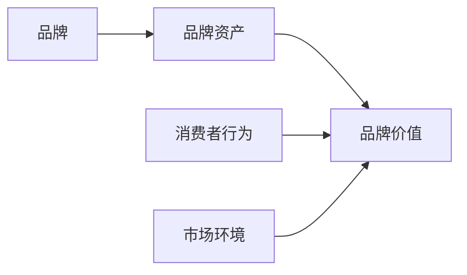
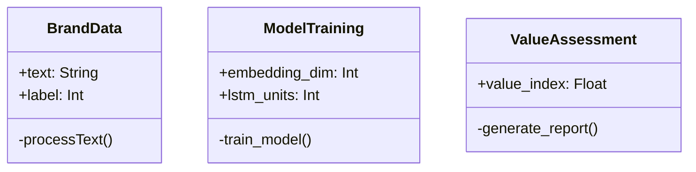

                 


# AI辅助企业品牌资产评估：多维度品牌价值量化与追踪

## 关键词：AI技术、品牌资产评估、多维度量化、实时追踪、自然语言处理、深度学习、品牌价值指数

## 摘要：  
本文深入探讨了如何利用人工智能技术对企业的品牌价值进行多维度量化评估与实时追踪。通过分析品牌资产的核心构成、AI技术在品牌评估中的应用前景，以及具体的算法原理和系统架构设计，本文为品牌价值的科学评估提供了全新的视角和实践方案。文章结合实际案例，详细讲解了从数据采集到模型训练的全过程，并总结了AI技术在品牌资产评估中的优势与挑战。

---

## 第一部分: 企业品牌资产评估的背景与挑战

### 第1章: 企业品牌资产评估的背景与挑战

#### 1.1 品牌价值的重要性
##### 1.1.1 品牌价值的定义与内涵
品牌价值是指品牌为企业带来的超额收益能力，是企业在市场中竞争的核心优势。品牌价值不仅包括直接的经济收益，还涉及品牌知名度、美誉度、忠诚度等多个维度的综合评估。

##### 1.1.2 品牌价值对企业的重要性
品牌价值是企业核心竞争力的体现，直接影响企业的市场地位、客户忠诚度和盈利能力。在数字化时代，品牌价值的评估已成为企业制定战略决策的重要依据。

##### 1.1.3 传统品牌资产评估方法的局限性
传统品牌资产评估方法多依赖于专家评分、市场调研等手段，存在数据采集成本高、评估周期长、结果缺乏实时性等问题。此外，传统方法难以量化品牌在社交媒体、消费者口碑等非结构化数据中的价值。

#### 1.2 企业品牌资产评估的挑战
##### 1.2.1 数据获取的难度
品牌价值的评估需要整合来自社交媒体、新闻媒体、消费者评论等多源数据，数据清洗和预处理的难度较高。

##### 1.2.2 数据多样性的处理
品牌相关的数据呈现多样化特征，包括文本、图像、视频等多种形式，如何有效整合这些数据并提取有价值的信息是关键挑战。

##### 1.2.3 评估结果的实时性要求
品牌价值会随着市场环境、消费者情绪的变化而动态波动，如何实现品牌价值的实时评估和追踪是企业的重要需求。

#### 1.3 AI技术在品牌资产评估中的应用前景
##### 1.3.1 AI技术的核心优势
人工智能技术具有数据处理能力强、算法模型复杂、自动化程度高等特点，能够有效解决传统品牌资产评估中的难题。

##### 1.3.2 AI技术如何解决传统评估的痛点
AI技术可以通过自然语言处理（NLP）技术分析文本数据，利用深度学习模型进行情感分析和语义理解，从而实现品牌价值的多维度量化评估。

##### 1.3.3 未来发展趋势
随着AI技术的不断进步，品牌价值评估将更加智能化、实时化和个性化，为企业提供更精准的决策支持。

---

## 第二部分: 品牌资产评估的核心概念与联系

### 第2章: 品牌资产评估的核心概念与联系

#### 2.1 品牌资产评估的核心概念
##### 2.1.1 品牌资产的定义与构成
品牌资产包括品牌知名度、品牌美誉度、品牌忠诚度等核心要素。这些要素共同构成了品牌价值的基础框架。

##### 2.1.2 品牌价值的多维度评估
品牌价值的评估需要从品牌认知度、品牌情感、品牌行为等多个维度进行综合考量。

##### 2.1.3 品牌资产的动态变化特征
品牌资产是一个动态变化的过程，受到市场环境、消费者行为、企业战略等多种因素的影响。

#### 2.2 AI技术的核心原理
##### 2.2.1 机器学习在品牌资产评估中的应用
机器学习技术可以通过对海量数据的学习，识别品牌相关的特征和模式，从而实现品牌价值的预测和评估。

##### 2.2.2 自然语言处理（NLP）的作用
NLP技术可以对社交媒体评论、新闻报道等文本数据进行情感分析和语义理解，提取品牌相关的语义信息。

##### 2.2.3 数据挖掘与分析技术
数据挖掘技术可以帮助发现品牌资产的隐藏规律，支持品牌价值的深度分析和预测。

#### 2.3 核心概念的联系与对比
##### 2.3.1 品牌资产与企业价值的关系
品牌资产是企业价值的重要组成部分，高品牌价值能够为企业带来更高的市场份额和盈利能力。

##### 2.3.2 不同评估方法的对比
| 评估方法 | 传统评估 | AI辅助评估 |
|----------|----------|------------|
| 数据来源 | 市场调研、专家评分 | 社交媒体数据、文本数据 |
| 评估维度 | 单一维度 | 多维度 |
| 评估效率 | 低效 | 高效 |
| 评估结果 | 精度低 | 精度高 |

##### 2.3.3 品牌资产的实体关系图


---

## 第三部分: AI辅助品牌价值评估的算法原理

### 第3章: 基于深度学习的品牌价值评估模型

#### 3.1 深度学习在品牌资产评估中的应用
##### 3.1.1 深度学习模型的核心原理
深度学习模型通过多层神经网络结构，能够自动提取数据中的特征和模式，适用于品牌文本数据的分析和情感预测。

##### 3.1.2 基于Transformer的文本分析
使用Transformer模型对社交媒体评论进行情感分析，提取品牌相关的语义信息。

##### 3.1.3 品牌情感指数的计算
通过情感分析结果，计算品牌的正面、负面情感指数，进而量化品牌情感价值。

#### 3.2 品牌价值指数的计算公式
$$ 品牌价值指数 = \sum_{i=1}^{n} w_i x_i $$
其中，$w_i$是第$i$个特征的权重，$x_i$是第$i$个特征的值。

#### 3.3 算法流程图


#### 3.4 系统实现代码示例
```python
import pandas as pd
from sklearn.model_selection import train_test_split
from tensorflow.keras import layers, Model

# 数据预处理
data = pd.read_csv('brand_data.csv')
X_train, X_test, y_train, y_test = train_test_split(data['text'], data['label'], test_size=0.2)

# 模型训练
input_layer = layers.Input(shape=(100,))
x = layers.Embedding(10000, 16)(input_layer)
x = layers.LSTM(32)(x)
x = layers.Dense(1, activation='sigmoid')(x)
model = Model(inputs=input_layer, outputs=x)
model.compile(optimizer='adam', loss='binary_crossentropy', metrics=['accuracy'])
model.fit(X_train, y_train, epochs=10, batch_size=32)

# 结果输出
loss, accuracy = model.evaluate(X_test, y_test)
print(f'Loss: {loss}, Accuracy: {accuracy}')
```

---

## 第四部分: 品牌价值评估系统的架构设计

### 第4章: 系统架构与功能设计

#### 4.1 系统功能模块设计
##### 4.1.1 数据采集模块
负责从社交媒体、新闻媒体等多源数据中采集品牌相关的文本数据。

##### 4.1.2 数据处理模块
对采集的数据进行清洗、分词、去停用词等预处理操作。

##### 4.1.3 模型训练模块
基于预处理后的数据，训练情感分析模型，计算品牌情感指数。

##### 4.1.4 评估分析模块
根据模型输出的结果，生成品牌价值指数报告，并进行可视化展示。

#### 4.2 系统架构设计


#### 4.3 系统功能设计的类图


---

## 第五部分: 项目实战与案例分析

### 第5章: 项目实战与案例分析

#### 5.1 项目背景介绍
以某汽车品牌为例，分析其品牌价值的评估过程。

#### 5.2 环境安装与数据准备
##### 5.2.1 环境安装
```bash
pip install tensorflow keras scikit-learn pandas
```

##### 5.2.2 数据准备
```python
import pandas as pd
data = pd.read_csv('brand_data.csv')
```

#### 5.3 核心代码实现
##### 5.3.1 数据清洗
```python
import re
import nltk

def preprocess(text):
    text = re.sub(r'[^\w\s]', '', text)
    words = nltk.word_tokenize(text)
    return ' '.join(words)
```

##### 5.3.2 模型训练
```python
from tensorflow.keras import layers, Model

input_layer = layers.Input(shape=(100,))
x = layers.Embedding(10000, 16)(input_layer)
x = layers.LSTM(32)(x)
x = layers.Dense(1, activation='sigmoid')(x)
model = Model(inputs=input_layer, outputs=x)
model.compile(optimizer='adam', loss='binary_crossentropy', metrics=['accuracy'])
model.fit(X_train, y_train, epochs=10, batch_size=32)
```

##### 5.3.3 评估结果分析
```python
loss, accuracy = model.evaluate(X_test, y_test)
print(f'Loss: {loss}, Accuracy: {accuracy}')
```

#### 5.4 案例分析与结果解读
通过对某汽车品牌的实际案例分析，展示了AI技术在品牌价值评估中的应用效果和优势。

#### 5.5 项目小结
总结项目实施的关键步骤和经验教训，强调AI技术在品牌资产评估中的重要性。

---

## 第六部分: 总结与展望

### 第6章: 总结与展望

#### 6.1 核心内容回顾
本文系统介绍了AI技术在企业品牌资产评估中的应用，从背景分析、核心概念、算法原理到系统架构设计，再到项目实战，全面探讨了AI辅助品牌价值评估的全过程。

#### 6.2 优势与局限性
AI技术能够提高品牌资产评估的效率和准确性，但仍然存在数据质量、模型解释性等方面的挑战。

#### 6.3 未来展望
随着AI技术的不断进步，品牌资产评估将更加智能化、实时化和个性化。未来的研究方向包括模型的可解释性、多模态数据的融合以及品牌资产的动态追踪。

---

## 作者：AI天才研究院/AI Genius Institute & 禅与计算机程序设计艺术 /Zen And The Art of Computer Programming

---

通过以上内容，本文为读者提供了一个全面的视角，帮助他们理解AI技术在品牌资产评估中的应用，并为实际操作提供了有价值的参考。

