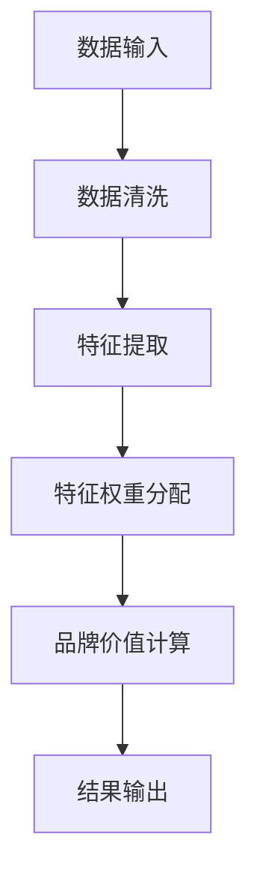
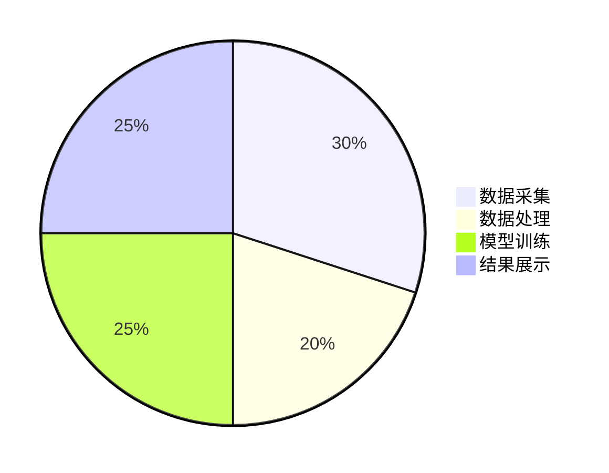
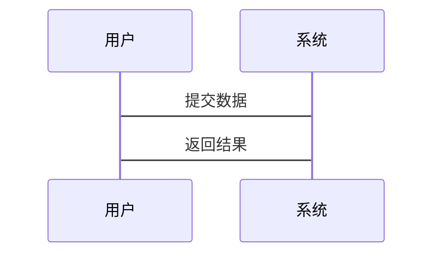

                 


# AI辅助企业品牌资产评估：多维度品牌价值量化与追踪系统

> 关键词：AI，品牌资产评估，多维度价值量化，品牌价值追踪，数据驱动

> 摘要：本文系统阐述了利用人工智能技术对企业品牌资产进行多维度量化评估的方法与实现方案。通过分析品牌价值的核心要素，构建了基于AI的评估模型，并设计了完整的系统架构。文章还详细讲解了算法原理、系统实现及实际应用案例，为企业的品牌价值管理提供了创新思路与技术参考。

---

# 第一章: 问题背景与核心概念

## 1.1 问题背景

### 1.1.1 传统品牌资产评估的局限性
传统的品牌资产评估主要依赖于财务指标和市场调研，存在以下问题：
- 数据采集范围有限，难以覆盖全维度的品牌价值
- 评估结果主观性强，缺乏数据支撑
- 难以实时追踪品牌价值的变化

### 1.1.2 AI技术在品牌评估中的潜力
人工智能技术的快速发展为品牌资产评估带来了新的可能性：
- 自然语言处理（NLP）可以分析品牌相关的文本数据
- 机器学习算法可以挖掘品牌价值的潜在规律
- 大数据分析能力可以整合多源异构数据

### 1.1.3 当前市场对品牌价值量化的需求
企业对品牌价值的量化需求日益增长：
- 需要实时追踪品牌资产的变化
- 需要多维度分析品牌价值的构成
- 需要精准预测品牌价值的未来趋势

## 1.2 问题描述

### 1.2.1 品牌价值的多维度特征
品牌价值可以从多个维度进行分析：
- 品牌知名度
- 品牌美誉度
- 品牌忠诚度
- 品牌市场影响力

### 1.2.2 数据驱动的品牌评估挑战
数据驱动的品牌评估面临以下挑战：
- 数据来源多样，清洗难度大
- 数据量大，计算复杂度高
- 数据隐私与安全问题

### 1.2.3 企业品牌资产追踪的痛点
企业品牌资产追踪的主要痛点包括：
- 缺乏实时监控能力
- 无法量化品牌价值的动态变化
- 难以制定精准的品牌管理策略

## 1.3 问题解决与边界

### 1.3.1 AI辅助品牌资产评估的核心目标
AI辅助品牌资产评估的核心目标是：
- 提供实时、动态的品牌价值评估
- 实现多维度品牌价值的量化分析
- 支持品牌价值的预测与优化

### 1.3.2 解决方案的技术边界
技术边界包括：
- 数据范围：仅限于公开可用的数据
- 计算能力：基于云平台的AI计算能力
- 应用场景：企业内部品牌管理

### 1.3.3 应用场景与适用范围
适用场景包括：
- 企业品牌价值管理
- 投资者品牌价值评估
- 品牌营销策略优化

---

# 第二章: 核心概念与系统架构

## 2.1 品牌价值量化的核心原理

### 2.1.1 数据驱动的品牌评估方法
数据驱动的品牌评估方法包括：
- 基于社交媒体数据的分析
- 基于市场调研数据的分析
- 基于销售数据的分析

### 2.1.2 多维度品牌价值模型
多维度品牌价值模型包括：
- 品牌知名度模型
- 品牌美誉度模型
- 品牌忠诚度模型

### 2.1.3 AI算法在品牌价值预测中的应用
AI算法在品牌价值预测中的应用包括：
- 线性回归
- 支持向量机
- 神经网络

## 2.2 系统架构设计

### 2.2.1 系统功能模块划分
系统功能模块包括：
- 数据采集模块
- 数据处理模块
- 模型训练模块
- 结果展示模块

### 2.2.2 数据流与信息交互
数据流包括：
- 数据采集模块从多个来源获取数据
- 数据处理模块对数据进行清洗和预处理
- 模型训练模块基于处理后的数据进行训练
- 结果展示模块将结果以可视化形式展示

### 2.2.3 系统组件之间的关系
系统组件之间的关系如下：
- 数据采集模块与数据处理模块交互
- 数据处理模块与模型训练模块交互
- 模型训练模块与结果展示模块交互

---

## 2.3 实体关系图

```mermaid
er
  actor(用户)
  actor(系统管理员)
  entity(品牌)
  entity(评估指标)
  entity(评估结果)
  entity(历史数据)
  relation(用户, 品牌, "评估")
  relation(系统管理员, 品牌, "管理")
  relation(品牌, 评估指标, "关联")
  relation(评估指标, 评估结果, "计算")
  relation(历史数据, 品牌, "存储")
```

---

# 第三章: 算法原理与实现

## 3.1 算法原理概述

### 3.1.1 数据预处理与特征提取
数据预处理包括：
- 数据清洗
- 数据转换
- 数据标准化

特征提取包括：
- 文本特征提取
- 图像特征提取
- 时间序列特征提取

### 3.1.2 基于AI的特征权重分配
特征权重分配方法包括：
- 人工经验法
- 机器学习法
- 统计分析法

### 3.1.3 品牌价值评分模型
品牌价值评分模型包括：
- 线性回归模型
- 支持向量机模型
- 神经网络模型

---

## 3.2 算法流程图



---

## 3.3 算法实现代码

```python
import pandas as pd
from sklearn.linear_model import LinearRegression

# 数据预处理
data = pd.read_csv('brand_data.csv')
data = data.dropna()

# 特征提取
features = data[['feature1', 'feature2', 'feature3']]
target = data['target']

# 模型训练
model = LinearRegression()
model.fit(features, target)

# 模型预测
new_data = pd.DataFrame({'feature1': [1], 'feature2': [2], 'feature3': [3]})
predicted_value = model.predict(new_data)
```

---

## 3.4 数学公式与模型解读

### 3.4.1 线性回归模型
线性回归模型的数学公式为：
$$ y = \beta_0 + \beta_1x_1 + \beta_2x_2 + \dots + \beta_nx_n $$

### 3.4.2 支持向量机模型
支持向量机模型的核心思想是通过找到一个超平面，将数据点分为两类。

### 3.4.3 神经网络模型
神经网络模型包括输入层、隐藏层和输出层，通过反向传播算法进行训练。

---

# 第四章: 系统分析与架构设计

## 4.1 问题场景介绍

### 4.1.1 项目介绍
本项目旨在构建一个基于AI的品牌价值量化与追踪系统。

### 4.1.2 系统功能设计
系统功能包括：
- 数据采集
- 数据处理
- 模型训练
- 结果展示

### 4.1.3 系统架构设计
系统架构包括：
- 前端界面
- 后端服务
- 数据存储

---

## 4.2 系统架构图



---

## 4.3 系统接口设计

### 4.3.1 API接口
API接口包括：
- 数据接口
- 模型接口
- 结果接口

### 4.3.2 接口设计图


---

## 4.4 系统交互流程

### 4.4.1 用户操作流程
用户操作流程包括：
1. 提交数据
2. 系统处理
3. 返回结果

### 4.4.2 系统处理流程
系统处理流程包括：
1. 数据采集
2. 数据处理
3. 模型训练
4. 结果展示

---

# 第五章: 项目实战与案例分析

## 5.1 项目实战

### 5.1.1 环境安装
环境安装包括：
- 安装Python
- 安装相关库

### 5.1.2 核心代码实现
核心代码实现包括：
```python
import pandas as pd
from sklearn.linear_model import LinearRegression

# 数据预处理
data = pd.read_csv('brand_data.csv')
data = data.dropna()

# 特征提取
features = data[['feature1', 'feature2', 'feature3']]
target = data['target']

# 模型训练
model = LinearRegression()
model.fit(features, target)

# 模型预测
new_data = pd.DataFrame({'feature1': [1], 'feature2': [2], 'feature3': [3]})
predicted_value = model.predict(new_data)
```

### 5.1.3 代码解读
代码解读包括：
- 数据预处理部分
- 特征提取部分
- 模型训练部分
- 模型预测部分

---

## 5.2 实际案例分析

### 5.2.1 案例背景
案例背景包括：
- 某品牌在社交媒体上的表现
- 市场调研数据

### 5.2.2 案例分析
案例分析包括：
- 数据采集与处理
- 模型训练与预测
- 结果展示与解读

---

## 5.3 案例总结

### 5.3.1 案例结果
案例结果包括：
- 品牌价值评分
- 品牌价值趋势图
- 品牌价值预测

### 5.3.2 案例总结
案例总结包括：
- 成功经验
- 改进方向
- 展望未来

---

# 第六章: 最佳实践与小结

## 6.1 最佳实践 tips

### 6.1.1 数据管理
数据管理包括：
- 数据清洗
- 数据存储
- 数据安全

### 6.1.2 系统优化
系统优化包括：
- 系统性能优化
- 系统功能优化
- 系统安全性优化

### 6.1.3 用户体验
用户体验包括：
- 界面设计
- 操作流程
- 反馈机制

## 6.2 小结
通过本文的分析与实践，我们成功构建了一个基于AI的品牌价值量化与追踪系统，为企业品牌管理提供了新的思路和技术支持。

---

# 第七章: 注意事项与拓展阅读

## 7.1 注意事项

### 7.1.1 数据隐私
数据隐私包括：
- 数据加密
- 数据脱敏
- 数据访问权限管理

### 7.1.2 系统安全
系统安全包括：
- 系统漏洞修复
- 系统权限管理
- 系统备份与恢复

### 7.1.3 技术选型
技术选型包括：
- 开源技术的选择
- 商业技术的选择
- 技术的可扩展性

## 7.2 拓展阅读
拓展阅读包括：
- 人工智能在品牌管理中的应用
- 多维度品牌价值量化的方法
- 数据驱动的品牌营销策略

---

# 第八章: 作者信息

作者：AI天才研究院/AI Genius Institute & 禅与计算机程序设计艺术/Zen And The Art of Computer Programming

---

# 结束语

通过本文的系统阐述与实践，我们展示了如何利用人工智能技术实现企业品牌价值的多维度量化与实时追踪。未来，随着AI技术的不断发展，品牌资产评估将更加精准、实时和智能化。

