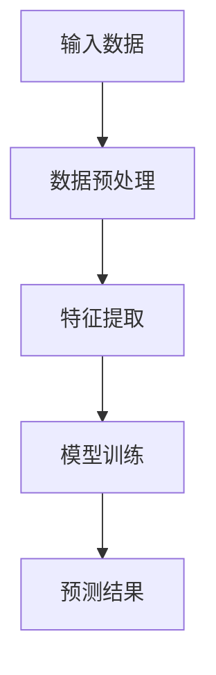
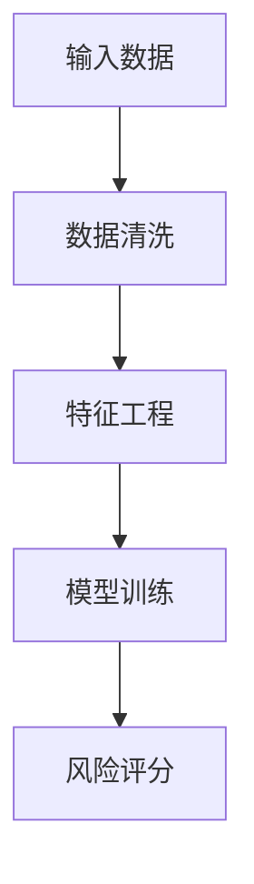
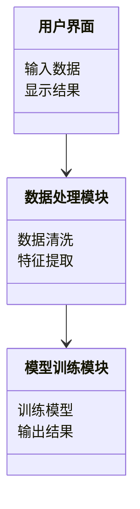
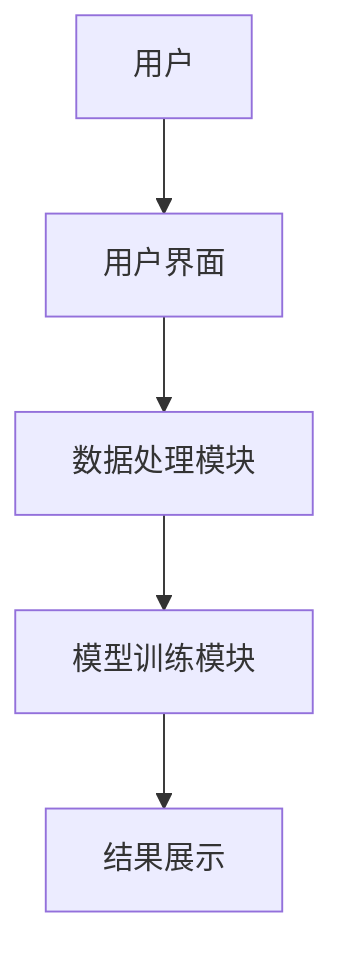

                 


# AI辅助企业并购估值：多维度协同效应量化与风险评估

## 关键词：
AI辅助、企业并购估值、协同效应、风险评估、多维度分析、机器学习、风险管理

## 摘要：
本文深入探讨了人工智能在企业并购估值中的应用，特别是多维度协同效应的量化与风险评估。通过结合企业并购的核心概念、AI技术的优势以及实际案例分析，本文系统地介绍了如何利用AI算法预测协同效应，评估并购风险，并优化并购决策。文章内容涵盖背景分析、算法原理、系统设计、项目实战等，为读者提供了全面的技术视角和实践指导。

---

# 第一部分: AI辅助企业并购估值的背景与核心概念

## 第1章: 企业并购估值的背景与挑战

### 1.1 企业并购的定义与重要性
#### 1.1.1 企业并购的基本概念
企业并购是指一家企业通过购买其他企业的股权或资产，以实现战略扩张、资源整合或市场扩展的一种商业行为。并购的核心目标在于实现协同效应，优化资源配置，提升整体竞争力。

#### 1.1.2 并购在企业发展中的作用
- **市场扩展**：通过并购进入新市场或细分领域。
- **资源整合**：整合上下游资源，优化供应链。
- **竞争优势**：通过并购获得技术、人才或品牌优势。
- **风险分散**：通过并购降低单一市场的风险。

#### 1.1.3 当前并购市场的特点与趋势
- **全球化**：跨国并购日益频繁。
- **技术驱动**：科技企业并购成为主流。
- **数字化**：数据驱动的并购决策越来越重要。

---

### 1.2 传统企业并购估值的局限性
#### 1.2.1 传统估值方法的优缺点
- **优点**：简单易懂，适用于标准化评估。
- **缺点**：难以量化协同效应，忽视潜在风险。

#### 1.2.2 并购协同效应的复杂性
协同效应是并购的核心价值来源，但其量化涉及多维度的分析，包括财务、战略和管理等方面。传统方法难以全面捕捉这些复杂因素。

#### 1.2.3 传统估值中的风险与不确定性
传统估值方法忽视了市场波动、政策变化等外部风险，导致估值结果的不准确性。

---

### 1.3 AI技术在企业并购中的应用潜力
#### 1.3.1 AI技术的核心优势
- **数据驱动**：AI能够处理海量数据，发现隐藏规律。
- **预测能力**：通过机器学习模型预测协同效应和风险。
- **动态调整**：AI能够实时更新模型，适应市场变化。

#### 1.3.2 AI在并购估值中的应用场景
- 协同效应预测
- 风险评估
- 估值优化

#### 1.3.3 AI辅助并购的未来展望
AI技术将进一步提升并购决策的精准性，成为企业并购的核心工具。

---

## 第2章: 协同效应的定义与量化方法

### 2.1 协同效应的定义与分类
#### 2.1.1 协同效应的定义
协同效应是指并购后企业之间的资源整合所产生的额外价值，通常表现为成本节约或收入增加。

#### 2.1.2 协同效应的类型
- **财务协同效应**：如成本节约、收入提升。
- **战略协同效应**：如市场扩展、技术共享。
- **管理协同效应**：如管理经验共享、组织优化。

---

### 2.2 协同效应的多维度分析
#### 2.2.1 财务协同效应
- **收入协同效应**：并购后收入的增加。
- **成本协同效应**：并购后成本的降低。

#### 2.2.2 战略协同效应
- **市场扩展**：并购后进入新市场。
- **技术共享**：并购后技术互补。

#### 2.2.3 管理协同效应
- **管理经验共享**：并购双方管理经验的互补。
- **组织优化**：并购后组织架构的优化。

---

### 2.3 协同效应的量化模型
#### 2.3.1 传统协同效应模型
传统模型通常基于财务指标（如EBITDA）进行估算，但缺乏动态调整能力。

#### 2.3.2 基于AI的协同效应量化模型
- **机器学习模型**：通过历史数据训练模型，预测协同效应。
- **神经网络模型**：深度学习模型能够捕捉非线性关系。

#### 2.3.3 模型的优缺点对比
| 模型类型 | 优点 | 缺点 |
|----------|------|------|
| 传统模型 | 简单易懂 | 静态，缺乏动态调整 |
| AI模型   | 高精度，动态调整 | 需大量数据，计算复杂 |

---

## 第3章: 风险评估与风险管理

### 3.1 并购中的主要风险类型
#### 3.1.1 市场风险
- **行业波动**：并购后行业环境变化。
- **政策风险**：政策调整对企业的影响。

#### 3.1.2 财务风险
- **整合成本**：并购后的整合成本超支。
- **财务杠杆**：并购后的财务负担加重。

#### 3.1.3 战略风险
- **战略协同失败**：并购后战略目标未实现。
- **管理风险**：并购后管理不善导致问题。

---

### 3.2 风险评估的方法与模型
#### 3.2.1 传统风险评估方法
- **情景分析法**：分析不同情景下的风险。
- **敏感性分析法**：分析关键变量对风险的影响。

#### 3.2.2 基于AI的风险评估模型
- **时间序列模型**：预测未来风险。
- **风险评分模型**：通过特征工程评分。

#### 3.2.3 风险评估模型的比较
| 方法类型 | 优点 | 缺点 |
|----------|------|------|
| 传统方法 | 易理解 | 静态，忽视复杂性 |
| AI模型   | 高精度 | 需大量数据，计算复杂 |

---

### 3.3 风险管理策略
#### 3.3.1 风险分散
- 通过多元化并购分散风险。
- 通过金融工具（如期权）对冲风险。

#### 3.3.2 风险监控
- **实时监控**：通过数据监控工具实时跟踪风险。
- **定期评估**：定期评估并购后的风险变化。

#### 3.3.3 风险应对
- **风险缓解**：通过优化整合降低风险。
- **风险接受**：接受部分风险，制定应对措施。

---

## 第4章: AI辅助企业并购估值的算法原理

### 4.1 协同效应预测模型
#### 4.1.1 算法原理
- **输入数据**：企业财务数据、市场数据。
- **模型训练**：使用历史数据训练机器学习模型。
- **预测结果**：输出协同效应的预测值。

#### 4.1.2 算法实现


#### 4.1.3 数学模型
$$ \text{协同效应} = \beta_0 + \beta_1x_1 + \beta_2x_2 + \cdots + \beta_nx_n $$

---

### 4.2 风险评估模型
#### 4.2.1 算法原理
- **输入数据**：企业内外部风险因素。
- **模型训练**：使用历史数据训练风险评分模型。
- **预测结果**：输出风险评分。

#### 4.2.2 算法实现


#### 4.2.3 数学模型
$$ \text{风险评分} = \alpha_0 + \alpha_1x_1 + \alpha_2x_2 + \cdots + \alpha_mx_m $$

---

## 第5章: 系统分析与架构设计

### 5.1 项目场景介绍
- **目标**：构建AI辅助企业并购估值系统。
- **用户**：企业并购决策者、财务分析师。
- **功能需求**：
  - 协同效应预测
  - 风险评估
  - 估值优化

### 5.2 系统功能设计


---

### 5.3 系统架构设计


---

## 第6章: 项目实战

### 6.1 环境安装
- **工具安装**：Python、TensorFlow、Pandas。
- **数据获取**：并购案例数据集。

### 6.2 核心代码实现
```python
import pandas as pd
import numpy as np
from sklearn.linear_model import LinearRegression

# 数据加载
data = pd.read_csv('并购数据.csv')

# 特征选择
features = ['收入', '利润', '市场份额']
target = '协同效应'

# 模型训练
model = LinearRegression()
model.fit(data[features], data[target])

# 预测结果
预测值 = model.predict(new_data[features])
```

### 6.3 案例分析
- **案例背景**：某企业并购案例。
- **数据准备**：收入、利润、市场份额等数据。
- **模型训练**：训练协同效应预测模型。
- **结果分析**：预测协同效应，优化并购决策。

### 6.4 项目小结
通过实际案例展示了AI辅助企业并购估值的可行性，验证了模型的有效性。

---

## 第7章: 结论与展望

### 7.1 最佳实践
- **数据质量**：确保数据的准确性和完整性。
- **模型选择**：根据实际需求选择合适的模型。
- **风险管理**：重视风险监控和应对策略。

### 7.2 小结
本文系统地介绍了AI辅助企业并购估值的核心概念、算法原理和系统设计，并通过实际案例验证了方法的有效性。

### 7.3 注意事项
- **数据隐私**：注意数据隐私和合规性。
- **模型解释性**：确保模型的可解释性。
- **持续优化**：根据市场变化持续优化模型。

### 7.4 拓展阅读
- 《机器学习在金融中的应用》
- 《企业并购与风险管理》

---

## 作者：AI天才研究院 & 禅与计算机程序设计艺术

