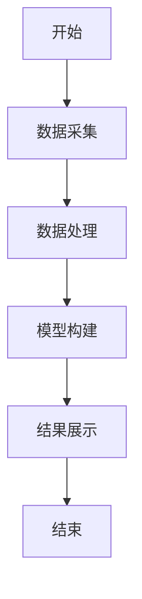
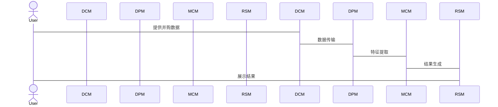

                 


# AI辅助企业并购决策：财务模型与协同效应分析

> 关键词：企业并购、人工智能、财务模型、协同效应、算法原理、系统设计、项目实战

> 摘要：本文探讨了人工智能在企业并购决策中的应用，重点分析了财务模型与协同效应的评估方法。通过详细讲解AI技术在并购决策中的核心作用，结合实际案例和系统设计，展示了如何利用AI技术优化企业并购过程，实现更高的协同效应和投资回报。

---

# 第一部分: AI辅助企业并购决策的背景与意义

## 第1章: 企业并购的定义与重要性

### 1.1 企业并购的基本概念
企业并购（Mergers and Acquisitions, M&A）是指一家企业与其他企业合并或收购其资产或股权的过程。并购是企业战略扩张的重要手段，能够快速获取市场资源、技术优势和人才团队。

### 1.2 并购在企业发展中的作用
- **市场扩展**：通过并购快速进入新市场或区域。
- **技术整合**：获取关键技术，提升企业竞争力。
- **成本优化**：通过规模效应降低运营成本。
- **风险管理**：并购可以帮助企业分散经营风险。

### 1.3 数字化时代并购决策的挑战
- 数据量庞大：传统方法难以处理海量数据。
- 数据复杂性：并购涉及财务、法律、市场等多方面数据，传统模型难以全面分析。
- 协同效应预测：如何准确预测并购后的协同效应是关键挑战。

---

## 第2章: AI在企业并购中的应用潜力

### 2.1 AI技术对企业并购的影响
AI技术可以通过大数据分析、机器学习等方法，帮助企业更好地识别并购机会，评估目标企业价值，预测并购后的协同效应。

### 2.2 数据驱动的并购决策优势
- 数据全面性：AI可以整合企业内外部数据，提供更全面的决策依据。
- 数据准确性：通过算法优化，提升数据预测的准确性。
- 数据实时性：AI可以实时监控市场动态，快速调整并购策略。

### 2.3 协同效应分析的AI辅助方法
- **协同效应定义**：协同效应是指并购后企业通过资源整合实现的成本节约或收入增加。
- **协同效应分类**：
  - 财务协同效应：如成本节约、收入增长。
  - 战略协同效应：如市场扩展、技术互补。
  - 运营协同效应：如生产效率提升、供应链优化。

---

# 第二部分: AI辅助并购决策的核心概念与模型

## 第3章: 协同效应分析的核心要素

### 3.1 协同效应的数学定义
$$协同效应 = \frac{A + B - (A \times B)}{A + B}$$

其中，A和B分别是并购双方的协同效应贡献率。

### 3.2 财务模型与协同效应的关系
- **财务模型**：用于评估并购后的财务表现，包括收入、成本、利润等。
- **协同效应分析**：是财务模型的重要组成部分，直接影响并购的决策。

### 3.3 协同效应分析的流程
1. **数据收集**：收集并购双方的财务数据、市场数据等。
2. **数据预处理**：清洗数据，提取特征。
3. **模型构建**：建立协同效应分析的数学模型。
4. **模型验证**：通过实际数据验证模型的准确性。
5. **结果分析**：根据模型结果制定并购策略。

---

## 第4章: AI算法在协同效应分析中的应用

### 4.1 机器学习算法简介
- **监督学习**：用于预测协同效应。
- **无监督学习**：用于发现数据中的潜在模式。
- **深度学习**：用于复杂数据的特征提取。

### 4.2 算法选择与优化
- **算法选择**：根据数据特征选择合适的算法。
- **参数优化**：通过交叉验证优化模型参数。
- **模型评估**：通过准确率、召回率等指标评估模型性能。

### 4.3 协同效应分析的算法实现
```python
import pandas as pd
from sklearn.model_selection import train_test_split
from sklearn.linear_model import LinearRegression

# 数据加载
data = pd.read_csv('merger_data.csv')

# 特征提取
X = data[['revenue', 'cost', 'profit']]
y = data['synergy']

# 数据分割
X_train, X_test, y_train, y_test = train_test_split(X, y, test_size=0.2, random_state=42)

# 模型训练
model = LinearRegression()
model.fit(X_train, y_train)

# 模型预测
y_pred = model.predict(X_test)

# 模型评估
print('Coefficient of determination (R²):', model.score(X_test, y_test))
```

---

# 第三部分: 协同效应分析的系统设计与实现

## 第5章: 系统设计与架构实现

### 5.1 系统功能模块设计
- **数据采集模块**：负责收集企业并购相关的数据。
- **数据处理模块**：对数据进行清洗、转换和特征提取。
- **模型构建模块**：建立协同效应分析的数学模型。
- **结果展示模块**：将分析结果以可视化形式展示。

### 5.2 系统架构设计


### 5.3 系统交互设计


---

## 第6章: 项目实战与案例分析

### 6.1 环境安装
- **Python环境**：建议使用Anaconda。
- **依赖库安装**：`pip install pandas scikit-learn matplotlib`

### 6.2 核心代码实现
```python
import pandas as pd
import numpy as np
from sklearn.metrics import mean_squared_error
from sklearn.model_selection import train_test_split

# 数据加载
data = pd.read_csv('merger_data.csv')

# 特征选择
X = data[['revenue', 'cost', 'profit']]
y = data['synergy']

# 数据分割
X_train, X_test, y_train, y_test = train_test_split(X, y, test_size=0.2, random_state=42)

# 模型训练
model = LinearRegression()
model.fit(X_train, y_train)

# 预测与评估
y_pred = model.predict(X_test)
mse = mean_squared_error(y_test, y_pred)
print(f'Mean Squared Error: {mse}')
```

### 6.3 案例分析
假设我们有两个企业A和B，A的收入为1000万元，成本为600万元，利润为400万元；B的收入为800万元，成本为500万元，利润为300万元。预测并购后的协同效应：

```python
# 输入数据
new_data = pd.DataFrame({'revenue': [1000], 'cost': [600], 'profit': [400]})

# 预测协同效应
synergy_pred = model.predict(new_data)
print(f'预测的协同效应：{synergy_pred[0]:.2f}')
```

---

## 第7章: 最佳实践与小结

### 7.1 最佳实践
- **数据质量**：确保数据的准确性和完整性。
- **模型选择**：根据实际情况选择合适的算法。
- **结果验证**：通过实际数据验证模型的准确性。

### 7.2 小结
本文详细探讨了AI在企业并购决策中的应用，重点分析了协同效应的评估方法。通过实际案例和系统设计，展示了如何利用AI技术优化企业并购过程，实现更高的协同效应和投资回报。

---

# 作者：AI天才研究院 & 禅与计算机程序设计艺术

