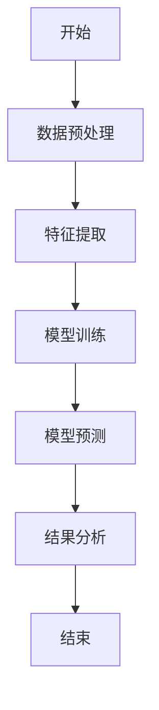

                 


# AI辅助企业并购协同效应分析与实现

## 关键词：
- 企业并购
- 人工智能
- 协同效应
- 算法实现
- 系统架构

## 摘要：
本文探讨了人工智能技术在企业并购协同效应分析中的应用。从企业并购的基本概念出发，详细分析了协同效应的类型和计算方法，并结合AI技术，介绍了协同效应分析的核心算法和系统架构。通过实际案例的分析和系统实现，展示了AI在企业并购中的强大能力。本文适合企业并购分析人员、AI工程师以及对AI技术感兴趣的读者阅读。

---

## 第1章: 企业并购与AI技术概述

### 1.1 企业并购的基本概念
#### 1.1.1 企业并购的定义与类型
企业并购（Mergers and Acquisitions, M&A）是指两个或多个企业之间合并或收购资产或股权的行为。常见的并购类型包括：
1. **横向并购**：同一行业内的企业合并，以扩大市场份额。
2. **纵向并购**：产业链上下游的企业合并，以增强垂直整合能力。
3. **混合并购**：无直接关联的企业合并，通常出于多元化发展的目的。

#### 1.1.2 并购的动机与目的
企业进行并购的主要动机包括：
1. **市场扩张**：通过并购进入新市场或扩大市场份额。
2. **资源获取**：获取关键技术、人才或原材料。
3. **成本协同**：通过规模经济降低运营成本。
4. **战略防御**：通过并购阻止竞争对手的扩张。

#### 1.1.3 并购的流程与挑战
并购流程通常包括以下几个阶段：
1. **战略规划**：确定并购目标和动机。
2. **目标筛选**：识别潜在的并购目标。
3. **尽职调查**：评估目标企业的财务、法律和运营状况。
4. **估值与谈判**：确定目标企业价值，进行谈判并签署协议。
5. **整合与实施**：完成并购后的业务整合。

挑战包括信息不对称、文化冲突、监管障碍等。

---

### 1.2 AI技术在企业并购中的作用
#### 1.2.1 AI技术的基本概念
人工智能（AI）通过模拟人类智能，利用机器学习、自然语言处理和计算机视觉等技术，帮助企业和组织做出更明智的决策。

#### 1.2.2 AI在企业并购中的应用场景
1. **目标筛选**：利用AI分析海量数据，筛选出符合并购条件的企业。
2. **尽职调查**：通过自然语言处理和大数据分析，评估目标企业的风险和价值。
3. **协同效应预测**：使用机器学习模型预测并购后的协同效应。

#### 1.2.3 AI技术对企业并购效率的提升
AI技术可以显著提高并购的效率和准确性，减少人为错误，并降低并购成本。

---

### 1.3 协同效应的定义与重要性
#### 1.3.1 协同效应的定义
协同效应是指并购后，企业通过资源整合和优化，实现1+1>2的效果。

#### 1.3.2 协同效应的类型
1. **成本协同**：通过规模经济降低运营成本。
2. **收入协同**：通过市场扩展和产品组合增加收入。
3. **技术协同**：通过技术共享和研发合作提升创新能力。

#### 1.3.3 协同效应对企业价值的影响
协同效应可以显著提升企业价值，是并购成功的重要因素。

---

## 第2章: 企业并购协同效应的分析方法

### 2.1 协同效应的定性分析
#### 2.1.1 企业战略协同分析
分析并购后的战略一致性，包括市场定位、业务模式等。

#### 2.1.2 企业文化协同分析
评估双方企业文化是否兼容，以减少整合风险。

#### 2.1.3 资源协同分析
分析双方资源的互补性，包括技术、人力资源等。

---

### 2.2 协同效应的定量分析
#### 2.2.1 协同效应指数的计算
协同效应指数（Synergy Index）可以通过以下公式计算：
$$ \text{协同效应指数} = \frac{\text{并购后价值} - \text{并购前双方价值之和}}{\text{并购前双方价值之和}} $$

#### 2.2.2 并购协同效应的财务模型
常用的财务模型包括：
1. **加成法**：基于协同效应的具体表现形式进行加成计算。
2. **净现值法**：评估协同效应的净现值（NPV）。

#### 2.2.3 协同效应的评估方法
1. **财务指标法**：通过ROE、净利润等财务指标评估协同效应。
2. **市场法**：通过市场估值变化评估协同效应。

---

## 第3章: AI辅助协同效应分析的核心概念

### 3.1 协同效应分析的AI模型
#### 3.1.1 基于机器学习的协同效应预测
使用回归分析预测协同效应的可能性。

#### 3.1.2 基于自然语言处理的文本分析
通过NLP技术分析企业财报和新闻，提取协同效应的相关信息。

#### 3.1.3 基于图论的网络分析
构建企业网络图，分析企业之间的关联性和协同效应。

---

### 3.2 协同效应分析的AI算法
#### 3.2.1 回归分析
回归分析是一种预测协同效应的常用方法，公式如下：
$$ y = \beta_0 + \beta_1 x_1 + \beta_2 x_2 + \cdots + \beta_n x_n + \epsilon $$

#### 3.2.2 聚类分析
通过聚类分析将企业分为不同的类别，评估协同效应的可能性。

#### 3.2.3 神经网络模型
使用深度学习模型（如LSTM）预测协同效应。

---

## 第4章: 协同效应分析的数学模型与算法实现

### 4.1 协同效应分析的数学模型
#### 4.1.1 协同效应指数的数学表达式
$$ \text{协同效应指数} = \frac{\text{协同效应价值}}{\text{并购前双方价值之和}} $$

#### 4.1.2 并购协同效应的回归模型
回归模型用于预测协同效应，公式如下：
$$ \text{协同效应} = \beta_0 + \beta_1 x_1 + \beta_2 x_2 + \epsilon $$

#### 4.1.3 协同效应的聚类分析模型
聚类分析用于将企业分为不同的类别，以评估协同效应。

---

### 4.2 协同效应分析的算法实现
#### 4.2.1 算法流程图


#### 4.2.2 Python代码实现
```python
import pandas as pd
from sklearn.linear_model import LinearRegression

# 数据预处理
data = pd.read_csv('并购数据.csv')
X = data[['收入', '成本', '利润']]
y = data['协同效应']

# 模型训练
model = LinearRegression()
model.fit(X, y)

# 模型预测
y_pred = model.predict(X)
print('预测协同效应:', y_pred)
```

---

## 第5章: 系统架构与设计

### 5.1 系统功能设计
#### 5.1.1 数据采集模块
负责采集企业并购的相关数据，包括财务数据和市场数据。

#### 5.1.2 协同效应分析模块
对数据进行处理和分析，预测协同效应。

#### 5.1.3 可视化展示模块
将分析结果以图表形式展示，便于用户理解。

---

### 5.2 系统架构设计
#### 5.2.1 系统架构图


#### 5.2.2 数据流图


---

## 第6章: 项目实战与应用案例

### 6.1 项目实战
#### 6.1.1 环境安装
安装Python和相关库（如Pandas、Scikit-learn）。

#### 6.1.2 核心代码实现
```python
import pandas as pd
from sklearn.metrics import mean_squared_error

# 数据加载
data = pd.read_csv('并购数据.csv')

# 特征选择
X = data[['收入', '成本']]
y = data['协同效应']

# 模型训练与评估
model = LinearRegression()
model.fit(X, y)
y_pred = model.predict(X)
print('均方误差:', mean_squared_error(y, y_pred))
```

#### 6.1.3 案例分析
分析一个实际的企业并购案例，评估协同效应。

---

## 第7章: 最佳实践与总结

### 7.1 小结
本文详细介绍了AI技术在企业并购协同效应分析中的应用，通过理论分析和实际案例，展示了AI技术的强大能力。

### 7.2 注意事项
在实际应用中，需注意数据质量和模型的可解释性。

### 7.3 拓展阅读
建议读者进一步阅读相关领域的书籍和论文。

---

## 作者：AI天才研究院 & 禅与计算机程序设计艺术

---

通过以上内容，读者可以全面了解AI在企业并购协同效应分析中的应用，并掌握相关的算法和系统设计方法。

