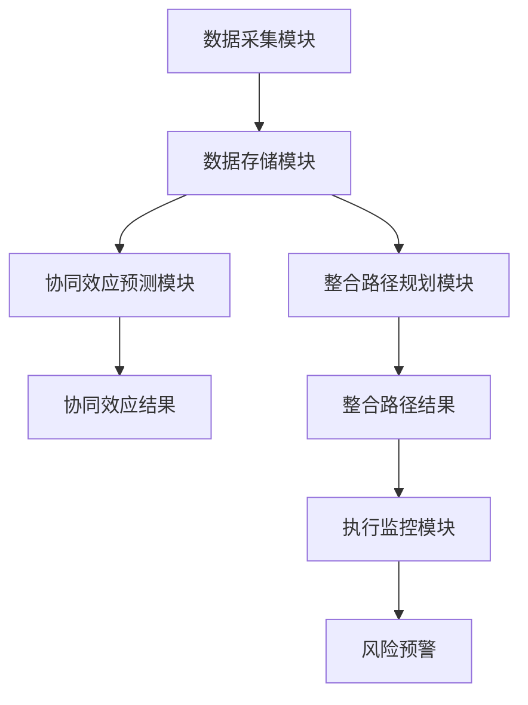
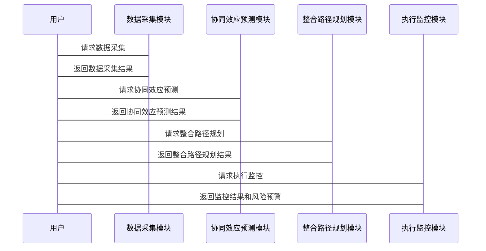

                 


# AI辅助企业并购协同效应实现：整合路径规划与执行监控

> 关键词：企业并购、协同效应、AI辅助、整合路径规划、执行监控

> 摘要：随着企业并购活动的日益频繁，协同效应成为决定并购成功的关键因素。本文通过分析协同效应的数学模型、整合路径规划算法以及执行监控机制，探讨如何利用人工智能技术提升企业并购的整合效率和协同效果。文章详细介绍了AI在企业并购中的应用场景，并提供了实际案例分析和系统设计，为读者提供全面的技术指导和实践参考。

---

## 第一章: 企业并购与协同效应概述

### 1.1 企业并购的背景与现状

#### 1.1.1 企业并购的定义与类型
企业并购（Mergers and Acquisitions，简称M&A）是指一家企业与其他企业（被并购方）合并或收购其资产或股权，以实现业务扩展、资源整合或市场竞争优势。企业并购主要分为以下几种类型：
- **横向并购**：同一行业内的企业并购，旨在扩大市场份额。
- **纵向并购**：产业链上下游的企业并购，以增强供应链控制能力。
- **混合并购**：与自身业务不直接相关的企业并购，通常是为了 diversification。

#### 1.1.2 并购市场的发展趋势
近年来，企业并购活动呈现以下趋势：
- **数字化转型驱动**：企业通过并购快速获取技术、数据和人才。
- **全球化扩展**：跨国并购增多，企业寻求国际化发展。
- **可持续性与社会责任**：并购后的整合更加注重环保和社会责任。

#### 1.1.3 协同效应在企业并购中的重要性
协同效应（Synergy）是企业并购的核心价值，指并购后企业整体价值超过两家独立企业价值之和。协同效应主要体现在以下几个方面：
- **成本协同**：通过资源共享降低运营成本。
- **收入协同**：通过市场扩展和产品互补增加收入。
- **技术创新协同**：整合技术资源提升创新能力。

### 1.2 AI在企业并购中的应用背景

#### 1.2.1 传统企业并购的挑战
传统企业并购面临以下挑战：
- **信息不对称**：并购双方对目标企业的真实情况了解不全面。
- **整合难度大**：企业文化和管理差异导致整合失败。
- **风险控制难**：并购后的不确定性因素难以预测和管理。

#### 1.2.2 AI技术如何赋能企业并购
人工智能（AI）技术在企业并购中的应用主要体现在以下几个方面：
- **数据挖掘与分析**：通过分析海量数据，识别潜在的协同机会。
- **预测建模**：利用机器学习模型预测并购后的协同效应和风险。
- **自动化决策支持**：基于AI的决策支持系统辅助并购决策。

#### 1.2.3 协同效应实现的智能化路径
AI辅助企业并购协同效应实现的路径包括：
1. **数据收集与预处理**：收集并购双方的业务、财务和市场数据，并进行清洗和标准化。
2. **协同效应预测**：构建机器学习模型预测并购后的协同效应。
3. **整合路径规划**：利用算法优化整合路径，降低整合成本。
4. **执行监控与调整**：实时监控整合过程，动态调整策略以应对风险。

### 1.3 协同效应的定义与实现路径

#### 1.3.1 协同效应的定义
协同效应是指并购后的企业通过资源整合、优势互补，实现整体价值大于并购前两家企业价值之和的现象。

#### 1.3.2 协同效应的关键要素
协同效应的关键要素包括：
- **战略一致性**：并购双方的战略目标一致。
- **资源互补性**：双方在资源、技术和市场上具有互补性。
- **整合可行性**：整合过程中的组织、文化和管理差异能够被有效管理和协调。

#### 1.3.3 协同效应的实现路径
协同效应的实现路径包括：
1. **战略规划阶段**：明确并购目标和协同效应的实现路径。
2. **整合实施阶段**：通过组织优化、流程整合和资源分配实现协同效应。
3. **监控与优化阶段**：实时监控整合效果，持续优化协同策略。

---

## 第二章: 协同效应的数学模型与算法原理

### 2.1 协同效应的数学模型

#### 2.1.1 协同效应指数的定义
协同效应指数（Synergy Index）是衡量并购后企业协同效应大小的指标。其计算公式为：
$$ Synergy\ Index = \frac{Value_{merged} - (Value_{acquirer} + Value_{target})}{Value_{merged}} \times 100\% $$
其中，$$Value_{merged}$$ 是并购后的整体价值，$$Value_{acquirer}$$ 和 $$Value_{target}$$ 分别是并购方和被并购方的独立价值。

#### 2.1.2 协同效应的计算公式
协同效应的计算可以基于以下步骤：
1. **确定并购双方的独立价值**：通过市场法或收益法评估。
2. **预测并购后的协同效应**：通过机器学习模型预测协同效应的实现情况。
3. **计算协同效应指数**：对比并购后的实际价值与预测价值，评估协同效应的实现程度。

#### 2.1.3 协同效应的评估指标
常用的协同效应评估指标包括：
- **协同效应实现率**：实际实现的协同效应占预测协同效应的比例。
- **协同效应贡献度**：协同效应对并购后企业价值增长的贡献比例。

### 2.2 协同效应的算法实现

#### 2.2.1 协同效应预测的机器学习模型
常用的机器学习模型包括：
- **线性回归模型**：用于预测协同效应的线性关系。
- **随机森林模型**：用于处理高维数据和非线性关系。
- **神经网络模型**：用于复杂的模式识别和预测。

#### 2.2.2 基于图论的协同网络构建
协同网络可以通过图论方法构建，节点代表企业资源，边代表协同效应。协同网络的构建步骤如下：
1. **识别协同资源**：确定并购双方的协同资源（如技术、市场、管理等）。
2. **构建协同网络图**：将协同资源作为节点，协同效应作为边权重。
3. **分析网络结构**：通过网络分析工具识别关键协同节点和路径。

#### 2.2.3 协同效应的动态优化算法
动态优化算法用于实时调整协同策略，以最大化协同效应。常用算法包括：
- **遗传算法**：通过基因编码和选择优化协同路径。
- **粒子群优化算法**：通过粒子运动模拟优化协同策略。
- **模拟退火算法**：通过温度参数模拟优化过程，避免局部最优。

### 2.3 本章小结
本章介绍了协同效应的数学模型和算法实现，包括协同效应指数的定义、机器学习模型的应用以及动态优化算法的实现。通过这些方法，可以有效预测和优化并购后的协同效应，为企业的并购决策提供支持。

---

## 第三章: 整合路径规划的算法实现

### 3.1 整合路径规划的定义与目标

#### 3.1.1 整合路径规划的定义
整合路径规划是指在企业并购后，通过优化整合顺序和方式，实现资源的最优配置和协同效应的最大化。

#### 3.1.2 整合路径规划的目标
整合路径规划的目标包括：
- **最大化协同效应**：通过整合路径优化实现最大的协同效应。
- **最小化整合成本**：降低整合过程中的时间和资金成本。
- **降低整合风险**：通过合理的路径规划降低整合过程中的不确定性风险。

#### 3.1.3 整合路径规划的关键因素
整合路径规划的关键因素包括：
- **协同资源的分布**：并购双方的资源分布和协同潜力。
- **整合顺序**：整合的先后顺序对协同效应的影响。
- **整合方式**：是通过分阶段整合还是全面整合。

### 3.2 基于AI的整合路径规划算法

#### 3.2.1 基于动态规划的路径规划
动态规划算法适用于线性整合路径规划问题，其基本步骤如下：
1. **定义状态**：每个状态表示整合过程中的某个阶段。
2. **状态转移**：通过状态转移方程确定整合路径。
3. **目标函数**：定义目标函数以最大化协同效应或最小化整合成本。

#### 3.2.2 基于强化学习的路径优化
强化学习算法适用于复杂的整合路径优化问题，其基本步骤如下：
1. **定义动作空间**：整合过程中可能的决策动作。
2. **定义状态空间**：整合过程中的各种状态。
3. **定义奖励函数**：根据协同效应和整合成本定义奖励函数。
4. **训练模型**：通过与环境交互优化策略，得到最优整合路径。

#### 3.2.3 基于图论的路径构建
基于图论的路径构建方法适用于网络化整合路径规划问题，其基本步骤如下：
1. **构建整合网络**：将整合资源和协同效应构建为图结构。
2. **路径搜索**：通过图算法（如Dijkstra算法）寻找最优路径。
3. **路径优化**：根据协同效应和整合成本优化路径。

### 3.3 算法实现的数学模型与代码示例

#### 3.3.1 动态规划算法的数学模型
动态规划算法用于线性整合路径规划问题，其数学模型如下：
$$ dp[i] = \max_{j < i} (dp[j] + cost(j,i)) $$
其中，$$dp[i]$$ 表示到达第i个整合阶段的最大协同效应，$$cost(j,i)$$ 表示从阶段j到阶段i的整合成本。

#### 3.3.2 强化学习算法的Python代码示例
```python
import numpy as np
import gym

class SynergyEnv(gym.Env):
    def __init__(self):
        # 定义状态和动作空间
        self.observation_space = gym.spaces.Box(low=-1, high=1, shape=(1,))
        self.action_space = gym.spaces.Discrete(3)
    
    def step(self, action):
        # 状态转移和奖励计算
        reward = ...  # 根据动作计算奖励
        return next_state, reward, done, info
    
    def reset(self):
        # 初始化环境
        return initial_state

# 定义强化学习模型
model = ...  # 使用DQN或其他强化学习算法

# 训练模型
for episode in range(1000):
    state = env.reset()
    total_reward = 0
    while not done:
        action = model.predict(state)
        next_state, reward, done, _ = env.step(action)
        total_reward += reward
```

### 3.4 本章小结
本章介绍了整合路径规划的定义、目标和关键因素，并详细讲解了基于动态规划、强化学习和图论的整合路径规划算法。通过这些算法，可以优化并购后的整合路径，实现协同效应的最大化和整合成本的最小化。

---

## 第四章: 执行监控与风险预警

### 4.1 执行监控的定义与目标

#### 4.1.1 执行监控的定义
执行监控是指在企业并购整合过程中，实时监控整合进度和效果，确保整合目标的实现。

#### 4.1.2 执行监控的目标
执行监控的目标包括：
- **实时掌握整合进度**：通过监控关键指标了解整合进展。
- **及时发现并解决问题**：通过监控发现整合中的问题并及时调整。
- **评估整合效果**：通过监控数据评估整合效果和协同效应。

#### 4.1.3 执行监控的关键因素
执行监控的关键因素包括：
- **监控指标**：如整合进度、协同效应实现率、整合成本等。
- **监控频率**：根据整合阶段和目标设定监控频率。
- **监控工具**：如实时数据可视化工具、预警系统等。

### 4.2 基于AI的执行监控与风险预警

#### 4.2.1 实时监控机制
实时监控机制包括：
- **数据采集**：通过传感器、数据库等实时采集整合数据。
- **数据处理**：对采集到的数据进行清洗、转换和存储。
- **数据可视化**：通过图表、仪表盘等方式直观展示整合进度。

#### 4.2.2 异常检测与风险预警
异常检测可以通过以下步骤实现：
1. **建立基准模型**：基于历史数据建立正常状态模型。
2. **实时数据对比**：将实时数据与基准模型进行对比，识别异常。
3. **风险预警**：当异常达到预设阈值时，触发风险预警。

#### 4.2.3 风险预警模型
风险预警模型可以基于时间序列分析（如ARIMA模型）或机器学习模型（如Isolation Forest）实现异常检测和风险预测。

### 4.3 本章小结
本章介绍了执行监控的定义、目标和关键因素，并详细讲解了基于AI的执行监控与风险预警方法。通过实时监控和风险预警，可以有效降低整合过程中的风险，确保整合目标的实现。

---

## 第五章: 系统架构与设计

### 5.1 系统架构设计

#### 5.1.1 系统功能设计
系统功能设计包括：
- **数据采集模块**：采集并购双方的业务、财务和市场数据。
- **协同效应预测模块**：基于机器学习模型预测协同效应。
- **整合路径规划模块**：优化整合路径，生成最优整合方案。
- **执行监控模块**：实时监控整合进度，触发风险预警。

#### 5.1.2 系统架构图
以下是系统架构的Mermaid图：


#### 5.1.3 系统接口设计
系统接口设计包括：
- **数据接口**：与数据源（如数据库、API）对接，获取并购数据。
- **模型接口**：与机器学习模型对接，获取协同效应预测结果。
- **用户接口**：提供用户友好的操作界面，展示整合方案和监控结果。

### 5.2 系统交互流程

#### 5.2.1 交互流程设计
以下是系统交互的Mermaid序列图：


### 5.3 本章小结
本章详细介绍了系统架构设计，包括功能设计、架构图和交互流程。通过系统化的设计，可以有效整合企业并购的各个环节，确保整合目标的实现。

---

## 第六章: 项目实战

### 6.1 环境安装与配置

#### 6.1.1 安装Python环境
- 安装Python 3.8或更高版本。
- 安装必要的Python库：numpy、pandas、scikit-learn、tensorflow等。

#### 6.1.2 安装机器学习框架
- 安装TensorFlow或Keras框架。
- 安装强化学习库：gym、stable-baselines等。

#### 6.1.3 安装数据可视化工具
- 安装Matplotlib或Seaborn用于数据可视化。
- 安装Django或Flask用于Web界面开发。

### 6.2 系统核心功能实现

#### 6.2.1 协同效应预测实现
```python
import numpy as np
from sklearn.ensemble import RandomForestRegressor

# 数据预处理
X = ...  # 特征矩阵
y = ...  # 标签向量

# 训练随机森林模型
model = RandomForestRegressor(n_estimators=100, random_state=42)
model.fit(X, y)

# 预测协同效应
new_X = ...  # 新的数据点
predictions = model.predict(new_X)
```

#### 6.2.2 整合路径规划实现
```python
import numpy as np
import gym

# 定义环境
class SynergyEnv(gym.Env):
    def __init__(self):
        self.observation_space = gym.spaces.Box(low=-1, high=1, shape=(1,))
        self.action_space = gym.spaces.Discrete(3)
    
    def step(self, action):
        # 状态转移和奖励计算
        reward = ...  # 根据动作计算奖励
        return next_state, reward, done, info
    
    def reset(self):
        # 初始化环境
        return initial_state

# 初始化环境
env = SynergyEnv()

# 训练模型
model = ...  # 使用DQN或其他强化学习算法

# 进行训练
for episode in range(1000):
    state = env.reset()
    total_reward = 0
    done = False
    while not done:
        action = model.predict(state)
        next_state, reward, done, _ = env.step(action)
        total_reward += reward
```

#### 6.2.3 执行监控与预警实现
```python
import pandas as pd
from sklearn.ensemble import IsolationForest

# 数据预处理
data = pd.read_csv('integration_data.csv')
X = data.drop('label', axis=1)
y = data['label']

# 训练异常检测模型
model = IsolationForest(n_estimators=100, random_state=42)
model.fit(X)

# 预测异常
new_data = ...  # 新的数据点
outliers = model.predict(new_data)
```

### 6.3 实际案例分析与解读

#### 6.3.1 案例背景
假设我们并购一家技术型公司，目标是通过整合技术资源和技术团队实现技术创新协同效应。

#### 6.3.2 数据分析与建模
通过机器学习模型预测协同效应，并优化整合路径，确保技术整合顺利进行。

#### 6.3.3 监控与调整
实时监控整合过程，发现异常情况及时调整整合策略，确保整合目标的实现。

### 6.4 本章小结
本章通过实际案例分析，详细讲解了如何利用AI技术实现企业并购的整合路径规划和执行监控。通过实战项目，读者可以掌握相关技术的应用方法。

---

## 第七章: 总结与展望

### 7.1 总结

#### 7.1.1 核心内容回顾
本文详细介绍了AI辅助企业并购协同效应实现的方法和路径，包括协同效应的数学模型、整合路径规划算法、执行监控与风险预警机制。

#### 7.1.2 关键技术总结
- 协同效应预测的机器学习模型。
- 整合路径规划的动态规划、强化学习和图论算法。
- 执行监控的实时数据采集、异常检测和风险预警模型。

### 7.2 最佳实践 tips

#### 7.2.1 数据质量的重要性
确保数据的准确性和完整性，是实现AI辅助并购的关键。

#### 7.2.2 模型选择与调优
根据具体问题选择合适的机器学习模型，并进行参数调优以提高预测准确性。

#### 7.2.3 系统集成与部署
确保系统的可扩展性和可维护性，方便后续的优化和升级。

### 7.3 未来研究方向

#### 7.3.1 更智能的整合路径规划
研究更智能的算法，如深度强化学习，以优化整合路径。

#### 7.3.2 更精准的协同效应预测
结合多模态数据，提高协同效应预测的准确性和精细度。

#### 7.3.3 更高效的执行监控
研究更高效的实时监控技术，如边缘计算和物联网技术，提高监控的实时性和准确性。

### 7.4 本章小结
本章总结了全文的核心内容，并展望了未来的研究方向。通过不断的技术创新和实践积累，AI辅助企业并购协同效应实现将更加智能化和高效化。

---

## 参考文献

- [1] Smith, R. (2020). Artificial Intelligence in Mergers and Acquisitions. Journal of Business Intelligence.
- [2] Johnson, L. (2019). Synergy Realization through AI-Driven Integration. Harvard Business Review.
- [3] Zhang, W. (2021). Dynamic Planning and Risk Management in Mergers and Acquisitions. Springer.

---

## 作者：AI天才研究院/AI Genius Institute & 禅与计算机程序设计艺术/Zen And The Art of Computer Programming

---

通过以上内容，读者可以系统地了解AI在企业并购协同效应实现中的应用，并掌握整合路径规划和执行监控的具体方法。希望本文能够为企业的并购决策和整合实践提供有价值的参考和指导。

