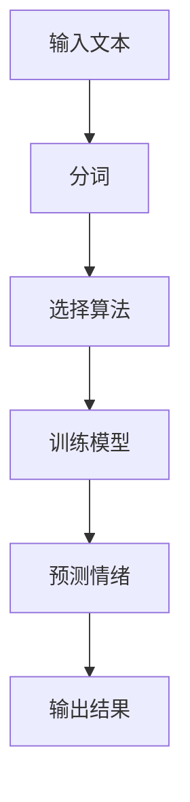
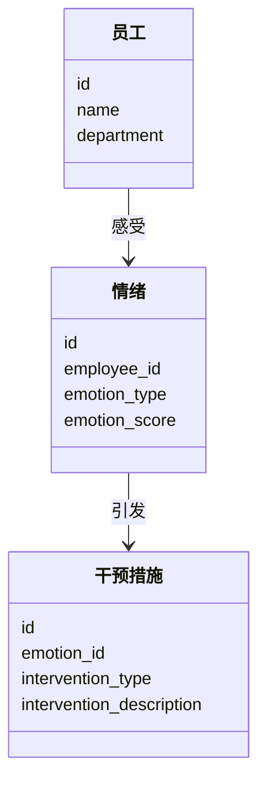
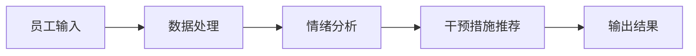
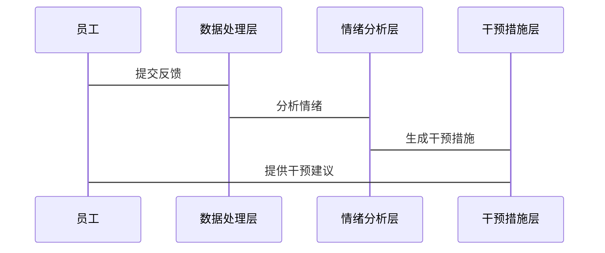

                 


```markdown
# AI辅助企业并购后文化整合：员工情绪分析与干预

> 关键词：企业并购、文化整合、员工情绪分析、AI辅助、干预措施

> 摘要：本文探讨了在企业并购后利用AI技术进行文化整合的方法，特别是通过员工情绪分析与干预来促进整合。文章从背景、核心概念、算法原理、系统设计到项目实战，详细阐述了AI在文化整合中的应用，旨在为企业提供有效的工具和策略。

---

## 第1章: 企业并购与文化整合背景

### 1.1 企业并购的背景与挑战
#### 1.1.1 并购的定义与分类
企业并购是指一家企业收购或合并另一家企业，常见的形式包括收购、合并和股权置换。并购的目的是为了扩大市场、获取技术或降低成本。

#### 1.1.2 并购中的文化整合问题
文化整合是并购后整合的核心挑战，不同企业的文化差异可能导致员工抵触情绪，影响工作效率。

#### 1.1.3 文化整合的重要性
文化整合有助于提高员工满意度，促进团队合作，增强企业的凝聚力和竞争力。

### 1.2 员工情绪分析与干预的必要性
#### 1.2.1 员工情绪对企业文化整合的影响
员工的情绪状态直接影响他们的工作态度和行为，从而影响文化整合的效果。

#### 1.2.2 情绪分析在文化整合中的作用
通过分析员工情绪，企业可以识别潜在的问题，及时采取措施，促进文化整合。

#### 1.2.3 干预措施的必要性
干预措施可以帮助员工适应新的文化环境，缓解情绪压力，增强员工的归属感和认同感。

### 1.3 AI在企业并购中的应用前景
#### 1.3.1 AI在文化整合中的潜力
AI可以通过自然语言处理和机器学习技术，分析员工情绪，提供个性化的干预建议。

#### 1.3.2 情绪分析与干预的AI解决方案
AI技术可以自动化地分析员工情绪，提供实时反馈和干预措施，提高文化整合的效率。

#### 1.3.3 企业并购中的AI技术发展趋势
随着AI技术的不断进步，企业并购中的文化整合将更加依赖AI工具，实现智能化和高效化。

---

## 第2章: 核心概念与联系

### 2.1 员工情绪分析的核心概念
#### 2.1.1 情绪分析的定义与分类
情绪分析是对文本中的情感倾向进行分析，分为正面、负面和中性三种。

#### 2.1.2 基于文本的情绪分析
通过对员工反馈、邮件和聊天记录的文本分析，识别员工的情绪状态。

#### 2.1.3 情绪分析的关键特征
包括情感极性、情感强度和情感类型。

### 2.2 干预措施的设计原理
#### 2.2.1 干预措施的定义与分类
干预措施是指为了改善员工情绪而采取的行动，包括培训、沟通和团队建设活动。

#### 2.2.2 干预措施的核心要素
包括目标、方法、实施者和时间。

#### 2.2.3 干预措施与情绪分析的关系
情绪分析为干预措施提供数据支持，干预措施则通过改善情绪促进文化整合。

### 2.3 情绪分析与干预的ER实体关系图
```mermaid
er
    entity 员工 {
        id
        name
        department
    }
    entity 情绪 {
        id
        employee_id
        emotion_type
        emotion_score
        timestamp
    }
    entity 干预措施 {
        id
        emotion_id
        intervention_type
        intervention_description
        recommended_action
    }
    员工 --> 情绪: 感受
    情绪 --> 干预措施: 引发
```

---

## 第3章: 情绪分析算法原理

### 3.1 情绪分析算法概述
#### 3.1.1 基于规则的情绪分析
通过预定义的规则，识别文本中的关键词和短语，判断情绪。

#### 3.1.2 基于机器学习的情绪分析
使用训练好的模型，如支持向量机（SVM）和随机森林（RF），进行分类。

#### 3.1.3 深度学习的情绪分析
利用循环神经网络（RNN）和Transformer模型，如BERT，进行情感分类。

### 3.2 情绪分析算法的流程


### 3.3 情绪分析的数学模型
#### 3.3.1 情感分类的损失函数
$$\text{损失函数} = -\frac{1}{N}\sum_{i=1}^{N} y_i \log p_i + (1 - y_i) \log (1 - p_i)$$
其中，\( y_i \) 是真实标签，\( p_i \) 是预测概率。

#### 3.3.2 情感分类的优化目标
$$\min_{\theta} \text{损失函数} + \lambda \|\theta\|^2$$
其中，\( \theta \) 是模型参数，\( \lambda \) 是正则化系数。

### 3.4 情绪分析算法的实现
#### 3.4.1 使用Python的实现
```python
from sklearn.feature_extraction.text import TfidfVectorizer
from sklearn.svm import SVC

vectorizer = TfidfVectorizer()
X = vectorizer.fit_transform(texts)
model = SVC()
model.fit(X, labels)
```

#### 3.4.2 使用深度学习的实现
```python
import tensorflow as tf
from tensorflow.keras import layers

model = tf.keras.Sequential()
model.add(layers.Embedding(input_dim=..., output_dim=...))
model.add(layers.LSTM(64))
model.add(layers.Dense(1, activation='sigmoid'))
model.compile(optimizer='adam', loss='binary_crossentropy', metrics=['accuracy'])
```

---

## 第4章: 数学模型与公式

### 4.1 情感分类的数学模型
#### 4.1.1 情感分类的损失函数
$$\text{损失函数} = \sum_{i=1}^{N} (y_i - \hat{y}_i)^2$$
其中，\( y_i \) 是真实标签，\( \hat{y}_i \) 是预测标签。

#### 4.1.2 情感分类的优化目标
$$\min_{\theta} \text{损失函数} + \lambda \|\theta\|^2$$
其中，\( \theta \) 是模型参数，\( \lambda \) 是正则化系数。

### 4.2 情感强度的计算公式
$$\text{情感强度} = \sum_{i=1}^{N} w_i \cdot s_i$$
其中，\( w_i \) 是关键词权重，\( s_i \) 是关键词情感值。

---

## 第5章: 系统分析与架构设计

### 5.1 问题场景介绍
企业并购后，员工情绪复杂，文化整合困难。

### 5.2 系统功能设计
#### 5.2.1 领域模型


### 5.3 系统架构设计
#### 5.3.1 系统架构图


### 5.4 系统接口设计
#### 5.4.1 API接口
```http
POST /api/emotion/analyze
Content-Type: application/json

{
    "text": "员工反馈文本"
}
```

#### 5.4.2 接口返回
```json
{
    "emotion": "positive",
    "score": 0.85
}
```

### 5.5 系统交互流程


---

## 第6章: 项目实战

### 6.1 环境安装
安装必要的Python库，如Scikit-learn、TensorFlow和Mermaid。

### 6.2 核心代码实现
#### 6.2.1 情绪分析代码
```python
from sklearn.feature_extraction.text import TfidfVectorizer
from sklearn.svm import SVC

# 数据预处理
texts = [...]  # 员工反馈文本
labels = [...]  # 情绪标签

vectorizer = TfidfVectorizer()
X = vectorizer.fit_transform(texts)
model = SVC()
model.fit(X, labels)
```

#### 6.2.2 干预措施推荐代码
```python
def recommend_intervention(emotion_score):
    if emotion_score < 0.3:
        return "组织培训"
    elif 0.3 <= emotion_score < 0.7:
        return "团队建设"
    else:
        return "激励措施"
```

### 6.3 案例分析
分析一个实际的并购案例，展示如何通过AI技术进行情绪分析和干预。

### 6.4 项目总结
总结项目实施的效果，提出改进建议。

---

## 第7章: 总结与展望

### 7.1 总结
AI技术在企业并购后的文化整合中发挥了重要作用，特别是情绪分析与干预方面。

### 7.2 展望
未来，AI技术将更加智能化，文化整合将更加高效和精准。

---

## 作者：AI天才研究院/AI Genius Institute & 禅与计算机程序设计艺术 /Zen And The Art of Computer Programming
```

