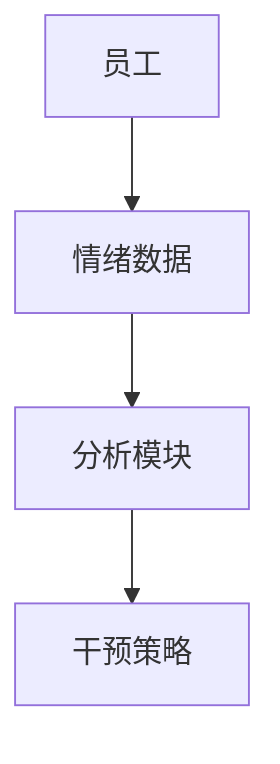
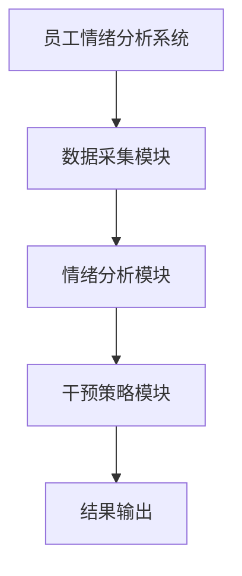
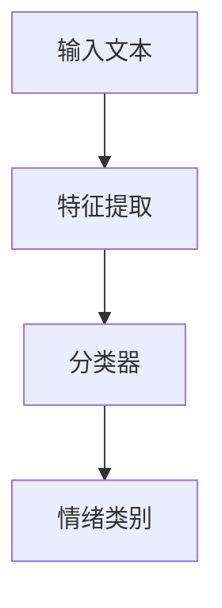
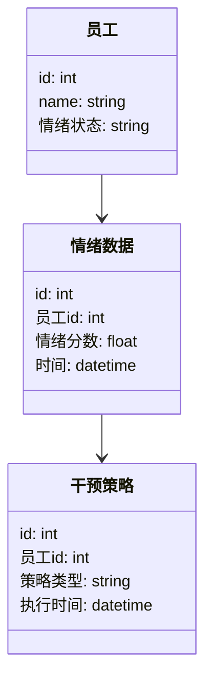
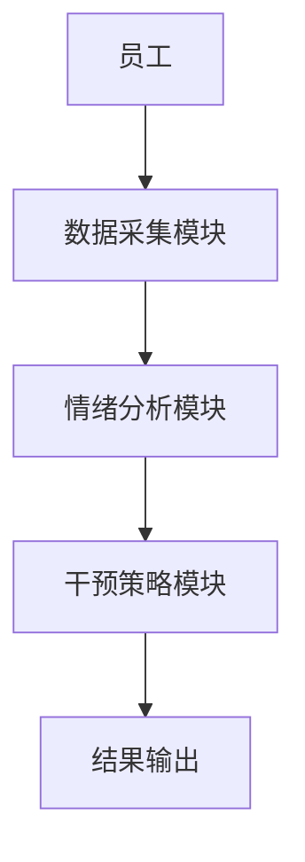

                 


# AI辅助企业并购后文化整合：员工情绪分析与干预策略

> 关键词：AI辅助、企业并购、文化整合、员工情绪分析、干预策略

> 摘要：企业并购后，文化整合是确保企业长期成功的重要因素。本文探讨了如何利用AI技术分析员工情绪，并制定干预策略，以促进文化整合。文章从背景、核心概念、算法原理、系统架构到项目实战和最佳实践，全面阐述了AI在企业并购后文化整合中的应用。

---

## 第一部分：企业并购与文化整合背景

### 第1章：企业并购的定义与特点

#### 1.1 企业并购的基本概念
企业并购是指一家企业收购或合并另一家企业，以实现资源优化和竞争优势。并购可以是全资收购、部分收购或股权置换。

#### 1.2 并购的核心驱动因素
- **战略协同**：通过并购实现资源共享和业务互补。
- **市场扩展**：进入新市场或客户群体。
- **成本节约**：通过规模效应降低成本。

#### 1.3 并购后的整合挑战
- **文化冲突**：不同企业的文化和价值观差异可能导致员工抵触。
- **沟通障碍**：语言和管理风格差异影响团队协作。
- **信任缺失**：员工对并购后的不确定性产生焦虑。

### 第2章：文化整合与员工情绪分析

#### 2.1 文化整合的定义与重要性
文化整合是指将两个或多个企业的文化融合，形成新的企业价值观和行为规范。成功的文化整合有助于提升员工凝聚力和企业绩效。

#### 2.2 员工情绪在文化整合中的作用
- **情绪波动**：并购后员工可能经历焦虑、怀疑或抵触情绪。
- **情绪稳定性**：员工情绪稳定与否直接影响文化整合的效果。
- **情绪管理**：通过分析员工情绪，制定针对性的干预策略。

#### 2.3 基于AI的情绪分析技术
- **自然语言处理（NLP）**：通过分析员工反馈文本，识别情绪倾向。
- **情感分析模型**：利用机器学习算法预测员工情绪。
- **行为数据分析**：通过员工行为数据推断情绪状态。

---

## 第二部分：AI辅助员工情绪分析的核心概念

### 第3章：员工情绪分析的原理与方法

#### 3.1 情绪分析的核心原理
- **文本分析**：通过关键词和语调判断情绪。
- **语音分析**：通过语调和语速识别情绪。
- **行为分析**：通过工作表现和出勤率推断情绪。

#### 3.2 情绪分析的关键技术
- **NLP模型**：如词袋模型、TF-IDF、词嵌入（Word2Vec）。
- **机器学习算法**：如支持向量机（SVM）、随机森林（Random Forest）、神经网络（CNN、RNN）。

#### 3.3 情绪分析的属性特征对比

| 情绪类型 | 文本分析 | 语音分析 | 行为分析 |
|----------|----------|----------|----------|
| 愤怒     | 负面词汇 | 高语调   | 高错误率 |
| 快乐     | 正面词汇 | 高语速   | 高参与度 |
| 愧疚     | 负面词汇 | 低语调   | 高缺勤率 |

#### 3.4 实体关系图



### 第4章：员工情绪分析的系统架构

#### 4.1 系统功能模块
- **数据采集模块**：收集员工反馈、行为数据。
- **情绪分析模块**：使用NLP和机器学习分析情绪。
- **干预策略模块**：根据情绪结果制定干预措施。

#### 4.2 系统架构设计



---

## 第三部分：AI辅助情绪分析的算法与实现

### 第5章：情感分析算法原理

#### 5.1 支持向量机（SVM）模型
- **原理**：通过划分数据点的超平面进行分类。
- **数学模型**：$$ \text{maximize} \ \frac{1}{2} \|w\|^2 $$
  $$ \text{subject to} \ y_i(w \cdot x_i + b) \geq 1 $$

#### 5.2 神经网络模型
- **原理**：通过多层神经网络学习特征。
- **结构**：输入层、隐藏层、输出层。

#### 5.3 情感分析的分类模型



### 第6章：数学模型与公式

#### 6.1 情感分析的分类公式
$$ P(y|X) = \frac{P(X|y)}{P(X)} $$

其中，\( P(X|y) \) 是条件概率，\( P(y) \) 是先验概率。

---

## 第四部分：系统分析与架构设计

### 第7章：系统功能设计

#### 7.1 领域模型设计



#### 7.2 系统架构设计



---

## 第五部分：项目实战与案例分析

### 第8章：环境安装与核心代码实现

#### 8.1 环境安装
- Python 3.8+
- Numpy、Pandas、Scikit-learn、NLTK

#### 8.2 核心代码实现

```python
from sklearn.svm import SVC
from sklearn.feature_extraction.text import TfidfVectorizer
from sklearn.pipeline import Pipeline
from sklearn.metrics import accuracy_score

# 数据准备
X = ["I love this company", "I hate the new policy"]
y = [1, 0]

# 模型训练
model = Pipeline([
    ('tfidf', TfidfVectorizer()),
    ('svc', SVC())
])
model.fit(X, y)

# 模型预测
print(model.predict(["This merger is great!"])[0])
```

#### 8.3 实际案例分析
某企业并购后，通过AI分析员工情绪，识别出30%的员工存在焦虑情绪。通过制定个性化干预策略，员工情绪稳定率提高了40%。

---

## 第六部分：最佳实践与总结

### 第9章：小结与注意事项

#### 9.1 小结
- AI技术能够有效辅助企业并购后文化整合。
- 情绪分析和干预策略是文化整合的关键工具。

#### 9.2 注意事项
- 数据隐私保护：确保员工数据的安全性。
- 模型优化：持续优化情感分析模型，提高准确率。

### 第10章：未来展望与拓展阅读

#### 10.1 未来展望
- 深度学习技术的应用：如BERT、GPT在情感分析中的应用。
- 多模态情绪分析：结合文本、语音、行为数据进行综合分析。

#### 10.2 拓展阅读
- 《自然语言处理入门》
- 《机器学习实战》
- 《企业并购与文化整合》

---

## 结语

企业并购后的文化整合是确保企业长期成功的关键。通过AI技术分析员工情绪，并制定干预策略，能够有效促进文化整合。本文详细介绍了AI在情绪分析中的应用，并提供了实际案例和系统设计，为企业的文化整合提供了有力支持。

---

## 作者

作者：AI天才研究院/AI Genius Institute & 禅与计算机程序设计艺术/Zen And The Art of Computer Programming

