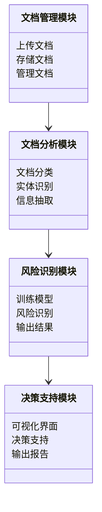
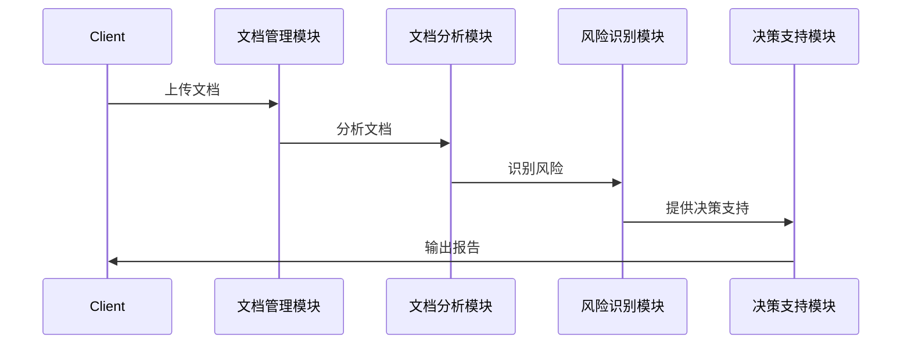

                 


# AI辅助企业并购尽职调查：自动化文档分析与风险识别

> 关键词：企业并购，尽职调查，AI辅助，文档分析，风险识别，自然语言处理，机器学习

> 摘要：本文探讨了人工智能技术在企业并购尽职调查中的应用，重点分析了自动化文档分析与风险识别的核心技术与方法。通过结合自然语言处理（NLP）和机器学习算法，AI能够显著提高尽职调查的效率与准确性，为企业并购决策提供有力支持。

---

## # 第1章: 企业并购尽职调查与AI辅助的背景

### ## 1.1 企业并购尽职调查的基本概念

#### ### 1.1.1 企业并购的定义与流程

企业并购（Mergers and Acquisitions, M&A）是指一家企业与其他企业合并或收购其资产或股份的过程。并购的流程通常包括以下几个阶段：

1. **战略规划**：确定并购目标与战略意图。
2. **目标筛选**：寻找符合战略目标的企业。
3. **尽职调查**：对目标企业进行全面的调查与评估。
4. **谈判与签约**：协商并购条件并签订协议。
5. **整合与执行**：完成资产与业务的整合。

#### ### 1.1.2 尽职调查的核心作用

尽职调查是企业并购过程中至关重要的一环，其主要作用包括：

1. **评估目标企业的真实价值**：发现财务、法律、运营等方面的问题。
2. **识别潜在风险**：发现可能影响并购的隐患。
3. **支持谈判与决策**：为并购方提供数据支持，制定合理的并购策略。

#### ### 1.1.3 AI技术在尽职调查中的作用

AI技术可以通过自动化处理大量文档、提取关键信息、识别潜在风险，显著提高尽职调查的效率和准确性。具体表现在：

1. **自动化文档分析**：快速处理大量文本数据，提取关键信息。
2. **风险识别**：基于历史数据和模式识别潜在风险。
3. **数据驱动的决策支持**：通过数据挖掘和分析提供决策支持。

### ## 1.2 AI辅助尽职调查的必要性

#### ### 1.2.1 传统尽职调查的痛点与挑战

传统尽职调查过程通常面临以下痛点：

1. **人工效率低**：需要手动处理大量文档，耗时耗力。
2. **信息遗漏风险**：人工审查容易遗漏关键信息。
3. **成本高**：需要投入大量的人力和时间，增加了并购成本。

#### ### 1.2.2 AI技术如何解决尽职调查中的效率问题

AI技术可以通过自动化处理文档、智能提取信息、快速识别风险，显著提高尽职调查的效率。具体表现在：

1. **自动化文档处理**：AI可以快速分类、整理和分析大量文档。
2. **智能信息提取**：通过NLP技术自动提取关键信息，减少人工干预。
3. **实时风险预警**：基于机器学习模型实时识别潜在风险。

#### ### 1.2.3 数据驱动的决策优势

通过AI技术，企业可以基于大量的历史数据和实时数据进行分析，从而做出更加科学和准确的决策。具体优势包括：

1. **数据全面性**：AI可以处理海量数据，提供更全面的分析结果。
2. **数据准确性**：通过算法优化，减少人为错误，提高分析结果的准确性。
3. **数据实时性**：AI可以实时分析数据，提供实时的决策支持。

### ## 1.3 本章小结

本章介绍了企业并购尽职调查的基本概念和AI技术在其中的重要作用。通过分析传统尽职调查的痛点与AI技术的优势，强调了AI辅助尽职调查的必要性。下一章将详细介绍自然语言处理（NLP）技术在文档分析中的应用。

---

## # 第2章: 自然语言处理在文档分析中的应用

### ## 2.1 自然语言处理（NLP）的基础原理

#### ### 2.1.1 NLP的核心任务与技术

NLP的核心任务包括：

1. **文本分类**：将文本划分为不同的类别（如正面、负面、中性）。
2. **实体识别**：识别文本中的命名实体（如人名、地名、组织名）。
3. **信息提取**：从文本中抽取特定的信息（如时间、地点、事件）。

NLP技术包括：

1. **分词**：将文本分割成词语或短语。
2. **词性标注**：给每个词语标注其词性（如名词、动词）。
3. **句法分析**：分析句子的语法结构。
4. **语义分析**：理解文本的语义含义。

#### ### 2.1.2 文本预处理与特征提取

文本预处理是NLP的重要步骤，主要包括：

1. **去除停用词**：移除常见词汇（如“的”、“是”等）。
2. **分词**：将文本分割成词语或短语。
3. **词干提取**：将词语还原到其基本形式（如“running”还原为“run”）。

特征提取是将文本转换为数值形式，常用的方法包括：

1. **词袋模型（Bag of Words, BoW）**：将文本表示为词的频率向量。
2. **TF-IDF（Term Frequency-Inverse Document Frequency）**：计算词语的重要性。

#### ### 2.1.3 常见的NLP模型与工具

常用的NLP模型与工具包括：

1. **Word2Vec**：用于生成词向量。
2. **GloVe**：基于全局词嵌入的词向量模型。
3. **BERT**：基于 transformer 的预训练模型。
4. **spaCy**：开源的NLP工具。

### ## 2.2 AI辅助文档分析的具体实现

#### ### 2.2.1 文档分类与主题识别

文档分类是将文档按照主题或类别进行分类，例如将文档分为“财务报告”、“法律文件”等。主题识别是进一步提取文档中的主题信息，例如识别出“财务风险”、“法律纠纷”等主题。

#### ### 2.2.2 实体识别与信息抽取

实体识别是识别文本中的命名实体，例如识别出公司名称、日期、金额等信息。信息抽取是从文本中抽取特定的信息，例如从财务报告中提取收入、利润等数据。

#### ### 2.2.3 关键信息的自动提取与汇总

关键信息的自动提取与汇总是将文档中的关键信息提取出来并进行汇总，例如从多份合同中提取出所有合同的金额、期限等信息。

### ## 2.3 本章小结

本章详细介绍了自然语言处理（NLP）技术在文档分析中的应用，包括文本预处理、特征提取、模型选择以及具体的文档分类、实体识别与信息抽取等技术。下一章将介绍基于机器学习的尽职调查风险识别。

---

## # 第3章: 基于机器学习的尽职调查风险识别

### ## 3.1 机器学习在风险识别中的应用

#### ### 3.1.1 机器学习的基本原理

机器学习是一种通过数据训练模型，使其能够从数据中学习并做出预测或决策的技术。机器学习的主要流程包括：

1. **数据收集**：收集训练数据。
2. **数据预处理**：清洗数据，提取特征。
3. **模型训练**：训练模型。
4. **模型评估**：评估模型的性能。
5. **模型部署**：将模型部署到实际应用中。

#### ### 3.1.2 常见的机器学习算法与模型

常用的机器学习算法与模型包括：

1. **线性回归**：用于回归问题。
2. **支持向量机（SVM）**：用于分类问题。
3. **随机森林**：基于决策树的集成学习方法。
4. **梯度提升树（如XGBoost、LightGBM）**：用于分类和回归问题。

#### ### 3.1.3 风险识别的特征工程与数据准备

特征工程是将原始数据转换为适合模型输入的特征。常用的特征工程方法包括：

1. **特征提取**：从文本、图像等数据中提取特征。
2. **特征选择**：选择对目标变量影响较大的特征。
3. **特征变换**：对特征进行变换（如标准化、正则化）。

数据准备是将数据转换为适合模型训练的形式，包括：

1. **数据清洗**：处理缺失值、异常值等。
2. **数据分割**：将数据分为训练集、验证集和测试集。
3. **数据增强**：增加数据的多样性（如图像旋转、翻转等）。

### ## 3.2 风险识别的数学模型与公式

#### ### 3.2.1 线性回归模型

线性回归模型的数学公式为：

$$ y = \beta_0 + \beta_1x_1 + \beta_2x_2 + \dots + \beta_nx_n $$

其中，$y$ 是目标变量，$\beta_0$ 是截距，$\beta_1, \beta_2, \dots, \beta_n$ 是回归系数，$x_1, x_2, \dots, x_n$ 是特征变量。

#### ### 3.2.2 支持向量机（SVM）模型

支持向量机的数学公式为：

$$ y = \text{sign}(w \cdot x + b) $$

其中，$w$ 是权重向量，$x$ 是输入向量，$b$ 是偏置项，$\text{sign}$ 是符号函数。

#### ### 3.2.3 随机森林与梯度提升树模型

随机森林和梯度提升树是基于决策树的集成学习方法，其数学公式较为复杂，通常用于分类和回归问题。

### ## 3.3 本章小结

本章详细介绍了机器学习在尽职调查风险识别中的应用，包括机器学习的基本原理、常见算法与模型、特征工程与数据准备等。下一章将介绍AI辅助尽职调查的系统架构与设计。

---

## # 第4章: AI辅助尽职调查的系统架构与设计

### ## 4.1 系统功能模块划分

AI辅助尽职调查系统的主要功能模块包括：

1. **文档管理模块**：负责文档的上传、存储和管理。
2. **文档分析模块**：负责文档的分类、实体识别和信息抽取。
3. **风险识别模块**：负责基于机器学习模型进行风险识别。
4. **决策支持模块**：提供决策支持和可视化界面。

### ## 4.2 系统功能设计（领域模型）

以下是系统功能设计的领域模型图（使用Mermaid）：



### ## 4.3 系统架构设计

以下是系统架构设计图（使用Mermaid）：

```mermaid
architecturalDiagram
    Client --> 文档管理模块
    文档管理模块 --> 文档分析模块
    文档分析模块 --> 风险识别模块
    风险识别模块 --> 决策支持模块
    决策支持模块 --> Client
```

### ## 4.4 系统接口设计

系统接口设计包括：

1. **文档上传接口**：允许用户上传文档。
2. **文档分析接口**：调用文档分析模块进行分析。
3. **风险识别接口**：调用风险识别模块进行风险识别。
4. **决策支持接口**：提供决策支持和可视化界面。

### ## 4.5 系统交互设计

以下是系统交互设计图（使用Mermaid）：



### ## 4.6 本章小结

本章详细介绍了AI辅助尽职调查系统的架构与设计，包括功能模块划分、系统功能设计、系统架构设计、系统接口设计和系统交互设计。下一章将介绍项目实战，包括环境安装、核心代码实现、案例分析等。

---

## # 第5章: 项目实战

### ## 5.1 环境安装

以下是项目实战所需的环境安装步骤：

1. **安装Python**：确保安装了Python 3.6或更高版本。
2. **安装必要的库**：安装NLP和机器学习相关的库，例如：
   - `nltk`：自然语言处理库。
   - `spaCy`：NLP库。
   - `scikit-learn`：机器学习库。
   - `tensorflow` 或 `pytorch`：深度学习框架。
3. **安装Jupyter Notebook**：用于编写和运行代码。

### ## 5.2 核心代码实现

以下是核心代码实现的示例：

#### ### 5.2.1 文档分类与主题识别

```python
from sklearn.feature_extraction.text import TfidfVectorizer
from sklearn.naive_bayes import MultinomialNB
from sklearn.pipeline import Pipeline

# 文本数据
text_data = ["财务报告", "法律文件", "商业计划书"]

# 创建TF-IDF向量化
vectorizer = TfidfVectorizer()

# 创建朴素贝叶斯分类器
clf = MultinomialNB()

# 创建管道
pipeline = Pipeline([
    ('tfidf', vectorizer),
    ('clf', clf)
])

# 训练模型
pipeline.fit(text_data, [0, 1, 2])

# 预测
print(pipeline.predict(["新的文档"])[0])
```

#### ### 5.2.2 实体识别与信息抽取

```python
import spacy

# 加载模型
nlp = spacy.load("en_core_web_sm")

# 文本数据
text = "Apple was founded by Steve Jobs in 1971."

# 实体识别
doc = nlp(text)
for entity in doc.ents:
    print(f"{entity.text} - {entity.label_}")
```

#### ### 5.2.3 风险识别

```python
from sklearn.ensemble import RandomForestClassifier

# 特征数据
X = [[1, 2, 3], [4, 5, 6], [7, 8, 9]]

# 标签数据
y = [0, 1, 0]

# 创建随机森林分类器
clf = RandomForestClassifier()

# 训练模型
clf.fit(X, y)

# 预测
print(clf.predict([[10, 11, 12]]))
```

### ## 5.3 案例分析

以下是一个案例分析的示例：

**案例背景**：某公司计划并购一家科技公司，需要对目标公司的财务报告、法律文件和商业计划书进行尽职调查。

**分析步骤**：

1. **文档分类**：将文档分为财务报告、法律文件和商业计划书。
2. **实体识别**：识别出公司名称、日期、金额等信息。
3. **风险识别**：基于机器学习模型识别潜在的财务风险和法律风险。

**分析结果**：识别出目标公司存在潜在的财务风险，建议并购方谨慎决策。

### ## 5.4 本章小结

本章通过实际案例展示了AI辅助尽职调查的项目实战，包括环境安装、核心代码实现和案例分析。通过这些实战，读者可以更好地理解AI技术在尽职调查中的具体应用。

---

## # 第6章: 最佳实践、小结、注意事项与拓展阅读

### ## 6.1 最佳实践

1. **数据质量**：确保数据的完整性和准确性。
2. **模型选择**：根据具体问题选择合适的模型和算法。
3. **模型调优**：通过交叉验证和网格搜索优化模型性能。
4. **结果解释**：确保模型结果的可解释性。

### ## 6.2 小结

本文详细介绍了AI辅助企业并购尽职调查的核心技术与方法，包括自然语言处理、机器学习算法、系统架构设计和项目实战。通过这些技术，AI可以显著提高尽职调查的效率和准确性，为企业并购决策提供有力支持。

### ## 6.3 注意事项

1. **数据隐私**：在处理敏感数据时，需要注意数据隐私和合规性。
2. **模型局限性**：AI模型可能存在局限性，需要结合人工审查和判断。
3. **技术更新**：AI技术不断更新，需要及时关注新技术和新算法。

### ## 6.4 拓展阅读

1. **《自然语言处理实战：基于Python的中文分词与文本挖掘》**
2. **《机器学习实战：基于Scikit-Learn和TensorFlow》**
3. **《企业并购与风险管理》**

---

## # 作者：AI天才研究院/AI Genius Institute & 禅与计算机程序设计艺术/Zen And The Art of Computer Programming

---

以上是《AI辅助企业并购尽职调查：自动化文档分析与风险识别》的技术博客文章的完整目录大纲和具体内容。

