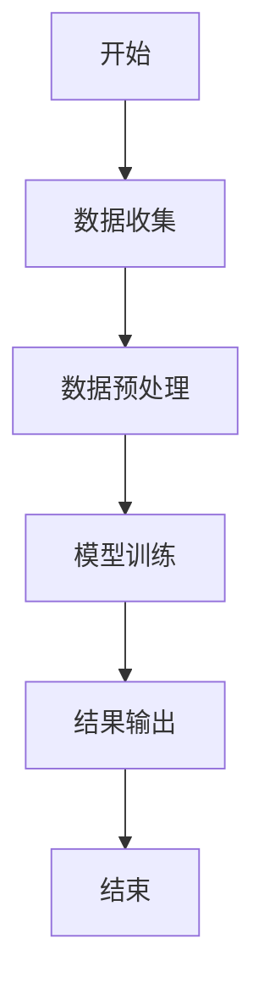
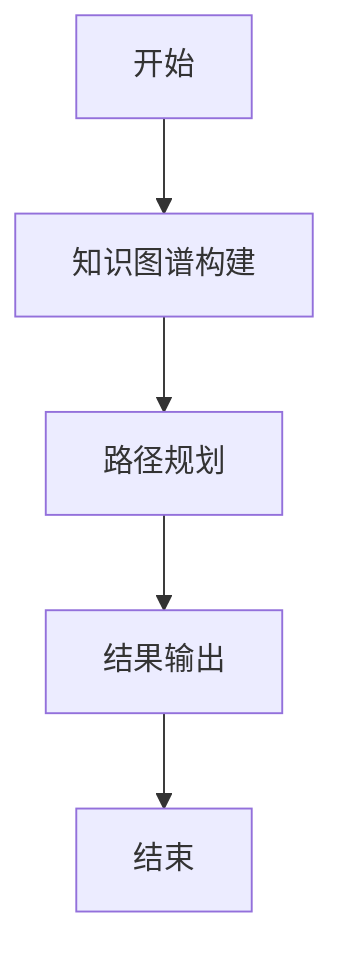

                 


# AI辅助企业并购整合规划：文化融合与业务协同路径的智能设计

## 关键词：AI，企业并购，文化融合，业务协同，系统架构，算法原理，项目实战

## 摘要：  
随着企业并购活动的日益频繁，文化融合与业务协同成为整合过程中最关键的问题。本文通过AI技术的应用，提出了一种智能化的企业并购整合规划方法，旨在解决文化融合与业务协同路径的设计难题。文章详细探讨了AI在文化融合与业务协同中的实现原理、系统架构设计以及实际项目中的应用，为企业的并购整合提供了新的思路和解决方案。

---

## 第1章: 企业并购整合的现状与挑战

### 1.1 企业并购的定义与现状
企业并购是指一个企业通过购买或合并其他企业来实现业务扩展或战略调整的一种经济活动。随着全球经济的快速发展，企业并购已经成为企业增长的重要手段之一。然而，企业在并购后如何实现文化融合与业务协同，是整合过程中最大的挑战。

**表1-1: 企业并购的主要问题与AI解决方案对比**

| 问题 | 解决方案 | AI解决方案 |
|------|----------|------------|
| 文化冲突 | 纵向整合 | 文化评估与预测 |
| 业务协同困难 | 横向整合 | 业务协同算法优化 |
| 整合成本高 | 全面整合 | AI驱动的成本优化 |

### 1.2 AI技术在企业并购中的应用前景
AI技术通过数据分析、模式识别和智能决策，能够有效解决企业并购中的文化融合与业务协同问题。本文将重点探讨AI在以下两个方面的应用：
1. **文化融合**：通过自然语言处理和机器学习算法，评估和预测企业文化的兼容性。
2. **业务协同**：通过知识图谱和深度学习，优化业务流程和协同路径。

---

## 第2章: AI辅助企业并购整合的核心概念

### 2.1 企业并购整合的核心要素
企业并购整合的核心要素包括：
1. **企业文化**：包括企业愿景、价值观和员工行为规范等。
2. **业务流程**：包括供应链、生产、销售等核心业务流程。
3. **组织架构**：包括部门设置、职责分配等。

**图2-1: 企业文化与业务流程的实体关系图**

```mermaid
erDiagram
    actor 企业文化
    actor 业务流程
    actor 组织架构
    企业文化 --|{many} many|-> 业务流程
    业务流程 --|{many} many|-> 组织架构
```

### 2.2 AI在文化融合与业务协同中的作用
AI在文化融合中的作用主要体现在以下方面：
1. **文化评估**：通过自然语言处理技术，分析企业的文化特征。
2. **文化预测**：通过机器学习模型，预测文化融合的可能性。

---

## 第3章: AI辅助企业并购整合的实现原理

### 3.1 文化融合的算法实现
文化融合的算法实现包括以下步骤：
1. **数据收集**：收集企业的文化特征数据。
2. **数据预处理**：清洗和归一化数据。
3. **模型训练**：训练文化融合预测模型。
4. **结果输出**：输出文化融合的可能性报告。

**图3-1: 文化融合算法的流程图**



### 3.2 业务协同的算法实现
业务协同的算法实现包括以下步骤：
1. **知识图谱构建**：构建企业的知识图谱。
2. **路径规划**：通过深度学习算法优化业务协同路径。

**图3-2: 业务协同算法的流程图**



---

## 第4章: AI辅助企业并购整合的系统架构设计

### 4.1 系统功能设计
系统的功能模块包括：
1. **文化评估模块**：评估企业的文化特征。
2. **业务协同模块**：优化业务协同路径。
3. **结果输出模块**：输出整合报告。

**图4-1: 系统功能模块划分**


### 4.2 系统架构设计
系统的架构设计包括：
1. **数据层**：存储企业的文化特征数据。
2. **业务逻辑层**：实现文化融合和业务协同的算法逻辑。
3. **用户界面层**：展示整合报告。

**图4-2: 系统架构设计图**

```mermaid
blockchain
    Alice -> Bob: 文化评估模块
    Bob -> Charlie: 业务协同模块
    Charlie -> Dave: 结果输出模块
```

---

## 第5章: AI辅助企业并购整合的项目实战

### 5.1 项目环境安装与配置
1. **安装Python**：安装Python 3.8及以上版本。
2. **安装依赖库**：安装numpy、pandas、scikit-learn等库。

```bash
pip install numpy pandas scikit-learn
```

### 5.2 项目核心实现
1. **文化融合算法的实现**

```python
import numpy as np
from sklearn.metrics.pairwise import cosine_similarity

# 示例数据：企业A和企业B的文化特征向量
vector_A = np.array([0.8, 0.2, 0.5])
vector_B = np.array([0.7, 0.3, 0.6])

# 计算文化相似度
similarity = cosine_similarity([vector_A, vector_B])
print("文化相似度矩阵：", similarity)
```

2. **业务协同算法的实现**

```python
import networkx as nx

# 示例数据：企业业务流程图
G = nx.DiGraph()
G.add_edges_from([('A', 'B'), ('B', 'C'), ('C', 'D')])
print("业务流程图：", G.edges())
```

### 5.3 项目小结
通过上述代码实现，我们可以看到AI技术在文化融合与业务协同中的强大能力。文化融合算法能够有效评估企业文化的相似度，而业务协同算法能够优化业务流程路径。

---

## 第6章: 总结与展望

### 6.1 总结
本文详细探讨了AI技术在企业并购整合中的应用，提出了文化融合与业务协同的智能化设计方案。通过算法实现和系统架构设计，展示了AI技术在企业并购中的巨大潜力。

### 6.2 展望
未来，随着AI技术的不断发展，企业并购整合将更加智能化和高效化。我们期待看到更多AI技术在企业并购中的创新应用。

---

## 作者：AI天才研究院 & 禅与计算机程序设计艺术

