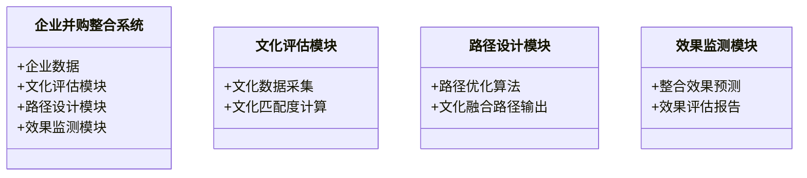

                 


# AI辅助企业并购整合规划：文化融合路径设计与效果监测

## 关键词：企业并购、文化融合、人工智能、路径设计、效果监测

## 摘要：  
随着企业并购活动的日益频繁，文化融合成为整合过程中最关键且最具挑战性的环节。本文从AI辅助企业并购整合的角度出发，系统探讨文化融合路径设计的核心要素、算法原理及实现方案，并提出一套基于AI的效果监测方法。通过理论分析与实践案例结合，本文为企业的并购整合提供了新的思路和解决方案。

---

# 第一部分: AI辅助企业并购整合规划的背景与重要性

## 第1章: 企业并购整合的背景与挑战

### 1.1 企业并购的定义与重要性  
企业并购是指一家企业通过购买另一家企业的一部分或全部股权，以实现战略扩张、资源整合或竞争优势提升的一种商业行为。并购整合则是指在并购完成后，将双方的业务、组织、文化等进行深度融合的过程。  

- **并购的定义**：并购不仅仅是资产的转移，更是企业战略目标的实现过程。  
- **并购的重要性**：通过并购，企业可以快速获取技术、市场、客户资源等核心竞争力，同时优化资源配置，降低运营成本。  

### 1.2 企业并购中的文化融合问题  
文化融合是并购整合中最复杂的环节之一。文化差异可能导致组织冲突、员工士气低落，甚至影响企业绩效。  

- **文化差异的影响**：例如，一家以“灵活决策”为核心文化的公司并购一家以“层级分明”为核心文化的公司，可能导致管理混乱。  
- **文化融合的目标**：通过整合双方文化，形成新的企业文化，提升组织凝聚力和竞争力。  
- **文化融合的挑战**：文化评估难度大、员工抵触情绪、文化冲突的协调难度等。  

### 1.3 AI技术在企业并购整合中的应用前景  
AI技术为企业并购整合提供了全新的解决方案。通过自然语言处理（NLP）、机器学习等技术，企业可以更高效地进行文化评估、路径设计和效果监测。  

- **AI的潜力**：AI可以帮助企业快速分析大量数据，发现潜在的文化冲突点，并提出优化建议。  
- **AI的可行性**：通过自然语言处理技术，AI可以分析企业文档、员工反馈等非结构化数据，提取文化特征。  
- **未来趋势**：随着AI技术的不断发展，文化融合路径设计将更加智能化、数据驱动化。  

---

# 第二部分: AI辅助企业并购整合的核心概念与技术

## 第2章: AI辅助企业并购整合的核心概念

### 2.1 企业并购整合的系统模型  
企业并购整合可以看作是一个复杂的系统工程，涉及多个核心要素和相互关系。  

- **系统模型的定义**：企业并购整合系统由企业战略目标、组织结构、文化特征、人力资源等要素构成。  
- **核心要素**：  
  - **战略目标**：并购的初衷和目标。  
  - **组织结构**：双方的组织架构和权责分配。  
  - **文化特征**：企业的核心价值观、管理风格等。  
  - **人力资源**：员工的技能、态度和文化背景。  

- **系统模型的边界**：企业并购整合系统的外部环境包括市场、政策、竞争等，内部环境包括企业战略、组织结构、文化等。  

### 2.2 AI辅助整合的关键技术  
AI技术在企业并购整合中的应用主要体现在以下方面：  

- **机器学习**：用于预测整合效果、分析文化匹配度。  
- **自然语言处理**：用于分析企业文档、员工反馈等非结构化数据。  
- **数据挖掘**：用于发现隐藏的文化冲突点和优化路径。  

### 2.3 文化融合路径设计的核心要素  
文化融合路径设计是AI辅助整合的核心任务之一。  

- **文化评估指标**：包括文化匹配度、文化冲突点、文化融合度等。  
- **文化匹配度的计算方法**：通过自然语言处理技术，提取双方文化的关键词，计算相似度。  
- **路径优化策略**：基于机器学习算法，优化文化融合路径，降低整合风险。  

---

## 第3章: AI辅助整合的算法原理与数学模型

### 3.1 机器学习算法在整合中的应用  
机器学习算法可以帮助企业预测整合效果、优化文化融合路径。  

- **监督学习与非监督学习**：  
  - **监督学习**：用于已知文化特征的分类任务。  
  - **非监督学习**：用于发现隐藏的文化模式。  

- **常见算法的优缺点**：  
  - **支持向量机（SVM）**：适用于小样本数据分类。  
  - **随机森林**：适用于特征重要性分析。  

### 3.2 文化融合路径设计的数学模型  
文化融合路径设计可以通过数学模型进行优化。  

- **文化匹配度的数学表达式**：  
  $$文化匹配度 = \sum_{i=1}^{n} w_i \cdot c_i$$  
  其中，$w_i$ 是第$i$个文化的权重，$c_i$ 是第$i$个文化的匹配度。  

- **路径优化的数学模型**：  
  $$目标函数：\text{最大化文化融合度}$$  
  $$约束条件：\text{文化冲突点最小化}$$  

### 3.3 效果监测的数学模型  
效果监测可以通过数学模型进行预测和评估。  

- **整合效果的评价指标**：  
  - **员工满意度**：通过问卷调查获取。  
  - **企业绩效**：通过财务指标衡量。  

- **效果预测的数学模型**：  
  $$效果预测 = \alpha \cdot \text{文化融合度} + \beta \cdot \text{组织协调度}$$  
  其中，$\alpha$ 和 $\beta$ 是权重系数。  

---

## 第4章: 系统分析与架构设计

### 4.1 问题场景介绍  
企业并购整合的核心问题是文化融合路径设计和效果监测。  

- **问题背景**：文化差异可能导致整合失败。  
- **问题描述**：如何利用AI技术优化文化融合路径，提升整合效果。  
- **边界与外延**：企业并购整合系统仅关注文化融合部分，不涉及财务、法律等其他方面。  

### 4.2 系统功能设计  
企业并购整合系统主要包括以下功能模块：  

- **文化评估模块**：用于分析双方文化特征。  
- **路径设计模块**：用于优化文化融合路径。  
- **效果监测模块**：用于评估整合效果。  

- **领域模型设计（Mermaid类图）**：  


### 4.3 系统架构设计  
- **系统架构设计（Mermaid架构图）**：  


---

## 第5章: 项目实战与案例分析

### 5.1 项目环境与安装  
- **环境要求**：Python 3.8以上版本，安装自然语言处理库（如spaCy）和机器学习库（如Scikit-learn）。  

### 5.2 系统核心实现  
- **文化匹配度计算代码**：  
```python
import numpy as np
from sklearn.metrics.pairwise import cosine_similarity

# 示例：计算文化向量的相似度
culture_vector1 = np.array([0.8, 0.2, 0.5])
culture_vector2 = np.array([0.7, 0.3, 0.6])

similarity = cosine_similarity([culture_vector1], [culture_vector2])
print("文化匹配度相似度：", similarity[0][0])
```

- **路径优化代码**：  
```python
from sklearn.model_selection import train_test_split
from sklearn.ensemble import RandomForestRegressor

# 示例：训练文化融合路径优化模型
X = [...]  # 文化特征
y = [...]  # 整合效果

X_train, X_test, y_train, y_test = train_test_split(X, y, test_size=0.2)
model = RandomForestRegressor().fit(X_train, y_train)
predicted = model.predict(X_test)
print("预测的整合效果：", predicted)
```

### 5.3 案例分析  
以某科技公司并购一家传统制造企业为例，分析文化融合路径设计和效果监测的过程。  

- **文化评估**：通过自然语言处理技术分析两家企业的文化文档，提取关键词和特征。  
- **路径设计**：基于机器学习模型，优化文化融合路径，例如通过调整管理风格、培训计划等。  
- **效果监测**：通过效果预测模型，评估整合效果，并根据实际结果调整路径设计。  

### 5.4 项目小结  
通过项目实战，验证了AI辅助企业并购整合的可行性和有效性。  

---

## 第6章: 未来展望与最佳实践

### 6.1 未来发展趋势  
随着AI技术的不断发展，企业并购整合将更加智能化、数据驱动化。未来，可能出现更多基于深度学习的文化融合路径优化算法。  

### 6.2 最佳实践 tips  
- 在并购前，进行全面的文化评估和匹配度分析。  
- 利用AI技术优化文化融合路径，降低整合风险。  
- 定期监测整合效果，及时调整策略。  

### 6.3 注意事项  
- 文化融合是一个长期过程，需要耐心和持续努力。  
- 在使用AI技术时，要注意数据质量和模型的可解释性。  

### 6.4 拓展阅读  
推荐阅读相关书籍和论文，深入理解企业并购整合和AI技术的结合。  

---

# 作者：AI天才研究院 & 禅与计算机程序设计艺术

---

通过以上内容，我们系统地探讨了AI辅助企业并购整合规划的核心概念、技术实现和实际应用。希望本文能为企业在并购整合过程中提供新的思路和解决方案。

