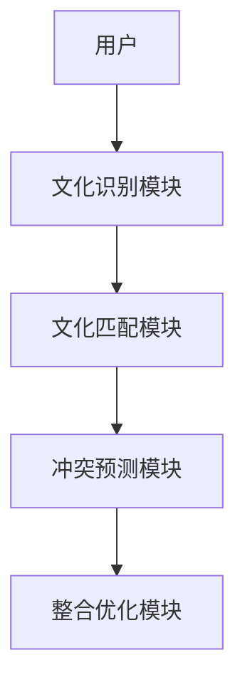

                 


# AI辅助企业并购文化整合：减少冲突

> **关键词**：企业并购、文化整合、人工智能、文化冲突、整合优化

> **摘要**：  
> 在企业并购过程中，文化整合是决定并购成功与否的关键因素之一。本文探讨了如何利用人工智能技术辅助企业并购中的文化整合，以减少文化冲突，提高并购的成功率。文章从文化整合的核心概念出发，分析了AI在文化识别、文化匹配和文化冲突预测中的作用，并详细介绍了相关算法的数学模型和实现方式。最后，通过实际案例展示了AI辅助文化整合的应用效果。

---

## 第一部分: 企业并购与文化整合概述

### 第1章: 企业并购与文化整合概述

#### 1.1 企业并购的基本概念

##### 1.1.1 企业并购的定义与类型

企业并购（Mergers and Acquisitions，简称M&A）是指两个或多个企业之间通过合并或收购的方式，将彼此的资产、负债、权益进行整合的过程。企业并购可以分为两种主要类型：

- **合并（Merger）**：两家或多家企业合并为一家新企业，通常发生在战略互补性强的企业之间。
- **收购（Acquisition）**：一家企业购买另一家企业的全部或部分股权，通常发生在目标企业具有特定优势或资源的情况下。

企业并购的核心目标是通过资源整合实现协同效应，提升整体竞争力。然而，并购过程中常常面临文化冲突的问题，这可能影响并购后的整合效果。

##### 1.1.2 并购中的文化整合问题

文化整合是企业并购后实现协同效应的关键环节。文化整合是指将两个或多个企业原有的文化理念、价值观、管理方式等进行融合，形成一种新的企业文化。然而，并购中的文化整合往往面临以下挑战：

- **文化差异**：不同企业可能有不同的文化背景、管理风格和价值观，这些差异可能导致摩擦。
- **员工抵触**：员工可能对并购后的文化变化产生抵触情绪，影响工作效率。
- **领导层沟通不畅**：管理层在文化整合过程中可能缺乏有效的沟通，导致整合方案偏离预期。

##### 1.1.3 文化整合对并购成功的影响

文化整合的成功与否直接影响并购的最终结果。如果文化整合顺利，企业能够更快地实现协同效应，员工的凝聚力和生产力也会显著提升。反之，如果文化整合失败，可能导致企业内部冲突加剧，员工士气低落，甚至导致并购失败。

#### 1.2 AI在企业并购中的应用前景

##### 1.2.1 AI技术在企业并购中的潜在价值

人工智能（AI）技术在企业并购中的应用前景广阔。AI可以通过大数据分析、自然语言处理（NLP）和机器学习等技术，帮助企业更好地识别和评估并购目标的文化特性，预测文化冲突的可能性，并提出优化整合的方案。

##### 1.2.2 AI辅助文化整合的优势

AI辅助文化整合的优势主要体现在以下几个方面：

- **高效性**：AI可以通过自动化分析快速处理大量数据，帮助企业在短时间内完成文化评估。
- **准确性**：AI能够基于数据和模型提供客观的文化匹配建议，减少人为判断的偏差。
- **个性化**：AI可以根据企业的具体需求定制文化整合方案，提高整合的针对性。

##### 1.2.3 当前AI在企业并购中的应用现状

目前，AI在企业并购中的应用还处于起步阶段，但已经有一些初步的实践案例。例如，一些企业开始利用AI技术进行文化匹配测试，评估潜在并购目标的文化适应性。然而，AI在文化整合中的应用仍需要进一步研究和探索。

---

### 第2章: 文化整合的核心概念与挑战

#### 2.1 文化整合的核心概念

##### 2.1.1 文化整合的定义

文化整合是指将两个或多个企业原有的文化理念、价值观、管理方式等进行融合，形成一种新的企业文化。文化整合的目标是实现企业文化的互补与协同，避免因文化差异导致的冲突。

##### 2.1.2 文化整合的关键要素

文化整合的关键要素包括以下几个方面：

- **企业价值观**：企业的核心价值观是否兼容。
- **管理风格**：企业的管理方式是否协调。
- **员工文化背景**：员工的文化背景是否容易融合。
- **沟通机制**：企业内部的沟通渠道是否畅通。

##### 2.1.3 文化整合的边界与外延

文化整合的边界是指文化整合的范围和限制。一般来说，文化整合的范围包括企业的组织结构、管理流程、员工行为规范等方面。文化整合的外延则涉及企业的外部环境，如行业特点、法律法规等。

#### 2.2 企业并购中文化冲突的成因与表现

##### 2.2.1 文化冲突的主要成因

文化冲突的主要成因包括以下几个方面：

- **文化差异**：不同企业的文化理念和价值观存在差异。
- **管理风格不匹配**：企业的管理方式和风格不一致。
- **员工抵触**：员工对并购后的文化变化产生抵触情绪。

##### 2.2.2 并购中文化冲突的表现形式

文化冲突的表现形式包括：

- **员工士气低落**：员工因文化差异产生不满情绪，影响工作效率。
- **沟通不畅**：员工之间因文化差异导致沟通障碍。
- **管理混乱**：管理层因文化差异导致管理决策失误。

##### 2.2.3 文化冲突对并购绩效的影响

文化冲突对并购绩效的影响是多方面的。首先，文化冲突会导致员工士气低落，影响企业的生产力。其次，文化冲突可能引发管理混乱，影响企业的决策效率。最后，文化冲突还可能导致企业内部的信任危机，影响企业的整体竞争力。

---

### 第3章: AI辅助文化整合的核心原理

#### 3.1 AI在文化整合中的作用机制

##### 3.1.1 AI技术在文化识别中的应用

AI可以通过大数据分析和自然语言处理技术，帮助企业识别潜在并购目标的文化特性。例如，AI可以通过分析企业的公开报告、员工评价等数据，提取企业的文化特征。

##### 3.1.2 AI在文化匹配中的算法原理

AI在文化匹配中的算法原理主要基于机器学习技术。通过训练模型，AI可以识别出文化匹配度高的企业，并提供文化匹配建议。

##### 3.1.3 AI辅助文化整合的流程模型

AI辅助文化整合的流程模型包括以下几个步骤：

1. **文化识别**：识别企业和目标企业的文化特性。
2. **文化匹配**：基于文化特性进行文化匹配。
3. **文化冲突预测**：预测文化冲突的可能性。
4. **文化整合优化**：提出文化整合优化方案。

#### 3.2 AI辅助文化整合的关键算法

##### 3.2.1 文化匹配算法的原理

文化匹配算法的原理基于相似度计算。通过计算企业和目标企业在文化特性上的相似度，AI可以评估文化匹配的可能性。

##### 3.2.2 文化冲突预测模型

文化冲突预测模型基于机器学习算法，通过分析企业和目标企业在文化特性上的差异，预测文化冲突的可能性。

##### 3.2.3 文化整合优化算法

文化整合优化算法基于优化模型，通过调整文化特性，优化文化整合的效果。

---

## 第二部分: AI辅助文化整合的算法原理与实现

### 第4章: 文化整合算法的数学模型

#### 4.1 文化匹配算法的数学模型

文化匹配算法的数学模型基于相似度计算。以下是文化匹配算法的数学公式：

$$ \text{相似度} = \sum_{i=1}^{n} w_i \cdot s_i $$

其中，\( w_i \) 为第 \( i \) 个文化维度的权重，\( s_i \) 为相似度评分。

#### 4.2 文化冲突预测模型

文化冲突预测模型基于机器学习算法，以下是文化冲突概率计算公式：

$$ P(\text{冲突}) = \sum_{i=1}^{m} p_i \cdot c_i $$

其中，\( p_i \) 为第 \( i \) 个文化维度冲突的概率，\( c_i \) 为冲突影响系数。

---

### 第5章: AI辅助文化整合的系统架构设计

#### 5.1 系统功能设计

##### 5.1.1 文化识别模块

文化识别模块负责识别企业和目标企业的文化特性，包括企业价值观、管理风格、员工文化背景等。

##### 5.1.2 文化匹配模块

文化匹配模块基于文化特性进行文化匹配，评估文化匹配的可能性。

##### 5.1.3 冲突预测模块

冲突预测模块基于文化特性预测文化冲突的可能性。

##### 5.1.4 整合优化模块

整合优化模块提出文化整合优化方案，优化文化整合的效果。

#### 5.2 系统架构设计

##### 5.2.1 系统架构图

以下是系统的架构图：



---

## 第三部分: 项目实战与总结

### 第6章: 项目实战

#### 6.1 环境安装

项目实战需要安装以下环境：

- Python 3.8+
- TensorFlow 2.0+
- Scikit-learn 0.20+

#### 6.2 核心实现源代码

以下是文化匹配算法的核心实现代码：

```python
import numpy as np
from sklearn.metrics.pairwise import cosine_similarity

# 定义文化特性向量
culture_vectors = {
    '企业A': [0.8, 0.6, 0.7],
    '企业B': [0.5, 0.9, 0.4]
}

# 计算相似度
def calculate_similarity(culture_vectors):
    vectors = list(culture_vectors.values())
    similarity_matrix = cosine_similarity(vectors)
    return similarity_matrix

# 输出相似度矩阵
similarity_matrix = calculate_similarity(culture_vectors)
print(similarity_matrix)
```

#### 6.3 代码应用解读

上述代码通过计算文化特性向量的相似度，评估文化匹配的可能性。相似度越高，文化匹配的可能性越大。

---

### 第7章: 总结与展望

#### 7.1 总结

本文探讨了AI辅助企业并购文化整合的实现方式，分析了文化整合的核心概念和算法原理，并通过实际案例展示了AI辅助文化整合的应用效果。AI技术在文化整合中的应用具有广阔前景，能够有效减少文化冲突，提高并购的成功率。

#### 7.2 展望

未来，随着AI技术的不断发展，文化整合的实现方式将更加智能化和个性化。企业可以通过AI技术实现文化整合的自动化和优化，进一步提升并购的效率和效果。

---

**作者：AI天才研究院/AI Genius Institute & 禅与计算机程序设计艺术 /Zen And The Art of Computer Programming**  
**相关资料**：[企业并购文化整合](https://example.com/mergers-acquisitions-cultural-integration)、[AI辅助企业并购](https://example.com/ai-mergers-acquisitions)

