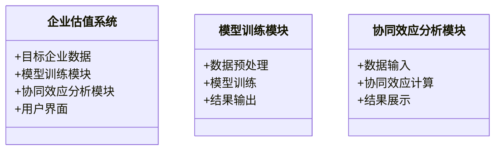
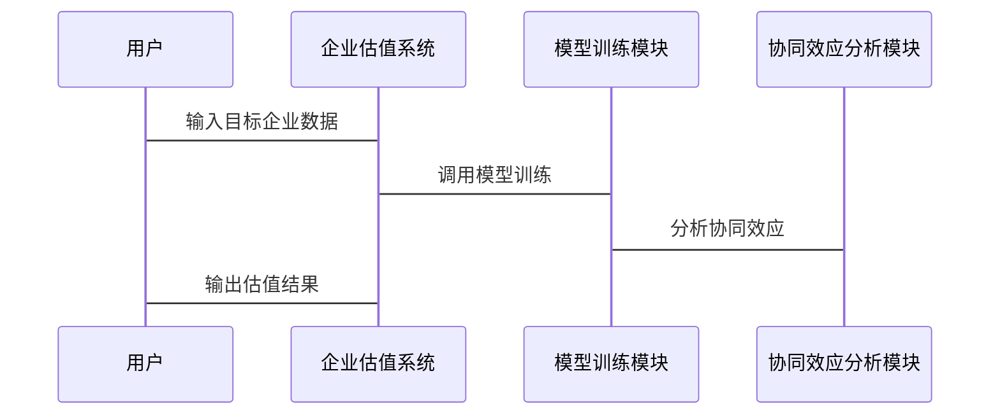

                 


# AI辅助企业并购目标估值：多维度财务模型与协同效应分析

## 关键词：企业并购，人工智能，财务模型，协同效应，估值分析

## 摘要：本文深入探讨了人工智能在企业并购目标估值中的应用，结合多维度财务模型与协同效应分析，详细讲解了AI技术如何提升企业估值的准确性和效率。文章从背景介绍、核心概念、算法原理、系统架构到项目实战，全面剖析了AI辅助企业并购的全过程，为读者提供了理论与实践相结合的深度解析。

---

# 第1章: 企业并购与估值概述

## 1.1 企业并购的基本概念

### 1.1.1 企业并购的定义与类型
企业并购是指一家企业通过购买另一家企业的一部分或全部股权，以实现战略目标的过程。常见的并购类型包括横向并购、纵向并购和混合并购。

- 横向并购：同一行业内的企业合并，旨在扩大市场份额。
- 纵向并购：产业链上下游企业的合并，以增强垂直整合能力。
- 混合并购：跨行业或跨领域的并购，通常是为了 diversification。

### 1.1.2 并购的流程与关键环节
企业并购的流程通常包括以下几个关键环节：
1. **战略规划**：明确并购目标和动机。
2. **目标筛选**：选择符合战略目标的企业。
3. **尽职调查**：对目标企业进行财务、法律和运营方面的详细调查。
4. **估值分析**：评估目标企业的价值。
5. **并购决策**：决定是否推进并购。
6. **交易执行**：完成交割和整合。

### 1.1.3 传统企业估值方法的优缺点
传统的估值方法主要包括：
- **市盈率法（P/E）**：基于目标企业的市盈率与可比公司的对比。
- **市净率法（P/B）**：基于目标企业的市净率与可比公司的对比。
- **现金流折现法（DCF）**：基于未来现金流的现值计算企业价值。

**优点**：方法简单，易于理解和应用。
**缺点**：依赖于可比公司数据的准确性和完整性，主观性较强，且难以量化协同效应。

---

## 1.2 AI技术在企业并购中的应用背景

### 1.2.1 传统估值方法的局限性
传统估值方法在实际应用中存在以下问题：
- 数据依赖性强，难以应对复杂市场环境。
- 协同效应难以量化，影响估值的准确性。
- 人工分析耗时耗力，效率低下。

### 1.2.2 AI技术如何提升估值效率
人工智能技术在企业估值中的优势包括：
- **数据处理能力**：AI能够快速处理海量数据，提取关键特征。
- **模型优化**：通过机器学习算法，建立更精准的估值模型。
- **协同效应预测**：AI可以量化协同效应，为估值提供更全面的支持。

### 1.2.3 AI在并购中的应用前景
随着AI技术的不断发展，其在企业并购中的应用前景广阔：
- 提高估值的准确性和效率。
- 实现动态估值，适应市场变化。
- 为并购决策提供数据支持，降低风险。

---

## 1.3 本章小结
本章介绍了企业并购的基本概念、流程和传统估值方法，分析了AI技术在并购中的应用背景及其优势。通过对比传统方法与AI技术的差异，为后续章节的深入分析奠定了基础。

---

# 第2章: 多维度财务模型构建

## 2.1 多维度财务模型的定义

### 2.1.1 多维度模型的核心要素
多维度财务模型通过引入多个维度的数据，如财务指标、市场表现和行业趋势，来提高估值的准确性。核心要素包括：
- 财务指标：收入、利润、现金流等。
- 市场数据：行业趋势、竞争格局等。
- 宏观经济指标：GDP、利率、通货膨胀等。

### 2.1.2 多维度模型与传统模型的对比
| 对比维度 | 传统模型 | 多维度模型 |
|----------|----------|------------|
| 数据来源 | 单一维度 | 多维度     |
| 精度     | 较低     | 较高       |
| 灵活性   | 较差     | 较好       |

---

## 2.2 多维度模型的构建步骤

### 2.2.1 数据收集与预处理
数据收集是模型构建的基础，包括目标企业的历史财务数据、行业数据和宏观经济数据。预处理步骤包括数据清洗、标准化和特征提取。

### 2.2.2 模型设计与参数选择
根据数据特点选择合适的模型，如线性回归或随机森林，并通过交叉验证优化参数。

### 2.2.3 模型训练与验证
使用训练数据训练模型，并通过验证数据评估模型的性能。

---

## 2.3 多维度模型的实现案例

### 2.3.1 案例背景介绍
假设我们对一家科技公司进行估值，目标是预测其未来三年的收入和利润。

### 2.3.2 数据分析与模型构建
- 数据来源：公司过去五年的财务数据、行业趋势和宏观经济指标。
- 模型选择：随机森林回归模型。
- 训练过程：使用历史数据训练模型，预测未来三年的收入和利润。

### 2.3.3 模型结果与解读
模型预测结果显示，未来三年收入增长率为15%，利润增长率为20%，为估值提供了重要参考。

---

## 2.4 本章小结
本章详细讲解了多维度财务模型的构建步骤和实现案例，展示了如何通过多维度数据提高估值的准确性。

---

# 第3章: 协同效应分析

## 3.1 协同效应的定义与分类

### 3.1.1 协同效应的定义
协同效应是指并购后双方在资源、技术和市场等方面产生协同作用，从而带来额外价值。

### 3.1.2 协同效应的分类与影响
协同效应主要分为以下几类：
- **成本协同效应**：通过合并运营降低成本。
- **收入协同效应**：通过扩大市场和客户群增加收入。
- **技术协同效应**：通过技术整合提升创新能力。

---

## 3.2 协同效应的量化方法

### 3.2.1 协同效应的计算公式
协同效应的计算公式为：
$$ 协同效应 = 合并后价值 - 两家公司单独价值之和 $$

### 3.2.2 协同效应的评估指标
常用的协同效应评估指标包括：
- 协同效应的大小。
- 协同效应的实现时间。
- 协同效应的风险。

---

## 3.3 协同效应的AI辅助分析

### 3.3.1 AI在协同效应分析中的应用
AI可以通过分析历史数据和市场趋势，预测并购后的协同效应。

### 3.3.2 协同效应的预测模型
使用机器学习算法，如支持向量机（SVM）或神经网络，构建协同效应预测模型。

---

## 3.4 本章小结
本章介绍了协同效应的定义、分类和量化方法，并探讨了AI在协同效应分析中的应用。

---

# 第4章: 基于机器学习的估值模型

## 4.1 机器学习在估值中的应用

### 4.1.1 机器学习的基本原理
机器学习通过数据训练模型，实现对目标企业的价值预测。

### 4.1.2 机器学习在估值中的优势
- 数据驱动，结果更准确。
- 能够处理复杂数据关系。

---

## 4.2 常见机器学习算法及其应用

### 4.2.1 线性回归模型
线性回归是一种简单但有效的回归模型，适用于线性关系的数据。

### 4.2.2 支持向量机（SVM）
SVM适用于非线性数据的分类和回归。

### 4.2.3 随机森林与梯度提升树
随机森林和梯度提升树适用于高维数据的分类和回归。

---

## 4.3 本章小结
本章介绍了机器学习在企业估值中的应用及其常见算法。

---

# 第5章: 系统分析与架构设计

## 5.1 问题场景介绍
假设我们正在开发一个AI辅助企业并购估值系统，旨在帮助用户快速准确地进行目标估值。

---

## 5.2 项目介绍

### 5.2.1 项目目标
开发一个基于AI的估值系统，提供多维度估值和协同效应分析。

---

## 5.3 系统功能设计

### 5.3.1 领域模型类图


---

## 5.4 系统架构设计

### 5.4.1 系统架构图
```mermaid
server
    类 企业估值系统 {
        函数 modelTraining() {
            // 模型训练逻辑
        }
        函数 synergyAnalysis() {
            // 协同效应分析逻辑
        }
    }
```

---

## 5.5 系统接口设计
系统接口设计包括数据输入接口、模型训练接口和结果输出接口。

---

## 5.6 系统交互流程图



---

## 5.7 本章小结
本章通过系统分析与架构设计，展示了如何将AI技术应用于企业并购估值系统。

---

# 第6章: 项目实战

## 6.1 环境安装与配置

### 6.1.1 安装Python和相关库
安装Python和scikit-learn、pandas、numpy等库。

```bash
pip install scikit-learn pandas numpy
```

---

## 6.2 系统核心实现源代码

### 6.2.1 数据预处理代码
```python
import pandas as pd
import numpy as np

# 读取数据
data = pd.read_csv('target_company.csv')

# 数据清洗
data.dropna(inplace=True)
data = pd.get_dummies(data)
```

### 6.2.2 模型训练代码
```python
from sklearn.ensemble import RandomForestRegressor
from sklearn.model_selection import train_test_split

# 划分数据集
X = data.drop('value', axis=1)
y = data['value']

X_train, X_test, y_train, y_test = train_test_split(X, y, test_size=0.2)

# 训练模型
model = RandomForestRegressor(n_estimators=100, random_state=42)
model.fit(X_train, y_train)
```

---

## 6.3 代码应用解读与分析
训练好的模型可以用来预测目标企业的估值。例如：
```python
# 预测结果
y_pred = model.predict(X_test)
print('预测值:', y_pred)
print('真实值:', y_test.values)
```

---

## 6.4 实际案例分析

### 6.4.1 案例背景
假设我们对一家科技公司进行估值，目标是预测其未来三年的估值。

### 6.4.2 数据分析
分析目标公司的历史财务数据、行业趋势和宏观经济指标。

### 6.4.3 模型应用
使用训练好的随机森林模型预测目标公司的估值。

---

## 6.5 项目小结
本章通过项目实战，展示了如何利用Python和机器学习算法实现企业并购估值系统。

---

# 第7章: 总结与展望

## 7.1 本章总结
本文详细探讨了AI技术在企业并购目标估值中的应用，结合多维度财务模型与协同效应分析，展示了如何利用AI技术提高估值的准确性和效率。

## 7.2 未来展望
未来，AI技术在企业并购中的应用将更加广泛，协同效应的预测和动态估值将成为研究重点。

---

# 最佳实践 tips
- 在实际应用中，建议结合具体行业特点优化模型。
- 数据质量是模型性能的关键，需加强数据清洗和特征工程。
- 协同效应的实现需要企业内部的有效整合和管理。

---

# 作者：AI天才研究院 & 禅与计算机程序设计艺术
--- 

以上是《AI辅助企业并购目标估值：多维度财务模型与协同效应分析》的技术博客文章内容，如果您对内容有疑问或需要进一步探讨，请随时与我联系。

