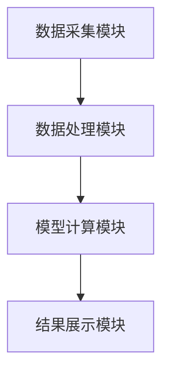
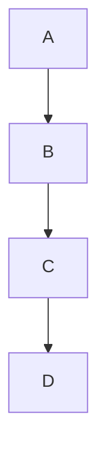
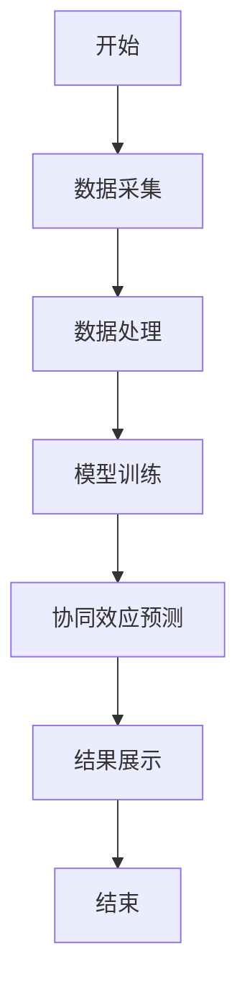

                 


# AI辅助企业并购目标估值：多维度财务模型与协同效应分析系统

**关键词：** AI, 企业并购, 财务模型, 协同效应, 技术博客, 系统架构

**摘要：**  
随着人工智能技术的快速发展，企业并购领域的估值方法也在不断革新。传统的财务模型虽然在一定程度上能够评估企业的价值，但在面对复杂多变的市场环境和海量数据时，往往显得力不从心。本文将探讨如何利用人工智能技术构建多维度财务模型，结合协同效应分析系统，为企业并购目标估值提供更高效、更精准的解决方案。文章从背景介绍、核心概念、算法原理、系统架构设计到实际案例分析，全面解析AI在企业并购估值中的应用，并展望未来的发展方向。

---

## 第1章: 企业并购与AI技术的结合

### 1.1 企业并购的基本概念
企业并购是指一家企业通过购买另一家企业的一部分或全部股权，以实现业务扩张、资源优化或市场拓展的一种商业行为。并购的核心目标在于创造价值，但同时也伴随着巨大的风险，尤其是在估值不准确的情况下，可能导致企业价值的高估或低估。

#### 1.1.1 企业并购的定义与类型
企业并购可以分为两种主要类型：一种是“横向并购”，即在同一行业内的并购，目的是扩大市场份额或消除竞争；另一种是“纵向并购”，即在产业链上下游的并购，以实现资源整合和协同效应。此外，还有混合并购，即在不同行业之间的并购。

#### 1.1.2 企业并购的动机与目标
企业并购的动机多种多样，包括寻求增长、获取技术、降低生产成本、扩大市场影响力等。并购的最终目标是通过整合资源和优化运营，实现企业价值的最大化。

#### 1.1.3 企业并购的流程与挑战
企业并购的流程通常包括以下几个阶段：  
1. **战略规划**：明确并购目标和动机。  
2. **目标筛选**：根据财务、市场和战略等因素筛选潜在目标。  
3. **尽职调查**：对目标企业进行全面的财务、法律和市场分析。  
4. **估值与谈判**：确定目标企业的估值，并与卖方进行谈判。  
5. **整合与实施**：完成并购后的资源整合和业务整合。  

并购过程中面临的主要挑战包括信息不对称、估值误差、整合风险以及文化冲突等。

### 1.2 AI技术在企业并购中的应用
人工智能技术的引入为企业并购提供了新的可能性。通过AI技术，企业可以更高效地处理海量数据，发现隐藏的市场趋势和企业价值，从而提升并购决策的准确性和效率。

#### 1.2.1 AI技术的基本概念
人工智能（AI）是指计算机系统模拟人类智能的能力，包括学习、推理、判断和自适应等功能。AI的核心技术包括机器学习、自然语言处理、计算机视觉等。

#### 1.2.2 AI在企业并购中的优势
AI技术在企业并购中的优势主要体现在以下几个方面：  
1. **数据处理能力**：AI可以快速处理和分析海量数据，提取有价值的信息。  
2. **预测能力**：通过机器学习模型，AI可以预测目标企业的未来表现和市场趋势。  
3. **自动化与效率**：AI可以自动化完成数据收集、分析和估值工作，大幅提高效率。  

#### 1.2.3 企业并购的现状与趋势
目前，企业并购的主要挑战在于如何准确评估目标企业的价值。传统的方法依赖于财务指标和主观判断，存在较大的不确定性。随着AI技术的成熟，企业并购正在向更加数据驱动和智能化的方向发展。

### 1.3 多维度财务模型与协同效应分析
#### 1.3.1 多维度财务模型的定义
多维度财务模型是一种基于多个维度（如财务、市场、技术等）对企业价值进行评估的模型。与传统的一维模型相比，多维度模型能够更全面地反映企业的实际情况。

#### 1.3.2 协同效应的定义与分类
协同效应是指在企业并购后，通过资源整合和业务协同所产生的一种额外价值。协同效应可以分为财务协同效应和战略协同效应两大类。

#### 1.3.3 多维度财务模型与协同效应的关系
多维度财务模型通过综合考虑多个维度的因素，能够更好地识别和评估协同效应。协同效应的实现往往依赖于模型中多个维度的优化和整合。

### 1.4 本章小结
本章介绍了企业并购的基本概念、AI技术的应用优势以及多维度财务模型与协同效应的关系。通过这些内容，我们可以看到，AI技术在企业并购中的应用前景广阔，尤其是在提升估值准确性和实现协同效应方面。

---

## 第2章: 多维度财务模型的核心概念

### 2.1 多维度财务模型的构建原理
#### 2.1.1 多维度模型的基本结构
多维度财务模型通常包括以下几个维度：  
1. **财务维度**：包括收入、利润、现金流等指标。  
2. **市场维度**：包括市场份额、竞争对手分析等。  
3. **技术维度**：包括技术创新能力、研发能力等。  
4. **管理维度**：包括组织结构、管理团队等。  

#### 2.1.2 数据采集与处理
数据采集是构建多维度模型的第一步。数据来源包括公开的财务报表、行业报告、市场数据等。数据处理包括数据清洗、特征提取和数据转换。

#### 2.1.3 模型的输入与输出
模型的输入包括多个维度的特征变量，输出则是目标企业的估值和协同效应的预测值。

### 2.2 协同效应的计算方法
#### 2.2.1 协同效应的定义与分类
协同效应可以分为财务协同效应和战略协同效应。财务协同效应包括成本协同、收入协同等；战略协同效应包括市场协同、技术协同等。

#### 2.2.2 协同效应的计算公式
协同效应的计算公式可以表示为：  
$$ \text{协同效应} = \text{协同收益} - \text{协同成本} $$  
其中，协同收益包括收入增长、成本节约等，协同成本包括整合成本、过渡成本等。

#### 2.2.3 协同效应的评估指标
常用的协同效应评估指标包括协同效应占比、协同效应贡献度等。

### 2.3 多维度模型与协同效应的关联
#### 2.3.1 多维度模型的维度选择
在构建多维度模型时，需要根据企业的实际情况选择合适的维度。例如，对于技术驱动型的企业，技术维度尤为重要。

#### 2.3.2 协同效应的多维度分析
通过多维度模型，可以对协同效应进行全方位的分析，从而更准确地预测协同效应的实现情况。

#### 2.3.3 模型的优化与调整
模型的优化与调整需要根据实际数据和反馈结果进行。例如，可以通过机器学习算法对模型进行训练和优化，以提高模型的预测准确度。

### 2.4 本章小结
本章详细介绍了多维度财务模型的核心概念和构建原理，并探讨了协同效应的计算方法和评估指标。通过多维度模型，可以更全面地评估企业并购的潜在价值。

---

## 第3章: AI辅助企业并购目标估值的系统架构

### 3.1 系统功能设计
#### 3.1.1 数据采集模块
数据采集模块负责从多种数据源（如公开数据库、企业财报等）获取数据，并进行清洗和预处理。

#### 3.1.2 模型计算模块
模型计算模块利用机器学习算法（如回归分析、决策树等）对目标企业的估值和协同效应进行预测。

#### 3.1.3 结果展示模块
结果展示模块将模型的输出结果以可视化的方式呈现，方便用户理解和决策。

### 3.2 系统架构设计
#### 3.2.1 系统架构图


#### 3.2.2 模块之间的交互关系
模块之间的交互关系可以用以下流程图表示：  


#### 3.2.3 系统的扩展性与可维护性
系统设计需要考虑扩展性和可维护性，例如通过模块化设计和接口标准化来实现。

### 3.3 系统接口设计
#### 3.3.1 数据接口规范
数据接口需要遵循统一的标准，例如使用API接口进行数据传输。

#### 3.3.2 API设计
API设计需要考虑请求方式、参数格式和返回格式。

#### 3.3.3 用户界面设计
用户界面需要简洁直观，方便用户进行操作和数据查看。

### 3.4 本章小结
本章从系统架构的角度，详细介绍了AI辅助企业并购目标估值系统的功能设计、架构设计和接口设计。通过系统的构建，可以实现企业并购估值的高效和准确。

---

## 第4章: 多维度财务模型与协同效应分析系统

### 4.1 多维度模型与协同效应的关联
#### 4.1.1 多维度模型的维度选择
在构建多维度模型时，需要根据企业的实际情况选择合适的维度。

#### 4.1.2 协同效应的多维度分析
通过多维度模型，可以对协同效应进行全方位的分析，从而更准确地预测协同效应的实现情况。

#### 4.1.3 模型的优化与调整
模型的优化与调整需要根据实际数据和反馈结果进行。例如，可以通过机器学习算法对模型进行训练和优化，以提高模型的预测准确度。

### 4.2 协同效应的数学模型
#### 4.2.1 协同效应的计算公式
协同效应的计算公式可以表示为：  
$$ \text{协同效应} = \text{协同收益} - \text{协同成本} $$  

#### 4.2.2 协同收益的计算
协同收益包括收入增长和成本节约。收入增长可以通过市场扩展和产品协同实现，成本节约可以通过资源共享和流程优化实现。

#### 4.2.3 协同成本的计算
协同成本包括整合成本和过渡成本。整合成本包括人员调整、系统整合等，过渡成本包括时间成本和管理成本。

### 4.3 协同效应的算法实现
#### 4.3.1 算法流程图


#### 4.3.2 Python核心代码实现
以下是协同效应预测的Python代码示例：
```python
import pandas as pd
from sklearn.linear_model import LinearRegression

# 数据加载
data = pd.read_csv('并购数据.csv')

# 特征选择
features = ['收入', '利润', '市场份额']
target = '协同效应'

# 模型训练
model = LinearRegression()
model.fit(data[features], data[target])

# 预测协同效应
predicted_synergy = model.predict(data[features])
```

### 4.4 本章小结
本章详细介绍了协同效应的数学模型和算法实现，并通过Python代码展示了协同效应预测的具体过程。通过多维度模型和协同效应分析系统，可以更准确地评估企业并购的潜在价值。

---

## 第5章: 项目实战——企业并购估值分析

### 5.1 环境安装与配置
#### 5.1.1 安装Python环境
安装Python和必要的库，例如pandas、numpy、scikit-learn等。

#### 5.1.2 数据获取与预处理
从公开数据源获取企业并购的相关数据，并进行清洗和预处理。

### 5.2 核心代码实现
#### 5.2.1 数据加载与特征选择
```python
import pandas as pd

# 数据加载
data = pd.read_csv('并购数据.csv')

# 特征选择
features = ['收入', '利润', '市场份额']
target = '协同效应'
```

#### 5.2.2 模型训练与预测
```python
from sklearn.linear_model import LinearRegression

# 模型训练
model = LinearRegression()
model.fit(data[features], data[target])

# 预测协同效应
predicted_synergy = model.predict(data[features])
```

#### 5.2.3 结果可视化与分析
```python
import matplotlib.pyplot as plt

# 绘制实际值与预测值的散点图
plt.scatter(data[target], predicted_synergy)
plt.xlabel('实际协同效应')
plt.ylabel('预测协同效应')
plt.show()
```

### 5.3 实际案例分析
#### 5.3.1 案例背景
以某企业为例，分析其并购目标企业的估值和协同效应。

#### 5.3.2 数据分析与模型预测
通过数据预处理和模型训练，预测目标企业的协同效应和估值。

#### 5.3.3 结果解读与决策建议
解读模型预测结果，提出并购决策的建议。

### 5.4 项目小结
本章通过实际案例分析，展示了AI技术在企业并购估值中的应用。通过模型的训练和预测，可以更准确地评估企业并购的潜在价值。

---

## 第6章: 总结与展望

### 6.1 本章总结
本文详细介绍了AI辅助企业并购目标估值的多维度财务模型与协同效应分析系统。通过构建多维度模型和协同效应分析系统，可以更高效、更精准地评估企业并购的潜在价值。

### 6.2 未来展望
未来，随着AI技术的不断发展，企业并购估值的方法将更加多样化和智能化。例如，可以通过深度学习技术进一步优化模型，提高预测的准确性和实时性。

### 6.3 最佳实践与注意事项
在实际应用中，需要注意数据的质量和模型的可解释性。此外，还需要结合企业的实际情况，灵活调整模型的参数和维度。

### 6.4 拓展阅读
推荐相关书籍和论文，供读者进一步学习和研究。

---

## 作者：AI天才研究院/AI Genius Institute & 禅与计算机程序设计艺术 /Zen And The Art of Computer Programming

---

**以上是文章的完整目录大纲和部分章节内容，您可以根据需要继续完成后续章节的编写。**

