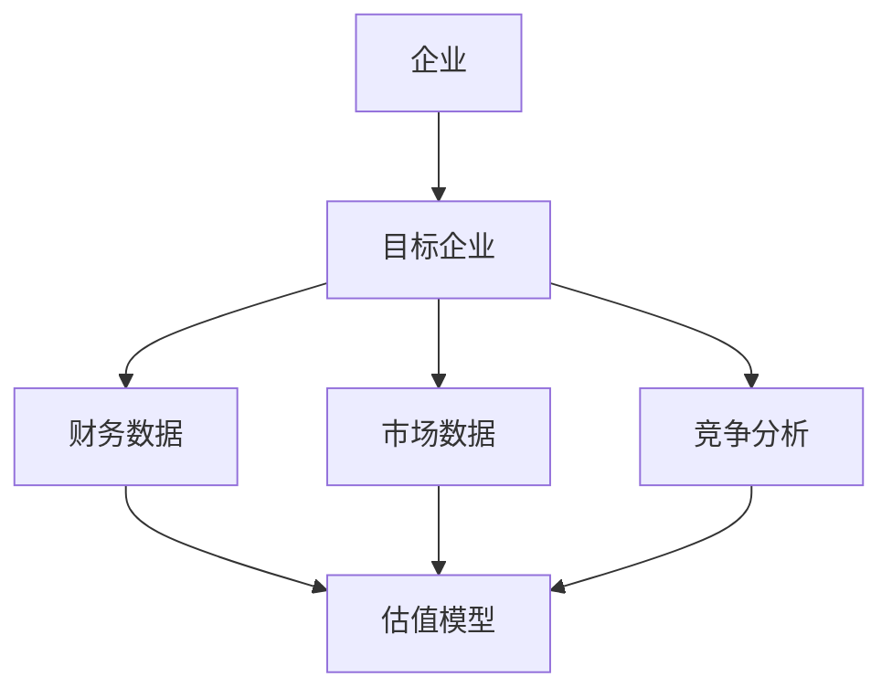
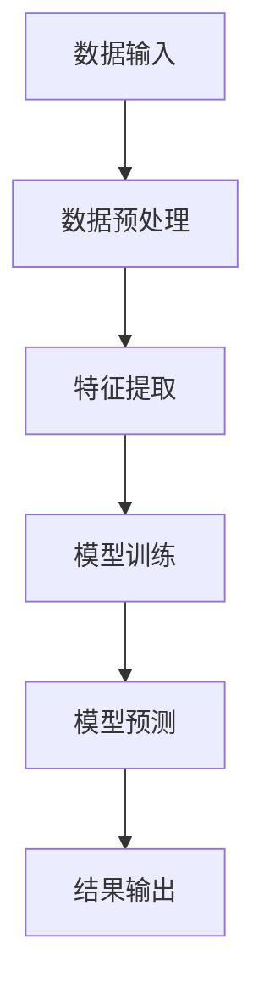
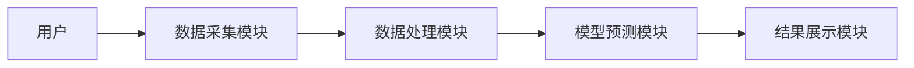
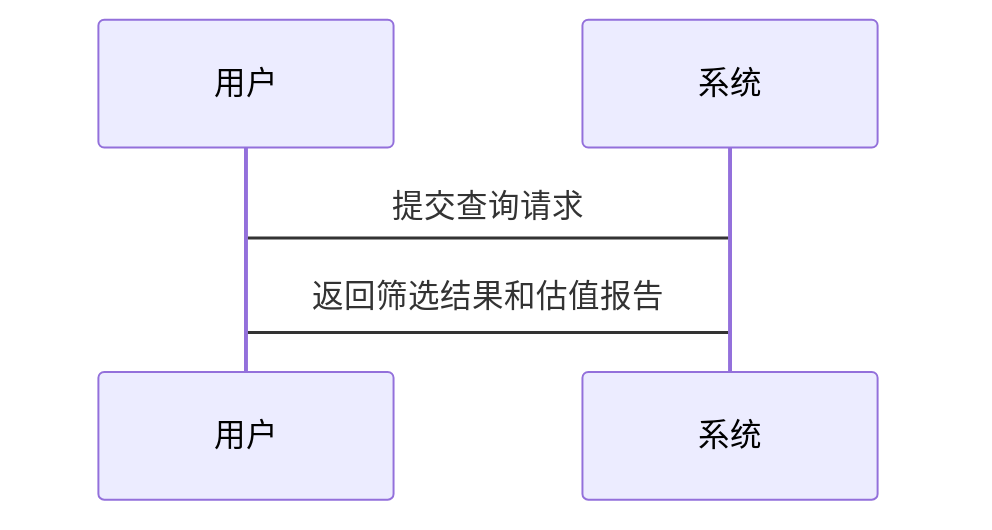

                 


# AI辅助企业并购目标筛选与估值分析

> 关键词：企业并购，AI辅助，目标筛选，估值分析，机器学习，自然语言处理，图神经网络

> 摘要：随着企业并购活动的日益频繁和复杂化，传统的并购方法已经难以满足现代企业的需求。本文将深入探讨如何利用人工智能技术，特别是机器学习、自然语言处理和图神经网络，来辅助企业并购的目标筛选与估值分析。通过结合实际案例和算法实现，本文将详细解析AI在企业并购中的应用原理和实际效果。

---

# 第一部分: AI辅助企业并购背景与核心概念

## 第1章: 企业并购与AI辅助的背景介绍

### 1.1 企业并购的基本概念
#### 1.1.1 企业并购的定义与类型
- **企业并购（Mergers and Acquisitions, M&A）**是指一家企业与其他企业合并或收购其资产、股权等行为。
- 并购类型：
  - **横向并购**：同一行业内的企业合并。
  - **纵向并购**：产业链上下游企业合并。
  - **混合并购**：无直接关联的企业合并。

#### 1.1.2 企业并购的主要驱动因素
- **战略协同**：通过并购实现资源共享、成本降低。
- **市场扩张**：进入新市场或新领域。
- **技术获取**：获取关键技术或专利。
- **财务优化**：通过并购实现规模效应或税务优化。

#### 1.1.3 并购过程中的主要问题与挑战
- **信息不对称**：目标企业的真实价值难以评估。
- **尽职调查成本高**：需要大量资源和时间进行调查。
- **估值误差**：传统估值方法主观性强，容易出现偏差。
- **整合风险**：并购后的企业文化、管理等问题可能导致失败。

### 1.2 AI技术在企业并购中的应用背景
#### 1.2.1 AI技术的发展与企业应用场景
- AI技术的发展使得数据分析、模式识别和自动化决策成为可能。
- 在企业并购中的应用场景：
  - 自动化数据收集与处理。
  - 智能目标筛选与匹配。
  - 风险评估与预测。

#### 1.2.2 并购行业对AI技术的需求
- 并购行业对数据处理和分析的需求日益增长。
- 传统方法依赖人工经验，效率低且准确性不足。
- AI技术可以提高效率、降低风险、增强决策的科学性。

#### 1.2.3 当前AI辅助并购的主要趋势
- **数据驱动决策**：利用大数据分析企业价值。
- **智能化筛选**：通过机器学习算法快速筛选目标企业。
- **动态估值模型**：基于实时数据动态调整估值。

### 1.3 本章小结
本章介绍了企业并购的基本概念、主要驱动因素和面临的挑战，并重点探讨了AI技术在企业并购中的应用背景和发展趋势，为后续章节的深入分析奠定了基础。

---

## 第2章: AI辅助企业并购的核心概念与联系

### 2.1 核心概念原理
#### 2.1.1 数据驱动的并购决策
- **数据来源**：企业财务数据、市场数据、新闻数据等。
- **数据预处理**：清洗、整合和特征提取。
- **数据驱动决策**：基于数据分析结果进行目标筛选和估值。

#### 2.1.2 AI模型在目标筛选中的作用
- **机器学习模型**：用于分类、回归和聚类分析。
- **自然语言处理（NLP）**：分析企业新闻、年报等文本数据。
- **图神经网络**：分析企业之间的关系网络。

#### 2.1.3 估值分析的AI方法论
- **特征工程**：构建有效的特征集合。
- **模型选择**：选择适合的AI模型进行估值预测。
- **结果解释**：通过可视化和解释性分析理解模型输出。

### 2.2 核心概念属性特征对比表格
| 概念       | 特征1         | 特征2         | 特征3         |
|------------|---------------|---------------|---------------|
| 数据来源   | 内部数据       | 第三方数据     | 公开数据       |
| 模型类型   | 机器学习       | 自然语言处理   | 图神经网络     |
| 评估指标   | 准确率         | 召回率         | F1值           |

### 2.3 实体关系图（ER图）


### 2.4 本章小结
本章详细阐述了AI辅助企业并购的核心概念，包括数据驱动决策、AI模型在目标筛选中的作用以及估值分析的方法论，并通过对比表格和实体关系图进一步明确了各概念之间的联系。

---

## 第3章: AI辅助企业并购的算法原理

### 3.1 算法原理概述
#### 3.1.1 机器学习在目标筛选中的应用
- **算法选择**：随机森林、支持向量机（SVM）、神经网络等。
- **数据特征**：企业财务指标、市场份额、增长潜力等。
- **模型训练**：基于历史并购数据训练模型。

#### 3.1.2 自然语言处理在企业描述分析中的应用
- **文本数据**：企业年报、新闻报道等。
- **文本预处理**：分词、去停用词、向量化。
- **情感分析**：分析企业声誉和市场信心。

#### 3.1.3 图神经网络在关系分析中的应用
- **关系网络**：企业之间的合作、竞争、供应链等关系。
- **图嵌入**：通过图神经网络生成企业关系的向量表示。
- **关系预测**：预测企业之间的潜在合作机会。

### 3.2 算法流程图


### 3.3 算法实现代码
```python
# 示例代码：机器学习模型训练
import pandas as pd
from sklearn.model_selection import train_test_split
from sklearn.ensemble import RandomForestClassifier

# 数据加载与预处理
data = pd.read_csv('merger_data.csv')
X = data.drop('target', axis=1)
y = data['target']

# 划分训练集与测试集
X_train, X_test, y_train, y_test = train_test_split(X, y, test_size=0.2)

# 模型训练
model = RandomForestClassifier()
model.fit(X_train, y_train)

# 模型预测
y_pred = model.predict(X_test)
```

### 3.4 数学模型与公式
#### 3.4.1 机器学习模型的损失函数
$$ L = \frac{1}{n}\sum_{i=1}^{n}(y_i - \hat{y_i})^2 $$

#### 3.4.2 图神经网络的边权重计算
$$ W_{ij} = \frac{1}{1 + |i-j|} $$

### 3.5 本章小结
本章详细介绍了AI辅助企业并购中常用的算法原理，包括机器学习、自然语言处理和图神经网络的应用，并通过流程图和代码示例展示了算法实现的步骤。

---

## 第4章: 系统分析与架构设计方案

### 4.1 问题场景介绍
- **场景描述**：企业需要快速筛选并购目标并进行估值分析。
- **主要问题**：数据分散、分析复杂、决策时间长。

### 4.2 系统功能设计
- **数据采集模块**：从多个数据源获取企业数据。
- **数据处理模块**：清洗、整合和特征提取。
- **模型预测模块**：基于机器学习模型进行目标筛选和估值预测。
- **结果展示模块**：可视化分析结果。

### 4.3 系统架构设计


### 4.4 系统接口设计
- **输入接口**：接收企业数据和用户查询。
- **输出接口**：提供筛选结果和估值报告。

### 4.5 系统交互序列图


### 4.6 本章小结
本章从系统设计的角度出发，详细介绍了AI辅助企业并购系统的功能设计、架构设计和接口设计，为后续的系统实现提供了理论基础。

---

## 第5章: 项目实战与案例分析

### 5.1 环境安装
- **工具安装**：Python、TensorFlow、Scikit-learn、Mermaid等。
- **数据集准备**：获取企业并购相关数据。

### 5.2 系统核心实现源代码
```python
# 示例代码：系统核心实现
import pandas as pd
from sklearn.ensemble import RandomForestClassifier
from sklearn.metrics import accuracy_score

# 数据加载与预处理
data = pd.read_csv('merger_data.csv')
X = data.drop('target', axis=1)
y = data['target']

# 划分训练集与测试集
X_train, X_test, y_train, y_test = train_test_split(X, y, test_size=0.2)

# 模型训练
model = RandomForestClassifier()
model.fit(X_train, y_train)

# 模型预测
y_pred = model.predict(X_test)

# 模型评估
accuracy = accuracy_score(y_test, y_pred)
print(f'模型准确率：{accuracy}')
```

### 5.3 代码应用解读与分析
- **数据预处理**：清洗和整合数据，提取关键特征。
- **模型训练**：使用随机森林算法进行分类。
- **模型评估**：计算准确率、召回率等指标。

### 5.4 实际案例分析
- **案例背景**：某企业希望通过AI辅助筛选目标企业。
- **数据分析**：提取财务指标、市场份额等特征。
- **结果展示**：筛选出高潜力目标企业并生成估值报告。

### 5.5 本章小结
本章通过实际案例分析展示了AI辅助企业并购系统的实现过程，包括环境安装、代码实现和结果分析。

---

## 第6章: 最佳实践与小结

### 6.1 最佳实践 tips
- **数据质量**：确保数据准确性和完整性。
- **模型选择**：根据实际需求选择合适的算法。
- **结果解释**：提供可解释的分析结果，便于决策者理解。

### 6.2 本章小结
本章总结了AI辅助企业并购的主要内容和最佳实践，并提出了未来的研究方向。

---

# 第七章: 总结

## 7.1 本文总结
- 本文详细探讨了AI辅助企业并购的目标筛选与估值分析，介绍了核心概念、算法原理和系统设计。
- AI技术的应用显著提高了并购效率和准确性。

## 7.2 未来展望
- **技术发展**：深度学习和强化学习在并购中的应用。
- **应用场景扩展**：AI技术在并购后的整合和风险管理中的应用。

---

# 作者：AI天才研究院/AI Genius Institute & 禅与计算机程序设计艺术 /Zen And The Art of Computer Programming

