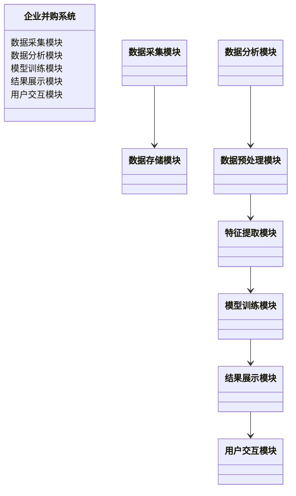
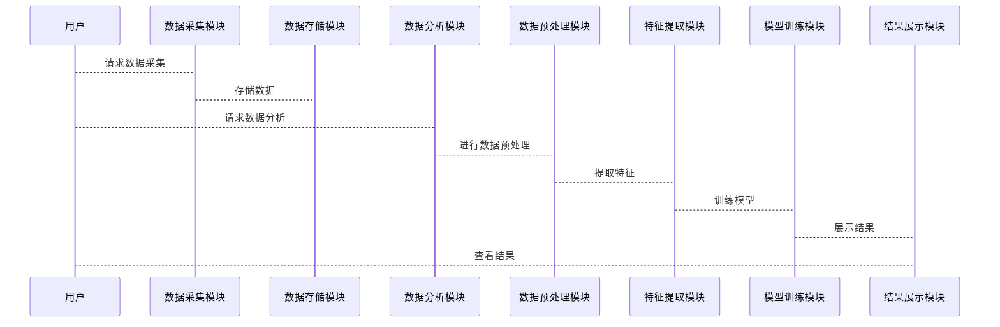

                 


# AI辅助企业并购目标筛选：战略匹配度评估与协同潜力分析

> 关键词：企业并购，人工智能，战略匹配度，协同潜力，目标筛选

> 摘要：随着企业并购活动的日益频繁，如何利用人工智能技术高效筛选并购目标，评估战略匹配度和协同潜力，成为企业决策者和数据科学家关注的焦点。本文将从AI辅助企业并购的核心概念出发，详细探讨战略匹配度评估与协同潜力分析的算法原理、系统架构设计及项目实战，为企业并购提供科学的决策支持。

---

## 第1章: 企业并购与AI辅助的必要性

### 1.1 企业并购的定义与重要性

企业并购是指企业之间通过合并、收购等方式，整合资源、扩展业务范围、增强竞争力的一种商业行为。并购不仅仅是简单的资产交易，更是一种战略性的资源整合过程。企业并购的直接目标是实现规模效应、获取技术优势、拓展市场或优化资产结构。

#### 1.1.1 企业并购的基本概念
- **并购类型**：包括横向并购、纵向并购和混合并购。
- **并购动机**：包括战略协同、市场扩展、技术获取和成本优化。
- **并购风险**：包括整合风险、文化冲突和财务风险。

#### 1.1.2 企业并购的驱动因素
- **市场竞争加剧**：企业需要通过并购快速扩大市场份额。
- **技术变革加速**：企业需要通过并购获取新技术和创新能力。
- **经济周期波动**：企业通过并购实现资产优化和成本控制。

#### 1.1.3 企业并购的战略意义
- **提升竞争力**：通过并购整合资源，提升企业的市场地位。
- **优化资产结构**：通过并购实现资产的高效配置。
- **推动创新**：通过并购获取新技术和新团队，加速创新步伐。

### 1.2 AI技术在企业并购中的应用潜力

随着AI技术的快速发展，企业并购的决策过程也在逐步智能化。AI技术能够帮助企业更高效地筛选并购目标，评估战略匹配度和协同潜力，降低并购风险。

#### 1.2.1 AI技术对企业并购的赋能
- **数据处理能力**：AI能够快速处理海量数据，提取关键信息。
- **模式识别能力**：AI能够识别潜在的并购机会和风险。
- **预测能力**：AI能够基于历史数据预测并购后的协同效应。

#### 1.2.2 AI在企业并购中的应用场景
- **目标筛选**：通过AI分析企业数据，筛选出符合战略匹配度的潜在并购目标。
- **估值分析**：利用AI技术评估目标企业的价值，提供精准的估值建议。
- **整合规划**：基于AI分析结果，制定并购后的整合计划，优化协同效应。

#### 1.2.3 AI辅助企业并购的优势与挑战
- **优势**：
  - 提高并购效率，缩短决策时间。
  - 减少人为错误，提高决策的准确性。
  - 发现潜在机会，提升并购的创新性。
- **挑战**：
  - 数据质量要求高，需要大量高质量的历史数据。
  - 模型的可解释性问题，需要确保AI决策的透明性。
  - 伦理和法律问题，需要遵守相关法律法规。

---

## 第2章: AI辅助企业并购的核心概念

### 2.1 战略匹配度评估

战略匹配度评估是判断目标企业是否与自身战略目标一致的重要指标。通过分析企业的核心竞争力、市场定位、文化契合度等因素，评估并购的可行性。

#### 2.1.1 战略匹配度的定义
战略匹配度是指目标企业与自身在战略目标、核心能力和资源互补性等方面的契合程度。

#### 2.1.2 战略匹配度的评估维度
- **战略目标一致性**：目标企业的发展战略是否与自身一致。
- **核心能力互补性**：目标企业的核心能力是否能够互补。
- **文化契合度**：目标企业的文化和组织结构是否能够融合。

#### 2.1.3 战略匹配度的计算模型
基于向量空间模型的相似度计算公式：
$$\text{战略匹配度} = \frac{\vec{A} \cdot \vec{B}}{|\vec{A}| \cdot |\vec{B}|}$$
其中，$\vec{A}$和$\vec{B}$分别表示目标企业和自身的核心竞争力向量。

### 2.2 协同潜力分析

协同潜力分析是评估并购后双方在业务、技术和管理等方面的协同效应，最大化资源整合效益。

#### 2.2.1 协同潜力的定义
协同潜力是指并购后双方在业务、技术和管理等方面实现协同的可能性和程度。

#### 2.2.2 协同潜力的评估维度
- **业务协同性**：目标企业的业务是否能够与自身形成协同。
- **技术互补性**：目标企业的技术是否能够与自身互补。
- **管理兼容性**：目标企业的管理风格是否能够与自身兼容。

#### 2.2.3 协同潜力的计算模型
基于关联规则挖掘的协同潜力评分公式：
$$\text{协同潜力} = \sum_{i=1}^n \text{规则强度}(r_i)$$
其中，$r_i$表示第$i$条关联规则的强度。

### 2.3 战略匹配度与协同潜力的关系

战略匹配度和协同潜力是两个相互关联但又有区别的概念。战略匹配度关注的是并购的战略一致性，而协同潜力关注的是并购后的资源整合效应。两者共同决定了并购的最终成功与否。

---

## 第3章: AI辅助企业并购的目标筛选流程

### 3.1 数据收集与预处理

数据是AI辅助企业并购的基础，需要从多个渠道收集目标企业的数据，并进行清洗和标准化处理。

#### 3.1.1 数据来源与采集方式
- **公开数据**：包括企业财务报表、市场报告、新闻资讯等。
- **内部数据**：包括企业战略规划、内部文档等。
- **第三方数据**：包括企业信用评分、行业分析报告等。

#### 3.1.2 数据清洗与标准化
- **数据清洗**：去除重复数据、处理缺失值、剔除异常值。
- **数据标准化**：将数据转换为统一的格式，便于后续分析。

#### 3.1.3 数据存储与管理
- **数据仓库**：将数据存储在数据库中，便于查询和分析。
- **数据湖**：将数据存储在数据湖中，支持多种数据格式和分析需求。

### 3.2 战略匹配度评估模型

基于向量空间模型的战略匹配度评估模型，能够量化目标企业与自身在战略目标、核心能力和文化契合度等方面的匹配程度。

#### 3.2.1 模型输入与输出
- **输入**：目标企业的核心竞争力向量。
- **输出**：战略匹配度评分。

#### 3.2.2 模型训练与优化
- **训练数据**：需要大量历史并购案例数据，用于模型训练。
- **优化方法**：使用交叉验证和网格搜索，优化模型参数。

#### 3.2.3 模型评估与验证
- **评估指标**：使用准确率、召回率和F1值等指标评估模型性能。
- **验证方法**：使用测试集验证模型的泛化能力。

### 3.3 协同潜力分析模型

基于关联规则挖掘的协同潜力分析模型，能够量化目标企业在业务、技术和管理等方面的协同潜力。

#### 3.3.1 模型输入与输出
- **输入**：目标企业的业务、技术和管理数据。
- **输出**：协同潜力评分。

#### 3.3.2 模型训练与优化
- **训练数据**：需要大量历史并购案例数据，用于模型训练。
- **优化方法**：使用Apriori算法优化关联规则的挖掘过程。

#### 3.3.3 模型评估与验证
- **评估指标**：使用支持度和置信度评估关联规则的质量。
- **验证方法**：使用测试集验证模型的泛化能力。

### 3.4 综合评估与目标筛选

综合评估模型能够将战略匹配度和协同潜力综合起来，给出目标企业的综合评分，帮助企业筛选出最合适的并购目标。

#### 3.4.1 综合评估指标的构建
- **权重分配**：根据企业战略目标，分配战略匹配度和协同潜力的权重。
- **综合评分公式**：
$$\text{综合评分} = \alpha \cdot \text{战略匹配度} + (1-\alpha) \cdot \text{协同潜力}$$
其中，$\alpha$是战略匹配度的权重。

#### 3.4.2 目标企业的排序与筛选
- **排序方法**：根据综合评分对目标企业进行排序。
- **筛选标准**：根据企业战略目标，设定综合评分的筛选阈值。

#### 3.4.3 筛选结果的可视化与解释
- **可视化工具**：使用图表展示目标企业的综合评分分布。
- **结果解释**：根据综合评分解释目标企业的并购可行性。

---

## 第4章: AI辅助企业并购的算法原理与数学模型

### 4.1 战略匹配度评估的算法原理

基于向量空间模型的战略匹配度评估算法，通过计算目标企业核心竞争力向量与自身核心竞争力向量的相似度，量化战略匹配度。

#### 4.1.1 向量空间模型的构建
- **特征提取**：从目标企业的财务、市场和管理数据中提取特征。
- **向量表示**：将特征表示为向量，每个维度表示一个特征。

#### 4.1.2 余弦相似度的计算
$$\text{余弦相似度} = \frac{\vec{A} \cdot \vec{B}}{|\vec{A}| \cdot |\vec{B}|}$$
其中，$\vec{A}$和$\vec{B}$分别表示目标企业和自身的核心竞争力向量。

#### 4.1.3 案例分析
假设目标企业A的核心竞争力向量为$\vec{A} = [0.8, 0.6, 0.7]$，自身的核心竞争力向量为$\vec{B} = [0.7, 0.5, 0.6]$，则：
$$\text{余弦相似度} = \frac{0.8 \cdot 0.7 + 0.6 \cdot 0.5 + 0.7 \cdot 0.6}{\sqrt{0.8^2 + 0.6^2 + 0.7^2} \cdot \sqrt{0.7^2 + 0.5^2 + 0.6^2}} = \frac{0.56 + 0.3 + 0.42}{\sqrt{1.13} \cdot \sqrt{0.89}} = \frac{1.28}{1.063 \cdot 0.943} = 0.956$$
这意味着目标企业A与自身的战略匹配度较高。

### 4.2 协同潜力分析的算法原理

基于关联规则挖掘的协同潜力分析算法，通过挖掘目标企业与自身在业务、技术和管理等方面的相关性，量化协同潜力。

#### 4.2.1 关联规则挖掘的基本原理
- **关联规则**：表示两个或多个物品之间频繁出现的关联关系。
- **支持度**：表示关联规则在数据集中出现的频率。
- **置信度**：表示在给定条件下，关联规则成立的概率。

#### 4.2.2 Apriori算法的实现步骤
1. **生成候选项集**：根据支持度阈值，生成候选项集。
2. **计算支持度**：统计候选项集在数据集中的出现频率。
3. **生成关联规则**：根据置信度阈值，生成最终的关联规则。

#### 4.2.3 协同潜力的关联规则表示
- **业务协同**：例如，如果目标企业A与自身在市场区域上有较高的关联度，则表示业务协同潜力较高。
- **技术互补**：例如，如果目标企业A与自身在技术领域上有较高的关联度，则表示技术互补潜力较高。

### 4.3 综合评估模型的数学公式与实现

综合评估模型将战略匹配度和协同潜力综合起来，给出目标企业的综合评分。

#### 4.3.1 综合评估指标的权重分配
- **权重分配**：根据企业战略目标，分配战略匹配度和协同潜力的权重。例如，战略匹配度的权重为0.6，协同潜力的权重为0.4。

#### 4.3.2 综合评分公式
$$\text{综合评分} = 0.6 \cdot \text{战略匹配度} + 0.4 \cdot \text{协同潜力}$$

---

## 第5章: AI辅助企业并购的系统架构设计

### 5.1 系统功能设计

系统功能设计包括数据采集、数据分析、模型训练、结果展示和用户交互等功能模块。

#### 5.1.1 领域模型mermaid类图


#### 5.1.2 系统架构设计mermaid架构图
```mermaid
architectural
    client - (http) - server
    server - (rest) - service_layer
    service_layer - (rpc) - data_layer
    data_layer - (jdbc) - database
```

#### 5.1.3 系统接口设计
- **数据接口**：用于与数据源交互，获取目标企业的数据。
- **模型接口**：用于与机器学习模型交互，进行战略匹配度和协同潜力的评估。
- **用户接口**：用于与用户交互，展示结果和接收用户输入。

#### 5.1.4 系统交互mermaid序列图


---

## 第6章: 项目实战

### 6.1 环境安装

项目实战需要安装以下环境：

- **Python**：用于编程和数据分析。
- **Pandas**：用于数据处理。
- **Scikit-learn**：用于机器学习模型训练。
- **Apriori**：用于关联规则挖掘。

#### 6.1.1 安装Python和相关库
```bash
pip install numpy pandas scikit-learn
```

### 6.2 核心实现源代码

以下是战略匹配度和协同潜力分析的核心代码示例：

#### 6.2.1 战略匹配度评估代码
```python
from sklearn.metrics.pairwise import cosine_similarity

# 目标企业的核心竞争力向量
target_vector = [0.8, 0.6, 0.7]
# 自身的核心竞争力向量
self_vector = [0.7, 0.5, 0.6]

# 计算余弦相似度
similarity = cosine_similarity([target_vector], [self_vector])
print("战略匹配度：", similarity[0][0])
```

#### 6.2.2 协同潜力分析代码
```python
from apyori import apriori

# 数据集
data = [
    [1, 2],
    [2, 3],
    [1, 2],
    [2, 3],
    [1, 2]
]

# 训练关联规则模型
rules = apriori(data, min_support=0.6, min_confidence=0.7)

# 输出关联规则
for rule in rules:
    print(rule)
```

### 6.3 案例分析

#### 6.3.1 案例背景
假设某企业计划并购一家目标企业，目标企业A和目标企业B的战略匹配度和协同潜力分别为：

- **目标企业A**：战略匹配度为0.95，协同潜力为0.85。
- **目标企业B**：战略匹配度为0.80，协同潜力为0.90。

综合评分公式：
$$\text{综合评分} = 0.6 \cdot \text{战略匹配度} + 0.4 \cdot \text{协同潜力}$$

计算结果：
- **目标企业A**：$0.6 \times 0.95 + 0.4 \times 0.85 = 0.57 + 0.34 = 0.91$
- **目标企业B**：$0.6 \times 0.80 + 0.4 \times 0.90 = 0.48 + 0.36 = 0.84$

因此，目标企业A的综合评分为0.91，高于目标企业B的0.84，建议优先选择目标企业A。

### 6.4 项目总结

通过本项目，我们展示了如何利用AI技术辅助企业并购目标筛选，评估战略匹配度和协同潜力。通过向量空间模型和关联规则挖掘算法，能够量化目标企业的综合评分，为企业并购提供科学的决策支持。

---

## 第7章: 最佳实践与注意事项

### 7.1 最佳实践

- **数据质量**：确保数据的准确性和完整性，避免噪声数据对模型的影响。
- **模型优化**：根据实际需求，不断优化模型参数，提高模型的准确率和召回率。
- **结果解释**：结合业务背景，对模型结果进行合理的解释和验证。

### 7.2 小结

通过本文的详细介绍，我们展示了AI技术在企业并购目标筛选中的广泛应用。从战略匹配度评估到协同潜力分析，再到综合评估模型的构建，AI技术能够帮助企业更高效地筛选并购目标，降低并购风险，提升并购成功率。

### 7.3 注意事项

- **数据隐私**：在数据采集和处理过程中，需要注意数据隐私和合规性。
- **模型透明性**：确保模型的可解释性，避免黑箱操作。
- **持续学习**：根据市场变化和企业需求，持续优化模型和算法。

### 7.4 拓展阅读

- **推荐书籍**：
  - 《企业并购：战略与管理》
  - 《机器学习实战》
- **推荐论文**：
  - “A Survey on AI in Corporate Mergers and Acquisitions”
  - “Deep Learning for Business Decision Making”

---

## 作者：AI天才研究院/AI Genius Institute & 禅与计算机程序设计艺术 /Zen And The Art of Computer Programming

---

通过本文的详细阐述，我们深入探讨了AI辅助企业并购目标筛选的核心概念、算法原理和系统架构设计，并通过实际案例展示了AI技术在企业并购中的应用。希望本文能够为企业并购的决策者和数据科学家提供有价值的参考和启发。

