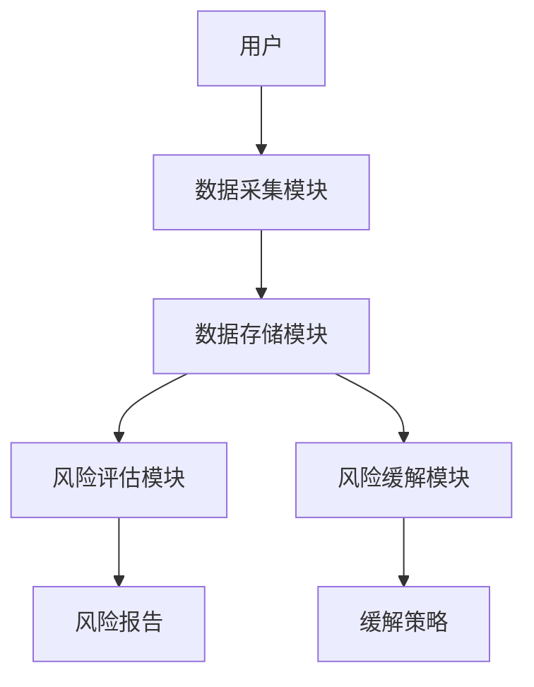
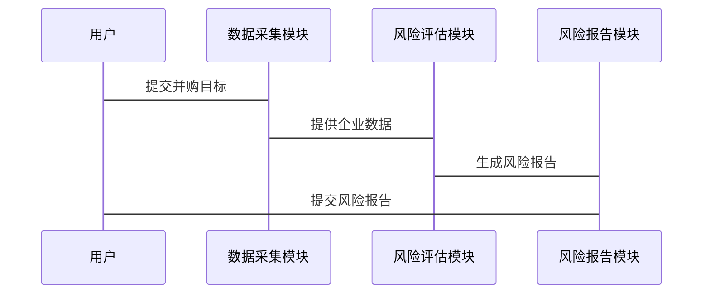

                 


# AI辅助企业并购风险评估与缓解策略

## 关键词：企业并购、AI技术、风险评估、风险缓解、系统架构

## 摘要：本文深入探讨了AI技术在企业并购中的应用，特别是如何利用AI进行风险评估和制定缓解策略。通过分析企业并购的复杂性，结合数据处理、机器学习算法和系统架构设计，本文提出了有效的AI辅助方案，以降低并购风险并提升决策效率。

---

## 第1章: 企业并购概述

### 1.1 企业并购的基本概念

#### 1.1.1 企业并购的定义与类型
企业并购是指一家企业收购另一家企业全部或部分股权，以实现战略目标的行为。常见的并购类型包括横向并购、纵向并购和混合并购。

- 横向并购：同一行业内的企业合并，以扩大市场份额。
- 纵向并购：上下游企业之间的合并，以控制价值链。
- 混合并购：不同行业之间的企业合并，以 diversify 业务。

#### 1.1.2 企业并购的流程与阶段
企业并购通常包括以下几个阶段：
1. 确定并购目标
2. 尽职调查
3. 谈判与签约
4. 交割与整合

#### 1.1.3 企业并购的核心问题
- **财务风险**：并购后的财务表现是否符合预期？
- **市场风险**：目标企业在市场中的竞争力如何？
- **法律风险**：是否存在未披露的法律纠纷？
- **操作风险**：整合过程中是否会出现管理问题？

### 1.2 AI在企业并购中的作用

#### 1.2.1 AI技术对企业并购的影响
AI技术可以通过数据挖掘、机器学习和自然语言处理（NLP）帮助企业更高效地进行并购决策。

- **数据驱动决策**：AI可以处理大量非结构化数据，如新闻、社交媒体和企业报告，提取关键信息。
- **风险预测**：通过分析历史数据，AI可以预测并购后的潜在风险。

#### 1.2.2 AI在企业并购中的应用场景
- **目标筛选**：AI可以根据企业的财务数据和市场表现，筛选出潜在的并购目标。
- **尽职调查**：AI可以辅助分析目标企业的财务报表、法律文件和市场数据。
- **估值与定价**：AI可以基于市场数据和企业绩效，提供准确的估值建议。

#### 1.2.3 AI技术的优势与局限性
- **优势**：
  - 提高效率：AI可以在短时间内处理大量数据。
  - 准确性：通过机器学习模型，AI可以提供更准确的预测。
- **局限性**：
  - 数据质量：AI依赖于高质量的数据，数据不足或错误会影响结果。
  - 解释性：复杂的机器学习模型可能难以解释其决策过程。

### 1.3 企业并购中的数据与技术挑战

#### 1.3.1 数据来源与处理
- 数据来源包括企业财务报表、新闻报道、社交媒体、行业报告等。
- 数据处理包括数据清洗、特征提取和数据标注。

#### 1.3.2 技术实现的难点
- 数据隐私问题：并购涉及敏感数据，如何保证数据安全？
- 数据整合：如何将结构化和非结构化数据整合？
- 模型选择：如何选择适合的机器学习模型？

#### 1.3.3 数据隐私与安全问题
- 数据泄露风险：并购数据可能被泄露，导致企业损失。
- 数据保护措施：需要采取加密技术和访问控制来保护数据。

### 1.4 企业并购中的风险类型

#### 1.4.1 财务风险
- 并购后的财务表现是否符合预期？
- 目标企业是否存在财务造假？

#### 1.4.2 市场风险
- 目标企业在市场中的竞争力如何？
- 行业趋势是否有利于并购后的业务发展？

#### 1.4.3 法律风险
- 目标企业是否存在未披露的法律纠纷？
- 并购是否符合当地法律法规？

#### 1.4.4 操作风险
- 并购后的整合是否顺利？
- 管理层是否能够有效协同？

### 1.5 案例分析: AI在企业并购中的实际应用

#### 1.5.1 国内外经典案例
- **案例1**：某科技公司并购一家初创企业，利用AI分析其技术专利和团队稳定性，成功降低风险。
- **案例2**：某跨国企业并购一家海外公司，利用AI进行跨语言文本分析，发现潜在法律问题。

#### 1.5.2 案例分析与经验总结
- **经验总结**：AI的应用显著提高了并购决策的效率和准确性。
- **挑战**：数据质量和模型解释性仍需进一步优化。

#### 1.5.3 案例中的AI技术应用
- **技术应用**：
  - 数据清洗与特征提取。
  - 机器学习模型进行风险预测。
  - 可视化工具展示分析结果。

### 1.6 本章小结
本章介绍了企业并购的基本概念、AI在其中的作用以及面临的挑战。通过案例分析，展示了AI技术在企业并购中的实际应用及其优势。

---

## 第2章: AI辅助风险评估的核心原理

### 2.1 数据采集与处理

#### 2.1.1 数据来源
- 结构化数据：企业财务报表、销售数据。
- 非结构化数据：新闻报道、社交媒体评论。

#### 2.1.2 数据清洗与预处理
- 数据清洗：去除重复、错误或不完整的数据。
- 数据预处理：标准化、归一化。

#### 2.1.3 数据特征提取
- 文本特征提取：利用TF-IDF或Word2Vec提取关键词。
- 数值特征提取：如收入增长率、净利润率。

### 2.2 风险评估模型构建

#### 2.2.1 机器学习模型的选择
- 分类模型：如逻辑回归、支持向量机（SVM）。
- 回归模型：如线性回归、随机森林。

#### 2.2.2 模型训练与优化
- 数据分割：训练集、验证集、测试集。
- 模型调参：如网格搜索（Grid Search）。

#### 2.2.3 模型评估与验证
- 评估指标：准确率、召回率、F1分数。
- 模型验证：交叉验证、留出验证。

### 2.3 风险预测与分析

#### 2.3.1 风险预测的数学模型
- 使用逻辑回归模型预测并购风险。
- 模型公式：
  $$ P(y=1|x) = \frac{1}{1 + e^{-\beta x}} $$
  其中，$y$ 是目标变量，$x$ 是自变量，$\beta$ 是系数。

#### 2.3.2 风险分析的可视化方法
- 概率热图：展示不同目标企业的风险概率。
- 降维可视化：如t-SNE，用于展示数据分布。

#### 2.3.3 风险预测的准确性评估
- 准确率：模型预测正确的比例。
- 混淆矩阵：展示模型的预测结果。

### 2.4 算法原理与实现

#### 2.4.1 机器学习算法的原理
- 逻辑回归：通过概率模型预测风险。
- 支持向量机（SVM）：通过最大化间隔分类。

#### 2.4.2 算法实现的步骤
1. 数据预处理。
2. 特征提取。
3. 模型训练。
4. 模型评估。

#### 2.4.3 算法的优缺点分析
- 逻辑回归：优点是简单、可解释性强；缺点是假设线性关系。
- SVM：优点是分类能力强；缺点是计算复杂度高。

### 2.5 本章小结
本章详细讲解了AI辅助风险评估的核心原理，包括数据处理、模型构建和风险预测。通过数学公式和算法流程图，展示了AI技术在风险评估中的具体应用。

---

## 第3章: AI辅助企业并购风险缓解策略

### 3.1 风险识别与预警

#### 3.1.1 风险识别的AI方法
- 使用聚类分析识别高风险企业。
- 使用异常检测发现潜在问题。

#### 3.1.2 风险预警的实现机制
- 设置预警阈值：当风险概率超过阈值时触发预警。
- 预警通知：通过邮件或短信通知相关人员。

#### 3.1.3 风险识别的准确性提升
- 使用集成学习（如随机森林）提高准确性。
- 定期更新模型：根据新数据优化模型。

### 3.2 风险缓解的AI方案

#### 3.2.1 数据驱动的风险缓解策略
- 分析历史数据，找出风险发生的原因。
- 提供针对性的解决方案。

#### 3.2.2 AI辅助的决策支持
- 提供多种并购方案的模拟结果。
- 自动生成风险缓解建议。

#### 3.2.3 风险缓解的动态调整
- 根据市场变化实时调整策略。
- 使用反馈机制优化风险缓解方案。

### 3.3 风险缓解的实施步骤

#### 3.3.1 风险缓解的规划
- 设定风险缓解目标。
- 制定详细的实施计划。

#### 3.3.2 风险缓解的执行
- 实施风险缓解措施。
- 监控风险变化。

#### 3.3.3 风险缓解的效果评估
- 定期评估风险缓解效果。
- 根据评估结果调整策略。

### 3.4 本章小结
本章提出了AI辅助风险缓解的策略，包括风险识别、预警机制和动态调整。通过AI技术，企业可以更有效地应对并购中的各种风险。

---

## 第4章: 系统架构与实现

### 4.1 系统架构设计

#### 4.1.1 问题场景介绍
- 系统需要支持企业并购中的风险评估和缓解。
- 用户包括企业高管、并购顾问等。

#### 4.1.2 系统功能设计
- 数据采集模块：收集企业数据。
- 风险评估模块：分析风险并生成报告。
- 风险缓解模块：提供缓解策略。

#### 4.1.3 系统架构设计（Mermaid图）


#### 4.1.4 系统接口设计
- 数据接口：与企业数据库对接。
- 报告接口：生成并导出风险报告。

#### 4.1.5 系统交互流程（Mermaid图）


### 4.2 项目实战

#### 4.2.1 环境安装
- 安装Python和必要的库（如scikit-learn、pandas）。

#### 4.2.2 系统核心实现源代码
```python
import pandas as pd
from sklearn.linear_model import LogisticRegression
from sklearn.metrics import accuracy_score

# 数据加载
data = pd.read_csv('merger_risk.csv')

# 特征与标签分离
X = data.drop('risk', axis=1)
y = data['risk']

# 模型训练
model = LogisticRegression()
model.fit(X, y)

# 模型预测
y_pred = model.predict(X)

# 模型评估
print(accuracy_score(y, y_pred))
```

#### 4.2.3 代码应用解读与分析
- 数据加载：读取CSV文件中的企业并购数据。
- 特征分离：提取特征变量和目标变量。
- 模型训练：使用逻辑回归模型训练。
- 模型预测：对测试数据进行预测。
- 模型评估：计算准确率。

#### 4.2.4 实际案例分析
- 案例分析：分析某企业的并购风险，生成风险报告。

#### 4.2.5 项目小结
- 项目总结：AI技术在企业并购中的应用效果显著。
- 经验分享：数据质量和模型选择是关键。

### 4.3 本章小结
本章详细讲解了AI辅助企业并购系统的架构设计和实现过程，包括数据采集、风险评估和报告生成。通过实际案例分析，展示了系统的实际应用价值。

---

## 作者：AI天才研究院 & 禅与计算机程序设计艺术

