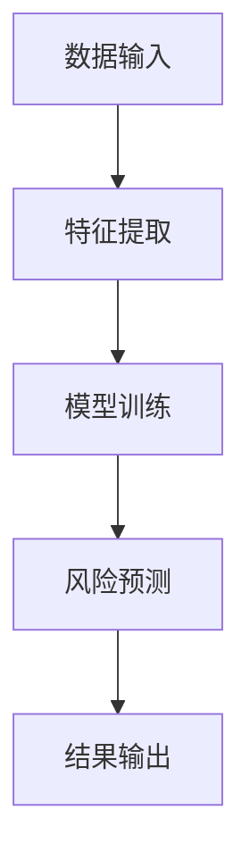
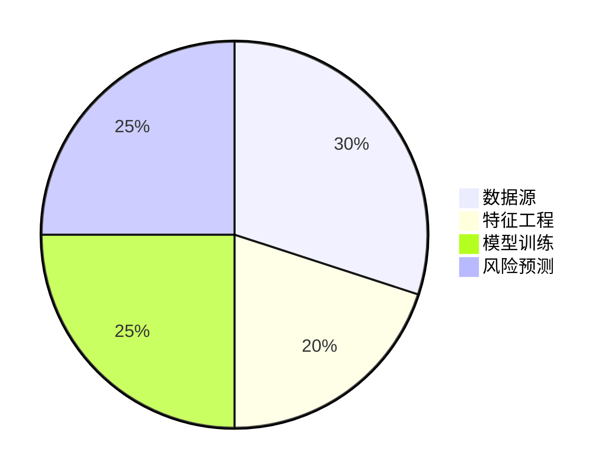

                 


# AI辅助企业并购风险评估：全面识别与量化风险

> **关键词**：企业并购、风险评估、人工智能、机器学习、风险量化  
> 
> **摘要**：本文详细探讨了如何利用人工智能技术辅助企业并购风险评估，从风险识别到量化分析，结合实际案例和系统架构设计，为企业并购决策提供科学支持。文章内容涵盖企业并购背景、AI技术优势、核心算法原理、系统架构设计、项目实战和最佳实践等，为读者提供全面的技术指导和实践参考。

---

## 正文

### 第1章: 企业并购与风险评估背景

#### 1.1 企业并购的基本概念

企业并购是企业战略发展的重要手段之一，通过整合资源、扩大规模或进入新市场，企业可以实现快速成长。并购通常包括“横向并购”（同行业竞争企业并购）、“纵向并购”（产业链上下游并购）和“混合并购”（无直接关联的业务并购）。并购的动机主要包括扩大市场份额、获取技术优势、降低运营成本和增强竞争优势等。

#### 1.2 并购中的风险与挑战

企业并购涉及复杂的法律、财务和市场因素，风险贯穿整个并购过程：

1. **财务风险**：包括目标企业财务状况不透明、负债过高或盈利能力不稳定。
2. **经营风险**：目标企业可能存在管理问题、核心团队不稳定或业务模式不可持续。
3. **市场风险**：宏观经济波动、行业竞争加剧或政策变化可能影响并购后的业务表现。
4. **法律风险**：并购涉及的法律文件复杂，可能因合规问题或反垄断调查导致并购失败。

传统的企业并购风险评估方法依赖于人工分析和经验判断，存在效率低、主观性强、覆盖面有限等缺点。企业需要更高效、更精准的工具来辅助决策。

#### 1.3 AI技术在风险评估中的应用前景

人工智能（AI）技术通过大数据分析、自然语言处理（NLP）和机器学习算法，能够快速识别和量化企业并购中的各种风险。AI的优势在于：

1. **数据处理能力**：AI可以处理海量非结构化数据（如新闻报道、社交媒体信息）和结构化数据（如财务报表、市场数据），提取有价值的风险信号。
2. **模式识别**：通过机器学习算法，AI能够发现隐藏在数据中的潜在风险模式，帮助企业在并购早期发现风险。
3. **实时监控**：AI系统可以实时跟踪市场动态和目标企业的经营状况，提供持续的风险评估支持。

### 第2章: AI辅助企业并购风险评估的核心概念

#### 2.1 风险识别与量化的基本原理

风险识别是企业并购的第一步，需要通过分析目标企业的财务、市场和法律等因素，识别潜在风险。风险量化则是将识别出的各类风险转化为可量化的指标，如风险概率、风险影响程度等。

#### 2.2 AI在风险识别与量化中的作用

AI通过以下方式辅助风险识别与量化：

1. **自然语言处理（NLP）**：分析目标企业或行业的新闻、报告和社交媒体信息，提取情感倾向和关键词，识别潜在风险。
2. **监督学习算法**：利用历史并购案例数据，训练分类模型，识别高风险并购目标。
3. **时间序列分析**：通过分析目标企业的历史财务数据，预测未来可能的风险。

#### 2.3 企业并购风险评估的核心要素

企业并购风险评估的核心要素包括：

1. **财务风险**：评估目标企业的财务健康状况，包括资产负债表、利润表和现金流分析。
2. **经营风险**：分析目标企业的业务模式、市场地位和管理团队稳定性。
3. **市场风险**：考虑宏观经济环境、行业竞争格局和政策变化对并购的影响。
4. **法律风险**：评估并购涉及的法律文件、合规性问题和潜在诉讼风险。

### 第3章: AI辅助企业并购风险评估的核心算法与模型

#### 3.1 机器学习在风险评估中的应用

机器学习算法在企业并购风险评估中的应用主要体现在以下几个方面：

1. **监督学习**：用于分类问题，如将并购案例分为“高风险”或“低风险”。
2. **无监督学习**：用于聚类分析，发现潜在的高风险企业群体。
3. **深度学习**：用于处理复杂的非结构化数据，如文本和图像。

#### 3.2 风险评估的数学模型与公式

##### 3.2.1 风险评分模型

风险评分模型通过加权计算各风险因素的得分，得出目标企业的综合风险评分：

$$
\text{风险评分} = \sum (\text{风险因素权重} \times \text{风险因素得分})
$$

##### 3.2.2 风险概率计算公式

利用逻辑回归模型计算并购失败的概率：

$$
P(\text{失败}) = \frac{1}{1 + e^{- (\beta_0 + \beta_1 x_1 + \beta_2 x_2 + \ldots + \beta_n x_n)}}
$$

其中，$x_i$ 是各风险因素，$\beta_i$ 是对应的系数。

##### 3.2.3 综合风险指数模型

综合风险指数模型将各风险因素的影响程度进行加权求和：

$$
\text{综合风险指数} = \sum (\text{风险权重} \times \text{风险指标})
$$

#### 3.3 算法流程图与系统架构设计

##### 3.3.1 风险评估算法流程图（使用mermaid）



##### 3.3.2 系统架构设计图（使用mermaid）



### 第4章: 企业并购风险评估的系统分析与架构设计

#### 4.1 系统功能设计

##### 4.1.1 数据采集模块

数据采集模块负责从多种来源获取目标企业的数据，包括财务报表、新闻报道和社交媒体信息等。

##### 4.1.2 特征工程模块

特征工程模块对采集的数据进行预处理和特征提取，包括文本清洗、数值标准化和特征选择。

##### 4.1.3 模型训练模块

模型训练模块利用机器学习算法（如逻辑回归和随机森林）对目标企业的风险进行分类和预测。

##### 4.1.4 风险预测模块

风险预测模块根据模型输出的风险评分，生成最终的并购风险评估报告。

#### 4.2 项目实战

##### 4.2.1 环境安装

安装所需的Python库：

```bash
pip install numpy pandas scikit-learn
```

##### 4.2.2 系统核心实现源代码

```python
import pandas as pd
from sklearn.model_selection import train_test_split
from sklearn.linear_model import LogisticRegression
from sklearn.metrics import accuracy_score

# 数据加载
data = pd.read_csv('并购数据.csv')

# 特征与标签分离
X = data.drop('风险标签', axis=1)
y = data['风险标签']

# 数据分割
X_train, X_test, y_train, y_test = train_test_split(X, y, test_size=0.2)

# 模型训练
model = LogisticRegression()
model.fit(X_train, y_train)

# 模型预测
y_pred = model.predict(X_test)

# 模型评估
print("准确率:", accuracy_score(y_test, y_pred))
```

##### 4.2.3 实际案例分析

以某科技公司为例，假设我们通过上述模型预测其并购风险为85%。这表明该并购存在较高的失败风险，建议企业谨慎决策。

#### 4.3 最佳实践

- **数据质量**：确保数据来源可靠，特征提取全面。
- **模型优化**：通过超参数调优和模型融合提高预测准确率。
- **持续监控**：定期更新模型和数据，保持风险评估的实时性。

### 第5章: 总结与展望

#### 5.1 总结

本文详细介绍了AI技术在企业并购风险评估中的应用，从核心概念、算法原理到系统设计，为读者提供了全面的技术指导和实践参考。

#### 5.2 展望

未来，随着AI技术的不断发展，企业并购风险评估将更加智能化和精准化。结合自然语言处理和知识图谱技术，AI将能够更全面地识别和量化风险，为企业并购决策提供更强有力的支持。

---

**作者：AI天才研究院/AI Genius Institute & 禅与计算机程序设计艺术 /Zen And The Art of Computer Programming**

