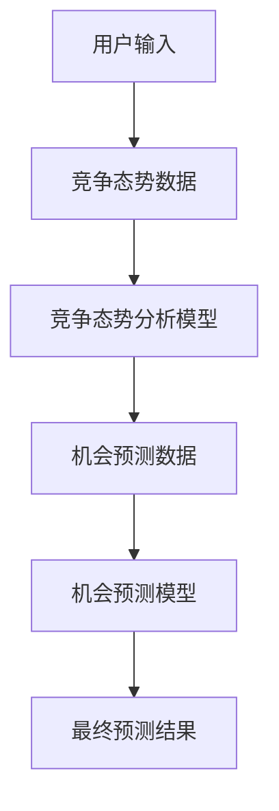
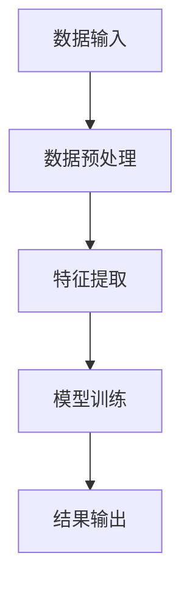
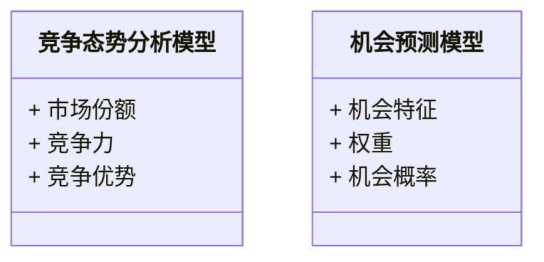
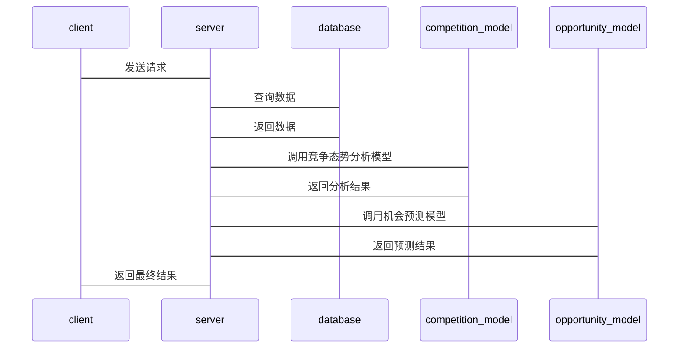

                 


```markdown
# AI辅助企业战略制定：竞争态势分析与机会预测模型

> 关键词：AI辅助企业战略制定，竞争态势分析，机会预测模型，企业战略，人工智能

> 摘要：本文探讨了如何利用人工智能技术辅助企业战略制定，重点分析了竞争态势分析与机会预测模型的核心概念、算法原理及系统架构设计。通过结合实际案例和项目实战，详细阐述了如何利用AI技术提升企业战略制定的效率和准确性。

---

# 第一部分: AI辅助企业战略制定的背景与核心概念

## 第1章: AI辅助企业战略制定的背景与问题背景

### 1.1 企业战略制定的背景与挑战

#### 1.1.1 企业战略制定的传统方法与局限性
企业战略制定的传统方法主要依赖于人工分析和经验判断，这种方法在信息不充分或环境变化剧烈的情况下显得力不从心。传统方法通常包括市场调研、竞争对手分析、SWOT分析等，但这些方法耗时且容易受到主观因素的影响，难以捕捉到市场变化的细微之处。

#### 1.1.2 当前商业环境的复杂性与不确定性
在当前商业环境中，企业面临日益复杂的市场环境和快速变化的竞争态势。全球化、技术革新、政策变化等因素使得企业战略的制定变得更加复杂。企业需要实时掌握市场动态、竞争对手动向以及潜在机会，这对传统的战略制定方法提出了更高的要求。

#### 1.1.3 AI技术在企业战略制定中的作用
人工智能技术，特别是机器学习和自然语言处理技术，为企业战略制定提供了新的可能性。AI可以通过大数据分析快速识别市场趋势，预测竞争态势，并为企业提供数据支持的决策建议。AI技术的引入，不仅提高了战略制定的效率，还增强了战略的科学性和准确性。

### 1.2 问题背景与问题描述

#### 1.2.1 竞争态势分析的核心问题
竞争态势分析的核心问题是如何从海量数据中提取有价值的信息，准确评估竞争对手的市场地位、产品策略、竞争优势等，从而帮助企业制定有效的竞争策略。

#### 1.2.2 机会预测模型的构建需求
机会预测模型的构建需求在于如何通过数据挖掘和预测分析，识别潜在的市场机会，帮助企业提前布局，抓住发展机遇。

#### 1.2.3 问题解决的目标与边界
竞争态势分析和机会预测模型的目标是为企业提供数据支持的决策依据，帮助企业在复杂多变的市场环境中制定科学、有效的战略。边界包括数据来源、分析范围和模型的应用场景。

### 1.3 问题解决方法与核心要素

#### 1.3.1 竞争态势分析的框架与流程
竞争态势分析的框架包括数据收集、数据分析、模型构建和结果输出四个阶段。通过系统的分析流程，帮助企业全面了解市场竞争状况。

#### 1.3.2 机会预测模型的构建逻辑
机会预测模型的构建逻辑包括数据预处理、特征提取、模型训练和结果预测四个步骤。通过科学的方法论，帮助企业准确预测市场机会。

#### 1.3.3 核心概念的结构化表达
竞争态势分析和机会预测模型的核心概念需要通过结构化的表达方式，明确各要素之间的关系和作用机制。

### 1.4 本章小结
本章通过分析企业战略制定的传统方法和当前面临的挑战，提出了AI技术在企业战略制定中的重要作用。明确了竞争态势分析和机会预测模型的核心问题，为后续章节的深入分析奠定了基础。

---

## 第2章: 竞争态势分析与机会预测模型的核心概念

### 2.1 核心概念的定义与属性

#### 2.1.1 竞争态势分析的定义与属性
竞争态势分析是通过对企业内外部环境的综合分析，评估企业在市场中的竞争地位和竞争优势。其属性包括数据驱动性、动态性和系统性。

#### 2.1.2 机会预测模型的定义与属性
机会预测模型是通过数据挖掘和预测分析，识别潜在市场机会。其属性包括数据驱动性、预测性和可解释性。

#### 2.1.3 两者的对比分析
从数据需求、分析目标和应用范围三个方面，对竞争态势分析和机会预测模型进行对比分析，明确两者的异同点。

### 2.2 核心概念的ER实体关系图

```mermaid
er
actor: 用户
model: 竞争态势分析模型
opportunity: 机会预测模型
competition: 竞争态势
predict: 机会预测
```

### 2.3 核心概念的联系与流程图



### 2.4 本章小结
本章通过定义和属性的分析，明确了竞争态势分析和机会预测模型的核心概念，并通过ER图和流程图展示了两者的联系和协作关系。

---

## 第3章: 竞争态势分析与机会预测模型的算法原理

### 3.1 竞争态势分析的算法原理

#### 3.1.1 竞争态势分析的数学模型
$$ 竞争优势 = \sum_{i=1}^{n} (市场份额_i \times 竞争力_i) $$

#### 3.1.2 算法流程图



### 3.2 机会预测模型的算法原理

#### 3.2.1 机会预测的数学模型
$$ 机会概率 = \frac{\sum_{i=1}^{m} (机会特征_i \times 权重_i)}{\sum_{i=1}^{m} 权重_i} $$

#### 3.2.2 算法流程图


### 3.3 算法实现的Python代码示例

```python
# 示例代码
import numpy as np
from sklearn import datasets

# 竞争态势分析模型
def competition_analysis_model(data):
    market_share = data['market_share']
    competitiveness = data['competitiveness']
    return np.sum(market_share * competitiveness)

# 机会预测模型
def opportunity_prediction_model(data):
    opportunity_features = data['opportunity_features']
    weights = data['weights']
    numerator = np.sum(opportunity_features * weights)
    denominator = np.sum(weights)
    return numerator / denominator

# 示例数据
data = {
    'market_share': np.array([0.3, 0.4, 0.2]),
    'competitiveness': np.array([0.8, 0.6, 0.7]),
    'opportunity_features': np.array([0.5, 0.3, 0.2]),
    'weights': np.array([0.4, 0.5, 0.1])
}

# 模型计算
print(competition_analysis_model(data))
print(opportunity_prediction_model(data))
```

### 3.4 本章小结
本章通过数学公式和流程图，详细讲解了竞争态势分析和机会预测模型的算法原理，并通过Python代码示例展示了模型的实现过程。

---

## 第4章: 竞争态势分析与机会预测模型的系统架构设计

### 4.1 问题场景介绍

#### 4.1.1 项目背景
本项目旨在通过AI技术辅助企业战略制定，实现竞争态势分析和机会预测模型的系统化应用。

#### 4.1.2 项目介绍
项目目标是构建一个基于AI的竞争态势分析与机会预测系统，为企业提供数据支持的战略制定工具。

### 4.2 系统功能设计

#### 4.2.1 领域模型图



#### 4.2.2 系统架构设计


#### 4.2.3 系统接口设计
系统接口包括数据输入接口、模型调用接口和结果输出接口，确保系统的高效运行和数据的顺畅流动。

#### 4.2.4 系统交互序列图



### 4.3 本章小结
本章通过系统架构设计，展示了竞争态势分析与机会预测模型的实现方式，明确了系统的功能模块和交互流程。

---

## 第5章: 竞争态势分析与机会预测模型的项目实战

### 5.1 项目环境安装

#### 5.1.1 系统环境要求
需要安装Python 3.6及以上版本，安装numpy、scikit-learn等依赖库。

#### 5.1.2 安装命令
```bash
pip install numpy scikit-learn
```

### 5.2 系统核心实现源代码

```python
# 竞争态势分析模型实现
from sklearn import linear_model

def competition_analysis_model(train_data, test_data):
    # 训练模型
    model = linear_model.LinearRegression()
    model.fit(train_data[['market_share', 'competitiveness']], train_data['advantage'])
    # 预测结果
    predictions = model.predict(test_data[['market_share', 'competitiveness']])
    return predictions

# 机会预测模型实现
from sklearn import tree

def opportunity_prediction_model(train_data, test_data):
    # 训练模型
    model = tree.DecisionTreeClassifier()
    model.fit(train_data[['opportunity_features', 'weights']], train_data['opportunity_probability'])
    # 预测结果
    predictions = model.predict(test_data[['opportunity_features', 'weights']])
    return predictions
```

### 5.3 代码应用解读与分析

#### 5.3.1 竞争态势分析模型实现
通过线性回归模型，利用市场份额和竞争力两个特征，预测企业的竞争优势。

#### 5.3.2 机会预测模型实现
通过决策树模型，利用机会特征和权重两个特征，预测市场机会的概率。

### 5.4 实际案例分析和详细讲解剖析

#### 5.4.1 案例背景
假设某企业面临市场竞争加剧的情况，希望通过竞争态势分析和机会预测模型，制定有效的战略。

#### 5.4.2 数据准备
收集市场份额、竞争力、机会特征和权重等数据，进行数据预处理和特征提取。

#### 5.4.3 模型训练
利用训练数据，分别训练竞争态势分析模型和机会预测模型。

#### 5.4.4 模型预测
通过测试数据，预测企业的竞争优势和市场机会概率，为战略制定提供数据支持。

### 5.5 项目小结
本章通过实际案例分析，展示了竞争态势分析和机会预测模型的实现过程，验证了模型的有效性和实用性。

---

## 第6章: 竞争态势分析与机会预测模型的最佳实践与小结

### 6.1 最佳实践 tips

#### 6.1.1 数据质量的重要性
确保数据的准确性和完整性，是模型准确预测的基础。

#### 6.1.2 模型选择的灵活性
根据具体场景和数据特点，选择合适的模型和算法。

#### 6.1.3 模型优化与迭代
定期更新数据和优化模型，确保模型的持续有效性和适应性。

### 6.2 小结
本章总结了竞争态势分析与机会预测模型的核心内容和最佳实践，强调了数据质量和模型优化的重要性，为企业实际应用提供了指导。

### 6.3 注意事项
在实际应用中，需要注意数据隐私和安全问题，避免数据泄露和滥用。

### 6.4 拓展阅读
建议读者进一步阅读相关领域的书籍和文献，深入理解竞争态势分析和机会预测模型的理论和实践。

---

# 附录: 工具与技术资料

## 附录A: 竞争态势分析与机会预测模型的工具推荐

### A.1 数据分析工具
- Python的pandas库
- SQL数据库

### A.2 机器学习框架
- Scikit-learn
- XGBoost

### A.3 可视化工具
- Matplotlib
- Seaborn

## 附录B: 竞争态势分析与机会预测模型的技术资料

### B.1 数据预处理技术
- 缺失值处理
- 数据标准化

### B.2 模型评估指标
- 均方误差（MSE）
- 准确率

### B.3 超参数调优技术
- 网格搜索
- 随机搜索

---

# 作者：AI天才研究院/AI Genius Institute & 禅与计算机程序设计艺术 /Zen And The Art of Computer Programming
```

