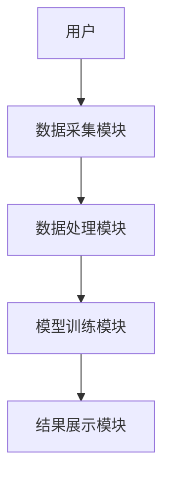
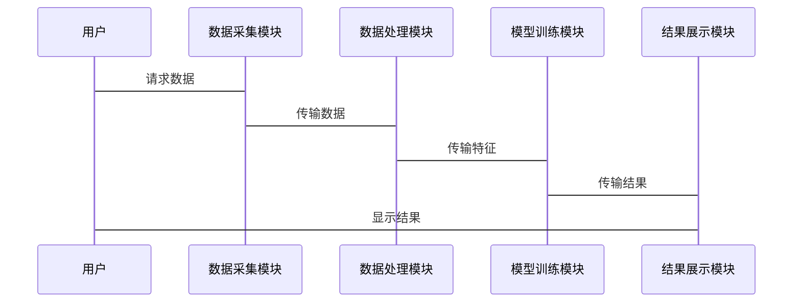

                 


# AI辅助企业战略情报收集：市场趋势与竞争分析

**关键词**：AI、战略情报收集、市场趋势分析、竞争分析、自然语言处理、数据挖掘、知识图谱

**摘要**：本文深入探讨了AI技术在企业战略情报收集中的应用，重点分析了市场趋势与竞争分析的核心算法、系统架构设计及实际案例。文章从背景介绍、核心概念、算法原理、系统实现到项目实战，全面解析了AI如何助力企业高效、精准地收集和分析战略情报，为企业决策提供有力支持。

---

# 第一部分：AI与企业战略情报收集的背景

## 第1章：企业战略情报收集的重要性

### 1.1 企业战略情报收集的定义与作用

企业战略情报收集是指通过系统化的方法，从内外部获取、处理和分析相关信息，以支持企业战略决策的过程。其作用包括：

- **辅助决策**：通过分析市场趋势、竞争对手动态等信息，为企业制定战略提供数据支持。
- **风险预警**：识别潜在风险，帮助企业提前采取应对措施。
- **竞争优势**：通过精准的情报分析，帮助企业发现市场机会，提升竞争力。

### 1.2 传统情报收集的局限性

传统情报收集主要依赖人工方式，存在以下问题：

- **效率低下**：人工收集和处理情报耗时长，且容易遗漏重要信息。
- **成本高昂**：需要大量人力资源和时间投入。
- **精度不足**：由于人为因素影响，情报分析的准确性难以保证。

### 1.3 AI技术在情报收集中的优势

AI技术通过自动化处理和分析海量数据，显著提升了情报收集的效率和精度。具体优势包括：

- **高效性**：AI能够快速处理大规模数据，缩短情报收集周期。
- **准确性**：基于机器学习算法，AI能够识别复杂模式，提高分析结果的准确性。
- **智能化**：AI系统能够自适应优化，不断提升情报分析的能力。

---

## 第2章：AI技术在情报收集中的应用现状

### 2.1 AI技术的基本概念与特点

AI（人工智能）是指计算机系统模拟人类智能的技术，具有以下特点：

- **学习能力**：通过机器学习算法，AI能够从数据中学习并改进性能。
- **推理能力**：AI系统能够基于已有知识进行逻辑推理和决策。
- **自适应能力**：AI系统能够根据环境变化调整自身行为。

### 2.2 AI在情报分析中的优势

AI技术在情报分析中的优势主要体现在以下几个方面：

- **自动化处理**：AI能够自动从多种来源（如新闻、社交媒体、行业报告等）获取数据。
- **多源数据整合**：通过自然语言处理（NLP）和数据挖掘技术，AI能够整合结构化和非结构化数据，形成完整的知识图谱。
- **实时监控**：AI系统能够实时跟踪市场动态和竞争对手行为，提供实时情报支持。

### 2.3 当前市场中的AI情报工具与平台

目前市场中已经涌现出许多AI情报工具和平台，例如：

- **语义搜索工具**：如Google的BERT模型，能够理解上下文语义，帮助从海量数据中提取有用信息。
- **竞争分析平台**：如SEMrush、Ahrefs等工具，能够分析竞争对手的SEO策略、市场表现等。
- **知识图谱构建工具**：如Google的Knowledge Graph，能够将分散的数据整合成结构化的知识图谱，便于分析和推理。

---

## 第3章：AI辅助情报收集的核心概念

### 3.1 自然语言处理（NLP）在情报分析中的应用

#### 3.1.1 NLP的基本原理与流程

NLP（Natural Language Processing）是AI技术的重要组成部分，主要通过计算机理解、处理和生成人类语言。其基本流程包括：

1. **数据预处理**：包括分词、去停用词、词干提取等。
2. **特征提取**：通过TF-IDF（词频-逆文档频率）等方法提取文本特征。
3. **模型训练**：基于监督学习或无监督学习方法训练NLP模型。
4. **结果分析**：通过模型输出结果并进行解读。

#### 3.1.2 常见的NLP技术与工具

- **分词工具**：如jieba（中文分词工具）。
- **情感分析工具**：如VADER、TextBlob。
- **文本摘要工具**：如Summarizer。

#### 3.1.3 NLP在情报分析中的具体应用

- **文本分类**：将市场报告、新闻等文本分类为不同主题或情感类别。
- **信息提取**：从非结构化文本中提取关键信息，如公司名称、产品名称等。
- **情感分析**：分析市场对某产品的舆论倾向，帮助企业了解市场需求。

### 3.2 数据挖掘与机器学习在情报处理中的作用

#### 3.2.1 数据挖掘的基本概念与流程

数据挖掘是指从海量数据中提取隐含模式、关联信息的过程。其基本流程包括：

1. **数据清洗**：去除噪声数据，确保数据质量。
2. **特征工程**：提取有助于模型训练的特征。
3. **模型训练**：基于机器学习算法训练模型。
4. **结果分析**：解释模型输出，提取有用信息。

#### 3.2.2 常见的数据挖掘算法与工具

- **聚类算法**：如K-means，用于发现市场中的潜在客户群体。
- **分类算法**：如随机森林、支持向量机（SVM），用于预测市场趋势。
- **关联规则挖掘**：如Apriori算法，用于发现产品之间的关联性。

#### 3.2.3 机器学习在情报预测与分类中的应用

- **市场趋势预测**：基于时间序列模型（如ARIMA、LSTM）预测市场走势。
- **竞争对手分析**：通过聚类分析识别竞争对手的市场策略。

---

## 第4章：知识图谱构建与情报关联分析

### 4.1 知识图谱的基本概念与构建方法

#### 4.1.1 知识图谱的定义

知识图谱是一种以图结构表示知识的技术，节点表示实体，边表示实体之间的关系。

#### 4.1.2 知识图谱的构建流程

1. **数据获取**：从多个数据源获取结构化和非结构化数据。
2. **实体识别**：通过NLP技术识别文本中的实体。
3. **关系抽取**：识别实体之间的关系。
4. **知识融合**：将分散的知识整合到统一的知识图谱中。

### 4.2 情报关联分析的原理与方法

#### 4.2.1 关联分析的定义

关联分析是指在海量数据中发现数据项之间的关联关系。

#### 4.2.2 基于图的关联分析方法

通过构建图结构，发现节点之间的关联关系，例如竞争对手之间的关联。

### 4.3 知识图谱在情报分析中的应用案例

#### 4.3.1 市场趋势分析

通过知识图谱分析市场中的关键词关联，发现市场热点和趋势。

#### 4.3.2 竞争对手分析

通过知识图谱识别竞争对手的市场布局、产品策略等信息。

---

## 第5章：市场趋势分析与竞争分析的核心算法

### 5.1 市场趋势分析的算法原理

#### 5.1.1 时间序列分析

时间序列分析是一种通过历史数据预测未来趋势的方法。常用模型包括ARIMA、LSTM等。

#### 5.1.2 基于NLP的市场趋势预测

通过分析新闻、社交媒体等文本数据，预测市场趋势。

### 5.2 竞争分析的算法原理

#### 5.2.1 基于聚类的竞争对手识别

通过聚类分析将市场中的企业分为不同群体，识别竞争对手。

#### 5.2.2 基于知识图谱的竞争对手分析

通过知识图谱分析竞争对手的市场布局、产品策略等。

---

## 第6章：系统架构设计与实现

### 6.1 系统功能设计

#### 6.1.1 系统模块划分

- **数据采集模块**：负责从多种数据源采集数据。
- **数据处理模块**：对采集的数据进行清洗、特征提取等处理。
- **模型训练模块**：基于机器学习算法训练模型。
- **结果展示模块**：将分析结果以可视化形式展示。

#### 6.1.2 系统功能流程

1. 数据采集：从新闻网站、社交媒体等来源采集数据。
2. 数据处理：清洗数据，提取特征。
3. 模型训练：训练NLP和机器学习模型。
4. 结果展示：将分析结果以图表形式展示。

### 6.2 系统架构设计

#### 6.2.1 系统架构图



#### 6.2.2 系统接口设计

- **数据采集接口**：负责与第三方数据源对接。
- **模型训练接口**：负责与机器学习框架（如TensorFlow、PyTorch）对接。
- **结果展示接口**：负责与前端展示模块对接。

### 6.3 系统交互设计

#### 6.3.1 用户与系统的交互流程

1. 用户输入需求，例如“分析科技行业的市场趋势”。
2. 系统通过数据采集模块获取相关数据。
3. 数据处理模块清洗数据并提取特征。
4. 模型训练模块训练模型并生成结果。
5. 结果展示模块将结果以可视化形式展示给用户。

#### 6.3.2 系统交互图



---

## 第7章：项目实战与最佳实践

### 7.1 环境配置与代码实现

#### 7.1.1 环境配置

- **Python版本**：3.8+
- **依赖库安装**：`pip install numpy pandas scikit-learn spacy transformers`

#### 7.1.2 核心代码实现

```python
import spacy
from sklearn.feature_extraction.text import TfidfVectorizer
from sklearn.cluster import KMeans

# 数据预处理
def preprocess(text):
    return text.lower().split()

# 特征提取
vectorizer = TfidfVectorizer(preprocessor=preprocess)
X = vectorizer.fit_transform(documents)

# 聚类分析
model = KMeans(n_clusters=5, random_state=42)
model.fit(X)

# 可视化结果
from sklearn.manifold import TSNE
import matplotlib.pyplot as plt

tsne = TSNE(n_components=2, random_state=42)
X_tsne = tsne.fit_transform(X.toarray())
plt.scatter(X_tsne[:,0], X_tsne[:,1], c=model.labels_)
plt.show()
```

### 7.2 代码解读与分析

- **数据预处理**：将文本转换为小写并分词。
- **特征提取**：使用TF-IDF方法提取文本特征。
- **聚类分析**：使用K-means算法将文档分为多个簇。
- **可视化结果**：通过t-SNE算法将结果降维并可视化。

### 7.3 案例分析与结果解读

#### 7.3.1 案例背景

假设我们要分析科技行业的市场趋势，从新闻、博客等来源获取相关文本数据。

#### 7.3.2 数据分析结果

- **市场趋势**：预测未来科技行业的热点领域。
- **竞争对手**：识别主要竞争对手及其市场策略。

#### 7.3.3 结果解读

通过聚类分析，我们发现科技行业的主要趋势包括人工智能、区块链、5G技术等。同时，识别出主要竞争对手及其市场布局，帮助企业制定相应的战略。

### 7.4 最佳实践与注意事项

- **数据质量**：确保数据来源可靠，数据清洗充分。
- **模型选择**：根据具体需求选择合适的算法和模型。
- **结果解释**：分析结果需结合业务背景，避免片面解读。

---

## 第8章：小结与展望

### 8.1 本章小结

本文详细探讨了AI技术在企业战略情报收集中的应用，重点分析了市场趋势与竞争分析的核心算法、系统架构设计及实际案例。通过理论与实践相结合，展示了AI如何助力企业高效、精准地收集和分析战略情报。

### 8.2 未来展望

随着AI技术的不断发展，未来企业战略情报收集将更加智能化和自动化。深度学习、强化学习等技术将进一步提升情报分析的精度和效率，为企业决策提供更有力的支持。

---

## 作者信息

作者：AI天才研究院/AI Genius Institute & 禅与计算机程序设计艺术 /Zen And The Art of Computer Programming

---

以上是文章的完整目录和部分章节内容的详细展开。如需进一步扩展某一部分内容，请随时告知。

