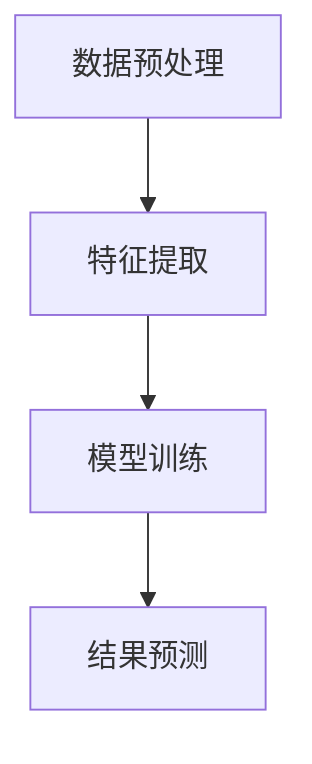
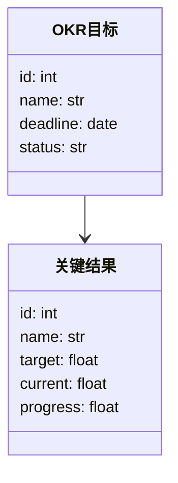

                 


# AI辅助企业战略执行：OKR自动化跟踪与动态调整

> 关键词：OKR，AI辅助，动态调整，战略执行，机器学习，数据可视化

> 摘要：本文深入探讨了如何利用人工智能技术辅助企业战略执行中的OKR（目标与关键结果）管理。通过分析OKR的核心概念、AI在OKR自动化跟踪与动态调整中的应用，结合具体的算法实现和系统架构设计，展示了如何利用AI技术优化企业目标管理流程，提升战略执行效率。

---

# 第一部分：AI辅助企业战略执行的背景与基础

## 第1章：OKR的基本概念与企业战略执行

### 1.1 OKR的定义与特点

#### 1.1.1 OKR的定义
OKR（目标与关键结果）是一种目标设定和管理方法，由目标（Objective）和关键结果（Key Results）组成。目标是定性的、高层次的，而关键结果是可量化的、具体的成果。

#### 1.1.2 OKR的特点
- **透明性**：OKR公开可见，便于团队协作和透明管理。
- **挑战性**：目标通常具有挑战性，激励团队超越常规。
- **时间性**：OKR通常设定在特定的时间段内，如季度或半年。
- **可衡量性**：关键结果是可以量化和衡量的。

#### 1.1.3 OKR与企业战略执行的关系
OKR不仅是目标管理工具，更是企业战略执行的重要手段。通过设定清晰的目标和关键结果，企业能够更好地协调资源、优化流程，并推动战略目标的实现。

---

### 1.2 企业战略执行的挑战

#### 1.2.1 传统目标管理的局限性
传统的目标管理方法（如KPI）往往缺乏灵活性和动态调整能力，难以应对快速变化的商业环境。

#### 1.2.2 现代企业战略执行的需求
现代企业在复杂多变的市场环境中，需要更加灵活和高效的目标管理方法，以快速响应变化并实现战略目标。

#### 1.2.3 OKR在企业战略中的作用
OKR通过其透明性、挑战性和动态性，能够更好地支持企业的战略执行，尤其是在敏捷开发和快速迭代的环境中。

---

## 第2章：AI在企业战略执行中的应用

### 2.1 AI辅助OKR的核心优势

#### 2.1.1 数据驱动的决策支持
AI通过分析历史数据和实时信息，提供数据驱动的决策支持，帮助企业在OKR设定和调整中做出更明智的选择。

#### 2.1.2 实时跟踪与反馈机制
AI能够实时跟踪OKR的执行情况，并根据反馈机制动态调整关键结果，确保目标的实现。

#### 2.1.3 动态调整的灵活性
AI辅助OKR能够根据市场变化和企业内部情况，快速调整目标和关键结果，提高战略执行的灵活性。

---

### 2.2 AI辅助OKR的技术基础

#### 2.2.1 自然语言处理（NLP）在OKR中的应用
NLP技术可以帮助企业从文本数据中提取目标和关键结果，支持OKR的自动化设定和调整。

#### 2.2.2 机器学习在OKR预测中的作用
机器学习算法可以通过历史数据预测OKR的实现情况，帮助企业在目标设定阶段进行优化。

#### 2.2.3 数据可视化在OKR跟踪中的价值
数据可视化技术能够直观展示OKR的执行进度和关键结果的实现情况，帮助管理者快速了解战略执行的效果。

---

# 第二部分：OKR与AI结合的核心概念与联系

## 第3章：OKR与AI结合的原理

### 3.1 数据流与算法选择

#### 3.1.1 OKR数据的采集与处理
- 数据采集：从企业内部系统（如CRM、ERP）中获取相关数据。
- 数据处理：清洗、转换和标注数据，确保数据的准确性和可用性。

#### 3.1.2 机器学习算法在OKR预测中的应用
- 监督学习：用于预测关键结果的实现情况。
- 非监督学习：用于发现数据中的潜在模式和关联。

#### 3.1.3 反馈机制在动态调整中的作用
- 根据OKR的执行结果和反馈信息，动态调整目标和关键结果。

---

### 3.2 OKR与AI结合的概念模型

#### 3.2.1 概念属性对比表
| 属性       | OKR                          | AI辅助OKR                   |
|------------|------------------------------|-----------------------------|
| 定义       | 目标与关键结果的管理方法     | 利用AI技术优化OKR管理       |
| 输入       | 企业目标、历史数据           | 数据、模型、反馈信息         |
| 输出       | 关键结果的实现情况           | 自动化调整后的OKR           |
| 优势       | 提高目标管理的透明性和动态性 | 提高目标管理的效率和精准性   |

#### 3.2.2 ER实体关系图

```mermaid
erd
  title 实体关系图
  Marine {
    <文件>
    实体: OKR目标、关键结果、企业目标
    关系: OKR目标与关键结果之间存在包含关系
    }
  Marine {
    <连接>
    关系: OKR目标 -> 关键结果
    }
```

---

## 第4章：AI辅助OKR的算法实现

### 4.1 算法原理

#### 4.1.1 机器学习算法的选择与应用
- 选择算法：基于历史数据，选择适合的机器学习算法（如线性回归、随机森林等）。
- 算法流程：数据预处理、特征提取、模型训练、结果预测。

#### 4.1.2 算法流程图



---

### 4.2 算法实现代码

#### 4.2.1 Python代码示例

```python
import pandas as pd
from sklearn.model_selection import train_test_split
from sklearn.linear_model import LinearRegression

# 数据加载
data = pd.read_csv('okr_data.csv')

# 数据分割
X = data[['feature1', 'feature2']]
y = data['target']

X_train, X_test, y_train, y_test = train_test_split(X, y, test_size=0.2)

# 模型训练
model = LinearRegression()
model.fit(X_train, y_train)

# 预测结果
y_pred = model.predict(X_test)
```

#### 4.2.2 代码功能解读
- 数据加载：从CSV文件中加载OKR相关数据。
- 数据分割：将数据划分为训练集和测试集。
- 模型训练：使用线性回归算法训练模型。
- 预测结果：利用训练好的模型预测OKR的实现情况。

---

### 4.3 数学模型与公式

#### 4.3.1 线性回归模型

$$ y = \beta_0 + \beta_1x_1 + \beta_2x_2 + \ldots + \beta_nx_n + \epsilon $$

其中：
- $y$：目标结果
- $x_i$：特征变量
- $\beta_i$：回归系数
- $\epsilon$：误差项

---

## 第5章：系统分析与架构设计方案

### 5.1 问题场景介绍
企业在战略执行过程中，需要动态调整OKR以应对市场变化和内部需求。传统的OKR管理方法效率低下，缺乏灵活性，难以满足现代企业的需求。

### 5.2 系统功能设计

#### 5.2.1 领域模型



---

#### 5.2.2 系统架构设计


---

### 5.3 系统交互设计

```mermaid
sequenceDiagram
    用户 --> 数据处理模块: 提交OKR数据
    数据处理模块 --> 模型训练模块: 请求预测服务
    模型训练模块 --> 用户界面模块: 返回预测结果
    用户 <-- 用户界面模块: 显示预测结果
```

---

# 第三部分：项目实战与总结

## 第6章：项目实战

### 6.1 环境安装

#### 6.1.1 安装Python依赖
```bash
pip install pandas scikit-learn matplotlib
```

---

### 6.2 系统核心实现

#### 6.2.1 数据处理代码

```python
import pandas as pd
import matplotlib.pyplot as plt

# 数据加载
data = pd.read_csv('okr_data.csv')

# 数据可视化
data['progress'].plot.hist()
plt.show()
```

---

### 6.2.2 代码功能解读
- 数据加载：从CSV文件中加载OKR数据。
- 数据可视化：使用Matplotlib绘制关键结果的分布图，帮助用户直观了解OKR的执行情况。

---

### 6.3 实际案例分析

#### 6.3.1 案例背景
某企业设定季度OKR为“提升客户满意度”，关键结果包括“客户满意度评分达到90%”、“客户投诉率降低至5%”等。

#### 6.3.2 案例分析
通过AI辅助OKR管理，系统自动跟踪客户满意度评分和投诉率，实时调整关键结果，并提供优化建议。

---

## 第7章：总结与展望

### 7.1 小结
本文详细探讨了AI辅助OKR自动化跟踪与动态调整的实现方法，通过算法、系统架构和项目实战展示了AI在企业战略执行中的巨大潜力。

### 7.2 最佳实践Tips
- 定期更新和优化AI模型，确保其预测能力。
- 结合企业实际情况，灵活调整OKR的目标和关键结果。
- 强化数据安全和隐私保护，确保数据的合规性。

### 7.3 注意事项
- 在实际应用中，需确保数据的准确性和完整性。
- 避免过度依赖AI，保持人工判断的灵活性。
- 定期评估AI辅助OKR的效果，及时调整和优化。

### 7.4 拓展阅读
- 推荐阅读《Effective OKRs: How to Use a Goal-Setting Framework to Drive Strategic Execution》。
- 关注AI在其他管理领域的应用，如AI辅助KPI管理、AI辅助战略规划等。

---

# 作者：AI天才研究院/AI Genius Institute & 禅与计算机程序设计艺术 /Zen And The Art of Computer Programming

---

通过本文的详细阐述，我们展示了AI如何助力企业战略执行中的OKR管理，为企业的高效目标管理提供了新的思路和方法。未来，随着AI技术的不断发展，OKR的自动化跟踪与动态调整将更加智能化和精准化，为企业战略执行带来更大的价值。

