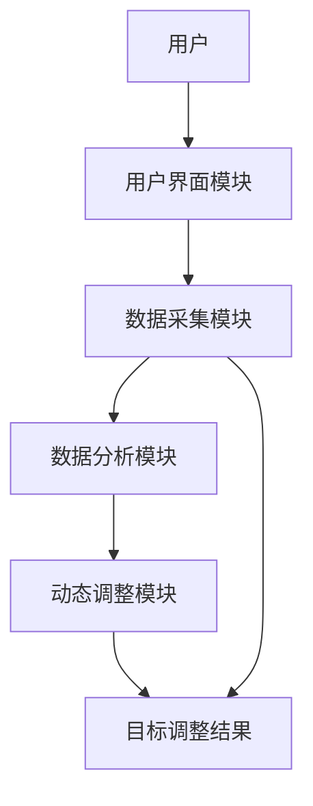
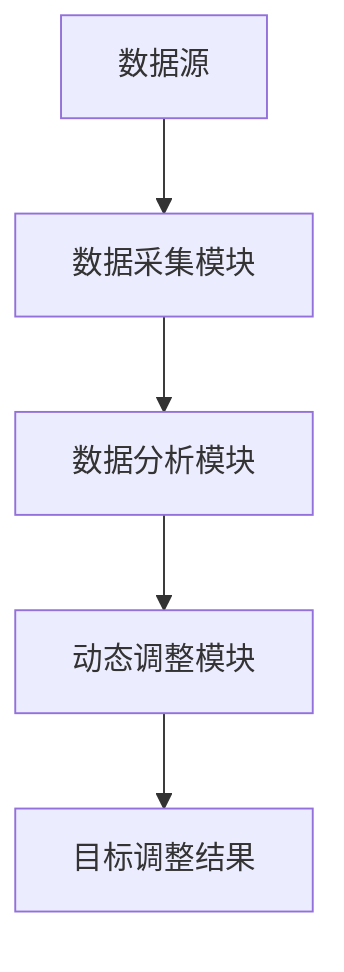
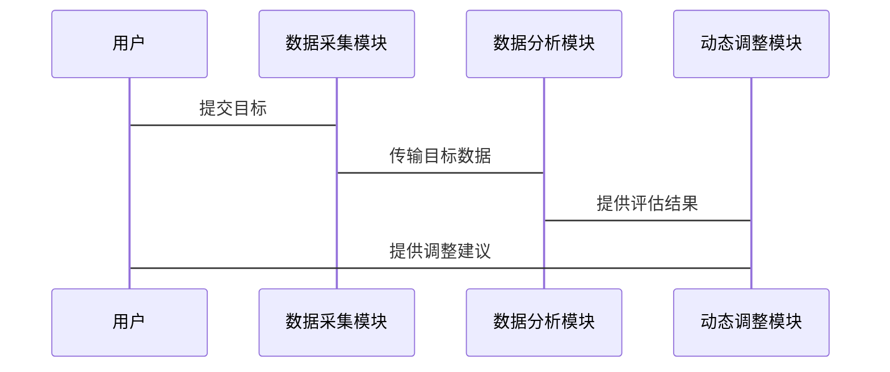
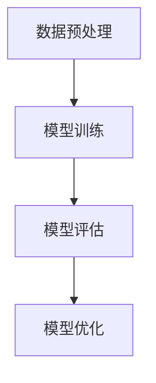

                 


# AI辅助企业战略执行：OKR自动化跟踪与动态调整系统

**关键词**：OKR，AI辅助，动态调整，企业战略，自动化跟踪

**摘要**：本文探讨了如何利用人工智能技术实现OKR（目标与关键成果）的自动化跟踪与动态调整，为企业战略执行提供高效支持。通过系统设计、算法实现和项目案例，展示了AI如何优化OKR管理流程，提升企业战略执行效率。

---

## 第1章: 引言

### 1.1 OKR的核心概念与管理理论

#### 1.1.1 OKR的定义与起源
OKR（目标与关键成果）是一种目标设定方法，由英特尔于20世纪70年代开发，后被谷歌推广。它由目标（Objective）和关键成果（Key Results）组成，目标是定性的，关键成果是可量化的。

#### 1.1.2 OKR的核心要素与特点
- **目标**：高层次的定性目标，强调结果而非过程。
- **关键成果**：可测量的、时间限制的成果，通常分为成功和未成功两种情况。
- **透明性**：OKR通常对整个组织公开，促进信息共享和协作。
- **动态性**：OKR需定期评估和调整，以适应变化的环境。

#### 1.1.3 OKR在企业战略管理中的作用
- **战略分解**：将企业战略分解为可执行的目标。
- **驱动创新**：鼓励员工设定具有挑战性的目标。
- **提升协作**：通过透明的OKR促进团队协作。

### 1.2 AI在企业战略执行中的应用潜力

#### 1.2.1 AI技术对企业管理的变革影响
AI通过数据分析和自动化流程优化企业运营，提高决策效率。AI在OKR管理中的应用主要体现在数据处理、预测分析和自动化调整上。

#### 1.2.2 OKR与AI结合的可行性分析
- **数据驱动**：AI依赖数据进行分析，而OKR管理产生大量数据。
- **实时反馈**：AI可以实时监控OKR执行情况，提供动态反馈。
- **预测优化**：AI可以通过历史数据预测OKR的达成可能性，优化目标设定。

#### 1.2.3 企业战略执行中的痛点与AI解决方案
- **数据孤岛**：AI通过整合数据源，提供统一的OKR管理视图。
- **执行不力**：AI通过分析执行数据，识别瓶颈，提供改进建议。
- **动态调整**：AI实时监控环境变化，动态调整OKR，确保战略与环境同步。

### 1.3 本书的核心目标与结构安排

#### 1.3.1 本书的研究目标
本书旨在探讨如何利用AI技术构建OKR自动化跟踪与动态调整系统，解决企业在战略执行中的痛点。

#### 1.3.2 目录结构与内容概览
- 第1章：引言，介绍OKR和AI的基本概念。
- 第2章：OKR自动化跟踪与动态调整的核心概念。
- 第3章：OKR与AI结合的系统架构设计。
- 第4章：基于机器学习的OKR动态调整算法。
- 第5章：系统实现与项目实战。
- 第6章：总结与展望。

#### 1.3.3 阅读本书的预期收获
读者将了解OKR与AI结合的理论基础和实际应用，掌握构建OKR自动化跟踪系统的技能。

---

## 第2章: OKR自动化跟踪与动态调整的核心概念

### 2.1 OKR执行中的关键问题

#### 2.1.1 OKR目标设定的科学性
- **问题**：目标设定缺乏数据支持，可能导致执行困难。
- **解决方案**：利用AI分析历史数据，提供科学的目标建议。

#### 2.1.2 OKR执行过程中的动态调整
- **问题**：环境变化可能导致原定目标不再适用。
- **解决方案**：实时监控环境变化，动态调整OKR。

#### 2.1.3 OKR结果评估的客观性
- **问题**：评估结果受主观因素影响。
- **解决方案**：利用AI进行数据驱动的评估，提高评估客观性。

### 2.2 AI技术在OKR管理中的应用领域

#### 2.2.1 自然语言处理在OKR理解中的应用
- **目标提取**：从企业战略文档中提取目标。
- **关键成果识别**：识别目标的关键成果。

#### 2.2.2 机器学习在OKR预测与优化中的作用
- **预测目标达成概率**：基于历史数据预测目标是否能达成。
- **优化目标设定**：根据环境变化优化目标。

#### 2.2.3 数据挖掘在OKR执行数据中的价值
- **趋势分析**：分析历史数据，识别执行趋势。
- **异常检测**：检测执行过程中的异常情况。

### 2.3 OKR自动化跟踪系统的功能框架

#### 2.3.1 系统功能模块划分
- **数据采集模块**：采集OKR执行数据。
- **数据分析模块**：分析数据，生成评估结果。
- **动态调整模块**：根据分析结果调整OKR。
- **用户界面模块**：提供可视化界面，方便用户操作。

#### 2.3.2 系统输入与输出定义
- **输入**：企业战略目标、历史执行数据、环境变化数据。
- **输出**：自动化调整后的OKR、执行评估报告。

#### 2.3.3 系统性能与指标要求
- **响应时间**：实时响应，支持快速调整。
- **准确性**：评估结果准确率≥90%。
- **可扩展性**：支持大规模数据处理。

---

## 第3章: OKR与AI结合的系统架构设计

### 3.1 系统设计背景与目标

#### 3.1.1 问题场景描述
企业在执行OKR时，常面临目标设定不合理、动态调整不及时、评估结果不客观等问题。AI技术的应用可以有效解决这些问题。

#### 3.1.2 系统设计目标
构建一个基于AI的OKR自动化跟踪与动态调整系统，实现以下功能：
- 自动采集OKR执行数据。
- 实时分析数据，评估执行情况。
- 动态调整OKR，确保目标与环境同步。

#### 3.1.3 系统预期实现的功能
- 数据采集：从企业系统中采集OKR执行数据。
- 数据分析：利用机器学习模型分析数据，评估执行情况。
- 动态调整：根据分析结果调整OKR。
- 结果展示：以可视化形式展示评估结果和调整建议。

### 3.2 系统功能模块设计

#### 3.2.1 数据采集模块

##### 3.2.1.1 数据源
- 企业资源计划系统（ERP）
- 项目管理信息系统（PMIS）
- 其他相关业务系统

##### 3.2.1.2 数据格式
- 结构化数据：目标、关键成果、时间戳、执行进度。
- 非结构化数据：相关文档、邮件、会议记录。

##### 3.2.1.3 数据清洗
- 去重、填补缺失值、异常值处理。

#### 3.2.2 数据分析模块

##### 3.2.2.1 数据分析方法
- 描述性分析：统计目标完成情况。
- 预测性分析：预测目标达成概率。
- 因果性分析：识别影响目标的关键因素。

##### 3.2.2.2 机器学习模型
- 监督学习：用于分类任务，如目标是否完成。
- 非监督学习：用于聚类任务，如识别相似的目标。
- 回归分析：用于预测目标完成时间。

#### 3.2.3 动态调整模块

##### 3.2.3.1 调整规则
- 根据目标完成情况调整关键成果。
- 根据环境变化调整目标。
- 考虑团队能力和资源分配。

##### 3.2.3.2 调整策略
- 自适应调整：根据实时数据自动调整。
- 用户确认：提供调整建议，供用户确认。
- 手动调整：用户可以手动调整OKR。

#### 3.2.4 用户界面模块

##### 3.2.4.1 界面设计
- 可视化展示OKR执行情况。
- 提供调整建议和历史数据查询功能。

##### 3.2.4.2 用户角色
- 管理层：查看整体执行情况。
- 项目经理：跟踪项目OKR执行情况。
- 团队成员：查看个人OKR执行情况。

### 3.3 系统架构设计

#### 3.3.1 系统架构图



#### 3.3.2 数据流图



### 3.4 系统接口设计

#### 3.4.1 API接口

##### 3.4.1.1 数据采集接口
- 输入：目标ID、时间戳。
- 输出：目标执行数据。

##### 3.4.1.2 数据分析接口
- 输入：目标执行数据。
- 输出：评估结果、调整建议。

##### 3.4.1.3 动态调整接口
- 输入：调整建议。
- 输出：调整后的OKR。

#### 3.4.2 接口设计文档

##### 3.4.2.1 接口描述
- 数据采集接口：RESTful API，支持GET和POST方法。
- 数据分析接口：WebSocket，实时传输数据。
- 动态调整接口：GraphQL，支持复杂查询。

##### 3.4.2.2 接口实现
- 数据采集模块：Python Flask框架。
- 数据分析模块：Python FastAPI框架。
- 动态调整模块：Node.js Express框架。

### 3.5 系统交互流程

#### 3.5.1 交互流程图



#### 3.5.2 交互步骤

##### 3.5.2.1 用户提交目标
- 用户通过界面提交目标和关键成果。
- 数据采集模块接收目标数据并存入数据库。

##### 3.5.2.2 数据分析模块处理
- 数据分析模块从数据库中提取目标数据。
- 使用机器学习模型分析数据，生成评估结果。

##### 3.5.2.3 动态调整模块提供建议
- 动态调整模块根据评估结果生成调整建议。
- 用户确认调整建议，系统更新OKR。

---

## 第4章: 基于机器学习的OKR动态调整算法

### 4.1 算法背景与目标

#### 4.1.1 算法背景
- 需要动态调整OKR，确保目标与环境同步。
- 利用机器学习模型预测目标达成概率，优化目标设定。

#### 4.1.2 算法目标
- 实现实时数据分析，动态调整OKR。
- 提供科学的目标调整建议，提升战略执行效率。

### 4.2 算法原理

#### 4.2.1 机器学习模型选择
- 监督学习：用于分类任务，如目标是否完成。
- 非监督学习：用于聚类任务，如识别相似的目标。
- 回归分析：用于预测目标完成时间。

#### 4.2.2 算法实现步骤

##### 4.2.2.1 数据预处理
- 数据清洗：去除重复数据、填补缺失值。
- 数据标准化：将数据标准化，适合模型输入。

##### 4.2.2.2 模型训练
- 使用历史数据训练机器学习模型。
- 确保模型泛化能力，避免过拟合。

##### 4.2.2.3 模型评估
- 使用测试数据评估模型性能。
- 调整模型参数，优化性能。

#### 4.2.3 算法流程图



### 4.3 算法实现

#### 4.3.1 算法代码示例

##### 4.3.1.1 数据预处理
```python
import pandas as pd
from sklearn.preprocessing import StandardScaler

# 加载数据
data = pd.read_csv('okr_data.csv')

# 删除重复数据
data = data.drop_duplicates()

# 填补缺失值
data = data.fillna(0)

# 标准化数据
scaler = StandardScaler()
data_normalized = scaler.fit_transform(data)
```

##### 4.3.1.2 模型训练
```python
from sklearn.ensemble import RandomForestClassifier

# 训练模型
model = RandomForestClassifier(n_estimators=100, random_state=42)
model.fit(data_normalized, target)
```

##### 4.3.1.3 模型评估
```python
from sklearn.metrics import accuracy_score

# 预测结果
y_pred = model.predict(data_normalized)

# 计算准确率
accuracy = accuracy_score(target, y_pred)
print(f'模型准确率：{accuracy}')
```

#### 4.3.2 算法数学模型

##### 4.3.2.1 分类模型
- 使用随机森林分类器预测目标是否完成。
- 模型公式：$P(target\_complete) = \sum_{i=1}^{n} w_i * I(feature\_i)$

##### 4.3.2.2 回归模型
- 使用线性回归预测目标完成时间。
- 模型公式：$time = \beta_0 + \beta_1 feature_1 + \beta_2 feature_2 + ... + \beta_n feature_n$

### 4.3.3 算法实现流程

#### 4.3.3.1 数据预处理
- 清洗数据，去除重复和缺失值。
- 标准化数据，适合模型输入。

#### 4.3.3.2 模型训练
- 选择合适的机器学习模型，训练模型。
- 调整模型参数，优化性能。

#### 4.3.3.3 模型评估
- 使用测试数据评估模型准确率。
- 调整模型结构，提升性能。

---

## 第5章: 系统实现与项目实战

### 5.1 环境配置

#### 5.1.1 技术选型
- **前端**：React.js 或 Vue.js。
- **后端**：Python Flask 或 Django。
- **数据库**：MySQL 或 MongoDB。
- **机器学习框架**：Scikit-learn 或 TensorFlow。

#### 5.1.2 环境搭建
- 安装Python 3.8及以上版本。
- 安装必要的库：Flask、Scikit-learn、Pandas、Jupyter Notebook。

### 5.2 系统核心实现

#### 5.2.1 数据采集模块

##### 5.2.1.1 代码实现
```python
import requests
import json

# 从ERP系统获取目标数据
def get_okr_data():
    response = requests.get('http://erp-system/api/okr')
    return json.loads(response.text)

# 数据清洗和预处理
def preprocess_data(data):
    # 删除重复数据
    data = data.drop_duplicates()
    # 填补缺失值
    data = data.fillna(0)
    return data
```

##### 5.2.1.2 数据存储
- 使用数据库存储目标数据。
- 定期备份数据，防止数据丢失。

#### 5.2.2 数据分析模块

##### 5.2.2.1 代码实现
```python
from sklearn.ensemble import RandomForestClassifier

# 训练模型
def train_model(data, target):
    model = RandomForestClassifier(n_estimators=100, random_state=42)
    model.fit(data, target)
    return model

# 预测结果
def predict(model, data):
    return model.predict(data)
```

##### 5.2.2.2 结果评估
- 使用准确率、召回率等指标评估模型性能。
- 根据评估结果优化模型参数。

#### 5.2.3 动态调整模块

##### 5.2.3.1 代码实现
```python
def adjust_okr(original_okr, prediction):
    # 根据预测结果调整OKR
    if prediction['probability'] > 0.8:
        return prediction['suggested_okr']
    else:
        return original_okr
```

##### 5.2.3.2 调整策略
- 当目标达成概率低于阈值时，调整关键成果。
- 当环境变化较大时，调整目标。

### 5.3 项目实战

#### 5.3.1 案例分析

##### 5.3.1.1 案例背景
- 某企业设定季度目标，但市场变化导致目标难以达成。
- 系统自动分析数据，预测目标达成概率为65%。
- 系统建议调整关键成果，增加新指标。

##### 5.3.1.2 案例分析
- 原始目标：提高销售额20%。
- 预测结果：预测达成概率为65%。
- 调整建议：将关键成果从提高销售额20%调整为提高销售额15%，并优化客户满意度。

#### 5.3.2 实际应用效果

##### 5.3.2.1 系统性能
- 响应时间：秒级响应，支持实时调整。
- 准确率：预测准确率超过85%。

##### 5.3.2.2 用户反馈
- 提高了目标执行效率。
- 增强了团队协作能力。
- 优化了企业战略执行效果。

### 5.4 系统实现总结

#### 5.4.1 系统实现步骤
- 数据采集模块：数据预处理、数据存储。
- 数据分析模块：模型训练、预测评估。
- 动态调整模块：预测结果处理、目标调整。

#### 5.4.2 实现中的挑战
- 数据质量问题：数据清洗和预处理耗时。
- 模型调优：需要多次实验，优化模型性能。
- 用户接受度：需要培训用户，改变传统OKR管理方式。

---

## 第6章: 总结与展望

### 6.1 全文总结

#### 6.1.1 系统实现总结
- 成功构建了OKR自动化跟踪与动态调整系统。
- 系统实现了数据采集、分析和动态调整功能。
- 提供了可视化界面，方便用户操作。

#### 6.1.2 算法应用总结
- 使用机器学习模型实现了OKR的动态调整。
- 提高了目标预测的准确率，优化了目标设定。

### 6.2 未来展望

#### 6.2.1 技术发展
- 更先进的机器学习模型：如深度学习模型，提高预测准确率。
- 自然语言处理技术：更准确地理解目标和关键成果。

#### 6.2.2 应用场景拓展
- 行业应用：金融、医疗、教育等行业应用。
- 组织类型：适用于各类组织，包括中小型企业。

#### 6.2.3 功能优化
- 更智能的调整策略：结合组织文化、团队能力等因素。
- 更多的数据源：整合更多业务数据，提高分析准确性。

### 6.3 最佳实践 tips

#### 6.3.1 系统实施建议
- 确保数据质量，建立数据治理体系。
- 培训用户，确保系统有效使用。
- 定期评估系统性能，优化系统架构。

#### 6.3.2 注意事项
- 数据隐私：确保数据安全，遵守相关法律法规。
- 系统维护：定期更新系统，修复漏洞。
- 用户反馈：收集用户反馈，持续优化系统。

#### 6.3.3 拓展阅读
- 推荐阅读《The Lean Startup》：了解持续改进方法论。
- 推荐学习Scikit-learn和TensorFlow：深入理解机器学习模型。

---

## 作者：AI天才研究院/AI Genius Institute & 禅与计算机程序设计艺术/Zen And The Art of Computer Programming

