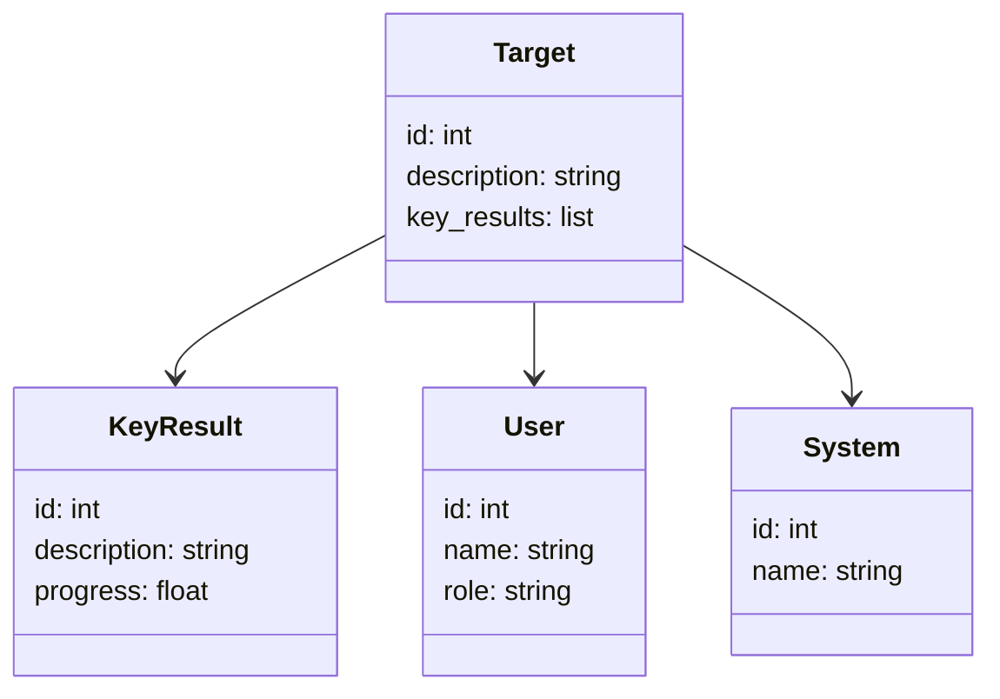
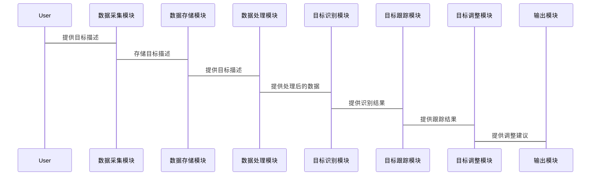

                 


# AI辅助企业战略执行：OKR自动化跟踪与调整

---

## 关键词：AI、企业战略、OKR、目标管理、自动化跟踪、机器学习、大模型

---

## 摘要：  
本文深入探讨了如何利用人工智能技术实现OKR（目标与关键成果法）的自动化跟踪与调整，以提升企业战略执行效率。文章从OKR的基本概念、AI在OKR自动化中的应用场景出发，结合具体的算法原理和系统架构设计，详细阐述了AI辅助OKR的实现路径。同时，通过实际案例分析和代码实现，展示了如何将OKR与AI技术结合，为企业战略执行提供高效、智能的解决方案。

---

# 第1章: AI辅助企业战略执行的背景与现状

## 1.1 企业战略执行的挑战

### 1.1.1 传统企业战略执行的痛点  
企业在制定和执行战略目标时，常常面临以下痛点：  
- **目标分解困难**：战略目标通常较为抽象，难以分解为具体可执行的任务。  
- **执行效率低**：目标执行过程中缺乏实时监控和反馈，导致资源浪费和效率低下。  
- **团队协作复杂**：跨部门协作时，目标和任务的协调难度大，容易出现信息孤岛。  
- **动态调整困难**：外部环境变化时，目标调整往往滞后，难以快速响应。  

### 1.1.2 OKR方法的引入与价值  
OKR（目标与关键成果法）作为一种敏捷的目标管理方法，通过明确的目标和可量化的关键成果，帮助企业实现高效的目标管理。其价值体现在：  
- **目标透明化**：OKR强调目标的公开性和透明性，便于团队协作和监督。  
- **结果导向**：通过关键成果的量化，OKR能够帮助企业更清晰地评估目标达成情况。  
- **动态调整**：OKR允许根据实际情况进行快速调整，增强企业的灵活性。  

### 1.1.3 AI在OKR自动化中的作用  
AI技术的引入，使得OKR的自动化跟踪与调整成为可能。AI可以通过以下方式提升OKR的管理效率：  
- **智能目标识别**：利用自然语言处理技术，自动识别目标和关键成果。  
- **实时数据监控**：通过机器学习模型，实时跟踪目标执行进度并提供反馈。  
- **智能调整建议**：基于历史数据和当前情况，AI可以自动生成目标调整建议。  

---

## 1.2 OKR的核心概念与特点

### 1.2.1 OKR的核心概念  
OKR由目标（Objective）和关键成果（Key Results）两部分组成：  
- **目标（Objective）**：是对企业或团队希望在一定时间内实现的成果的高层次描述，通常具有挑战性和激励性。  
- **关键成果（Key Results）**：是衡量目标实现程度的具体指标，通常是可以量化的成果，通常分为成功/失败两种状态。  

### 1.2.2 OKR与传统目标管理方法的区别  
与传统目标管理方法（如SMART原则）相比，OKR的特点在于其灵活性和动态性：  
- **更加灵活**：OKR允许目标的动态调整，而传统方法通常注重目标的固定性和可衡量性。  
- **注重结果导向**：OKR更关注关键成果的实现，而不仅仅是过程的控制。  
- **高度透明**：OKR强调目标的公开性和团队协作，而传统方法通常注重个体目标的设定。  

### 1.2.3 OKR在企业中的应用场景  
OKR广泛应用于企业的多个领域，包括：  
- **产品开发**：设定产品开发的目标和关键成果，确保产品按时交付。  
- **市场营销**：设定市场推广目标，如用户增长、品牌知名度提升等。  
- **团队管理**：设定团队协作目标，提升团队效率和凝聚力。  

---

## 1.3 AI辅助OKR的必要性与优势

### 1.3.1 AI在OKR自动化中的关键作用  
AI技术可以显著提升OKR的管理效率，具体体现在以下几个方面：  
- **自动化数据采集与分析**：AI能够自动采集目标执行过程中的数据，并通过机器学习模型进行分析，提供实时反馈。  
- **智能目标调整**：基于历史数据和当前情况，AI可以自动生成目标调整建议，帮助企业快速应对变化。  
- **个性化推荐**：AI可以根据团队或个人的特点，推荐适合的目标和关键成果。  

### 1.3.2 AI辅助OKR的优势  
- **提高效率**：AI能够自动化完成目标跟踪和反馈，减少人工干预，提高管理效率。  
- **增强准确性**：通过机器学习模型，AI能够更准确地预测目标执行结果，并提供科学的调整建议。  
- **促进协作**：OKR的透明性和动态调整能力，能够促进团队协作，提升组织的灵活性。  

---

## 1.4 本章小结  
本章介绍了企业战略执行的挑战、OKR的核心概念与特点，以及AI在OKR自动化中的作用和优势。通过结合OKR和AI技术，企业可以实现目标管理的自动化和智能化，从而提升战略执行效率。

---

# 第2章: AI与OKR结合的技术基础

## 2.1 AI技术在OKR自动化中的应用领域

### 2.1.1 自然语言处理（NLP）在OKR描述中的作用  
- **目标识别**：通过NLP技术，AI可以自动从文本中提取目标和关键成果。  
- **意图识别**：AI能够识别目标描述中的意图，帮助优化目标设定。  
- **语言生成**：基于历史数据，AI可以自动生成目标描述和关键成果的建议。  

### 2.1.2 机器学习在OKR预测与评估中的应用  
- **目标达成概率预测**：通过机器学习模型，AI可以预测目标的达成概率，并提供实时反馈。  
- **关键成果评估**：AI能够自动评估关键成果的实现情况，并生成评估报告。  

### 2.1.3 大模型在OKR生成与优化中的潜力  
- **目标优化**：基于大模型的生成能力，AI可以优化目标描述，使其更加清晰和具体。  
- **关键成果推荐**：通过大模型，AI可以推荐与目标相关的关键成果，帮助团队设定更合理的目标。  

---

## 2.2 OKR自动化跟踪的关键技术

### 2.2.1 自动化数据采集与处理  
- **数据源多样化**：AI可以从企业内部系统（如CRM、ERP）和外部数据源（如社交媒体、市场数据）中采集相关数据。  
- **数据清洗与预处理**：通过AI技术，对采集的数据进行清洗和预处理，确保数据的准确性和完整性。  

### 2.2.2 基于AI的目标识别与分类  
- **目标识别**：利用计算机视觉和NLP技术，AI可以自动识别目标和关键成果。  
- **目标分类**：通过机器学习模型，AI可以对目标进行分类，便于后续的跟踪和管理。  

### 2.2.3 智能提醒与反馈机制  
- **实时提醒**：当目标执行进度偏离预期时，AI可以向相关人员发送提醒。  
- **智能反馈**：基于目标执行情况，AI可以自动生成反馈报告，并提出改进建议。  

---

## 2.3 本章小结  
本章详细介绍了AI技术在OKR自动化中的应用领域和关键技术和方法，为后续章节的深入分析奠定了基础。

---

# 第3章: OKR与AI结合的核心概念与联系

## 3.1 OKR的结构与属性

### 3.1.1 目标（Objective）的定义与特征  
- **目标的层次性**：目标可以分为战略目标、战术目标和操作目标，不同层次的目标相互关联。  
- **目标的可衡量性**：目标需要通过关键成果进行量化，以便于跟踪和评估。  
- **目标的动态性**：目标可以根据实际情况进行调整，以适应变化的环境。  

### 3.1.2 关键成果（Key Results）的定义与特征  
- **关键成果的可量化性**：关键成果需要是可量化的指标，以便于评估目标的实现情况。  
- **关键成果的相关性**：关键成果需要与目标密切相关，能够有效衡量目标的实现。  
- **关键成果的挑战性**：关键成果应该具有一定的挑战性，以激励团队努力实现目标。  

---

## 3.2 AI在OKR中的核心作用

### 3.2.1 AI驱动的目标识别与分类  
- **目标识别**：通过NLP技术，AI可以自动识别目标和关键成果。  
- **目标分类**：基于历史数据，AI可以对目标进行分类，便于后续的跟踪和管理。  

### 3.2.2 AI驱动的关键成果预测  
- **关键成果预测**：通过机器学习模型，AI可以预测关键成果的实现情况，并提供实时反馈。  
- **关键成果优化**：基于预测结果，AI可以优化关键成果的设定，以提高目标实现的概率。  

### 3.2.3 AI驱动的目标优化与调整  
- **目标调整建议**：当目标执行进度偏离预期时，AI可以自动生成调整建议，帮助团队快速应对变化。  
- **目标优化**：通过大模型的生成能力，AI可以优化目标描述，使其更加清晰和具体。  

---

## 3.3 OKR与AI结合的系统架构

### 3.3.1 系统模块划分  
- **数据采集模块**：负责采集目标执行过程中的数据。  
- **目标识别模块**：通过NLP技术识别目标和关键成果。  
- **目标跟踪模块**：实时跟踪目标执行进度，并提供反馈。  
- **目标调整模块**：根据跟踪结果，自动生成目标调整建议。  

### 3.3.2 数据流与信息流分析  
- **数据流**：数据从数据源流向数据处理模块，再流向目标识别和跟踪模块，最后输出目标调整建议。  
- **信息流**：目标和关键成果的信息在系统内部传递，AI根据信息生成反馈和调整建议。  

### 3.3.3 系统功能描述  
- **目标识别与分类**：系统能够自动识别目标和关键成果，并进行分类管理。  
- **实时跟踪与反馈**：系统能够实时跟踪目标执行进度，并提供反馈。  
- **智能调整建议**：系统能够根据跟踪结果，自动生成目标调整建议。  

---

## 3.4 本章小结  
本章详细分析了OKR的核心概念与AI在OKR中的核心作用，并通过系统架构设计展示了OKR与AI结合的整体框架。

---

# 第4章: AI辅助OKR的算法原理

## 4.1 基于NLP的目标识别与分类

### 4.1.1 NLP技术在目标识别中的应用  
- **文本分词**：通过分词技术，将目标描述分解为关键词。  
- **关键词提取**：通过关键词提取技术，识别目标描述中的核心关键词。  
- **意图识别**：通过意图识别技术，确定目标描述的意图。  

### 4.1.2 基于机器学习的目标分类  
- **数据准备**：收集目标描述数据，并进行标注。  
- **特征提取**：通过TF-IDF或Word2Vec等技术，提取目标描述的特征。  
- **模型训练**：使用分类算法（如SVM、随机森林）训练目标分类模型。  
- **目标分类**：基于训练好的模型，对新的目标描述进行分类。  

---

## 4.2 基于机器学习的关键成果预测

### 4.2.1 数据准备与特征提取  
- **数据采集**：收集关键成果的历史数据，包括关键成果的描述和实现情况。  
- **特征提取**：提取关键成果的相关特征，如历史实现情况、相关指标等。  

### 4.2.2 模型训练与预测  
- **模型选择**：选择适合的关键成果预测模型（如线性回归、随机森林）。  
- **模型训练**：使用训练数据训练模型。  
- **模型预测**：基于当前目标执行情况，预测关键成果的实现概率。  

---

## 4.3 基于大模型的目标优化与调整

### 4.3.1 大模型的引入  
- **目标优化**：通过大模型的生成能力，优化目标描述，使其更加清晰和具体。  
- **关键成果推荐**：基于大模型，推荐与目标相关的关键成果，帮助团队设定更合理的目标。  

### 4.3.2 目标调整建议生成  
- **数据输入**：输入当前目标执行情况和预测结果。  
- **调整建议生成**：基于大模型，生成目标调整建议，包括调整目标和关键成果的建议。  

---

## 4.4 本章小结  
本章详细讲解了AI辅助OKR的算法原理，包括基于NLP的目标识别与分类、基于机器学习的关键成果预测，以及基于大模型的目标优化与调整。

---

# 第5章: 系统分析与架构设计方案

## 5.1 问题场景介绍

### 5.1.1 项目介绍  
- **项目背景**：企业希望通过OKR方法实现战略目标的自动化跟踪与调整。  
- **项目目标**：构建一个基于AI的OKR自动化跟踪与调整系统。  

### 5.1.2 系统需求  
- **目标识别与分类**：能够自动识别目标和关键成果，并进行分类管理。  
- **实时跟踪与反馈**：能够实时跟踪目标执行进度，并提供反馈。  
- **智能调整建议**：能够根据跟踪结果，自动生成目标调整建议。  

---

## 5.2 系统功能设计

### 5.2.1 领域模型设计  


### 5.2.2 系统架构设计  


### 5.2.3 系统交互设计  


---

## 5.3 本章小结  
本章通过系统分析与架构设计，展示了如何将AI技术应用于OKR的自动化跟踪与调整，为后续的实现提供了明确的方向。

---

# 第6章: 项目实战与最佳实践

## 6.1 环境安装与配置

### 6.1.1 环境要求  
- **操作系统**：Linux/Windows/MacOS  
- **Python版本**：Python 3.8及以上  
- **依赖库**：numpy、pandas、scikit-learn、transformers、mermaid等  

### 6.1.2 安装步骤  
```bash
pip install numpy pandas scikit-learn transformers mermaid
```

---

## 6.2 系统核心实现

### 6.2.1 目标识别模块实现  
```python
from transformers import pipeline

nlp = pipeline("text-classification", model="bert-base-uncased")
def identify_target(description):
    result = nlp(description)
    return result[0]['label']
```

### 6.2.2 关键成果预测模块实现  
```python
from sklearn.ensemble import RandomForestClassifier

def trainKRClassifier(X_train, y_train):
    clf = RandomForestClassifier()
    clf.fit(X_train, y_train)
    return clf

def predictKRProgress(clf, X_test):
    return clf.predict(X_test)
```

### 6.2.3 目标调整建议生成模块实现  
```python
from transformers import pipeline

text_generation = pipeline("text-generation", model="gpt2")
def generate_adjustment建议(description):
    result = text_generation(description, max_length=100, num_return_sequences=1)
    return result[0]['text']
```

---

## 6.3 案例分析与解读

### 6.3.1 实际案例  
假设某企业的目标是“提升产品市场份额”，关键成果包括“提高品牌知名度”和“增加客户留存率”。通过AI系统，我们可以自动生成目标调整建议，例如：  
- **调整目标**：将目标调整为“提升产品市场份额至20%”。  
- **调整关键成果**：将关键成果调整为“提高品牌知名度至80%”和“增加客户留存率至70%”。  

### 6.3.2 代码实现与解读  
通过上述代码实现，我们可以看到AI系统是如何通过NLP、机器学习和大模型技术，实现目标识别、关键成果预测和目标调整建议生成的。  

---

## 6.4 最佳实践与注意事项

### 6.4.1 最佳实践  
- **数据质量**：确保数据的准确性和完整性，以提高模型的预测精度。  
- **模型优化**：通过不断优化模型参数和结构，提升目标识别和预测的准确性。  
- **用户反馈**：根据用户反馈，不断改进系统功能，提升用户体验。  

### 6.4.2 注意事项  
- **数据隐私**：在处理企业数据时，需要注意数据隐私和安全。  
- **模型解释性**：在生成目标调整建议时，需要确保建议的可解释性，避免黑箱操作。  
- **系统稳定性**：确保系统的稳定性和可靠性，避免因系统故障导致目标管理中断。  

---

## 6.5 本章小结  
本章通过具体的项目实战，展示了如何将AI技术应用于OKR的自动化跟踪与调整，并总结了实际应用中的最佳实践和注意事项。

---

# 第7章: 总结与展望

## 7.1 全文总结  
本文详细探讨了AI辅助企业战略执行的OKR自动化跟踪与调整的实现路径，通过理论分析、算法原理和系统设计，展示了如何利用AI技术提升OKR的管理效率和准确性。  

## 7.2 未来展望  
随着AI技术的不断发展，OKR的自动化跟踪与调整将更加智能化和个性化。未来的研究方向包括：  
- **更强大的模型**：利用更大规模的模型（如GPT-4）提升目标识别和预测的准确性。  
- **多模态数据融合**：结合文本、图像等多种数据源，提升目标识别和预测的全面性。  
- **自适应系统**：构建更加自适应的系统，能够根据环境变化动态调整目标和关键成果。  

---

## 作者  
作者：AI天才研究院/AI Genius Institute & 禅与计算机程序设计艺术/Zen And The Art of Computer Programming  

---

