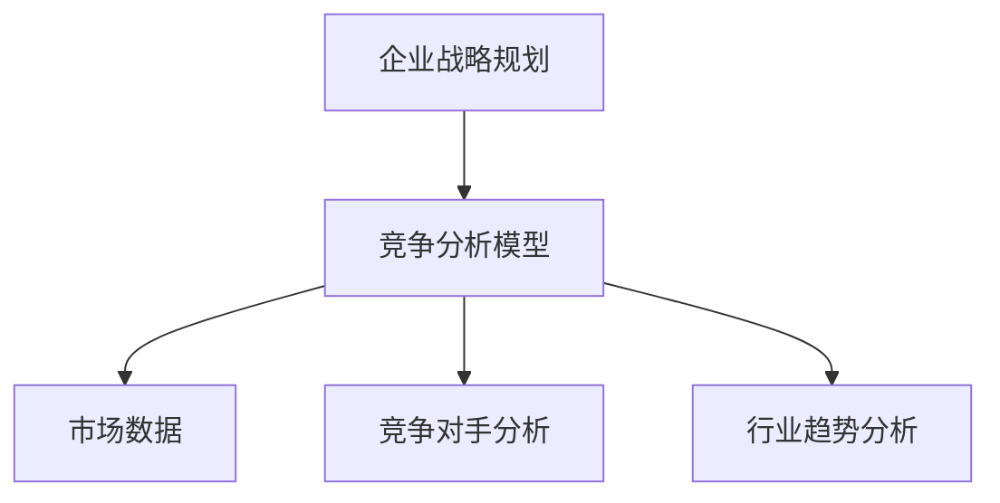
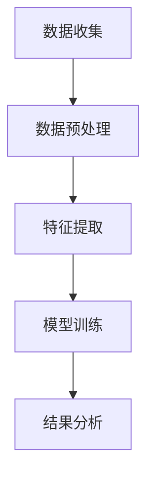
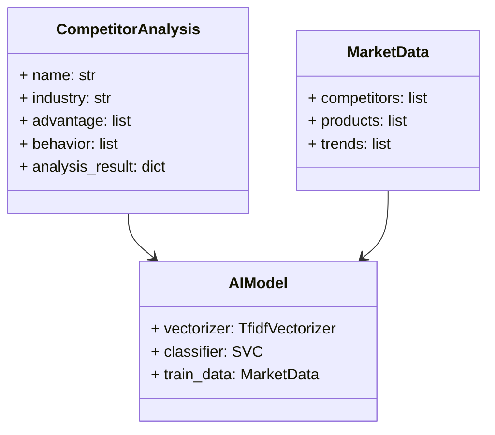
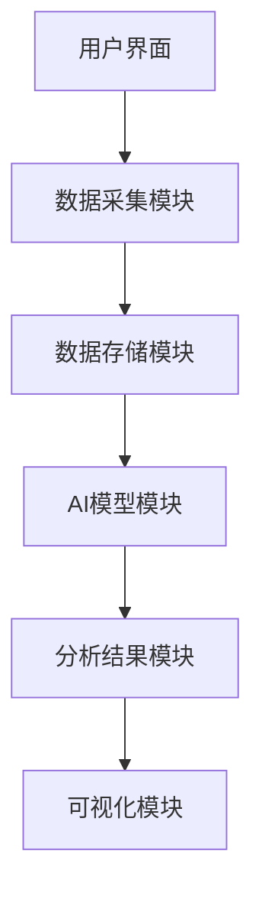
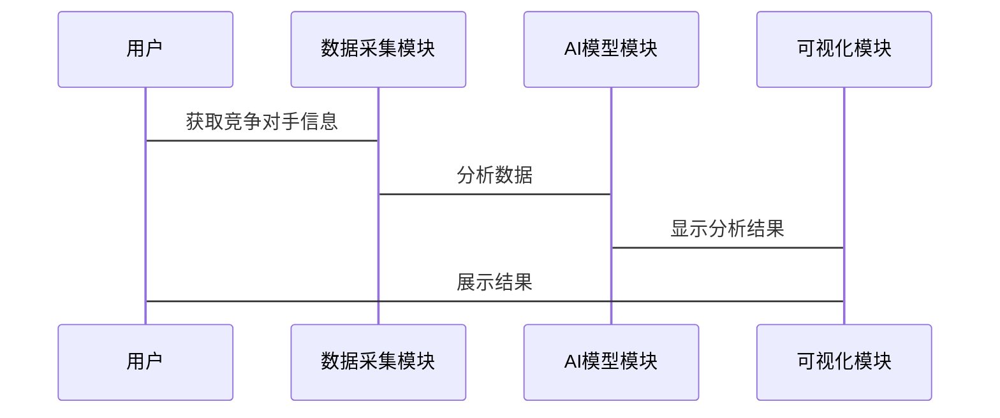

                 


```markdown
# AI辅助企业战略规划与竞争分析的方法论

> 关键词：AI辅助战略规划，竞争分析，企业战略，AI技术，数据分析，机器学习

> 摘要：本文系统地探讨了如何利用人工智能技术辅助企业进行战略规划与竞争分析。通过结合企业战略规划的核心要素和竞争分析的关键环节，本文提出了一套基于AI的方法论，详细阐述了其原理、实现过程以及实际应用案例。同时，本文还分析了该方法论的优势、局限性以及未来的发展方向。

---

# 第一部分: AI辅助企业战略规划与竞争分析的背景与核心概念

## 第1章: 问题背景与核心概念

### 1.1 问题背景
#### 1.1.1 企业战略规划的传统挑战
企业战略规划是企业在复杂多变的市场环境中制定长期发展目标和行动计划的过程。然而，传统战略规划方法依赖于人工分析和经验判断，存在以下挑战：
- 数据量大、维度多，难以全面分析。
- 市场变化快，战略调整周期长。
- 竞争对手分析不够精准，难以制定有效的竞争策略。

#### 1.1.2 竞争分析的复杂性与局限性
竞争分析是企业战略规划的重要组成部分，但传统竞争分析方法存在以下问题：
- 数据来源单一，难以获取全面的竞争对手信息。
- 分析结果依赖人工判断，主观性强。
- 缺乏动态更新机制，难以应对市场的快速变化。

#### 1.1.3 AI技术如何解决这些问题
人工智能技术可以通过以下方式解决传统战略规划和竞争分析的挑战：
- 利用大数据分析技术，提取有价值的信息。
- 建立预测模型，帮助企业在变化的市场环境中快速调整战略。
- 实现实时数据监控和竞争对手动态分析。

### 1.2 核心概念与定义
#### 1.2.1 AI辅助战略规划的定义
AI辅助战略规划是指利用人工智能技术，通过数据分析、模式识别和智能推理等手段，帮助企业制定更科学、更精准的战略规划。

#### 1.2.2 竞争分析的AI方法论
竞争分析的AI方法论是指通过机器学习、自然语言处理等技术，对竞争对手的市场行为、产品特点、竞争优势等进行分析，为企业制定竞争策略提供支持。

#### 1.2.3 方法论的核心要素与组成
AI辅助战略规划与竞争分析的方法论主要包括以下核心要素：
- 数据采集与预处理
- 数据分析与建模
- 智能推理与决策
- 竞争对手分析
- 战略优化与调整

### 1.3 方法论的提出与意义
#### 1.3.1 方法论的提出背景
随着市场竞争的加剧，企业需要更加精准和快速的决策支持。AI技术的发展为企业提供了新的工具和方法，可以有效提升战略规划的科学性和竞争分析的准确性。

#### 1.3.2 方法论的核心价值
- 提高战略规划的效率和准确性。
- 实现实时竞争对手监控和分析。
- 帮助企业制定更具前瞻性的竞争策略。

#### 1.3.3 方法论的适用范围与边界
- 适用于需要快速响应市场变化的企业。
- 适用于数据量大、维度多的行业。
- 适用于需要精准竞争分析的企业。

### 1.4 本章小结
本章介绍了AI辅助企业战略规划与竞争分析的背景、核心概念和方法论，为后续章节的展开奠定了基础。

---

# 第二部分: AI辅助企业战略规划与竞争分析的方法论

## 第2章: AI辅助战略规划的核心概念与联系

### 2.1 核心概念原理
#### 2.1.1 AI在战略规划中的作用
- 数据驱动决策
- 智能预测与模拟
- 实时监控与反馈

#### 2.1.2 数据驱动的决策模型
- 数据采集与清洗
- 数据分析与建模
- 模型验证与优化

#### 2.1.3 竞争分析的AI模型
- 竞争对手行为预测
- 市场趋势分析
- 竞争优势识别

### 2.2 核心概念属性特征对比表
| 概念       | 数据驱动 | 智能分析 | 实时更新 |
|------------|----------|----------|----------|
| AI辅助战略规划 | 是       | 是       | 是       |
| 竞争分析    | 否       | 否       | 否       |

### 2.3 实体关系图（ER图）


### 2.4 本章小结
本章详细阐述了AI辅助战略规划的核心概念及其在竞争分析中的应用，通过对比和图表展示了方法论的逻辑结构。

---

## 第3章: AI辅助竞争分析的算法原理

### 3.1 算法原理概述
#### 3.1.1 自然语言处理（NLP）在竞争分析中的应用
- 文本挖掘
- 情感分析
- 主题建模

#### 3.1.2 数据挖掘与分析算法
- 聚类分析
- 分类算法
- 关联规则挖掘

#### 3.1.3 机器学习模型的构建与训练
- 线性回归
- 支持向量机（SVM）
- 神经网络

### 3.2 算法流程图


### 3.3 算法实现代码示例
```python
import pandas as pd
from sklearn.feature_extraction.text import TfidfVectorizer
from sklearn.svm import SVC
from sklearn.metrics import accuracy_score

# 数据加载与预处理
data = pd.read_csv('competitor_data.csv')
text_data = data['text'].fillna('')

# 特征提取
vectorizer = TfidfVectorizer()
X = vectorizer.fit_transform(text_data)

# 模型训练
model = SVC()
model.fit(X, data['label'])

# 模型预测
test_data = ['new competitor product']
test_X = vectorizer.transform(test_data)
predicted = model.predict(test_X)

print(f'预测结果：{predicted[0]}')
print(f'准确率：{accuracy_score(predicted, [1])}')
```

### 3.4 本章小结
本章详细讲解了AI辅助竞争分析的算法原理，包括自然语言处理、数据挖掘和机器学习等技术，并通过代码示例展示了算法的实现过程。

---

## 第4章: 系统分析与架构设计

### 4.1 问题场景介绍
- 企业需要实时监控竞争对手的市场行为。
- 需要建立一个能够自动分析市场数据的系统。

### 4.2 系统功能设计
#### 4.2.1 领域模型（Mermaid类图）


### 4.3 系统架构设计
#### 4.3.1 系统架构图


### 4.4 系统接口设计
- 数据采集接口：从公开数据源获取竞争对手信息。
- 数据存储接口：将市场数据存储到数据库中。
- 模型调用接口：调用AI模型进行分析并返回结果。

### 4.5 系统交互设计（Mermaid序列图）


### 4.6 本章小结
本章详细设计了AI辅助竞争分析系统的架构和接口，并通过图表展示了系统的各个部分及其交互过程。

---

## 第5章: 项目实战

### 5.1 环境安装与配置
- 安装Python和必要的库（如pandas、scikit-learn、mermaid等）。
- 配置开发环境（如Jupyter Notebook）。

### 5.2 系统核心功能实现
#### 5.2.1 竞争对手数据采集
```python
import requests
from bs4 import BeautifulSoup

def fetch_competitor_data(url):
    response = requests.get(url)
    soup = BeautifulSoup(response.text, 'html.parser')
    data = {'name': soup.find('h1').text,
            'description': soup.find('p').text}
    return data

competitor_data = fetch_competitor_data('https://example.com/competitor')
print(competitor_data)
```

#### 5.2.2 数据分析与建模
```python
from sklearn.ensemble import RandomForestClassifier
from sklearn.metrics import classification_report

# 数据加载
data = pd.read_csv('train.csv')

# 特征提取
X = data.drop('label', axis=1)
y = data['label']

# 模型训练
model = RandomForestClassifier()
model.fit(X, y)

# 模型预测
test_data = pd.read_csv('test.csv')
predicted = model.predict(test_data.drop('label', axis=1))

print(classification_report(test_data['label'], predicted))
```

#### 5.2.3 竞争对手行为预测
```python
import joblib
import numpy as np

# 加载模型
model = joblib.load('competitor_model.pkl')

# 预测竞争对手行为
new_data = np.array([[1, 2, 3, 4]])
predicted_behavior = model.predict(new_data)
print(f'预测行为：{predicted_behavior[0]}')
```

### 5.3 代码实现与解读
- 竞争对手数据采集：通过网络爬虫技术获取竞争对手的信息。
- 数据分析与建模：使用随机森林模型进行分类预测。
- 竞争对手行为预测：基于训练好的模型进行实时预测。

### 5.4 案例分析与结果解读
- 案例背景：某企业需要分析竞争对手的新产品发布情况。
- 数据来源：竞争对手的官方网站和新闻报道。
- 分析结果：预测竞争对手将在下季度发布新产品，并提供具体的市场策略建议。

### 5.5 本章小结
本章通过实际案例展示了AI辅助竞争分析系统的实现过程，从数据采集到模型训练，再到结果预测，详细解读了每个步骤的具体操作。

---

## 第6章: 最佳实践与总结

### 6.1 最佳实践
#### 6.1.1 数据质量的重要性
- 数据的准确性和完整性直接影响分析结果。
- 需要建立数据清洗和预处理机制。

#### 6.1.2 模型优化技巧
- 选择合适的算法和参数。
- 定期更新模型，适应市场变化。

#### 6.1.3 可视化的重要性
- 通过可视化工具展示分析结果，帮助决策者更好地理解数据。
- 使用图表和仪表盘实时监控竞争对手动态。

### 6.2 小结
本章总结了AI辅助企业战略规划与竞争分析方法论的核心内容，并提出了最佳实践建议。

### 6.3 注意事项
- 数据隐私和安全问题需要特别注意。
- 模型的解释性需要足够强，以便决策者理解和信任。

### 6.4 拓展阅读
- 推荐阅读《机器学习实战》和《数据驱动的商业决策》等书籍。
- 关注AI在商业分析领域的最新研究成果。

### 6.5 本章小结
本章总结了方法论的要点，并提出了实践中的注意事项和未来的研究方向。

---

# 第三部分: 结语

## 结语
AI辅助企业战略规划与竞争分析的方法论为企业提供了新的思路和工具。通过结合AI技术，企业可以更高效地制定战略规划，更精准地分析竞争对手，从而在激烈的市场竞争中占据优势。未来，随着AI技术的不断发展，该方法论将得到更广泛的应用和进一步的完善。

---

# 作者

作者：AI天才研究院（AI Genius Institute） & 禅与计算机程序设计艺术（Zen And The Art of Computer Programming）

---

感谢您的阅读！希望本文能为您提供有价值的见解和方法论，帮助您在企业战略规划与竞争分析中更好地应用AI技术。
```

