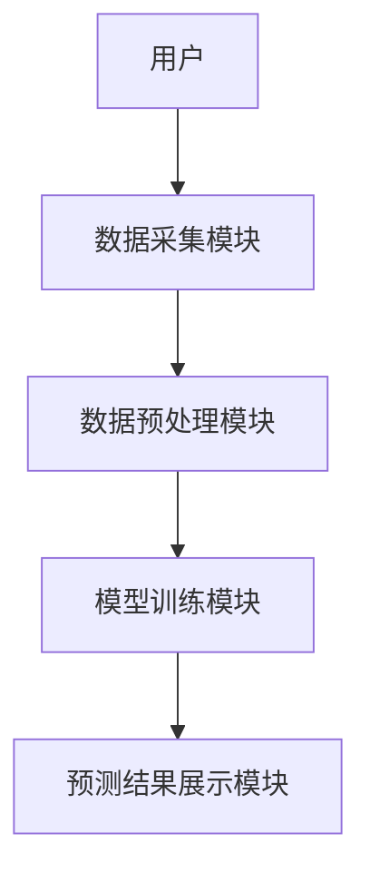
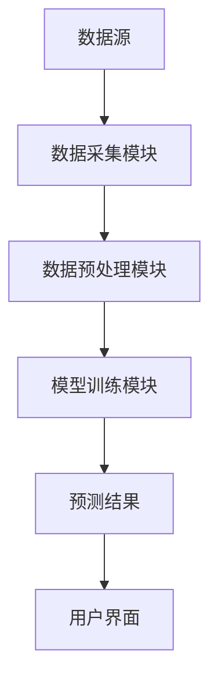
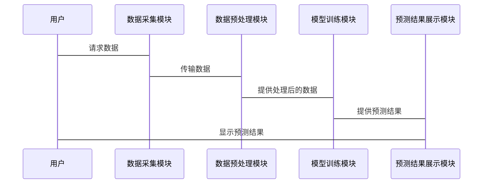

                 


# AI辅助企业战略规划：市场趋势分析与预测

## 关键词：AI，企业战略规划，市场趋势分析，预测模型，时间序列分析，机器学习，深度学习

## 摘要：  
本文深入探讨了人工智能（AI）在企业战略规划中的应用，特别是在市场趋势分析与预测方面。通过结合时间序列分析、机器学习和深度学习等技术，本文详细介绍了AI如何帮助企业预测市场动态，优化战略决策。文章从背景、核心概念、算法原理、系统架构设计到项目实战，全面解析了AI辅助企业战略规划的实现过程，并提供了丰富的代码示例和实际案例分析。

---

# 第一部分: 背景介绍

## 第1章: AI与企业战略规划的背景

### 1.1 AI技术的发展与应用  
人工智能（AI）技术近年来取得了显著进展，从简单的规则引擎到复杂的深度学习模型，AI已经渗透到企业战略规划的各个环节。企业通过AI技术可以更高效地分析市场数据、预测趋势，并制定更具前瞻性的战略。  

#### 1.1.1 AI技术的演进历程  
AI技术的发展可以分为以下几个阶段：  
1. **符号推理阶段**（20世纪50年代-70年代）：基于逻辑推理的AI系统，如专家系统。  
2. **机器学习阶段**（20世纪80年代-90年代）：基于数据的模式识别技术，如决策树和神经网络。  
3. **深度学习阶段**（21世纪初至今）：基于多层神经网络的深度学习技术，如卷积神经网络（CNN）和循环神经网络（RNN）。  

#### 1.1.2 AI在企业管理中的应用现状  
当前，AI技术在企业管理中的应用主要集中在以下几个方面：  
- 数据分析与挖掘  
- 市场趋势预测  
- 风险评估与管理  
- 自动化决策支持  

#### 1.1.3 企业战略规划的重要性  
企业战略规划是企业在复杂市场环境中生存和发展的关键。通过AI技术，企业可以更准确地预测市场趋势，优化资源配置，提升战略决策的效率和质量。  

---

## 第2章: 市场趋势分析与预测的核心概念  

### 2.1 市场趋势分析的定义  
市场趋势分析是指通过对市场数据的分析，识别市场变化的规律和趋势，为企业制定战略提供依据。  

### 2.2 AI在市场趋势分析中的作用  
AI技术通过以下方式辅助市场趋势分析：  
- **数据处理**：自动化处理海量数据，提取关键特征。  
- **模式识别**：识别数据中的隐藏模式和趋势。  
- **预测模型**：构建预测模型，预测未来市场走势。  

### 2.3 市场趋势预测的实现流程  
市场趋势预测的实现流程可以分为以下几个步骤：  
1. 数据采集与预处理  
2. 特征提取与选择  
3. 模型训练与优化  
4. 模型验证与部署  

---

# 第二部分: AI辅助市场趋势分析的核心原理

## 第3章: 时间序列分析算法  

### 3.1 时间序列分析的基本概念  
时间序列分析是一种通过分析历史数据，预测未来趋势的方法。  

#### 3.1.1 时间序列的分解  
时间序列可以分解为以下几个部分：  
- **趋势（Trend）**：长期趋势的变化。  
- **周期性（Seasonality）**：周期性波动。  
- **随机性（Noise）**：不可预测的随机波动。  

#### 3.1.2 常见的时间序列模型  
- **简单指数平滑法（Simple Exponential Smoothing）**  
- ** Holt-Winters 方法**  
- **ARIMA模型**  

### 3.2 基于机器学习的时间序列预测  

#### 3.2.1 ARIMA模型  
ARIMA（AutoRegressive Integrated Moving Average）模型是一种广泛应用于时间序列预测的统计模型。其数学表达式如下：  
$$ ARIMA(p, d, q) $$  
其中，p为自回归阶数，d为差分阶数，q为移动平均阶数。  

#### 3.2.2 LSTM网络  
LSTM（Long Short-Term Memory）是一种基于循环神经网络（RNN）的变体，特别适用于时间序列预测。LSTM通过引入记忆单元（Memory Cell）和遗忘门（Forget Gate）来捕捉长期依赖关系。  

#### 3.2.3 Prophet模型  
Prophet模型是Facebook开源的一种时间序列预测工具，特别适合处理具有周期性特征的数据。  

### 3.3 算法实现与代码示例  

#### 3.3.1 ARIMA模型的实现  
```python
from statsmodels.tsa.arima.model import ARIMA
import pandas as pd

# 假设我们有一个时间序列数据集df，其中包含' sales'列
model = ARIMA(df['sales'], order=(5,1,0))
model_fit = model.fit()
```

#### 3.3.2 LSTM模型的代码示例  
```python
from keras.models import Sequential
from keras.layers import LSTM, Dense

# 定义LSTM模型
model = Sequential()
model.add(LSTM(128, input_shape=(timesteps, features)))
model.add(Dense(1))
model.compile(loss='mean_squared_error', optimizer='adam')
```

#### 3.3.3 Prophet模型的应用  
```python
from fbprophet import Prophet

# 初始化Prophet模型
model = Prophet()
model.fit(train_data)
```

### 3.4 算法对比与选择  
- **ARIMA模型**：适合具有明显趋势和周期性的数据。  
- **LSTM模型**：适合处理复杂的时间序列数据，能够捕捉长期依赖关系。  
- **Prophet模型**：适合处理具有周期性特征的数据，且易于使用。  

---

# 第三部分: 系统分析与架构设计

## 第4章: 系统架构设计  

### 4.1 问题场景介绍  
假设我们有一个电商企业，希望通过AI技术预测未来的销售趋势，优化库存管理和营销策略。  

### 4.2 系统功能设计  
系统功能模块包括：  
- 数据采集模块  
- 数据预处理模块  
- 模型训练模块  
- 预测结果展示模块  

### 4.3 系统架构设计  

#### 4.3.1 系统架构图  


#### 4.3.2 数据流图  


### 4.4 系统接口设计  
- **数据接口**：与数据库或API对接，获取市场数据。  
- **模型接口**：与训练好的模型对接，获取预测结果。  

### 4.5 系统交互设计  

#### 4.5.1 交互流程图  


---

# 第四部分: 项目实战

## 第5章: 项目实战  

### 5.1 环境安装  

#### 5.1.1 安装Python环境  
```bash
pip install python
```

#### 5.1.2 安装依赖库  
```bash
pip install numpy pandas scikit-learn keras tensorflow prophet
```

### 5.2 系统核心实现  

#### 5.2.1 数据预处理代码  
```python
import pandas as pd
import numpy as np

# 读取数据
data = pd.read_csv('market_data.csv')

# 数据清洗
data = data.dropna()
data = data.replace([np.inf, -np.inf], np.nan).dropna()

# 特征提取
features = data[['revenue', 'profit', 'sales']]
target = data['price']
```

#### 5.2.2 模型实现代码  
```python
from keras.models import Sequential
from keras.layers import LSTM, Dense

# 定义LSTM模型
model = Sequential()
model.add(LSTM(128, input_shape=(timesteps, features)))
model.add(Dense(1))
model.compile(loss='mean_squared_error', optimizer='adam')

# 训练模型
model.fit(x_train, y_train, epochs=100, batch_size=32)
```

### 5.3 实际案例分析  

#### 5.3.1 案例背景  
假设我们有一个零售企业，希望通过预测未来的销售趋势优化库存管理。  

#### 5.3.2 数据分析与建模  
通过LSTM模型预测未来的销售数据，预测结果如下：  
$$ \text{预测销售量} = \text{当前库存} \times \text{预测增长率} $$  

#### 5.3.3 模型评估  
通过均方误差（MSE）和R平方值评估模型的性能：  
$$ \text{MSE} = \frac{1}{n}\sum_{i=1}^{n}(y_i - \hat{y}_i)^2 $$  
$$ R^2 = 1 - \frac{\sum (y_i - \hat{y}_i)^2}{\sum (y_i - \bar{y})^2} $$  

### 5.4 项目小结  
通过本项目，我们展示了如何利用AI技术预测市场趋势，并优化企业战略规划。  

---

# 第五部分: 最佳实践与总结

## 第6章: 最佳实践  

### 6.1 AI辅助市场趋势分析的注意事项  
- **数据质量**：确保数据的完整性和准确性。  
- **模型选择**：根据数据特点选择合适的模型。  
- **模型调优**：通过超参数优化提升模型性能。  

### 6.2 小结  
本文通过理论与实践相结合的方式，深入探讨了AI辅助企业战略规划的实现过程。通过时间序列分析、机器学习和深度学习等技术，企业可以更高效地预测市场趋势，制定更具前瞻性的战略。  

### 6.3 注意事项  
- 在实际应用中，需要结合企业的具体需求和数据特点，选择合适的算法和模型。  
- 模型的预测结果仅供参考，需结合企业的实际情况进行调整和优化。  

### 6.4 拓展阅读  
- 《Deep Learning》（Ian Goodfellow等著）  
- 《Time Series Analysis and Its Applications》（Shumway和Stoffer著）  
- 《Python机器学习实战》（Andreas Müller和Sarah Guida著）  

---

## 作者：AI天才研究院/AI Genius Institute & 禅与计算机程序设计艺术 /Zen And The Art of Computer Programming  

---

以上是《AI辅助企业战略规划：市场趋势分析与预测》的完整目录大纲和文章内容，涵盖了从背景介绍到系统架构设计，再到项目实战的各个方面。通过结合理论与实践，本文为读者提供了一个全面了解AI辅助企业战略规划的视角。

