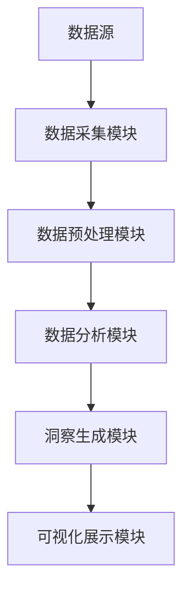
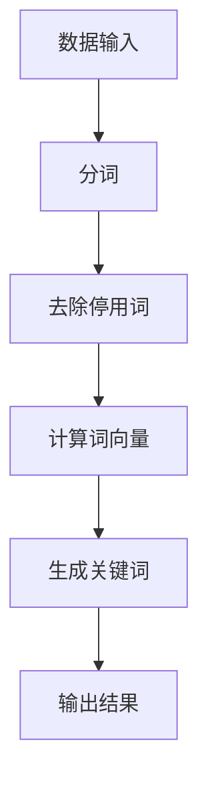
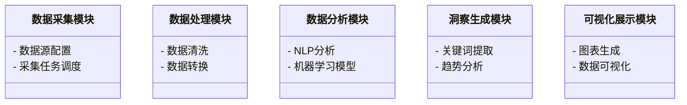
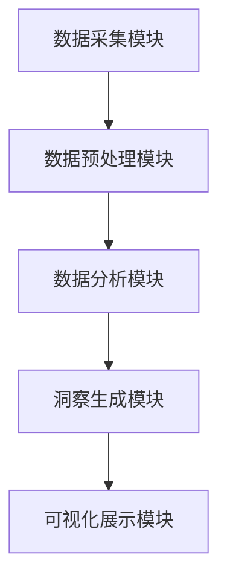

                 


# AI辅助企业竞争情报分析：自动化数据收集与洞察生成

---

## 关键词：
- AI
- 竞争情报分析
- 自动化数据收集
- 洞察生成
- 企业竞争

---

## 摘要：
本文深入探讨了人工智能（AI）在企业竞争情报分析中的应用，重点分析了AI如何实现数据的自动化收集与洞察的自动生成。文章从背景介绍、核心概念、算法原理、系统架构到项目实战，全面解析了AI在竞争情报分析中的作用，并通过实际案例展示了如何利用AI技术提升企业的竞争分析效率和准确性。

---

## 第一部分：背景介绍

### 第1章：竞争情报分析的重要性

#### 1.1 问题背景
- **竞争情报分析**是企业在市场中获取竞争对手信息、了解行业趋势、制定战略决策的重要手段。
- 传统竞争情报分析依赖人工收集和分析数据，效率低、成本高且容易遗漏关键信息。
- 随着市场竞争的加剧，企业需要更高效、更精准的工具来应对竞争。

#### 1.2 问题描述
- 数据来源广泛：包括公开资料、新闻报道、社交媒体、行业报告等。
- 数据量大且复杂：信息分散在多种格式和渠道中，难以快速整合和分析。
- 分析需求多样化：企业需要从不同维度获取竞争对手的产品、市场、财务和战略信息。

#### 1.3 问题解决
- 引入AI技术，通过自动化数据收集和智能分析，提高竞争情报分析的效率和准确性。
- 利用NLP和机器学习算法，从海量数据中提取关键信息并生成洞察。

#### 1.4 边界与外延
- **边界**：聚焦于公开可用的数据源，不涉及企业内部数据或机密信息。
- **外延**：可扩展至市场趋势分析、消费者行为研究等领域。

#### 1.5 核心要素
| 核心要素 | 描述 |
|----------|------|
| 数据源   | 公开数据、社交媒体、新闻报道等 |
| 数据类型 | 文本、结构化数据、图像等 |
| 分析目标 | 竞争对手分析、市场趋势分析等 |
| 工具与技术 | NLP、机器学习、数据挖掘等 |

---

### 第2章：AI与竞争情报分析的结合

#### 2.1 核心概念
- **AI**：模拟人类智能的技术，包括学习、推理和自适应能力。
- **竞争情报分析**：通过收集和分析竞争对手的信息，为企业提供战略支持。
- **自动化数据收集**：利用AI技术自动获取和整理数据。
- **洞察生成**：通过AI分析数据，提取有价值的信息并生成决策建议。

#### 2.2 数据流与模块交互


---

## 第二部分：核心概念与联系

### 第3章：AI在竞争情报分析中的应用

#### 3.1 核心概念属性对比
| 概念 | 特性 |
|------|------|
| 数据源 | 多样性、实时性 |
| 数据处理 | 自动化、高效性 |
| 数据分析 | 智能化、准确性 |
| 洞察生成 | 可视化、可操作性 |

#### 3.2 实体关系图
```mermaid
er
actor 竞争情报分析师
actor 企业决策者
actor 数据源
actor 数据处理工具
actor 数据分析工具
actor 洞察生成工具
```

---

## 第三部分：算法原理

### 第4章：自然语言处理在竞争情报分析中的应用

#### 4.1 NLP算法流程


#### 4.2 代码实现
```python
import jieba

text = "竞争对手发布新产品，性能优于市场现有产品。"
words = jieba.lcut(text)
print(words)  # 输出：['竞争对手', '发布', '新产品', '性能', '优于', '市场', '现有', '产品']
```

#### 4.3 数学模型
- TF-IDF算法：
$$ TF = \frac{\text{某词在文档中的出现次数}}{\text{文档总词数}} $$
$$ IDF = \log\left(\frac{\text{总文档数}}{\text{某词出现的文档数}}\right) $$
$$ \text{TF-IDF} = TF \times IDF $$

---

## 第四部分：系统分析与架构设计

### 第5章：系统功能设计

#### 5.1 系统功能模块


#### 5.2 系统架构设计


---

## 第五部分：项目实战

### 第6章：项目实现与案例分析

#### 6.1 项目背景
- 某企业需要分析竞争对手的产品发布信息。

#### 6.2 核心代码实现
```python
from sklearn.feature_extraction.text import TfidfVectorizer

corpus = ["竞争对手发布新产品，性能优于市场现有产品。",
          "新产品定价低于预期，市场反应热烈。"]
vectorizer = TfidfVectorizer()
tfidf = vectorizer.fit_transform(corpus)
print(vectorizer.get_feature_names())  # 输出：['低于', '现有', '市场', '新产品', '优于', '反应', '定价', '热烈', '性能']
```

#### 6.3 案例分析
- 通过TF-IDF算法提取关键词，发现“新产品”和“市场反应”是核心信息。
- 生成洞察：竞争对手的新产品在市场上的反应良好，值得进一步关注。

---

## 第六部分：最佳实践与小结

### 第7章：总结与建议

#### 7.1 小结
- AI技术显著提升了竞争情报分析的效率和准确性。
- 自动化数据收集与洞察生成为企业提供了强大的工具支持。

#### 7.2 注意事项
- 数据隐私与合规性需严格遵守。
- 系统需定期更新模型以适应市场变化。

#### 7.3 拓展阅读
- 《自然语言处理入门》
- 《机器学习实战》
- 《竞争情报分析方法论》

---

## 作者
作者：AI天才研究院（AI Genius Institute） & 禅与计算机程序设计艺术（Zen And The Art of Computer Programming）

---

本文通过系统的分析和详细的代码示例，展示了AI在企业竞争情报分析中的强大能力。希望本文能为企业在竞争分析中提供新的思路和工具。

