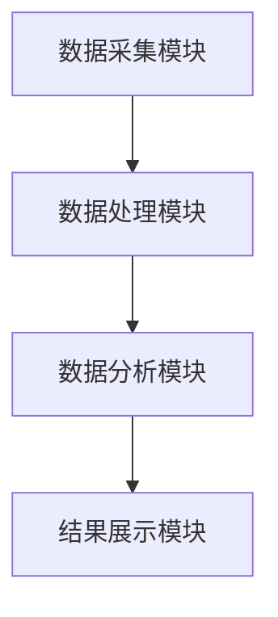
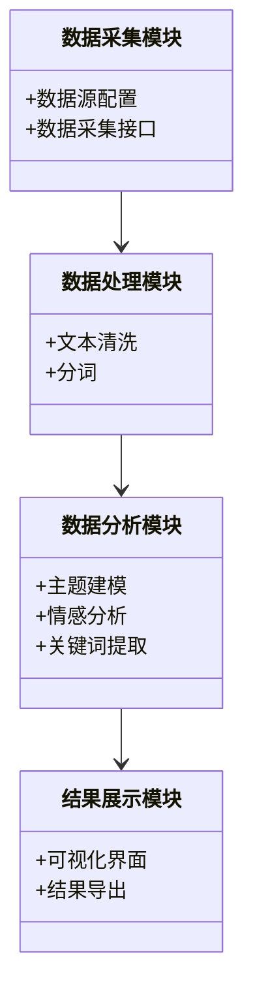

                 


```markdown
# AI辅助企业竞争情报分析：自动化数据收集与洞察生成系统

> 关键词：AI, 竞争情报分析, 自动化数据收集, 洞察生成, 机器学习, NLP, 数据挖掘

> 摘要：本文将详细介绍AI在企业竞争情报分析中的应用，重点探讨自动化数据收集与洞察生成系统的构建与实现。从背景与概念、核心技术、系统架构与算法原理、项目实战到最佳实践，全面解析如何利用AI技术提升企业竞争情报分析的效率与准确性。

---

## 第1章: 企业竞争情报分析概述

### 1.1 竞争情报分析的基本概念
竞争情报分析是通过对竞争对手、市场动态、行业趋势等信息的收集、整理和分析，为企业制定战略决策提供支持的过程。其核心目标是帮助企业了解竞争环境，识别机会与威胁，优化资源配置。

### 1.2 AI在竞争情报分析中的作用
AI技术的引入，显著提升了竞争情报分析的效率和准确性。通过自动化数据收集、智能处理与分析，AI能够快速从海量数据中提取有价值的信息，生成 actionable insights。

### 1.3 系统的需求与目标
#### 需求分析
- 数据来源多样：包括新闻、社交媒体、行业报告等。
- 数据量大：需要处理结构化与非结构化数据。
- 实时性要求高：企业需要快速响应市场变化。
- 分析结果需要可解释性：确保决策的透明性。

#### 系统目标
- 实现自动化数据收集与处理。
- 提供智能化的洞察生成能力。
- 支持企业战略决策的实时优化。

---

## 第2章: AI辅助竞争情报分析的核心技术

### 2.1 自然语言处理（NLP）技术
NLP是AI辅助竞争情报分析的核心技术之一。通过NLP技术，系统可以自动理解、分析和提取文本中的信息。

#### 2.1.1 NLP在竞争情报分析中的应用
- **分词与实体识别**：识别文本中的关键词和实体（如公司名称、产品名称等）。
- **情感分析**：分析市场对竞争对手产品的评价，判断其情感倾向。
- **主题建模**：识别文本中的主题，帮助理解市场趋势。

#### 2.1.2 NLP技术的实现原理
以主题建模为例，LDA（Latent Dirichlet Allocation）是一种常用的主题建模算法。其基本原理如下：
$$
\text{LDA假设每一篇文档中的词分布服从多项式分布，主题通过词的概率分布来表示。}
$$

### 2.2 数据挖掘与机器学习技术
数据挖掘和机器学习技术用于从海量数据中提取模式和规律，支持竞争情报分析的深度挖掘。

#### 2.2.1 数据挖掘技术
- **关联规则挖掘**：发现数据中的关联关系，例如某些产品常被一起购买。
- **聚类分析**：将相似的产品或市场趋势进行分组。

#### 2.2.2 机器学习技术
- **监督学习**：用于分类任务，例如将竞争对手的产品分为“成功”或“失败”两类。
- **无监督学习**：用于主题建模和聚类分析。

---

## 第3章: 竞争情报分析系统的算法原理

### 3.1 竞争情报分析系统的核心算法
本章将详细介绍系统中常用的算法及其实现原理。

#### 3.1.1 主题建模算法（LDA）
LDA（Latent Dirichlet Allocation）是一种常用的无监督主题建模算法。其基本流程如下：
1. 对文本进行预处理（分词、去停用词等）。
2. 假设每一篇文档中的词分布服从多项式分布。
3. 通过迭代优化，得到每篇文档的主题分布和每个主题的词分布。

#### 3.1.2 情感分析算法（SVM与LSTM）
- **SVM**：支持向量机是一种常用的分类算法，适用于小规模数据的情感分析。
- **LSTM**：长短期记忆网络适用于处理长文本序列，能够捕捉情感变化的上下文信息。

#### 3.1.3 关键词提取算法（TF-IDF）
TF-IDF（Term Frequency-Inverse Document Frequency）是一种常用的关键词提取方法。其公式如下：
$$
\text{TF-IDF}(t, d) = \text{TF}(t, d) \times \text{IDF}(t, d)
$$
其中，$\text{TF}(t, d)$表示词$t$在文档$d$中的频率，$\text{IDF}(t, d)$表示词$t$的逆文档频率。

---

## 第4章: 竞争情报分析系统的架构与实现

### 4.1 系统架构设计
系统的总体架构分为以下几个模块：
1. **数据采集模块**：负责从多种数据源（如新闻网站、社交媒体）采集数据。
2. **数据处理模块**：对采集到的数据进行清洗、分词等预处理。
3. **数据分析模块**：利用NLP、数据挖掘和机器学习算法对数据进行分析，生成洞察。
4. **结果展示模块**：将分析结果以可视化的方式呈现给用户。

#### 系统架构图


### 4.2 系统功能设计
#### 功能模块类图


---

## 第5章: 项目实战：竞争情报分析系统的实现

### 5.1 环境安装
- 安装Python环境（如Anaconda）。
- 安装必要的库（如scikit-learn、spaCy、Gensim）。

### 5.2 核心代码实现
#### 5.2.1 数据采集模块
```python
import requests
from bs4 import BeautifulSoup

def fetch_data(url):
    response = requests.get(url)
    soup = BeautifulSoup(response.text, 'html.parser')
    return [p.text for p in soup.find_all('p')]
```

#### 5.2.2 数据处理模块
```python
import spacy

nlp = spacy.load('en_core_web_sm')

def preprocess(text):
    doc = nlp(text)
    return [token.text for token in doc if not token.is_stop]
```

#### 5.2.3 数据分析模块
```python
from gensim.models import LdaModel

def topic_modeling(documents):
    dictionary = Dictionary(documents)
    corpus = [dictionary.doc2bow(doc) for doc in documents]
    lda = LdaModel(corpus, num_topics=5, id2word=dictionary)
    return lda.print_topics()
```

---

## 第6章: 最佳实践与小结

### 6.1 最佳实践
- 数据预处理是关键：确保数据质量，减少噪音。
- 选择合适的算法：根据数据类型和任务选择合适的NLP或机器学习算法。
- 可视化结果：用图表清晰展示分析结果，便于用户理解。

### 6.2 小结
AI技术的应用显著提升了竞争情报分析的效率与准确性。通过自动化数据收集与智能化分析，企业能够快速获取市场洞察，制定更有效的竞争策略。

---

## 参考文献
- [1] 刘洋, 等.《自然语言处理入门》. 清华大学出版社, 2020.
- [2] 李航.《统计学习题》. 清华大学出版社, 2021.

---

## 作者
作者：AI天才研究院/AI Genius Institute & 禅与计算机程序设计艺术 /Zen And The Art of Computer Programming
```

