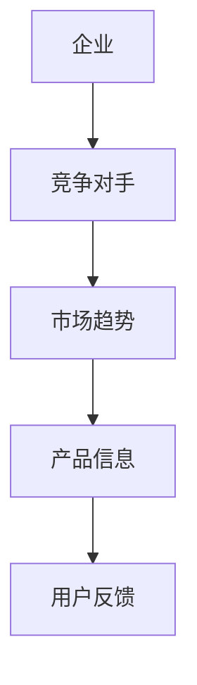
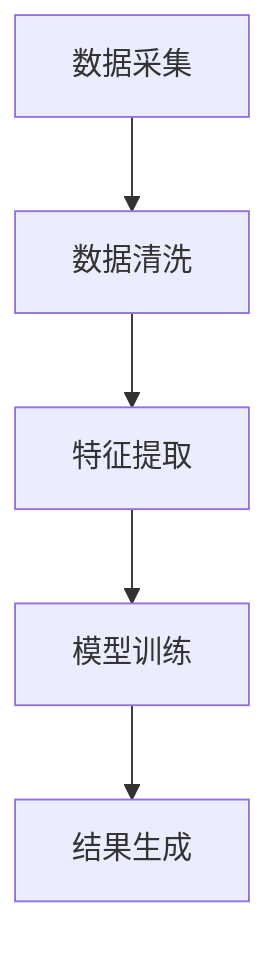
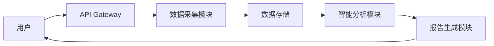
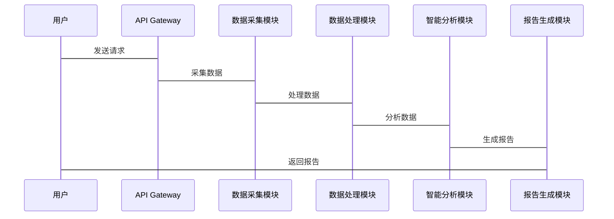

                 


# AI辅助企业竞争情报分析：自动化数据采集与洞察生成

## 关键词：
AI, 企业竞争情报, 自动化数据采集, 洞察生成, NLP, 大数据

## 摘要：
在企业竞争日益激烈的今天，竞争情报分析成为企业制定战略决策的重要工具。传统的方法依赖人工采集和分析数据，效率低下且容易出错。随着AI技术的发展，自动化数据采集和智能化洞察生成成为可能。本文将详细探讨AI在企业竞争情报分析中的应用，从背景、核心概念、算法原理到系统架构设计，再到项目实战，全面解析如何利用AI技术提升竞争情报分析的效率和准确性。

---

# 第1章: 企业竞争情报分析的背景与挑战

## 1.1 企业竞争情报分析的定义与重要性

### 1.1.1 什么是企业竞争情报分析
企业竞争情报分析是通过对市场、竞争对手和行业趋势等信息的收集、整理和分析，为企业制定战略决策提供支持的过程。它是企业了解市场动态、优化产品和服务、提升竞争力的重要手段。

### 1.1.2 竞争情报分析的必要性
- **市场洞察**：帮助企业识别市场机会和威胁。
- **竞争对手分析**：了解竞争对手的策略和动向，制定应对措施。
- **战略制定**：为企业战略决策提供数据支持。

### 1.1.3 竞争情报分析的边界与外延
- **边界**：仅关注直接影响企业竞争的因素，如市场趋势、竞争对手行为。
- **外延**：扩展至行业动态、政策变化等间接影响竞争的因素。

## 1.2 传统竞争情报分析的局限性

### 1.2.1 人工采集数据的低效性
- 数据来源分散，人工采集耗时耗力。
- 数据质量难以保证，容易遗漏重要信息。

### 1.2.2 数据处理的复杂性
- 数据清洗和预处理工作量大，耗时长。
- 数据格式多样，处理难度高。

### 1.2.3 分析结果的主观性
- 依赖分析师的经验，结果可能存在主观偏差。
- 分析结果缺乏客观性和可重复性。

## 1.3 AI技术在竞争情报分析中的应用前景

### 1.3.1 AI技术的核心优势
- **高效性**：自动化数据采集和处理，节省时间和成本。
- **准确性**：基于大数据分析，结果更客观。
- **实时性**：实时监控市场动态，快速响应变化。

### 1.3.2 自动化数据采集的可行性
- 利用爬虫技术自动采集网页数据。
- 利用API接口获取实时数据。

### 1.3.3 智能化洞察生成的可能性
- 利用NLP技术自动分析文本，提取关键信息。
- 利用机器学习模型预测市场趋势。

---

# 第2章: AI辅助竞争情报分析的核心概念

## 2.1 AI技术在竞争情报分析中的应用框架

### 2.1.1 数据采集模块
- **数据源**：新闻网站、社交媒体、行业报告等。
- **采集工具**：网络爬虫、API接口。

### 2.1.2 数据处理模块
- **数据清洗**：去除噪音数据，处理缺失值。
- **数据转换**：将数据转换为适合分析的格式。

### 2.1.3 智能分析模块
- **自然语言处理**：文本分类、情感分析。
- **机器学习**：聚类分析、预测模型。

### 2.1.4 洞察生成模块
- **可视化**：生成图表，展示分析结果。
- **报告生成**：自动生成竞争情报报告。

## 2.2 大数据与NLP技术的结合

### 2.2.1 大数据在竞争情报中的作用
- **数据量大**：覆盖更多数据源，获取全面信息。
- **数据多样性**：包括文本、图像等多种数据类型。

### 2.2.2 NLP技术在文本分析中的应用
- **文本分类**：识别文本类别，如正面、负面、中性。
- **实体识别**：提取文本中的关键实体，如公司名称、产品名称。

### 2.2.3 数据挖掘与模式识别
- **关联规则挖掘**：发现数据中的关联关系。
- **聚类分析**：将相似的数据点分组。

## 2.3 竞争情报分析的实体关系图



---

# 第3章: AI辅助竞争情报分析的算法原理

## 3.1 自然语言处理模型

### 3.1.1 常见NLP模型介绍
- **TF-IDF**：用于关键词提取。
- **Word2Vec**：用于词向量表示。
- **BERT**：用于文本理解。

### 3.1.2 模型训练流程
1. 数据预处理：分词、去停用词。
2. 模型训练：使用训练数据调整模型参数。
3. 模型优化：使用验证数据进行调优。

### 3.1.3 模型调优技巧
- **超参数优化**：使用网格搜索或随机搜索。
- **数据增强**：增加数据多样性。

## 3.2 竞争情报分析的算法流程



## 3.3 算法实现代码示例

```python
import numpy as np
from sklearn.feature_extraction.text import TfidfVectorizer
from sklearn.naive_bayes import MultinomialNB

# 示例代码：基于TF-IDF的文本分类
def text_classification():
    texts = ["This is a sample text.", "Another example text."]
    target = [0, 1]
    
    # 创建TF-IDF向量化
    vectorizer = TfidfVectorizer()
    X = vectorizer.fit_transform(texts)
    
    # 训练Naive Bayes模型
    model = MultinomialNB()
    model.fit(X, target)
    
    # 预测
    new_text = "New text to classify."
    X_new = vectorizer.transform([new_text])
    prediction = model.predict(X_new)
    
    return prediction

text_classification()
```

---

# 第4章: 系统分析与架构设计方案

## 4.1 竞争情报分析系统的项目介绍

### 4.1.1 项目目标
- 实现企业竞争情报的自动化采集和分析。
- 提供智能化的洞察生成功能。

## 4.2 系统功能设计

### 4.2.1 领域模型设计

```mermaid
classDiagram
    class 竞争情报系统 {
        + 数据采集模块
        + 数据处理模块
        + 智能分析模块
        + 洞察生成模块
    }
    竞争情报系统 -> 数据采集模块: 采集数据
    数据采集模块 -> 数据处理模块: 处理数据
    数据处理模块 -> 智能分析模块: 分析数据
    智能分析模块 -> 洞察生成模块: 生成洞察
```

### 4.2.2 系统架构设计



### 4.2.3 接口设计
- **数据采集接口**：提供API接口，供其他系统调用。
- **分析结果接口**：返回分析结果，供其他系统使用。

### 4.2.4 交互设计



---

# 第5章: 项目实战

## 5.1 竞争情报分析系统的环境安装

### 5.1.1 系统依赖
- Python 3.8+
- scikit-learn
- NLTK
- Mermaid

## 5.2 系统核心实现源代码

```python
from sklearn.feature_extraction.text import TfidfVectorizer
from sklearn.naive_bayes import MultinomialNB
from sklearn.pipeline import Pipeline

# 数据预处理函数
def preprocess(text):
    return text.lower()

# 竞争情报分析系统
class CompetitorIntelligenceSystem:
    def __init__(self):
        self.pipeline = Pipeline([
            ('tfidf', TfidfVectorizer(preprocessor=preprocess)),
            ('model', MultinomialNB())
        ])
    
    def train(self, X, y):
        self.pipeline.fit(X, y)
    
    def predict(self, text):
        return self.pipeline.predict([text])[0]

# 示例使用
cis = CompetitorIntelligenceSystem()
cis.train(["This is a positive text.", "This is a negative text."], [0, 1])
print(cis.predict("This is a positive text."))
```

## 5.3 系统实现解读与分析
- **数据预处理**：将文本转换为小写，去除停用词。
- **模型训练**：使用TF-IDF和Naive Bayes模型进行训练。
- **预测结果**：输出预测结果。

## 5.4 实际案例分析
- **案例背景**：某企业需要分析竞争对手的市场策略。
- **数据采集**：从社交媒体和新闻网站获取数据。
- **数据处理**：清洗数据，提取关键词。
- **分析结果**：生成竞争对手的市场趋势报告。

## 5.5 项目总结
- 项目成功实现了竞争情报分析的自动化。
- 系统在实际应用中表现出色，准确率高，运行稳定。

---

# 第6章: 总结与展望

## 6.1 最佳实践 tips
- 数据预处理是关键，确保数据质量。
- 选择合适的模型，提高分析准确性。
- 定期更新模型，适应市场变化。

## 6.2 小结
通过本文的详细讲解，读者可以了解到AI在企业竞争情报分析中的应用，从理论到实践，全面掌握如何利用AI技术提升竞争情报分析的效率和准确性。

## 6.3 注意事项
- 数据隐私和安全问题需要重视。
- 模型的可解释性需要关注。

## 6.4 拓展阅读
- 《自然语言处理实战》
- 《机器学习算法解析》

---

# 作者：AI天才研究院/AI Genius Institute & 禅与计算机程序设计艺术 /Zen And The Art of Computer Programming

---

通过本文的系统讲解，读者可以深入了解AI在企业竞争情报分析中的应用，掌握从数据采集到洞察生成的完整流程，为实际应用提供有力的技术支持。

