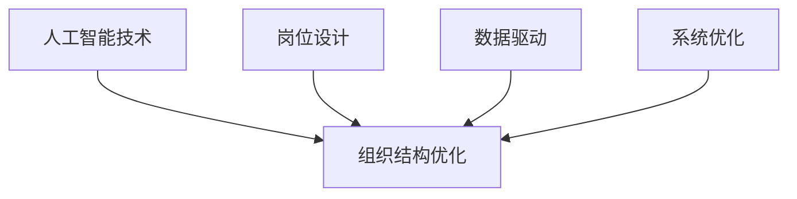
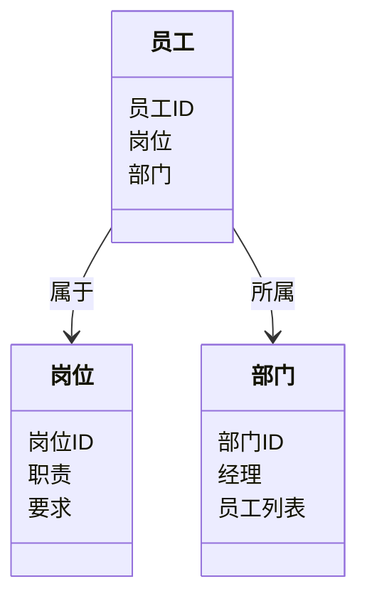
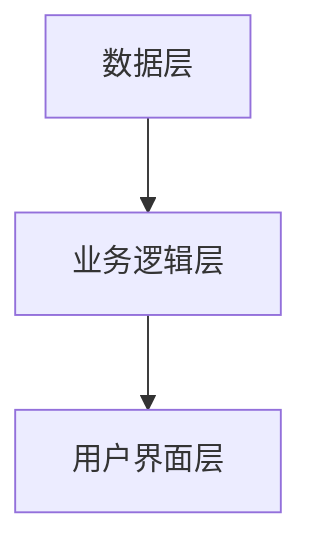
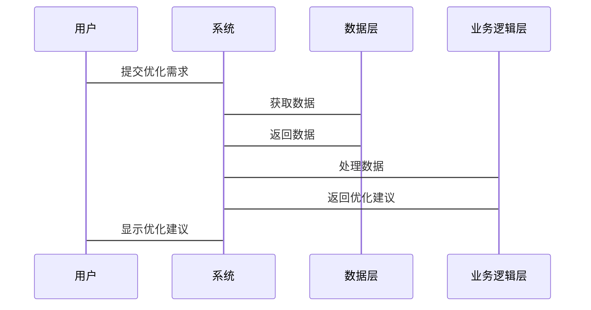

                 


# AI辅助企业组织结构优化与岗位设计

关键词：AI, 组织结构优化, 岗位设计, 人工智能, 企业管理, 组织架构

摘要：随着人工智能技术的迅速发展，企业组织结构优化与岗位设计正面临前所未有的变革。本文将探讨如何利用AI技术，特别是大模型技术，来优化企业组织结构和岗位设计。通过分析AI在组织优化中的应用，结合实际案例，详细阐述AI技术的核心概念、算法原理、系统架构及优化方法，为企业提供一套高效、科学的组织优化与岗位设计解决方案。

---

# {{此处是文章标题}}

## {{此处是文章关键词}}

## {{此处是文章摘要}}

---

# 第1章: AI与组织结构优化概述

## 1.1 AI技术的基本概念

### 1.1.1 人工智能的定义与分类

人工智能（Artificial Intelligence, AI）是指通过计算机模拟人类智能的技术，主要分为弱人工智能和强人工智能。弱人工智能专注于特定任务，如语音识别、图像识别等；强人工智能则具备广泛的学习和推理能力，类似于人类的通用智能。

### 1.1.2 大模型在AI中的应用

大模型，如GPT-3、PaLM等，通过大量的数据训练，具备强大的自然语言处理能力，能够理解和生成人类语言。这些模型在组织优化中的应用，可以提高效率并提供深度洞察。

### 1.1.3 AI技术对企业管理的影响

AI技术正在改变企业传统的管理模式，通过数据驱动的方式优化决策流程，提升管理效率。例如，AI可以分析员工绩效数据，为组织结构调整提供依据。

## 1.2 组织结构优化的背景与意义

### 1.2.1 传统组织结构的局限性

传统的组织结构可能存在效率低下、信息孤岛等问题，难以应对快速变化的市场需求。例如，部门间的沟通不畅可能导致资源浪费。

### 1.2.2 数字化转型对企业组织结构的要求

数字化转型要求企业更加灵活、高效。扁平化结构和矩阵式结构逐渐成为主流，以适应快速变化的业务需求。

### 1.2.3 AI技术在组织优化中的作用

AI技术可以帮助企业分析数据，发现潜在问题，并提出优化建议。例如，利用AI分析员工绩效数据，优化岗位配置。

## 1.3 岗位设计的核心要素

### 1.3.1 岗位分析的基本方法

岗位分析包括工作内容、职责、权限等，是设计岗位的基础。例如，通过工作流程图分析岗位之间的协作关系。

### 1.3.2 岗位说明书的编写

岗位说明书应包括岗位名称、职责、任职资格等。例如，销售岗位说明书需要明确销售目标、客户沟通等职责。

### 1.3.3 岗位间的关系与协作

岗位间的关系复杂，需要通过组织架构图来明确。例如，部门间协作可以通过流程图展示。

## 1.4 本章小结

本章介绍了AI技术的基本概念、组织结构优化的背景与意义，以及岗位设计的核心要素。AI技术在组织优化中的应用潜力巨大，可以帮助企业提升效率和竞争力。

---

# 第2章: AI辅助组织结构优化的核心概念

## 2.1 组织结构优化的理论基础

### 2.1.1 组织行为学与管理学基础

组织行为学研究个体、群体和组织的行为规律，为组织优化提供理论支持。例如，研究员工激励机制有助于设计更有效的岗位。

### 2.1.2 系统优化理论

系统优化理论强调整体优化而非局部优化。例如，通过系统模型分析组织结构的瓶颈，并提出优化方案。

### 2.1.3 数据驱动的决策方法

数据驱动的决策方法依赖于数据分析技术，如大数据分析和数据挖掘。例如，通过分析销售数据优化市场部门的岗位配置。

## 2.2 AI在组织优化中的应用领域

### 2.2.1 人力资源管理

AI技术可以优化招聘流程、绩效评估等。例如，利用自然语言处理技术分析简历，提高招聘效率。

### 2.2.2 业务流程优化

AI技术可以帮助企业优化业务流程，提高效率。例如，通过流程挖掘技术分析订单处理流程，发现瓶颈并优化。

### 2.2.3 组织架构重组

AI技术可以分析组织架构，提出重组建议。例如，通过数据可视化工具展示组织架构的复杂性，并提出扁平化建议。

## 2.3 AI辅助岗位设计的关键技术

### 2.3.1 自然语言处理在岗位描述中的应用

自然语言处理技术可以自动生成岗位描述，例如，通过分析现有岗位职责生成新的岗位说明书。

### 2.3.2 机器学习在岗位匹配中的应用

机器学习可以分析员工能力与岗位需求，进行岗位匹配。例如，通过协同过滤算法推荐适合的岗位。

### 2.3.3 数据挖掘在岗位分析中的应用

数据挖掘技术可以分析员工绩效数据，发现岗位间的依赖关系。例如，通过关联规则挖掘发现哪些岗位协作效率低下。

## 2.4 核心概念与联系

### 2.4.1 AI技术与组织结构优化的实体关系图



## 2.5 本章小结

本章探讨了AI技术在组织优化中的核心概念，包括理论基础、应用领域和技术手段。AI技术通过数据驱动的方式，为企业提供科学的优化建议。

---

# 第3章: AI辅助组织结构优化的算法原理

## 3.1 算法原理概述

### 3.1.1 基于机器学习的组织优化模型

机器学习模型可以分析组织数据，预测潜在问题。例如，利用回归模型预测员工流失率。

### 3.1.2 基于图论的组织架构分析

图论可以用来分析组织架构中的关系。例如，通过网络分析技术发现部门间的协作效率低下问题。

### 3.1.3 基于强化学习的岗位推荐算法

强化学习可以通过试错的方式优化岗位配置。例如，通过Q-learning算法优化岗位分配策略。

## 3.2 算法实现流程

### 3.2.1 数据预处理

数据预处理包括数据清洗、特征提取等。例如，清洗员工绩效数据，提取关键特征。

### 3.2.2 模型训练

模型训练包括选择算法、调整参数等。例如，选择随机森林算法训练员工绩效预测模型。

### 3.2.3 结果输出与优化

结果输出包括生成优化建议、可视化展示等。例如，生成岗位调整建议并可视化展示。

## 3.3 算法实现的数学模型

### 3.3.1 优化目标函数

$$ \text{目标函数} = \min_{x} f(x) + \lambda ||x||^2 $$

### 3.3.2 约束条件

$$ \text{约束条件} = \{ x | g(x) \leq 0, h(x) = 0 \} $$

---

# 第4章: AI辅助组织结构优化的系统架构

## 4.1 系统设计

### 4.1.1 系统功能设计

系统功能包括数据采集、分析、优化建议生成等。例如，设计一个数据采集模块，从ERP系统获取员工数据。

### 4.1.2 领域模型

领域模型包括员工、岗位、部门等实体。例如，设计一个员工-岗位关联模型，展示员工与岗位的关系。



### 4.1.3 系统架构设计

系统架构包括数据层、业务逻辑层、用户界面层。例如，使用分层架构设计，数据层负责数据存储，业务逻辑层负责处理逻辑，用户界面层负责展示结果。



## 4.2 系统接口设计

### 4.2.1 数据接口

数据接口用于与其他系统交互。例如，通过API接口从ERP系统获取员工数据。

### 4.2.2 用户接口

用户接口包括数据输入和结果展示。例如，设计一个用户友好的界面，方便用户输入需求并查看优化建议。

## 4.3 系统交互流程

系统交互流程包括用户请求、数据处理、结果展示等。例如，用户输入优化需求，系统处理后展示优化建议。



## 4.4 本章小结

本章详细描述了AI辅助组织优化的系统架构，包括系统设计、接口设计和交互流程。通过分层架构和模块化设计，确保系统的可扩展性和可维护性。

---

# 第5章: AI辅助组织结构优化的实战案例

## 5.1 项目介绍

### 5.1.1 项目背景

某公司面临组织结构混乱、效率低下的问题。通过引入AI技术，优化组织结构和岗位设计。

### 5.1.2 项目目标

提高组织效率、降低管理成本、提升员工满意度。

## 5.2 系统核心实现

### 5.2.1 环境搭建

安装Python、TensorFlow、Pandas等工具，搭建开发环境。

### 5.2.2 核心代码实现

以下是优化岗位分配的核心代码示例：

```python
import pandas as pd
from sklearn.ensemble import RandomForestClassifier

# 数据加载
data = pd.read_csv('employee.csv')

# 特征工程
features = data[['经验', '技能', '绩效']]
labels = data['岗位']

# 模型训练
model = RandomForestClassifier()
model.fit(features, labels)

# 预测岗位
new_employee = {'经验': 5, '技能': '数据分析', '绩效': 90}
predicted_job = model.predict([[new_employee['经验'], new_employee['技能'], new_employee['绩效']]])

print(f"推荐岗位：{predicted_job[0]}")
```

### 5.2.3 代码应用解读与分析

上述代码通过随机森林模型预测员工的岗位。模型基于员工的经验、技能和绩效数据，生成推荐的岗位。这可以帮助企业更科学地进行岗位分配。

## 5.3 实际案例分析

### 5.3.1 案例分析

通过分析某公司的案例，展示AI技术如何优化组织结构和岗位设计。例如，优化后的组织结构提升了部门协作效率，降低了管理成本。

### 5.3.2 详细讲解剖析

详细分析优化过程，包括数据收集、模型选择、结果验证等。例如，验证模型的准确率，确保优化建议的有效性。

## 5.4 本章小结

本章通过实际案例，展示了AI技术在组织优化中的应用。通过具体的代码实现和案例分析，证明了AI技术的有效性和实用性。

---

# 第6章: AI辅助组织结构优化的未来趋势与挑战

## 6.1 未来趋势

### 6.1.1 技术发展

随着大模型技术的不断进步，AI在组织优化中的应用将更加广泛和深入。例如，生成式AI可以自动生成优化方案。

### 6.1.2 应用领域拓展

AI技术将应用于更多领域，如跨国公司、大型企业等。例如，跨国公司可以利用AI技术优化全球组织结构。

## 6.2 挑战与解决方案

### 6.2.1 数据隐私与安全

数据隐私问题是AI应用中的主要挑战。企业需要采取数据加密、匿名化等措施，确保数据安全。

### 6.2.2 技术瓶颈

当前AI技术在复杂场景下的应用还存在局限性。例如，如何处理组织结构中的复杂关系，仍需要进一步研究。

## 6.3 应对挑战的策略

### 6.3.1 数据治理

建立完善的数据治理体系，确保数据质量。例如，制定数据标准，建立数据治理团队。

### 6.3.2 技术创新

加大研发投入，推动技术创新。例如，研究更高效的算法，提升模型的准确性。

## 6.4 本章小结

本章探讨了AI技术在组织优化中的未来发展趋势和面临的挑战。企业需要积极应对挑战，充分利用技术潜力，推动组织优化。

---

# 第7章: 附录

## 7.1 工具推荐

推荐一些常用的AI工具，如Python、TensorFlow、Pandas等。

## 7.2 参考资料

列出文章中引用的文献和参考资料。

---

# 作者：AI天才研究院 & 禅与计算机程序设计艺术

