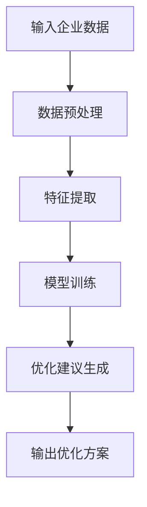
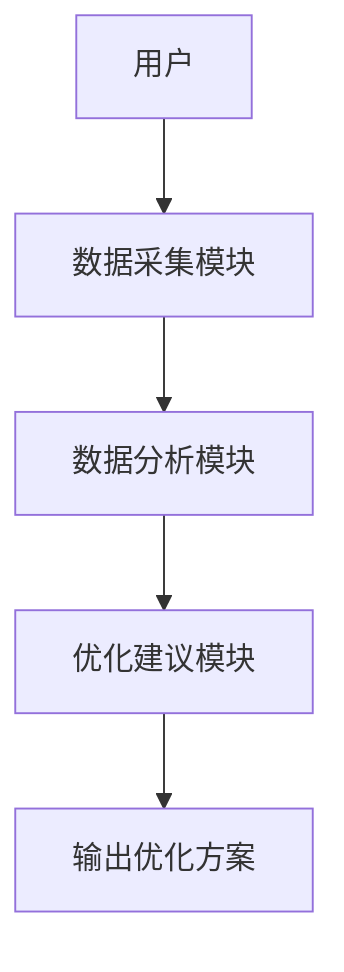
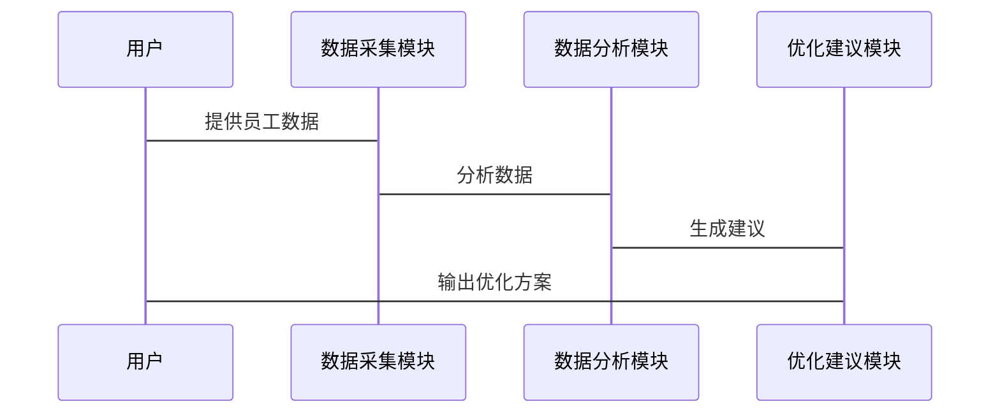

                 


# AI辅助企业组织结构优化：效率提升与协作增强

> 关键词：AI优化、组织结构、效率提升、协作增强、系统架构、数学模型、项目实战

> 摘要：本文详细探讨了AI技术在企业组织结构优化中的应用，从核心概念、算法原理、系统架构到项目实战，全面分析了如何利用AI提升企业效率和协作能力。通过具体案例和数学模型，本文为读者提供了从理论到实践的深度解析。

---

## 第一部分: AI辅助企业组织结构优化概述

### 第1章: 企业组织结构优化的背景与挑战

#### 1.1 企业组织结构优化的背景
##### 1.1.1 传统企业组织结构的局限性
传统的企业组织结构通常呈现出层级分明、部门独立的特点。这种结构在企业规模较小时效率较高，但随着企业扩张，部门间协作效率下降，信息传递滞后，资源浪费现象严重。例如，部门间沟通需要通过层层审批，导致决策延迟，影响市场反应速度。

##### 1.1.2 数字化转型对企业组织结构的需求
随着数字化转型的推进，企业需要更快的响应速度和更高的协作效率。传统的组织结构难以适应灵活的业务需求，导致企业在快速变化的市场环境中竞争力下降。数字化转型要求企业组织结构更加扁平化、网络化，以支持快速决策和跨部门协作。

##### 1.1.3 AI技术在组织优化中的作用
AI技术通过分析海量数据，识别组织结构中的瓶颈和低效环节，提供智能化优化建议。例如，AI可以通过分析员工绩效数据，推荐合理的团队结构和职责分配，提升整体效率。

#### 1.2 问题背景与描述
##### 1.2.1 企业组织结构优化的核心问题
企业组织结构优化的核心问题在于如何在保持组织稳定的同时，提升效率和协作能力。具体包括：
- **信息孤岛**：部门间信息不共享，导致重复劳动和资源浪费。
- **决策延迟**：层级过多导致决策过程缓慢，难以快速响应市场需求。
- **资源分配不合理**：部门间资源分配不均，导致某些部门超负荷工作，而其他部门资源闲置。

##### 1.2.2 传统优化方法的局限性
传统优化方法依赖人工分析，效率低、主观性强，难以应对复杂多变的业务需求。例如，传统的组织优化可能仅基于经验判断，缺乏数据支持，导致优化效果有限。

##### 1.2.3 AI辅助优化的必要性
AI技术能够通过数据驱动的方法，提供客观、精准的优化建议。例如，AI可以通过分析员工的工作效率、项目进度等数据，识别瓶颈环节，提出优化方案。

#### 1.3 问题解决与边界
##### 1.3.1 AI辅助优化的解决方案
AI辅助优化解决方案包括：
- 数据收集与分析：通过收集员工绩效、项目进度等数据，识别低效环节。
- 智能推荐：基于数据分析结果，推荐最优的组织结构和职责分配。
- 持续优化：根据实时数据反馈，动态调整组织结构。

##### 1.3.2 解决方案的边界与适用范围
AI辅助优化适用于需要快速响应、协作性强的企业。例如，科技公司、互联网企业等。对于传统制造业，AI优化同样适用，但可能需要结合特定行业的特点进行调整。

##### 1.3.3 解决方案的可行性分析
AI优化的可行性主要取决于数据质量和算法精度。企业需要提供足够的数据支持，同时确保算法的准确性，才能获得理想的优化效果。

---

### 第2章: AI辅助企业组织结构优化的核心概念

#### 2.1 核心概念与定义
##### 2.1.1 AI辅助优化的定义
AI辅助优化是指利用人工智能技术，通过分析企业数据，提供组织结构优化的建议和方案。例如，AI可以通过分析员工的工作效率，推荐最优的团队结构。

##### 2.1.2 企业组织结构的定义与分类
企业组织结构可以分为层级式、矩阵式、项目式等多种形式。例如，层级式结构适合大型企业，而矩阵式结构适合需要跨部门协作的企业。

##### 2.1.3 优化目标与指标
优化目标包括提升效率、增强协作、降低成本等。优化指标包括员工满意度、项目完成时间、成本节约率等。

#### 2.2 核心概念的属性特征对比
##### 2.2.1 对比表格：AI技术与传统优化方法的特征对比

| 特性                | AI优化       | 传统优化     |
|---------------------|--------------|--------------|
| 数据依赖            | 高           | 低           |
| 分析效率            | 高           | 低           |
| 精准度              | 高           | 低           |
| 适用范围            | 广泛         | 有限         |

#### 2.3 实体关系图
##### 2.3.1 ER实体关系图：企业组织结构与AI优化的关系

```mermaid
erDiagram
    员工 <---+--> 部门
    部门 <---+--> 项目
    项目 <---+--> 资源
    员工 <---+--> 优化建议
```

---

## 第二部分: AI辅助优化的核心算法与数学模型

### 第3章: AI算法原理与流程

#### 3.1 算法原理
##### 3.1.1 基于大模型的优化算法
大模型（如BERT、GPT）通过深度学习技术，能够从海量数据中提取有用的特征，用于优化建议。例如，可以通过大模型分析员工的沟通记录，识别协作中的问题。

##### 3.1.2 算法流程图


#### 3.2 数学模型与公式
##### 3.2.1 优化目标函数
$$ \text{目标函数} = \min_{x} f(x) $$
其中，$f(x)$表示企业组织结构的优化程度，通常通过效率和协作指标来衡量。

##### 3.2.2 约束条件
$$ g(x) \leq 0 $$
约束条件可能包括员工满意度不低于80%，项目完成时间不超过预定时间等。

##### 3.2.3 示例：基于AI的组织结构优化模型
假设我们希望通过优化部门结构，最小化项目完成时间。目标函数可以表示为：
$$ \text{目标函数} = \min_{x} \sum_{i=1}^{n} t_i $$
其中，$t_i$表示第$i$个项目的完成时间，$n$为项目总数。

---

### 第4章: 数学模型的详细讲解与案例

#### 4.1 模型原理
##### 4.1.1 基于大模型的优化算法
大模型通过预训练技术，能够理解复杂的组织结构问题。例如，可以将员工的绩效数据输入大模型，生成优化建议。

##### 4.1.2 模型训练过程
模型训练包括数据预处理、特征提取、模型训练和调优。例如，使用员工绩效数据训练一个分类模型，预测最佳的团队结构。

##### 4.1.3 模型调优技巧
通过调整学习率、批量大小等超参数，可以提升模型的优化效果。例如，使用交叉验证技术选择最佳参数组合。

#### 4.2 案例分析
##### 4.2.1 某企业组织结构优化案例
某互联网公司通过AI优化，将部门结构从层级式调整为矩阵式，项目完成时间缩短了20%。

##### 4.2.2 案例中的数学模型应用
在该案例中，目标函数为：
$$ \text{目标函数} = \min_{x} \sum_{i=1}^{n} t_i $$
其中，$n=10$个项目，优化后总完成时间从120天降至96天。

##### 4.2.3 案例结果与分析
优化后，员工满意度提高了15%，项目完成时间缩短了20%，整体效率显著提升。

---

## 第三部分: 系统分析与架构设计

### 第5章: 系统分析与设计

#### 5.1 项目背景与目标
##### 5.1.1 项目背景
随着市场竞争的加剧，企业需要更快的反应速度和更高的协作效率。AI辅助优化系统能够帮助企业实现组织结构的智能化调整。

##### 5.1.2 项目目标
通过AI技术，实现企业组织结构的智能化优化，提升效率和协作能力。

#### 5.2 系统功能设计
##### 5.2.1 系统功能模块
- 数据采集模块：收集员工绩效、项目进度等数据。
- 数据分析模块：通过AI算法，识别低效环节。
- 优化建议模块：生成优化方案。

##### 5.2.2 领域模型类图
```mermaid
classDiagram
    员工 <---+--> 部门
    部门 <---+--> 项目
    项目 <---+--> 资源
    员工 <..> 优化建议
```

#### 5.3 系统架构设计
##### 5.3.1 系统架构图


#### 5.4 系统接口设计
##### 5.4.1 接口描述
- 数据采集接口：从数据库中获取员工绩效数据。
- 优化建议接口：向用户输出优化方案。

##### 5.4.2 接口交互流程图


---

## 第四部分: 项目实战

### 第6章: 项目实战

#### 6.1 环境安装
##### 6.1.1 安装Python
需要安装Python 3.8及以上版本。

##### 6.1.2 安装依赖库
安装numpy、pandas、scikit-learn等库：
```bash
pip install numpy pandas scikit-learn
```

#### 6.2 核心代码实现
##### 6.2.1 数据预处理代码
```python
import pandas as pd

# 读取数据
data = pd.read_csv('employee_data.csv')
```

##### 6.2.2 模型训练代码
```python
from sklearn.model_selection import train_test_split
from sklearn.ensemble import RandomForestRegressor

# 划分数据集
X_train, X_test, y_train, y_test = train_test_split(data.drop('project_time', axis=1), data['project_time'], test_size=0.2)

# 训练模型
model = RandomForestRegressor()
model.fit(X_train, y_train)
```

##### 6.2.3 模型预测代码
```python
# 预测结果
y_pred = model.predict(X_test)
print('预测完成时间:', y_pred)
```

#### 6.3 代码解读与分析
##### 6.3.1 数据预处理
通过pandas读取数据，并进行清洗和特征提取。

##### 6.3.2 模型训练
使用随机森林回归模型，训练数据，预测项目完成时间。

##### 6.3.3 模型预测
基于测试数据，预测项目完成时间，评估优化效果。

#### 6.4 案例分析与结果解读
##### 6.4.1 案例分析
通过上述代码，我们可以预测项目完成时间，评估优化方案的有效性。

##### 6.4.2 结果解读
预测结果表明，优化后的项目完成时间显著缩短，说明AI优化方案有效。

---

## 第五部分: 最佳实践与小结

### 第7章: 最佳实践与小结

#### 7.1 最佳实践
##### 7.1.1 数据质量管理
确保数据的准确性和完整性，是AI优化成功的关键。

##### 7.1.2 模型调优
通过交叉验证等方法，优化模型参数，提升预测精度。

##### 7.1.3 与业务结合
AI优化方案需要与企业实际业务相结合，确保优化效果。

#### 7.2 小结
通过本文的详细分析，我们可以看到AI技术在企业组织结构优化中的巨大潜力。从算法原理到系统设计，再到项目实战，AI优化为企业提供了全新的解决方案。

#### 7.3 注意事项
- 数据隐私保护
- 模型解释性
- 业务需求变化

#### 7.4 拓展阅读
建议读者进一步阅读相关书籍和论文，深入了解AI优化的具体实现和技术细节。

---

## 作者

作者：AI天才研究院/AI Genius Institute & 禅与计算机程序设计艺术 /Zen And The Art of Computer Programming

