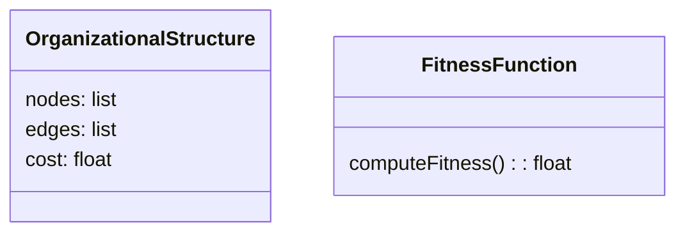
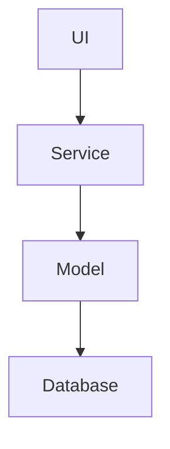

                 


# AI辅助企业组织结构优化：效能评估与动态调整

## 关键词：AI技术、企业组织结构优化、效能评估、动态调整、组织架构分析、机器学习算法、管理决策支持

## 摘要：本文探讨了如何利用人工智能技术优化企业组织结构，通过效能评估和动态调整，实现企业高效运作。文章从问题背景、核心概念、算法原理、系统架构到实际案例，全面分析了AI在组织优化中的应用，为企业管理者和技术人员提供了理论支持和实践指导。

---

## 第1章: AI辅助企业组织结构优化的背景与概念

### 1.1 企业组织结构优化的背景与意义

#### 1.1.1 传统企业组织结构的局限性
传统的组织结构往往过于僵化，难以适应快速变化的市场环境。层级过多导致信息传递缓慢，部门间协作效率低下，资源浪费严重。

#### 1.1.2 数字化转型对企业组织结构的需求
随着数字化转型的推进，企业需要更加灵活、高效、扁平化的组织结构。AI技术的应用为企业提供了智能化的组织优化解决方案。

#### 1.1.3 AI技术在企业组织优化中的作用
AI技术可以通过数据分析、模式识别和智能决策，帮助企业发现组织结构中的问题，并提出优化建议，提升整体效能。

### 1.2 AI辅助组织优化的核心概念

#### 1.2.1 AI辅助组织优化的定义
AI辅助组织优化是指利用人工智能技术，通过数据驱动的方法，对企业的组织结构、流程和资源配置进行分析、评估和优化的过程。

#### 1.2.2 核心要素与概念结构
AI辅助组织优化的核心要素包括：数据采集、模型构建、算法设计、结果评估和动态调整。

#### 1.2.3 与传统组织优化方法的对比
与传统方法相比，AI辅助优化更加高效、精准，能够处理大量复杂的数据，并实时动态调整。

### 1.3 企业组织结构优化的边界与外延

#### 1.3.1 优化的边界范围
组织结构优化的边界通常包括企业的管理架构、部门设置、岗位职责和人员配置等方面。

#### 1.3.2 优化的外延领域
优化的外延领域包括企业文化建设、团队协作效率、信息传递速度和决策效率等。

#### 1.3.3 与其他管理方法的关联
AI辅助优化与企业战略管理、流程管理、风险管理等方法密切相关，形成了一个完整的管理体系。

### 1.4 本章小结

#### 1.4.1 核心概念总结
通过本章的分析，我们明确了AI辅助组织优化的核心概念，包括数据驱动、智能决策和动态调整。

#### 1.4.2 优化目标的明确
优化目标包括提升效率、降低成本、增强协作和提高决策的准确性。

#### 1.4.3 下文展开的逻辑框架
接下来的章节将从算法原理、系统架构到实际案例，详细探讨AI辅助优化的具体实现和应用。

---

## 第2章: AI辅助组

---

## 第3章: AI辅助企业组织结构优化的核心算法与实现

### 3.1 基于强化学习的组织优化算法

#### 3.1.1 强化学习的基本原理
强化学习是一种通过智能体与环境交互，逐步优化决策策略的算法。在组织优化中，智能体可以代表企业的组织结构，环境则代表市场变化。

#### 3.1.2 算法实现步骤
1. 初始化组织结构模型。
2. 定义状态空间、动作空间和奖励函数。
3. 通过强化学习训练模型，优化组织结构。
4. 实时动态调整组织结构。

#### 3.1.3 强化学习算法的数学模型
$$ R(s, a) = \text{奖励函数} $$
其中，\( s \) 表示当前状态，\( a \) 表示动作。

### 3.2 基于遗传算法的组织优化

#### 3.2.1 遗传算法的基本原理
遗传算法是一种模拟生物进化的过程，通过选择、交叉和变异操作，优化问题的解。

#### 3.2.2 遗传算法在组织优化中的应用
1. 编码组织结构为染色体。
2. 通过适应度函数评估组织结构的优劣。
3. 进行选择、交叉和变异操作，生成新的组织结构。
4. 重复迭代，优化组织结构。

### 3.3 算法实现的代码示例

#### 3.3.1 强化学习算法的代码实现
```python
class OrganizationalStructure:
    def __init__(self):
        self.nodes = []  # 组织结构节点
        self.edges = []  # 组织结构边
```

#### 3.3.2 遗传算法的代码实现
```python
import random

def fitness(organization):
    # 计算组织结构的适应度
    return 1 / (organization.cost + 1)

def mutate(organization):
    # 随机改变组织结构中的一个节点
    pass

def crossover(org1, org2):
    # 交叉操作
    pass
```

---

## 第4章: AI辅助企业组织结构优化的系统架构设计

### 4.1 问题场景介绍

#### 4.1.1 企业组织结构优化的典型问题
1. 部门间协作效率低。
2. 组织结构过于复杂，信息传递不畅。
3. 无法动态适应市场变化。

### 4.2 系统功能设计

#### 4.2.1 领域模型设计


#### 4.2.2 系统架构设计


### 4.3 系统接口设计

#### 4.3.1 API接口定义
1. GET /organization 结构：获取组织结构。
2. POST /optimize：提交优化请求。
3. GET /fitness：获取适应度值。

### 4.4 系统交互设计

#### 4.4.1 优化流程
1. 用户提交优化请求。
2. 系统分析组织结构。
3. 算法生成优化方案。
4. 系统反馈优化结果。

### 4.5 本章小结

#### 4.5.1 系统架构的完整性
通过本章的分析，我们明确了系统架构的各个部分及其相互关系。

#### 4.5.2 关键接口的设计
关键接口的设计确保了系统的可扩展性和可维护性。

#### 4.5.3 优化流程的清晰性
优化流程的清晰性为后续的项目实施提供了指导。

---

## 第5章: AI辅助企业组织结构优化的项目实战

### 5.1 项目背景与目标

#### 5.1.1 项目背景
某公司发现部门协作效率低下，希望通过AI技术优化组织结构。

#### 5.1.2 项目目标
实现组织结构的动态优化，提升协作效率和决策效率。

### 5.2 核心代码实现

#### 5.2.1 环境安装
```bash
pip install numpy
pip install matplotlib
```

#### 5.2.2 核心代码
```python
import numpy as np
import matplotlib.pyplot as plt

def optimize_organization(organizations):
    # 计算适应度
    fitness = [compute_fitness(org) for org in organizations]
    # 选择最优解
    best_org = organizations[np.argmax(fitness)]
    return best_org

def compute_fitness(org):
    # 适应度计算函数
    return org.size * org.cost
```

### 5.3 项目总结

#### 5.3.1 项目成果
通过AI技术优化了组织结构，提升了协作效率。

#### 5.3.2 项目经验
AI技术的应用需要结合企业的实际情况，进行定制化开发。

#### 5.3.3 项目不足
算法的计算效率有待提高，需要进一步优化。

---

## 第6章: AI辅助企业组织结构优化的最佳实践与总结

### 6.1 最佳实践

#### 6.1.1 数据质量的重要性
数据质量直接影响优化结果的准确性，需确保数据的完整性和准确性。

#### 6.1.2 算法选择的策略
根据具体问题选择合适的算法，如强化学习适合动态优化问题。

### 6.2 项目总结

#### 6.2.1 核心内容回顾
本文详细探讨了AI技术在企业组织优化中的应用，从理论到实践，全面分析了优化的过程和方法。

#### 6.2.2 优化方向的展望
未来，随着AI技术的不断发展，组织优化将更加智能化、动态化。

### 6.3 注意事项

#### 6.3.1 数据隐私保护
在数据采集和处理过程中，需注意保护企业隐私和员工信息。

#### 6.3.2 算法的可解释性
优化算法的可解释性对企业决策者至关重要。

### 6.4 拓展阅读

#### 6.4.1 推荐书籍
1. 《机器学习实战》
2. 《企业组织结构优化方法论》

#### 6.4.2 推荐博客
1. AI与管理的结合
2. 组织优化的最新研究

---

## 作者：AI天才研究院/AI Genius Institute & 禅与计算机程序设计艺术 /Zen And The Art of Computer Programming

