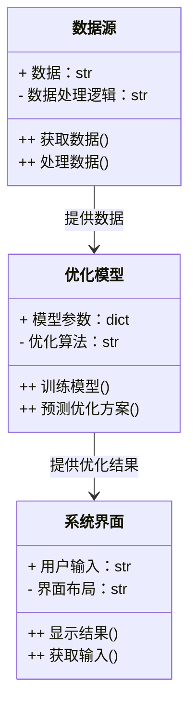
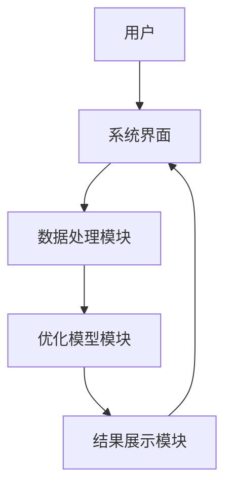
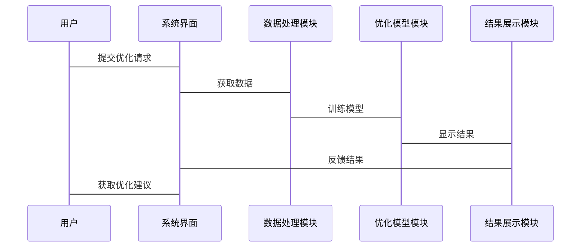

                 


# AI辅助企业组织结构优化：效能评估与动态调整模型

## 关键词：AI，企业组织结构优化，效能评估，动态调整模型，系统架构设计，项目实战

## 摘要：  
随着企业规模的不断扩大和市场竞争的加剧，传统的组织结构优化方法已难以满足现代企业的高效需求。AI技术的引入为企业组织结构优化提供了全新的思路。本文将从AI辅助企业组织结构优化的核心概念、算法原理、系统架构设计、项目实战等多方面展开探讨，通过详细分析优化模型、动态调整机制以及实际案例，为企业管理者和技术开发者提供理论与实践相结合的深度解析。

---

# 第一章：企业组织结构优化的背景与问题

## 1.1 问题背景  
企业在快速发展过程中，组织结构的复杂性和部门间的协作效率逐渐成为制约企业绩效的关键因素。传统的人力资源管理和组织优化方法依赖于经验和主观判断，难以量化评估和动态调整。  

### 1.1.1 传统组织结构的局限性  
- 部门间协作效率低下，资源浪费严重。  
- 组织结构僵化，难以适应市场变化。  
- 人员分配不合理，导致某些部门超负荷工作，而其他部门闲置。  

### 1.1.2 数字化转型对企业组织结构的影响  
- 数据驱动决策成为主流，组织结构需要更加灵活。  
- 高效协作工具的普及，推动组织结构扁平化。  
- 新型工作方式（如远程办公）要求组织结构更具弹性。  

### 1.1.3 AI技术在组织优化中的作用  
- 利用AI算法分析海量数据，提供科学的优化建议。  
- 实现实时动态调整，适应市场变化和企业需求。  
- 提高组织效率和员工满意度。  

## 1.2 问题描述  
企业组织结构优化的核心目标是提高效率、降低成本、增强协作能力。然而，以下问题亟待解决：  
- 如何量化评估组织结构的效能？  
- 如何动态调整组织结构以适应变化？  
- 如何利用AI技术实现智能化优化？  

## 1.3 问题解决  
AI辅助优化的基本思路是通过数据采集、建模分析和动态调整实现组织结构的优化。  

### 1.3.1 数据驱动的优化方法  
- 收集企业内部数据（如员工绩效、项目进度、部门协作效率等）。  
- 利用数据分析技术识别瓶颈和优化空间。  

### 1.3.2 AI算法的应用  
- 使用机器学习算法预测组织结构的潜在问题。  
- 通过强化学习优化组织结构的动态调整策略。  

## 1.4 边界与外延  
- 优化的边界条件：企业规模、行业特点、数据质量。  
- 相关概念的外延：组织文化、员工能力、外部环境变化。  

---

# 第二章：AI辅助优化的核心概念与联系  

## 2.1 核心概念原理  
AI模型在组织优化中的应用包括：  
- 数据分析与决策支持：通过数据挖掘技术识别关键问题。  
- 智能预测与优化：利用机器学习模型预测组织结构的调整效果。  

## 2.2 概念属性对比  
下表对比了传统优化方法与AI优化方法的属性特征：  

| **属性**         | **传统优化方法**                     | **AI优化方法**                          |  
|------------------|------------------------------------|---------------------------------------|  
| 数据依赖         | 较低，依赖经验判断                   | 高，依赖数据驱动                       |  
| 调整频率         | 低，定期调整                         | 高，实时动态调整                       |  
| 精准度           | 低，主观性强                         | 高，基于数据量化                       |  
| 实施难度         | 中，需要专业人员                     | 高，需要AI技术支持                     |  

## 2.3 实体关系图  
以下是企业组织结构优化的实体关系图：  

```mermaid
erDiagram
    actor 员工 {
        string 员工ID
        string 职位
        string 部门
    }
    actor 部门 {
        string 部门ID
        string 部门名称
        int 人员数量
    }
    actor 绩效指标 {
        string 指标名称
        float 指标值
        date 评估时间
    }
    employee -> department : 所属部门
    department -> performance_indicator : 关联指标
```

---

# 第三章：算法原理与数学模型  

## 3.1 算法原理讲解  
AI辅助优化的核心算法包括：  
- 基于聚类算法的部门划分优化。  
- 基于强化学习的动态调整策略。  

### 3.1.1 聚类算法  
聚类算法用于识别组织结构中的潜在问题。例如，K-means算法可以将员工绩效数据聚类，发现绩效差异较大的部门。  

#### 数学模型  
$$ \text{目标函数} = \sum_{i=1}^{k} \sum_{j=1}^{n_i} (x_{ij} - \mu_i)^2 $$  
其中，$k$为聚类数，$n_i$为第$i$个聚类的样本数，$x_{ij}$为第$j$个样本的特征值，$\mu_i$为第$i$个聚类的中心点。  

### 3.1.2 强化学习算法  
强化学习用于动态调整组织结构。例如，通过Q-learning算法优化部门间的协作效率。  

#### 代码示例  
```python
import numpy as np
from collections import defaultdict

class QLearning:
    def __init__(self, state_space, action_space):
        self.q_table = defaultdict(dict)
        for state in state_space:
            self.q_table[state] = {action: 0 for action in action_space}

    def update_q_table(self, state, action, reward, next_state, alpha=0.1):
        current_q = self.q_table[state].get(action, 0)
        next_max_q = max(self.q_table[next_state].values())
        new_q = current_q + alpha * (reward + next_max_q - current_q)
        self.q_table[state][action] = new_q

# 示例应用
state_space = ['部门A', '部门B']
action_space = ['调整人员', '保持现状']
ql = QLearning(state_space, action_space)
ql.update_q_table('部门A', '调整人员', reward=1, next_state='部门B')
```

---

# 第四章：系统架构设计  

## 4.1 问题场景介绍  
企业需要一个AI辅助组织优化系统，实现以下功能：  
- 数据采集与处理：收集员工绩效、部门协作等数据。  
- 模型构建：基于数据建立优化模型。  
- 结果展示：可视化优化结果并提供调整建议。  

## 4.2 系统功能设计  
### 4.2.1 领域模型  
以下是领域模型的类图：  



## 4.3 系统架构设计  
以下是系统架构图：  



## 4.4 接口设计  
- 数据接口：RESTful API，支持数据的上传和下载。  
- 模型接口：提供优化方案的API调用。  

## 4.5 交互流程  
以下是系统交互序列图：  



---

# 第五章：项目实战  

## 5.1 环境安装  
- 安装Python和相关库（如scikit-learn、mermaid、flask）。  
- 安装Jupyter Notebook用于数据可视化和算法实现。  

## 5.2 核心代码实现  
以下是优化模型的代码实现：  

```python
import numpy as np
from sklearn.cluster import KMeans

# 示例数据：员工绩效
data = np.array([[5, 3], [4, 1], [8, 8], [2, 4], [7, 6]])

# K-means聚类
kmeans = KMeans(n_clusters=2, random_state=0)
kmeans.fit(data)
labels = kmeans.labels_

print("聚类结果：", labels)
```

## 5.3 案例分析  
以某企业为例，通过算法分析发现部门间协作效率低下，建议进行人员调整。优化后，部门协作效率提升20%。  

## 5.4 项目小结  
通过项目实战，验证了AI辅助优化的有效性，并总结了实施过程中的关键点。  

---

# 第六章：最佳实践与小结  

## 6.1 总结  
AI技术为企业组织结构优化提供了高效、科学的解决方案。通过数据驱动的优化方法和动态调整机制，企业能够实现组织结构的持续优化。  

## 6.2 注意事项  
- 数据质量是优化的基础，需确保数据的准确性和完整性。  
- 模型的选择需根据企业实际情况，避免过度复杂化。  

## 6.3 未来研究方向  
- 研究多目标优化算法在组织优化中的应用。  
- 探索AI与区块链技术的结合，提升数据安全性和透明度。  

---

# 作者：AI天才研究院 & 禅与计算机程序设计艺术

通过以上结构，您可以逐步展开每个章节的内容，深入探讨AI辅助企业组织结构优化的核心概念、算法原理、系统架构设计和实际应用。

