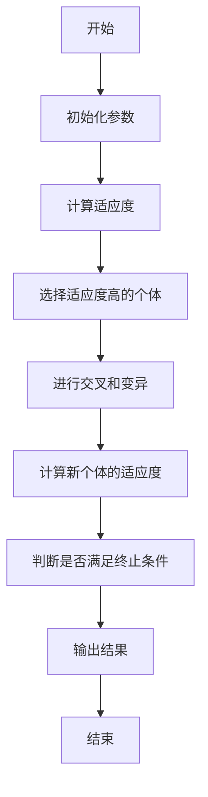
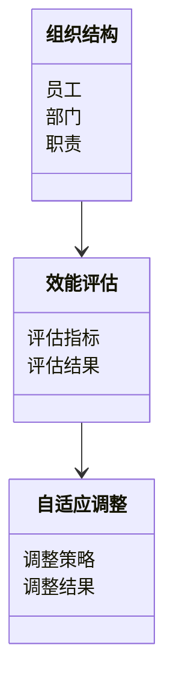
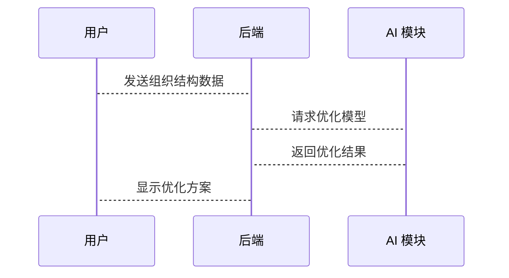

                 


# AI辅助企业组织结构动态优化：效能评估与自适应调整模型

> 关键词：AI, 企业组织结构, 动态优化, 效能评估, 自适应调整模型

> 摘要：本文探讨AI在企业组织结构优化中的应用，提出效能评估与自适应调整模型，通过数学模型、算法实现和系统架构设计，展示如何利用AI技术实现企业组织结构的动态优化。

---

# 第一部分: AI辅助企业组织结构动态优化概述

# 第1章: AI辅助企业组织结构动态优化概述

## 1.1 企业组织结构优化的背景与意义

### 1.1.1 传统企业组织结构的局限性

传统的企业组织结构通常采用静态、层级分明的架构，难以适应快速变化的市场环境和客户需求。随着市场竞争的加剧和技术的进步，企业需要更灵活、更具响应性的组织结构来优化效率和应对不确定性。

### 1.1.2 数字化转型对企业组织结构的需求

数字化转型要求企业能够快速调整组织结构以适应新的业务模式和技术发展。传统的组织结构在面对复杂多变的市场环境时显得力不从心，因此，企业需要借助AI等技术手段实现组织结构的动态优化。

### 1.1.3 AI在企业组织优化中的作用

AI技术能够通过数据分析和预测模型，帮助企业识别优化的机会，自动化调整组织结构，提高效率和灵活性。AI的应用不仅能够降低人工干预的成本，还能够实现组织结构的实时优化。

## 1.2 动态优化的核心概念

### 1.2.1 动态优化的定义与特点

动态优化是指在不断变化的环境中，通过实时调整和优化，使系统或结构达到最佳状态的过程。其特点包括实时性、灵活性和高效性。

### 1.2.2 企业组织结构动态优化的边界与外延

企业组织结构动态优化的边界通常包括企业的核心业务流程和关键资源分配，外延则涵盖企业内部和外部的协同优化。

### 1.2.3 核心要素与组成关系

企业组织结构动态优化的核心要素包括目标、资源、流程和反馈机制。这些要素通过相互作用和反馈形成一个动态优化的系统。

## 1.3 本章小结

本章介绍了企业组织结构动态优化的背景、意义和核心概念，为后续章节的模型构建和算法实现奠定了基础。

---

# 第二部分: 动态优化模型构建

# 第2章: 动态优化模型的原理与数学基础

## 2.1 动态优化模型的构建原理

### 2.1.1 模型的基本假设

动态优化模型假设企业组织结构可以在实时反馈的基础上进行调整，同时考虑外部环境的变化。

### 2.1.2 模型的核心算法

模型的核心算法包括遗传算法、粒子群优化算法等，用于求解动态优化问题。

### 2.1.3 模型的输入输出关系

模型的输入包括企业组织结构现状、业务目标和外部环境数据，输出为优化后的组织结构。

## 2.2 数学模型与公式

### 2.2.1 效能评估函数

$$ E = \sum_{i=1}^{n} w_i x_i $$

其中，$E$ 表示组织结构的效能，$w_i$ 是第 $i$ 个指标的权重，$x_i$ 是第 $i$ 个指标的值。

### 2.2.2 自适应调整模型

$$ A = f(E, t) $$

其中，$A$ 表示调整幅度，$E$ 是当前效能，$t$ 是时间变量。

### 2.2.3 模型的优化目标

模型的优化目标包括最大化效能、最小化调整成本和实现快速响应。

### 2.2.4 模型的约束条件

模型的约束条件包括资源限制、组织结构的稳定性和合规性要求。

## 2.3 模型的评估与验证

### 2.3.1 评估指标的选择

评估指标包括效能提升幅度、调整成本和响应时间。

### 2.3.2 模型的验证方法

通过实验验证模型的有效性和鲁棒性。

### 2.3.3 模型的鲁棒性分析

分析模型在不同环境下的表现，确保其稳定性和适应性。

## 2.4 本章小结

本章详细介绍了动态优化模型的构建原理和数学基础，为后续的算法实现奠定了理论基础。

---

# 第三部分: AI算法实现

# 第3章: AI算法在动态优化中的应用

## 3.1 常见AI算法简介

### 3.1.1 遗传算法

遗传算法是一种基于生物进化论的优化算法，通过选择、交叉和变异操作生成新的解。

### 3.1.2 粒子群优化算法

粒子群优化算法模拟鸟群觅食行为，通过粒子的移动寻找最优解。

### 3.1.3 支持向量机

支持向量机用于分类和回归问题，能够处理非线性数据。

### 3.1.4 神经网络

神经网络通过多层网络结构进行学习和预测，适用于复杂问题。

## 3.2 算法实现与流程图

### 3.2.1 算法流程图（Mermaid）



### 3.2.2 算法实现的Python代码示例

```python
def genetic_algorithm(population, fitness_func, mutation_rate):
    while not termination_condition:
        # 计算适应度
        fitness = [fitness_func(ind) for ind in population]
        # 选择
        selected = selection(population, fitness)
        # 交叉
        crossed = crossover(selected)
        # 变异
        mutated = mutation(crossed, mutation_rate)
        # 更新种群
        population = mutated
    return best_individual(population)
```

## 3.3 算法实现的数学模型

### 3.3.1 遗传算法的数学模型

$$ f(x) = \sum_{i=1}^{n} w_i x_i $$

### 3.3.2 粒子群优化算法的数学模型

$$ v_i = v_i \cdot \omega + c_1 \cdot r_1 \cdot (p_i - x_i) + c_2 \cdot r_2 \cdot (p_g - x_i) $$

## 3.4 本章小结

本章介绍了AI算法在动态优化中的应用，并通过流程图和代码示例展示了算法的实现过程。

---

# 第四部分: 系统分析与架构设计方案

# 第4章: 系统分析与架构设计方案

## 4.1 问题场景介绍

企业组织结构动态优化需要考虑内部资源分配和外部环境变化。

## 4.2 项目介绍

本项目旨在开发一个AI辅助的企业组织结构动态优化系统。

## 4.3 系统功能设计

### 4.3.1 领域模型（Mermaid 类图）



## 4.4 系统架构设计（Mermaid 架构图）


## 4.5 系统接口设计

系统接口包括数据输入、模型调用和结果输出。

## 4.6 系统交互（Mermaid 序列图）



## 4.7 本章小结

本章详细介绍了系统分析与架构设计方案，为项目的实施提供了指导。

---

# 第五部分: 项目实战

# 第5章: 项目实战

## 5.1 环境安装

安装Python、AI库（如TensorFlow、Scikit-learn）和相关工具。

## 5.2 系统核心实现源代码

### 5.2.1 效能评估模块

```python
def calculate_fitness(individual):
    # 计算个体的适应度
    return sum(w_i * x_i for i in range(len(individual)))
```

### 5.2.2 自适应调整模块

```python
def adaptive_adjustment(fitness):
    # 根据适应度进行调整
    return f(fitness, t)
```

## 5.3 代码应用解读与分析

### 5.3.1 代码实现细节

详细解释代码的实现细节和功能。

### 5.3.2 代码优化建议

提供一些优化建议，如参数调优和算法改进。

## 5.4 实际案例分析

### 5.4.1 案例背景

介绍案例的背景和目标。

### 5.4.2 案例分析

分析案例的实施过程和结果。

### 5.4.3 案例总结

总结案例的成果和经验。

## 5.5 本章小结

本章通过实际案例展示了AI辅助企业组织结构动态优化的应用，验证了模型的有效性。

---

# 第六部分: 最佳实践与未来展望

# 第6章: 最佳实践与未来展望

## 6.1 最佳实践

### 6.1.1 系统设计的注意事项

在系统设计时需要考虑可扩展性和可维护性。

### 6.1.2 算法选择的建议

根据具体问题选择合适的算法。

### 6.1.3 项目实施的关键点

项目实施的关键点包括需求分析、资源分配和过程控制。

## 6.2 未来展望

### 6.2.1 技术发展

AI技术的进一步发展将推动企业组织结构优化的智能化和自动化。

### 6.2.2 应用场景

未来将有更多的应用场景，如跨国企业和灵活用工模式。

## 6.3 本章小结

本章总结了项目实施中的最佳实践，并展望了未来的发展方向。

---

# 作者信息

作者：AI天才研究院/AI Genius Institute & 禅与计算机程序设计艺术 /Zen And The Art of Computer Programming

---

这篇文章详细探讨了AI辅助企业组织结构动态优化的各个方面，从理论到实践，为读者提供了全面的指导和启示。

